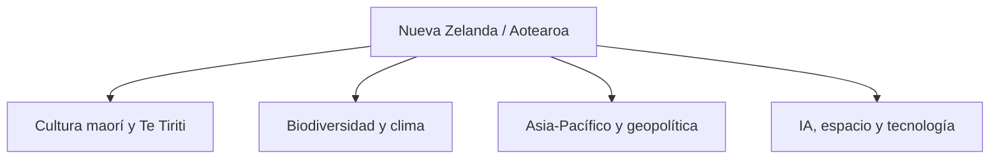
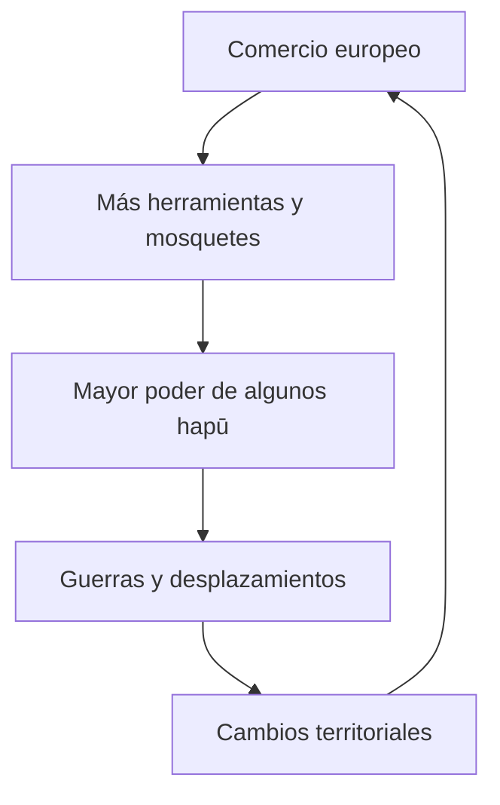
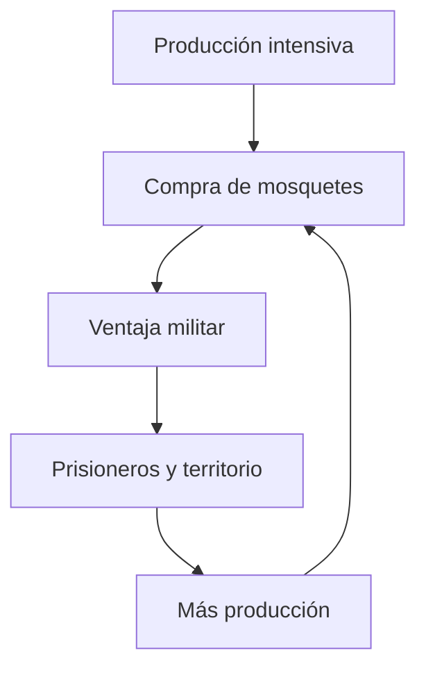
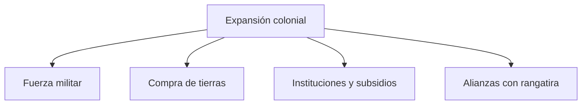

#Índices #Geografía

## [WIKIPEDIA](https://es.wikipedia.org/wiki/Nueva_Zelanda)

## Introducción general — Aotearoa, el país de la gran nube blanca

**Fecha de actualización: 13 de agosto de 2026**

Nueva Zelanda es mucho más que un conjunto de islas remotas, paisajes cinematográficos, ovejas y rugby. Es un pequeño país que funciona como un extraordinario laboratorio político, cultural, ecológico y tecnológico.

En Nueva Zelanda confluyen:

- La cultura indígena maorí y la herencia británica.

- Una democracia parlamentaria estable.

- Una economía pequeña, abierta y profundamente exportadora.

- Una biodiversidad excepcionalmente singular.

- Una relación muy estrecha entre identidad nacional y naturaleza.

- Una posición geopolítica estratégica entre Occidente, Asia y el Pacífico.

- Una creciente apuesta por la innovación, la inteligencia artificial y las tecnologías aplicadas.

Mi primera impresión, Fran, es que Nueva Zelanda encaja especialmente bien en TCD porque permite conectar **geografía, pueblos indígenas, colonización, democracia, cambio climático, agricultura, ciencia, cine, turismo, geopolítica e inteligencia artificial**.

---

## 1. Ficha esencial de Nueva Zelanda

|Elemento|Información|
|---|---|
|Nombre oficial|Nueva Zelanda|
|Nombre maorí habitual|**Aotearoa**|
|Capital|Wellington|
|Ciudad más poblada|Auckland|
|Continente o región|Oceanía; Pacífico suroccidental|
|Superficie|Aproximadamente 268.000 km²|
|Población estimada|**5.361.300 habitantes**, a 31 de marzo de 2026|
|Gentilicio|Neozelandés; informalmente, _kiwi_|
|Idiomas oficiales o reconocidos institucionalmente|Inglés, maorí y lengua de signos neozelandesa|
|Moneda|Dólar neozelandés, NZD|
|Forma de Estado|Monarquía constitucional|
|Sistema político|Democracia parlamentaria|
|Jefe del Estado|El rey Carlos III, representado por la gobernadora general|
|Primera ministra o primer ministro|**Christopher Luxon**, a 13 de agosto de 2026|
|Parlamento|Cámara de Representantes, unicameral|
|Sistema electoral|Representación proporcional mixta, MMP|
|Próximas elecciones generales|**7 de noviembre de 2026**|
|Dominio de Internet|`.nz`|
|Prefijo telefónico|+64|

La estimación demográfica procede de [Stats NZ — Population](https://www.stats.govt.nz/topics/population/). La Comisión Electoral confirma que las próximas elecciones generales se celebrarán el [7 de noviembre de 2026](https://elections.nz/guidance-and-rules/candidate-hub/key-information-and-dates). El primer ministro actual es [Christopher Luxon](https://www.beehive.govt.nz/minister/rt-hon-christopher-luxon).

---

## 2. ¿Dónde está Nueva Zelanda?

Nueva Zelanda se encuentra en el **océano Pacífico sur**, aproximadamente a 2.000 kilómetros al sureste de Australia. Su aislamiento geográfico es una de las claves para comprender su historia natural, su cultura y su desarrollo económico.

El país está compuesto principalmente por dos grandes islas:

### Isla Norte — Te Ika-a-Māui

Es la más poblada y concentra:

- Auckland.

- Wellington.

- Hamilton.

- Rotorua.

- La mayor parte de la actividad económica.

- Importantes zonas volcánicas y geotérmicas.

- Una fuerte presencia histórica y cultural maorí.

### Isla Sur — Te Waipounamu

Es más extensa, menos poblada y especialmente montañosa. En ella encontramos:

- Los Alpes del Sur.

- Christchurch.

- Dunedin.

- Queenstown.

- Fiordland.

- Grandes glaciares, lagos y fiordos.

- El monte Aoraki/Mount Cook, la cumbre más alta del país.

### Otras islas

También forman parte del territorio:

- Isla Stewart/Rakiura.

- Islas Chatham.

- Numerosas islas menores.

- Territorios insulares asociados en diferentes regímenes políticos, como las Islas Cook, Niue y Tokelau.

Para profundizar en su formación y características naturales: [Te Ara — Geografía y geología de Nueva Zelanda](https://teara.govt.nz/en/natural-environment/page-1).

---

## 3. Zealandia: un continente casi sumergido

Uno de los aspectos más fascinantes de Nueva Zelanda es que constituye la parte visible de **Zealandia o Te Riu-a-Māui**, una gran masa continental cuya mayor parte está sumergida bajo el Pacífico.

Zealandia:

- Tiene una superficie aproximada de 4,9 millones de km².

- Se separó progresivamente de Gondwana.

- Está sumergida en alrededor de un 94 %.

- Incluye Nueva Zelanda y Nueva Caledonia.

- Presenta corteza continental diferenciada de la corteza oceánica circundante.

Aunque la expresión «octavo continente» es frecuente en divulgación, su consideración formal depende de los criterios geológicos utilizados. No existe una autoridad mundial única que “apruebe” oficialmente los continentes.

La idea es importante porque Nueva Zelanda no es simplemente la parte superior de unas islas volcánicas: es la porción emergida de una extensa región continental.

Referencia científica: [GNS Science — Zealandia](https://www.gns.cri.nz/our-science/land-and-marine-geoscience/zealandia/).

---

## 4. Un territorio geológicamente activo

Nueva Zelanda está situada en el límite entre las placas tectónicas del Pacífico y Australiana. Esa situación explica:

- Los terremotos frecuentes.

- La actividad volcánica.

- Las fuentes termales.

- Los géiseres.

- La formación de grandes cadenas montañosas.

- El riesgo de tsunamis.

- El levantamiento geológico continuo.

La Isla Norte contiene la llamada **Zona Volcánica de Taupō**, mientras que la Isla Sur está atravesada por la **falla alpina**.

Entre los volcanes más conocidos están:

- Ruapehu.

- Tongariro.

- Taranaki.

- Whakaari/White Island.

- La caldera de Taupō.

Nueva Zelanda es conocida a veces como _the shaky isles_, «las islas temblorosas». El país ha desarrollado una cultura avanzada de prevención sísmica, construcción resistente y vigilancia geológica.

Fuentes recomendadas:

- [GeoNet — Vigilancia de terremotos, volcanes y riesgos geológicos](https://www.geonet.org.nz/)

- [GNS Science](https://www.gns.cri.nz/)

- [National Emergency Management Agency](https://www.civildefence.govt.nz/)

---

## 5. La llegada de los maoríes

Los antepasados polinesios de los maoríes llegaron a Nueva Zelanda probablemente durante los siglos XIII y XIV, tras extraordinarias navegaciones oceánicas.

Desarrollaron una sociedad adaptada a un medio más frío que el de otras islas polinesias. Su organización se articuló alrededor de:

- **Whānau:** familia extensa.

- **Hapū:** subtribu o comunidad de parentesco.

- **Iwi:** pueblo o tribu.

- **Marae:** espacio comunitario, cultural y ceremonial.

- **Whakapapa:** genealogía y red de relaciones entre personas, antepasados y naturaleza.

- **Mana:** autoridad, prestigio o poder espiritual.

- **Tapu:** carácter sagrado o restringido.

- **Kaitiakitanga:** responsabilidad de cuidado y protección del entorno.

La cultura maorí no puede reducirse a una colección de tradiciones antiguas. Es una cultura contemporánea que participa activamente en la política, la educación, los medios, la ciencia, el derecho y la economía del país.

Fuentes:

- [Te Ara — Historia y cultura maorí](https://teara.govt.nz/en/maori)

- [Te Ara — Llegada y asentamiento maorí](https://teara.govt.nz/en/history/page-1)

- [Te Papa — Museo Nacional de Nueva Zelanda](https://www.tepapa.govt.nz/)

---

## 6. Aotearoa: el nombre maorí

**Aotearoa** se traduce habitualmente como «tierra de la larga nube blanca», aunque su historia lingüística y su aplicación a todo el país son más complejas.

Actualmente se emplea con enorme frecuencia:

- En instituciones públicas.

- En universidades.

- En medios de comunicación.

- En documentos oficiales.

- En contextos culturales y educativos.

- En la expresión bilingüe **Aotearoa New Zealand**.

El uso conjunto de nombres maoríes e ingleses refleja el proceso de recuperación de **te reo Māori**, la lengua maorí, y una reinterpretación bicultural de la identidad nacional.

---

## 7. La colonización europea

El navegante neerlandés **Abel Tasman** llegó a las costas de Nueva Zelanda en 1642. El nombre deriva de la provincia neerlandesa de Zeeland.

En 1769, **James Cook** cartografió gran parte de la costa. A partir de entonces aumentaron:

- Las expediciones europeas.

- La caza de ballenas y focas.

- El comercio.

- Las misiones cristianas.

- La adquisición de tierras.

- La inmigración europea.

El contacto produjo intercambios económicos, pero también:

- Epidemias.

- Alteraciones sociales.

- Conflictos armados.

- Introducción de mosquetes.

- Pérdida de tierras.

- Desequilibrios de poder.

---

## 8. El Tratado de Waitangi

El **Tratado de Waitangi**, firmado inicialmente el 6 de febrero de 1840, se considera el documento fundacional de Nueva Zelanda.

Fue acordado entre representantes de la Corona británica y alrededor de 540 jefes o _rangatira_ maoríes.

El gran problema histórico es que existen diferencias relevantes entre:

- El texto en inglés.

- El texto en lengua maorí, conocido como **Te Tiriti o Waitangi**.

Conceptos como soberanía, gobierno y autoridad no quedaron expresados de manera equivalente. Estas diferencias contribuyeron a décadas de conflictos y reclamaciones.

En términos generales, el tratado se relaciona con:

- El establecimiento de una forma de gobierno británico.

- La protección de tierras, recursos y posesiones maoríes.

- Los derechos de los habitantes bajo la Corona.

- La relación entre el Estado y los pueblos maoríes.

No es una constitución escrita completa ni una ley única que resuelva automáticamente todos los conflictos. Sin embargo, sus principios influyen en la legislación, la Administración, los tribunales y las políticas públicas.

Fuentes fundamentales:

- [NZ History — Tratado de Waitangi](https://nzhistory.govt.nz/politics/treaty-of-waitangi)

- [El Tratado explicado brevemente](https://nzhistory.govt.nz/politics/treaty/the-treaty-in-brief)

- [Texto del Tratado](https://nzhistory.govt.nz/politics/treaty/read-the-treaty/english-text)

- [Diferencias entre las versiones](https://nzhistory.govt.nz/page/differences-between-texts)

- [Waitangi Tribunal](https://www.waitangitribunal.govt.nz/)

---

## 9. De colonia británica a Estado soberano

La evolución política fue gradual:

- **1840:** proclamación de la soberanía británica.

- **1852:** establecimiento de instituciones representativas.

- **1856:** gobierno responsable.

- **1907:** Nueva Zelanda pasa a ser Dominio.

- **1947:** adopción plena del Estatuto de Westminster.

- **1986:** la Constitution Act reorganiza y afirma el marco constitucional moderno.

Nueva Zelanda mantiene la monarquía, pero actúa como Estado soberano e independiente.

Un hecho histórico especialmente importante es que en **1893 se convirtió en el primer país autónomo del mundo donde las mujeres obtuvieron el derecho a votar en elecciones parlamentarias nacionales**.

---

## 10. Sistema político actual

Nueva Zelanda es una **monarquía constitucional y democracia parlamentaria**.

El sistema se caracteriza por:

- Una única cámara legislativa nacional.

- Gobierno responsable ante el Parlamento.

- Un poder judicial independiente.

- Elecciones normalmente cada tres años.

- Representación proporcional.

- Ausencia de una constitución codificada en un documento único.

El jefe del Estado es Carlos III, representado en el país por la gobernadora general. El poder político cotidiano corresponde al primer ministro, el gabinete y el Parlamento.

### Sistema electoral MMP

Desde 1996 se utiliza el sistema **Mixed Member Proportional**, representación proporcional mixta.

Cada elector dispone generalmente de dos votos:

1. Un voto para un partido político.

2. Un voto para el representante de su circunscripción.

El sistema favorece:

- Gobiernos de coalición.

- Acuerdos entre partidos.

- Una representación parlamentaria más proporcional.

- Mayor presencia de partidos pequeños que en sistemas mayoritarios.

Explicación oficial: [Govt.nz — Cómo funciona el Gobierno de Nueva Zelanda](https://www.govt.nz/browse/engaging-with-government/government-in-new-zealand/).

### Situación en agosto de 2026

El primer ministro es **Christopher Luxon**, líder del Partido Nacional. Las próximas elecciones generales están convocadas para el **sábado 7 de noviembre de 2026**.

Este dato es importante porque cualquier evaluación política realizada ahora es provisional: el panorama puede cambiar tras las elecciones.

---

## 11. Población y sociedad

Nueva Zelanda tenía una población residente estimada provisional de **5.361.300 personas a 31 de marzo de 2026**.

Es un país:

- Poco poblado para su superficie.

- Altamente urbanizado.

- Concentrado principalmente en la Isla Norte.

- Culturalmente diverso.

- Receptor histórico de inmigración.

### Principales grupos de población

La identidad estadística es compleja porque una misma persona puede declararse perteneciente a más de un grupo étnico. Entre las grandes comunidades se encuentran:

- Personas de ascendencia europea o _Pākehā_.

- Maoríes.

- Comunidades asiáticas.

- Pueblos del Pacífico.

- Personas de origen africano, latinoamericano y de Oriente Medio.

### Ciudades principales

- **Auckland:** gran centro económico, financiero y multicultural.

- **Wellington:** capital política y administrativa.

- **Christchurch:** principal ciudad de la Isla Sur.

- **Hamilton:** centro agrícola, científico y tecnológico.

- **Tauranga:** puerto y ciudad de rápido crecimiento.

- **Dunedin:** ciudad universitaria de fuerte herencia escocesa.

- **Queenstown:** turismo, deportes y producción audiovisual.

---

## 12. Economía

Nueva Zelanda posee una economía avanzada, pequeña y muy abierta al comercio internacional.

Sus sectores fundamentales incluyen:

- Agricultura.

- Ganadería.

- Industria láctea.

- Carne.

- Horticultura.

- Kiwis y manzanas.

- Viticultura.

- Silvicultura.

- Pesca.

- Turismo.

- Educación internacional.

- Servicios financieros y profesionales.

- Tecnología digital.

- Producción audiovisual.

### Dependencia exportadora

Con un mercado interior de poco más de cinco millones de habitantes, el país necesita comerciar con el exterior. Según el Ministerio de Asuntos Exteriores y Comercio, más de **600.000 empleos** se encuentran en sectores directamente exportadores o relacionados con las exportaciones.

Fuente: [MFAT — Política comercial de Nueva Zelanda](https://www.mfat.govt.nz/en/trade/nz-trade-policy).

### Principales productos exportados

- Leche en polvo y otros lácteos.

- Carne.

- Madera.

- Frutas.

- Vino.

- Lana.

- Pescado y productos marinos.

- Servicios turísticos.

- Educación.

- Tecnología y servicios profesionales.

### Principales socios

Entre los socios comerciales más relevantes se encuentran:

- China.

- Australia.

- Estados Unidos.

- Japón.

- Corea del Sur.

- Unión Europea.

- Países del sudeste asiático.

- Reino Unido.

- India, con una relación económica en expansión.

Nueva Zelanda participa en acuerdos como:

- CPTPP.

- RCEP.

- Acuerdo de libre comercio con China.

- Acuerdo con la Unión Europea.

- Acuerdo con Reino Unido.

- Acuerdo económico Australia–Nueva Zelanda.

### Coyuntura reciente

El PIB real creció un **0,2 % durante el trimestre finalizado en diciembre de 2025**, después de un aumento del 0,9 % en el trimestre anterior. Esto señala recuperación, pero no una expansión espectacular.

Fuente: [Stats NZ — PIB, trimestre de diciembre de 2025](https://www.stats.govt.nz/information-releases/gross-domestic-product-december-2025-quarter/).

---

## 13. Agricultura: fortaleza y vulnerabilidad

Nueva Zelanda ha construido gran parte de su prosperidad sobre la producción agropecuaria.

Destacan:

- La industria láctea.

- La ganadería ovina y bovina.

- El cultivo de kiwi.

- La producción de manzanas.

- Los viñedos.

- La industria forestal.

Pero este modelo también genera debates:

- Emisiones de metano.

- Uso intensivo del suelo.

- Contaminación de ríos y acuíferos.

- Fertilizantes.

- Deforestación histórica.

- Vulnerabilidad ante sequías e inundaciones.

- Dependencia de mercados externos.

La cuestión central es cómo conservar la potencia exportadora agroalimentaria reduciendo simultáneamente su impacto ecológico.

---

## 14. Turismo

Nueva Zelanda es uno de los grandes destinos mundiales de naturaleza y aventura.

Durante 2025:

- Recibió aproximadamente **3,51 millones de visitantes internacionales**.

- El gasto de esos visitantes alcanzó unos **12.500 millones de dólares neozelandeses**.

- El turismo continuó siendo una de sus principales industrias exportadoras.

Fuente: [Tourism New Zealand — Datos de turismo de 2025](https://www.tourismnewzealand.com/news-and-activity/new-data-reiterates-importance-of/).

Lugares destacados:

- Auckland.

- Rotorua.

- Wellington.

- Hobbiton.

- Tongariro.

- Bay of Islands.

- Waitomo.

- Christchurch.

- Queenstown.

- Milford Sound/Piopiotahi.

- Fiordland.

- Aoraki/Mount Cook.

- Glaciares Franz Josef y Fox.

- Abel Tasman.

- Kaikōura.

El reto consiste en evitar que el éxito turístico deteriore precisamente el patrimonio natural que atrae a los visitantes.

---

## 15. Biodiversidad excepcional

El aislamiento de Nueva Zelanda produjo una evolución biológica singular.

Antes de la llegada humana prácticamente no existían mamíferos terrestres nativos, salvo los murciélagos. Los nichos ecológicos fueron ocupados en gran medida por aves.

Entre sus especies emblemáticas están:

- Kiwi.

- Kākāpō.

- Kea.

- Takahē.

- Tuátara.

- Wētā gigante.

- Delfín de Māui.

- Pingüino de ojos amarillos.

Muchas especies evolucionaron sin grandes depredadores mamíferos y perdieron la capacidad de volar. La introducción de ratas, gatos, armiños, zarigüeyas y otras especies invasoras provocó una catástrofe ecológica.

El Ministerio de Medioambiente indica que:

- Se conocen **79 especies extinguidas** desde la llegada humana.

- Más de tres cuartas partes de los reptiles, aves, murciélagos, peces de agua dulce y ranas autóctonas se encuentran amenazados o en riesgo.

Fuente: [Ministry for the Environment — Por qué importa la biodiversidad](https://environment.govt.nz/facts-and-science/biodiversity/why-biodiversity-matters/).

---

## 16. Cambio climático

Nueva Zelanda combina una intensa imagen ecológica con importantes problemas ambientales.

La [Evaluación Nacional de Riesgos Climáticos de 2026](https://www.climatecommission.govt.nz/reports-and-evidence/publications/2026-national-climate-change-risk-assessment/) analiza **37 riesgos** distribuidos en siete grandes ámbitos.

Entre los riesgos prioritarios están:

- Infraestructuras de agua potable y saneamiento.

- Edificios expuestos a inundaciones.

- Carreteras y ferrocarriles.

- Desplazamiento de comunidades.

- Gestión de emergencias.

- Impactos específicos sobre iwi y comunidades maoríes.

- Ecosistemas y biodiversidad.

- Bosques.

- Financiación pública.

- Capacidad institucional para planificar la adaptación.

La evaluación calcula que aproximadamente **556.000 edificios** ya están expuestos a inundaciones interiores, con un valor de reposición conjunto de unos 235.000 millones de dólares neozelandeses.

Nueva Zelanda es, por tanto, un ejemplo de una paradoja global:

> Un país con enorme conciencia ambiental, pero también con una economía territorial, ganadera y exportadora difícil de descarbonizar.

---

## 17. Ciencia e innovación

Nueva Zelanda ha desarrollado capacidades destacadas en:

- Ciencias agrícolas.

- Biotecnología.

- Geología.

- Vulcanología.

- Ciencias antárticas.

- Oceanografía.

- Conservación.

- Medicina.

- Tecnología espacial.

- Efectos digitales.

- Producción audiovisual.

- Agrotecnología.

- Inteligencia artificial aplicada.

Instituciones importantes:

- [University of Auckland](https://www.auckland.ac.nz/)

- [University of Otago](https://www.otago.ac.nz/)

- [Victoria University of Wellington](https://www.wgtn.ac.nz/)

- [University of Canterbury](https://www.canterbury.ac.nz/)

- [University of Waikato](https://www.waikato.ac.nz/)

- [Massey University](https://www.massey.ac.nz/)

- [Auckland University of Technology](https://www.aut.ac.nz/)

- [Lincoln University](https://www.lincoln.ac.nz/)

- [Royal Society Te Apārangi](https://www.royalsociety.org.nz/)

- [GNS Science](https://www.gns.cri.nz/)

- [NIWA](https://niwa.co.nz/)

---

## 18. El sector espacial

Nueva Zelanda se ha convertido inesperadamente en un actor espacial relevante gracias, sobre todo, a **Rocket Lab**.

La empresa fue fundada en Nueva Zelanda por Peter Beck, aunque actualmente tiene sede corporativa en Estados Unidos. Su complejo de lanzamiento de Māhia permite colocar pequeños satélites en órbita.

La posición geográfica del país aporta ventajas:

- Amplias zonas oceánicas.

- Menor densidad de población.

- Trayectorias de lanzamiento favorables.

- Entorno político estable.

- Regulación espacial específica.

Fuentes:

- [New Zealand Space Agency](https://www.mbie.govt.nz/science-and-technology/space)

- [Rocket Lab](https://www.rocketlabusa.com/)

Este sector conecta Nueva Zelanda con comunicaciones, observación terrestre, clima, seguridad, agricultura de precisión y economía espacial.

---

## 19. Nueva Zelanda y la inteligencia artificial

Nueva Zelanda presentó en julio de 2025 su primera estrategia nacional específica de inteligencia artificial: **New Zealand’s AI Strategy: Investing with Confidence**.

Su orientación resulta muy interesante. El país no pretende competir directamente con Estados Unidos o China en la creación de gigantescos modelos fundacionales. Su estrategia se concentra en:

- Adoptar IA en empresas y organismos.

- Mejorar la productividad.

- Reducir barreras regulatorias innecesarias.

- Aumentar la confianza.

- Promover experimentación.

- Formar capacidades.

- Favorecer una IA responsable.

- Aplicarla a sectores donde Nueva Zelanda ya posee ventajas.

La estrategia sigue como referencia los principios de IA de la OCDE.

Fuente oficial: [MBIE — Estrategia de inteligencia artificial de Nueva Zelanda](https://www.mbie.govt.nz/business-and-employment/economic-growth/digital-policy/new-zealands-ai-strategy-investing-with-confidence).

### Sectores donde la IA puede ser especialmente importante

- Agricultura de precisión.

- Predicción meteorológica.

- Protección de la biodiversidad.

- Bioseguridad.

- Diagnóstico médico.

- Logística y puertos.

- Educación.

- Gestión de desastres.

- Observación de la Tierra.

- Producción cinematográfica.

- Servicios públicos.

- Recuperación y enseñanza de la lengua maorí.

### Inversión pública en investigación

En septiembre de 2025 se anunció una inversión de hasta **70 millones de dólares neozelandeses durante siete años** para una plataforma de investigación en IA vinculada al New Zealand Institute for Advanced Technology.

Fuente: [MBIE — Inversión en una plataforma de investigación en IA](https://www.mbie.govt.nz/about/news/new-zealand-institute-for-advanced-technology-launches-major-ai-investment).

### Mi valoración

Nueva Zelanda está adoptando una estrategia pragmática:

> No necesita fabricar el modelo de IA más grande del mundo; necesita utilizar inteligentemente los modelos disponibles para multiplicar el valor de su agricultura, ciencia, sanidad, medioambiente y servicios públicos.

Su desafío será evitar una dependencia excesiva de plataformas extranjeras y proteger:

- Los datos nacionales.

- La privacidad.

- La propiedad intelectual.

- La soberanía tecnológica.

- Los datos y conocimientos indígenas maoríes.

---

## 20. Cultura maorí y soberanía de los datos

La inteligencia artificial abre una cuestión especialmente relevante: **¿quién controla los datos sobre los pueblos indígenas?**

La idea de soberanía de datos maorí sostiene que los datos relacionados con personas, recursos, lengua, cultura y comunidades maoríes deben estar sujetos a formas de gobernanza coherentes con sus derechos e intereses colectivos.

Esto afecta a:

- Bases de datos sanitarias.

- Modelos lingüísticos.

- Digitalización de archivos.

- Reconocimiento facial.

- Información genética.

- Sistemas educativos.

- Conocimientos tradicionales.

- Entrenamiento de modelos de IA.

Organización de referencia: [Te Mana Raraunga — Māori Data Sovereignty Network](https://www.temanararaunga.maori.nz/).

Para TCD, esta cuestión ofrece un puente potentísimo entre:

**IA → datos → pueblos indígenas → propiedad colectiva → ética → soberanía digital.**

---

## 21. Cine y cultura popular

Nueva Zelanda se convirtió en una potencia audiovisual mundial gracias a:

- Peter Jackson.

- La trilogía de _El Señor de los Anillos_.

- _El Hobbit_.

- Wētā Workshop.

- Wētā FX.

- Sus paisajes.

- Incentivos públicos.

- Estudios y especialistas en efectos visuales.

También destacan cineastas y artistas como:

- Jane Campion.

- Taika Waititi.

- Lee Tamahori.

- Niki Caro.

- Jemaine Clement.

- Bret McKenzie.

- Lorde.

Fuentes:

- [New Zealand Film Commission](https://www.nzfilm.co.nz/)

- [Wētā Workshop](https://www.wetaworkshop.com/)

- [Wētā FX](https://www.wetafx.co.nz/)

---

## 22. Rugby e identidad nacional

El rugby forma parte de la identidad cultural neozelandesa.

Los **All Blacks** son uno de los equipos nacionales más reconocidos del mundo. Su interpretación de la _haka_ antes de los partidos ha difundido internacionalmente una manifestación cultural maorí, aunque también genera debates sobre:

- Contextualización.

- Respeto cultural.

- Comercialización.

- Apropiación.

- Representación de la identidad nacional.

Nueva Zelanda también destaca en:

- Rugby femenino.

- Cricket.

- Vela.

- Remo.

- Atletismo.

- Deportes de aventura.

---

## 23. Política exterior y geopolítica

Nueva Zelanda mantiene una identidad occidental, pero su posición geográfica la obliga a mirar simultáneamente hacia Asia y el Pacífico.

Sus relaciones prioritarias incluyen:

- Australia.

- Estados Unidos.

- Reino Unido.

- China.

- Japón.

- Unión Europea.

- India.

- Estados insulares del Pacífico.

Forma parte de:

- Naciones Unidas.

- OCDE.

- Commonwealth.

- APEC.

- Five Eyes.

- CPTPP.

- RCEP.

- Pacific Islands Forum.

No pertenece a la OTAN, aunque coopera con países occidentales en seguridad e inteligencia.

### La tensión estratégica

Nueva Zelanda debe equilibrar:

- Su cooperación estratégica con Australia, Estados Unidos y Reino Unido.

- Su considerable dependencia comercial de China.

- Su identidad como país del Pacífico.

- Las demandas de los pequeños Estados insulares.

- La creciente rivalidad entre China y Estados Unidos.

- Los efectos regionales del cambio climático.

---

## 24. Las grandes fortalezas de Nueva Zelanda

- Instituciones democráticas estables.

- Cohesión social relativamente elevada.

- Buena reputación internacional.

- Gran patrimonio natural.

- Agricultura muy eficiente.

- Capacidad científica especializada.

- Cultura maorí viva.

- Educación de calidad.

- Producción audiovisual avanzada.

- Potencial en tecnología espacial.

- Capacidad de experimentar con políticas públicas.

- Integración con los mercados de Asia-Pacífico.

---

## 25. Sus principales problemas

Nueva Zelanda no es el paraíso perfecto que a veces presenta la publicidad turística. Afronta desafíos importantes:

- Precio elevado de la vivienda.

- Coste de vida.

- Productividad relativamente débil.

- Dependencia de exportaciones primarias.

- Infraestructuras insuficientes.

- Emigración de profesionales hacia Australia.

- Desigualdades sanitarias y económicas.

- Brechas que afectan especialmente a maoríes y pueblos del Pacífico.

- Presión sobre ríos y acuíferos.

- Emisiones agrícolas.

- Pérdida de biodiversidad.

- Riesgo de terremotos.

- Inundaciones y fenómenos meteorológicos extremos.

- Dependencia tecnológica exterior.

- Aislamiento y costes logísticos.

En 2025 y 2026, la economía mostró recuperación, pero también vulnerabilidades. El país busca mejorar productividad e inversión sin sacrificar cohesión social y protección ambiental.

---

## 26. Nueva Zelanda como laboratorio del futuro

Nueva Zelanda merece estudiarse como un laboratorio donde se ensayan preguntas universales:

1. ¿Cómo reconciliar un Estado moderno con los derechos de un pueblo indígena?

2. ¿Cómo conservar una biodiversidad excepcional en una economía agroexportadora?

3. ¿Cómo puede un país pequeño mantener soberanía en la era de las grandes plataformas?

4. ¿Cómo adaptarse simultáneamente a terremotos y cambio climático?

5. ¿Puede la IA aumentar la productividad sin aumentar la dependencia exterior?

6. ¿Cómo convertir conocimientos indígenas y ciencia moderna en formas complementarias de comprensión?

7. ¿Cómo equilibrar China, Estados Unidos, Australia y el Pacífico?

8. ¿Puede una pequeña democracia actuar con mayor agilidad que las grandes potencias?

---

## 27. Fuentes fundamentales con URL interactivas

### Gobierno e instituciones

- [Portal del Gobierno de Nueva Zelanda](https://www.govt.nz/)

- [Parlamento de Nueva Zelanda](https://www.parliament.nz/)

- [Gobierno y ministros — Beehive](https://www.beehive.govt.nz/)

- [Comisión Electoral](https://elections.nz/)

- [Legislación de Nueva Zelanda](https://www.legislation.govt.nz/)

- [Ministerio de Asuntos Exteriores y Comercio](https://www.mfat.govt.nz/)

### Estadísticas y economía

- [Stats NZ](https://www.stats.govt.nz/)

- [Reserve Bank of New Zealand](https://www.rbnz.govt.nz/)

- [Treasury New Zealand](https://www.treasury.govt.nz/)

- [Ministerio de Empresa, Innovación y Empleo](https://www.mbie.govt.nz/)

- [New Zealand Trade and Enterprise](https://www.nzte.govt.nz/)

### Historia y cultura

- [NZ History](https://nzhistory.govt.nz/)

- [Te Ara — Enciclopedia de Nueva Zelanda](https://teara.govt.nz/en)

- [Te Papa — Museo Nacional](https://www.tepapa.govt.nz/)

- [Waitangi Tribunal](https://www.waitangitribunal.govt.nz/)

- [Ministerio de Cultura y Patrimonio](https://www.mch.govt.nz/)

### Ciencia y medioambiente

- [Ministry for the Environment](https://environment.govt.nz/)

- [Department of Conservation](https://www.doc.govt.nz/)

- [Climate Change Commission](https://www.climatecommission.govt.nz/)

- [NIWA](https://niwa.co.nz/)

- [GNS Science](https://www.gns.cri.nz/)

- [GeoNet](https://www.geonet.org.nz/)

- [Royal Society Te Apārangi](https://www.royalsociety.org.nz/)

### Noticias

- [Radio New Zealand — RNZ](https://www.rnz.co.nz/)

- [1News](https://www.1news.co.nz/)

- [The New Zealand Herald](https://www.nzherald.co.nz/)

- [Stuff](https://www.stuff.co.nz/)

- [Newsroom](https://newsroom.co.nz/)

- [Scoop](https://www.scoop.co.nz/)

---

## 28. Posibles conexiones para TCD

### Puentes TCD recomendados

1. **Oceanía** — localización territorial y civilización del Pacífico.

2. **Pueblos indígenas** — cultura maorí y derechos colectivos.

3. **Colonialismo** — Tratado de Waitangi, tierra y soberanía.

4. **Cambio climático** — adaptación de infraestructuras y comunidades.

5. **Biodiversidad** — evolución insular y especies invasoras.

6. **Inteligencia artificial** — adopción pragmática y productividad.

7. **Geopolítica** — equilibrio entre China, Occidente y el Pacífico.

---

# Conclusión

Nueva Zelanda es un país pequeño con una densidad extraordinaria de temas importantes. En un mismo territorio encontramos:

- Un continente casi sumergido.

- Una geología muy activa.

- Una evolución biológica única.

- Una gran civilización navegante polinesia.

- Un tratado fundacional todavía vivo y discutido.

- Una democracia proporcional.

- Una economía agroexportadora.

- Una potencia turística y audiovisual.

- Un actor espacial inesperado.

- Una estrategia de IA pragmática.

- Un laboratorio de convivencia entre conocimientos indígenas, ciencia y tecnología.

Mi opinión es que la clave para comprender Nueva Zelanda está en una tensión fundamental:

> **Es un país moderno que intenta avanzar sin romper completamente su relación con la tierra, la comunidad, la memoria maorí y el océano Pacífico.**

La siguiente entrega puede profundizar en la **Historia completa de Nueva Zelanda**, comenzando por Zealandia, el poblamiento polinesio, la formación de la sociedad maorí y los primeros contactos europeos.

# HISTORIA DE NUEVA ZELANDA

## Parte 1 — De Zealandia a los primeros encuentros con Europa

La historia de Nueva Zelanda no comienza con James Cook ni con la colonización británica. Tampoco comienza con la llegada de los primeros navegantes polinesios.

Su historia profunda empieza hace cientos de millones de años, cuando las rocas que hoy forman Aotearoa se encontraban unidas al supercontinente Gondwana. Sobre aquel territorio geológicamente inestable se desarrollaría después una biodiversidad extraordinaria y, mucho más tarde, una civilización polinesia adaptada a uno de los últimos grandes territorios habitables colonizados por la humanidad.

---

## 1. Nueva Zelanda antes de Nueva Zelanda

Hace aproximadamente 540 millones de años comenzaron a formarse algunas de las rocas que actualmente componen Nueva Zelanda.

En aquella época, la región se encontraba en el borde oriental de **Gondwana**, el supercontinente que reunía grandes masas terrestres actualmente separadas:

- Antártida.

- Australia.

- África.

- América del Sur.

- India.

- Madagascar.

- Zealandia.

Durante millones de años:

- Los ríos depositaron sedimentos en el fondo marino.

- Los volcanes submarinos acumularon cenizas y materiales.

- Las capas fueron comprimidas y convertidas en roca.

- Los movimientos tectónicos elevaron y hundieron repetidamente el territorio.

Nueva Zelanda es, por tanto, el resultado de un proceso geológico extremadamente largo. No se formó mediante una única erupción volcánica ni apareció repentinamente en medio del Pacífico.

Fuente principal: [Te Ara — Historia geológica de Nueva Zelanda](https://teara.govt.nz/en/geology-overview).

---

## 2. La separación de Gondwana

Hace unos 100 millones de años comenzaron a abrirse grandes fracturas en el borde oriental de Gondwana.

El magma ascendió desde el interior terrestre y produjo:

- Erupciones volcánicas.

- Fallas.

- Estiramiento de la corteza.

- Separación progresiva de grandes bloques continentales.

Hace aproximadamente **85 millones de años**, Zealandia comenzó a separarse de Gondwana. Al abrirse el mar de Tasmania, la nueva masa continental se alejó de Australia.

Este acontecimiento tuvo consecuencias decisivas:

1. Zealandia quedó aislada.

2. Gran parte de sus especies dejó de intercambiar genes con las poblaciones continentales.

3. El océano se convirtió en una enorme barrera biológica.

4. Los animales y plantas que consiguieron llegar posteriormente tuvieron que hacerlo volando, nadando o transportados por el viento y las corrientes.

El aislamiento fue el fundamento de la futura singularidad biológica de Nueva Zelanda.

Más información: [Te Ara — La separación de Gondwana](https://teara.govt.nz/en/evolution-of-plants-and-animals/page-2).

---

## 3. El hundimiento de Zealandia

Después de separarse de Gondwana, la corteza de Zealandia se estiró, se hizo más delgada y fue hundiéndose.

Durante decenas de millones de años:

- Grandes extensiones quedaron bajo el océano.

- Se acumularon sedimentos marinos.

- Se formaron depósitos de caliza.

- Muchas formas de vida terrestre desaparecieron.

- La superficie emergida quedó reducida a islas y zonas elevadas.

Hace unos 25 millones de años, Zealandia estaba casi completamente sumergida. Sin embargo, el debate científico continúa sobre si llegó a desaparecer absolutamente toda la tierra emergida.

La cuestión tiene importancia porque determina si algunas especies actuales:

- Descienden directamente de organismos procedentes de Gondwana.

- Sobrevivieron en pequeñas islas.

- O llegaron posteriormente desde Australia y otros territorios.

Probablemente la historia biológica real combine supervivencias antiguas, extinciones y colonizaciones posteriores.

---

## 4. El nacimiento del paisaje moderno

Hace aproximadamente 25 millones de años, los movimientos entre las placas Australiana y del Pacífico comenzaron a elevar partes del continente sumergido.

Desde entonces se produjeron:

- El levantamiento de las islas.

- La formación de cordilleras.

- La aparición de volcanes.

- El desarrollo de cuencas sedimentarias.

- La transformación de antiguas plataformas marinas en tierra firme.

Durante los últimos cinco millones de años, el relieve adquirió progresivamente su forma actual.

### Los Alpes del Sur

La colisión oblicua entre las dos placas elevó los Alpes del Sur. La cordillera continúa creciendo geológicamente, aunque la erosión elimina gran parte de ese crecimiento.

### La actividad volcánica

En la Isla Norte, el hundimiento de la placa del Pacífico bajo la placa Australiana alimentó importantes sistemas volcánicos.

### Las glaciaciones

Durante los últimos 1,8 millones de años, los sucesivos periodos glaciares:

- Excavaron valles.

- Modelaron montañas.

- Crearon lagos.

- Transportaron enormes cantidades de roca.

- Contribuyeron a formar los fiordos de la Isla Sur.

El paisaje neozelandés es joven, dinámico y todavía se encuentra en construcción.

---

## 5. Un mundo dominado por las aves

Antes de la llegada humana, Nueva Zelanda poseía una característica extraordinaria: prácticamente no había mamíferos terrestres nativos, salvo algunas especies de murciélagos.

Esta ausencia permitió que las aves ocuparan funciones ecológicas que, en otros continentes, correspondían a mamíferos.

Algunas aves:

- Perdieron la capacidad de volar.

- Aumentaron considerablemente de tamaño.

- Anidaron en el suelo.

- Vivieron sin defensas frente a depredadores mamíferos.

- Desarrollaron ciclos reproductivos lentos.

Entre ellas se encontraban:

- Las diferentes especies de moa.

- El águila de Haast.

- El kiwi.

- El kākāpō.

- El takahē.

- Varias especies de rálidos y aves marinas.

### El moa

Los moas eran aves no voladoras de distintos tamaños. Algunas especies gigantes podían superar los tres metros de altura si extendían completamente el cuello.

No existía una única especie de moa, sino varias, adaptadas a ecosistemas diferentes:

- Bosques.

- Matorrales.

- Praderas.

- Regiones montañosas.

### El águila de Haast

El águila de Haast fue probablemente una de las mayores águilas conocidas. Su principal presa eran los moas.

La desaparición de estos últimos eliminó su principal fuente de alimentación y contribuyó a la extinción del águila.

---

## 6. El último gran territorio habitable colonizado

Nueva Zelanda fue uno de los últimos grandes territorios habitables del planeta en recibir población humana permanente.

La evidencia científica actual indica que los primeros asentamientos permanentes fueron establecidos aproximadamente entre **1250 y 1300**.

Esta datación se apoya en varias líneas de evidencia:

- Radiocarbono.

- Restos arqueológicos.

- Cambios en el polen.

- Capas de ceniza volcánica.

- ADN humano y animal.

- Genealogías.

- Extinción y disminución de especies.

- Restos de incendios.

- Semillas roídas por la rata polinesia.

La síntesis oficial de la historia neozelandesa sitúa los primeros asentamientos permanentes dentro de ese intervalo: [NZ History — Navegación y descubrimiento del Pacífico](https://nzhistory.govt.nz/page/pacific-voyaging-and-discovery).

---

## 7. ¿Hubo habitantes anteriores?

A lo largo del tiempo han aparecido teorías que sostienen que Nueva Zelanda estuvo habitada:

- Hace dos mil años.

- Por pueblos anteriores a los polinesios.

- Por navegantes procedentes de otros continentes.

- Por una supuesta población pre-maorí.

Hasta ahora no existe evidencia científica sólida que confirme una población permanente anterior a la llegada polinesia del siglo XIII.

Algunas dataciones antiguas parecían indicar ocupaciones anteriores, pero fueron revisadas porque podían contener errores:

- La madera quemada podía proceder de árboles ya muy viejos.

- Algunas muestras estaban contaminadas.

- Las técnicas iniciales de datación eran menos precisas.

- Ciertos restos animales fueron incorrectamente interpretados.

Las dataciones fiables conocidas se sitúan después de 1250. El yacimiento de **Wairau Bar**, en Marlborough, ha sido fechado aproximadamente entre 1288 y 1300.

Fuente: [Te Ara — ¿Cuándo fue colonizada Nueva Zelanda?](https://teara.govt.nz/en/when-was-new-zealand-first-settled/print).

---

## 8. Los grandes navegantes polinesios

Los primeros pobladores procedían de la **Polinesia oriental**, probablemente de una región cultural relacionada con:

- Islas de la Sociedad.

- Islas Cook.

- Islas Australes.

- Otras comunidades de la Polinesia central y oriental.

No eran personas perdidas que hubieran llegado accidentalmente. Formaban parte de una tradición de exploración oceánica desarrollada durante muchas generaciones.

Sus navegantes sabían interpretar:

- Las estrellas.

- El Sol.

- Las corrientes.

- La dirección del oleaje.

- Las nubes.

- Los vientos.

- Las aves marinas.

- La presencia de vegetación flotante.

- El comportamiento de especies oceánicas.

También conservaban rutas, conocimientos y experiencias mediante tradiciones orales.

---

## 9. Las embarcaciones de la migración

Los primeros pobladores realizaron el viaje en grandes canoas oceánicas o **waka**.

Es probable que utilizaran:

- Canoas dobles.

- Velas tejidas.

- Cascos unidos mediante plataformas.

- Sistemas para transportar agua y alimentos.

- Plantas cultivables.

- Animales domésticos.

- Herramientas y materiales.

El viaje desde la Polinesia central pudo superar los 3.000 kilómetros.

En las embarcaciones debían viajar comunidades capaces de fundar nuevos asentamientos:

- Hombres.

- Mujeres.

- Niños.

- Navegantes.

- Artesanos.

- Agricultores.

- Personas depositarias de genealogías y conocimientos religiosos.

No bastaba con alcanzar tierra. Era necesario transportar una sociedad en miniatura.

---

## 10. Kupe: historia, tradición y memoria

En numerosas tradiciones maoríes, **Kupe** aparece como un gran navegante relacionado con el descubrimiento o exploración de Aotearoa.

Las narraciones varían según las comunidades y regiones. En unas versiones:

- Kupe persigue a un gran pulpo.

- Navega desde Hawaiki.

- Explora diversas costas.

- Da nombre a lugares.

- Regresa posteriormente a su tierra de origen.

En otras tradiciones su papel y cronología son diferentes.

Kupe no debe tratarse simplemente como un personaje cuya biografía pueda reconstruirse con criterios modernos. Representa:

- Memoria ancestral.

- Legitimidad territorial.

- Conocimiento geográfico.

- Identidad tribal.

- Conexión con Hawaiki.

- La capacidad navegante polinesia.

Las tradiciones orales no son meros cuentos decorativos. Funcionan como archivos culturales que organizan genealogía, territorio, valores y memoria.

---

## 11. Hawaiki: origen y lugar ancestral

En las tradiciones maoríes, **Hawaiki** es el lugar de procedencia de los antepasados.

No tiene necesariamente que corresponder a una única isla. Puede entenderse simultáneamente como:

- Lugar geográfico de origen.

- Conjunto de islas ancestrales.

- Patria cultural.

- Espacio genealógico.

- Lugar espiritual al que regresan los muertos.

Su nombre está relacionado con topónimos presentes en otras culturas polinesias:

- Hawaiʻi.

- Savaiʻi.

- Havaiʻi.

Esta semejanza lingüística evidencia el origen común y las antiguas conexiones entre los pueblos polinesios.

---

## 12. La tradición de las grandes canoas

Numerosos iwi vinculan su genealogía a determinadas canoas migratorias.

Entre las waka más conocidas se encuentran:

- Arawa.

- Tainui.

- Tākitimu.

- Mataatua.

- Kurahaupō.

- Tokomaru.

- Aotea.

- Horouta.

Las tradiciones sobre estas canoas no deben imaginarse necesariamente como el registro literal de una única “gran flota” que llegó en una fecha concreta.

La idea de una migración organizada en una flota única fue popularizada por determinadas interpretaciones históricas del siglo XIX y comienzos del XX. La evidencia arqueológica sugiere un proceso más complejo, posiblemente con varios viajes y redes de contacto.

Las waka siguen siendo fundamentales porque expresan:

- Procedencia.

- Parentesco.

- Relaciones entre iwi.

- Derechos territoriales.

- Historia colectiva.

La pregunta tradicional **“Ko wai tō waka?”**, «¿cuál es tu canoa?», no pregunta por un simple medio de transporte: pregunta por la genealogía y la pertenencia.

---

## 13. El primer choque climático

Los colonizadores polinesios procedían de territorios tropicales y subtropicales. Nueva Zelanda era mucho más grande y fría.

Tuvieron que adaptarse a:

- Inviernos más duros.

- Heladas.

- Montañas nevadas.

- Grandes bosques templados.

- Diferencias estacionales pronunciadas.

- Costas y mares desconocidos.

- Nuevas especies animales y vegetales.

Algunas plantas traídas desde la Polinesia no sobrevivieron o solo pudieron cultivarse en las regiones más cálidas.

Entre los cultivos que consiguieron adaptar estaban:

- **Kūmara:** batata.

- Taro, en áreas favorables.

- Calabaza.

- Ñame, con mayores limitaciones.

- Morera de papel, aunque no se extendió ampliamente.

El cocotero, el árbol del pan y otros cultivos tropicales no podían desarrollarse normalmente.

---

## 14. La revolución de la kūmara

La batata o **kūmara** se convirtió en uno de los alimentos fundamentales, especialmente en la Isla Norte.

Su cultivo exigía innovaciones:

- Elegir laderas orientadas al sol.

- Crear suelos más arenosos.

- Añadir grava para mejorar el drenaje.

- Construir cortavientos.

- Almacenar los tubérculos en depósitos protegidos.

- Organizar calendarios agrícolas.

- Coordinar el trabajo comunitario.

La agricultura no era una actividad individual. Dependía de:

- El whānau.

- El hapū.

- Los conocimientos estacionales.

- Las decisiones de los rangatira.

- Ceremonias y restricciones.

- Sistemas de almacenamiento y distribución.

La capacidad para producir y conservar excedentes permitió sostener comunidades mayores.

---

## 15. Una economía basada en el territorio

La economía maorí combinaba:

- Agricultura.

- Pesca.

- Recolección de mariscos.

- Caza de aves.

- Captura de anguilas.

- Aprovechamiento de plantas.

- Intercambios entre comunidades.

- Conservación y almacenamiento de alimentos.

Los asentamientos o **kāinga** se situaban cerca de recursos fundamentales:

- Agua dulce.

- Bancos de marisco.

- Zonas pesqueras.

- Suelos cultivables.

- Bosques.

- Rutas de comunicación.

- Puertos naturales.

La producción seguía un calendario anual. Cada estación determinaba las actividades de cultivo, pesca, caza, recolección y conservación.

Fuente: [Te Ara — Producción alimentaria maorí](https://teara.govt.nz/en/te-mahi-kai-food-production-economics/print).

---

## 16. La explotación de los moas

Los primeros pobladores encontraron grandes poblaciones de moas que carecían de experiencia evolutiva frente a cazadores humanos.

Los moas proporcionaban:

- Carne.

- Huesos para herramientas.

- Materias primas.

- Grandes cantidades de alimento.

En algunos yacimientos arqueológicos aparecen enormes concentraciones de huesos.

La combinación de:

- Caza intensa.

- Destrucción de hábitats.

- Incendios.

- Reproducción lenta.

- Recogida de huevos.

provocó una disminución acelerada.

Los moas desaparecieron probablemente durante los primeros siglos de ocupación humana. No puede fijarse una única fecha para todas las especies y regiones, pero hacia mediados del siglo XV ya se encontraban extinguidos o próximos a la extinción.

---

## 17. La primera transformación ambiental

Los colonizadores utilizaron el fuego para:

- Abrir espacios.

- Facilitar desplazamientos.

- Crear zonas de cultivo.

- Favorecer determinadas plantas.

- Cazar.

- Establecer asentamientos.

El fuego transformó extensas áreas, especialmente en la Isla Sur y en las regiones orientales más secas.

Grandes superficies de bosque fueron sustituidas por:

- Matorrales.

- Pastizales.

- Helechos.

- Paisajes abiertos.

Esta transformación comenzó siglos antes de la colonización europea.

No obstante, debe evitarse una conclusión simplista. Las primeras comunidades no disponían de conocimientos ecológicos perfectos desde su llegada; tuvieron que descubrir por experiencia los límites del nuevo territorio. Con el tiempo desarrollaron sistemas de gestión, restricciones y conservación vinculados a conceptos como:

- **Rāhui:** prohibición temporal de utilizar un recurso o territorio.

- **Tapu:** protección mediante restricciones sagradas.

- **Kaitiakitanga:** responsabilidad de cuidado.

- **Mātauranga Māori:** conocimiento maorí acumulado.

---

## 18. La llegada de la rata polinesia y el perro

Los navegantes llevaron consigo algunos animales.

### Kiore

La rata polinesia o **kiore** pudo ser transportada deliberadamente como alimento o llegar accidentalmente.

Afectó a:

- Semillas.

- Insectos.

- Lagartos.

- Ranas.

- Aves pequeñas.

- Huevos.

Las semillas roídas por kiore constituyen una de las pruebas utilizadas para fechar la presencia humana. Los restos fiables más antiguos corresponden al siglo XIII.

### Kurī

El perro polinesio o **kurī** se utilizó para:

- Alimentación.

- Pieles.

- Huesos.

- Compañía.

- Actividades culturales.

Ambas especies formaban parte del mundo polinesio, pero generaron cambios ecológicos en un territorio que carecía de mamíferos terrestres semejantes.

Fuente: [Te Ara — Primer impacto humano sobre el medioambiente](https://teara.govt.nz/en/human-effects-on-the-environment/page-1).

---

## 19. De colonos polinesios a maoríes

Los primeros habitantes no llegaron identificándose como “maoríes” en oposición a otros pueblos. Eran comunidades polinesias con sus propias genealogías y lugares de procedencia.

La cultura maorí se formó en Nueva Zelanda mediante:

- Adaptación climática.

- Innovación tecnológica.

- Separación respecto a las comunidades de origen.

- Desarrollo de nuevos dialectos.

- Expansión territorial.

- Creación de genealogías locales.

- Relaciones entre grupos.

- Conflictos y alianzas.

- Interacción con la nueva naturaleza.

“Maorí” significa aproximadamente común, normal u ordinario. El término adquirió una función étnica diferenciadora tras la llegada de europeos, llamados **Pākehā**.

Por eso podemos afirmar:

> Los primeros pobladores llegaron como polinesios y, mediante siglos de adaptación y creación cultural, se convirtieron en maoríes.

---

## 20. Whakapapa: el mundo como genealogía

Uno de los conceptos fundamentales es **whakapapa**.

Suele traducirse como genealogía, pero contiene un significado más amplio. Relaciona:

- Personas.

- Antepasados.

- Iwi y hapū.

- Montañas.

- Ríos.

- Bosques.

- Animales.

- Seres espirituales.

- Fuerzas naturales.

En una visión occidental moderna, la naturaleza se considera frecuentemente un conjunto de recursos externos al ser humano.

En la perspectiva de whakapapa, las personas pertenecen a una red de parentesco que incluye al mundo natural.

Esto ayuda a entender por qué determinados elementos geográficos no son simples accidentes del paisaje:

- Una montaña puede ser un antepasado.

- Un río puede tener identidad jurídica y espiritual.

- Un bosque puede formar parte de la historia de un pueblo.

- Proteger la naturaleza puede equivaler a cumplir una obligación familiar.

---

## 21. Organización social: whānau, hapū e iwi

La sociedad maorí se organizaba en varios niveles relacionados.

### Whānau

Era la familia extensa. Incluía varias generaciones y constituía la unidad cotidiana de:

- Trabajo.

- Crianza.

- Producción.

- Enseñanza.

- Transmisión cultural.

### Hapū

Era una agrupación de familias emparentadas. Constituyó durante largos periodos la principal unidad política y económica autónoma.

El hapū podía:

- Controlar un territorio.

- Organizar cultivos.

- Defender recursos.

- Construir fortificaciones.

- Negociar alianzas.

- Participar en guerras.

### Iwi

Era una agrupación más amplia de hapū vinculados por genealogía y antepasados comunes.

La idea de iwi como equivalente directo a un Estado o nación moderna puede resultar engañosa. En la vida cotidiana, el hapū solía poseer una autonomía muy considerable.

---

## 22. Rangatira, kaumātua y tohunga

La autoridad no dependía de un único sistema centralizado.

### Rangatira

El rangatira era una persona de alto rango y liderazgo. Su autoridad dependía de:

- Genealogía.

- Prestigio.

- Capacidad de decisión.

- Generosidad.

- Habilidad para proteger al grupo.

- Éxito político y militar.

- Mana.

Un jefe incapaz de mantener el apoyo de su comunidad podía perder influencia.

### Kaumātua

Los ancianos conservaban y transmitían:

- Genealogías.

- Historias.

- Normas.

- Experiencia.

- Conocimientos del territorio.

### Tohunga

Los tohunga eran especialistas. Podían poseer conocimientos en:

- Religión.

- Navegación.

- Medicina.

- Talla.

- Construcción.

- Enseñanza.

- Astronomía.

- Ritual.

La palabra no significa simplemente “sacerdote”; designa a una persona experta en una actividad especializada.

---

## 23. Mana, tapu y utu

Tres conceptos permiten comprender parte del orden social tradicional.

### Mana

Es autoridad, prestigio, influencia y poder reconocido. Puede proceder de:

- La genealogía.

- Las acciones personales.

- El liderazgo.

- Los logros.

- La relación con la comunidad.

### Tapu

Designa lo sagrado, restringido o protegido. Podía aplicarse a:

- Personas.

- Lugares.

- Objetos.

- Actividades.

- Periodos concretos.

Las restricciones de tapu también ayudaban a ordenar el acceso a ciertos recursos.

### Utu

Se traduce a veces incorrectamente como venganza. Su sentido es más amplio: reciprocidad, compensación y restauración del equilibrio.

Podía implicar:

- Devolver un regalo.

- Responder a una ayuda.

- Compensar una ofensa.

- Restablecer relaciones.

- Responder militarmente a una agresión.

El objetivo esencial era recuperar el equilibrio social y el mana.

---

## 24. Los pā: arquitectura defensiva

Desde aproximadamente el siglo XVI se extendieron los **pā**, asentamientos o posiciones fortificadas.

Se construían normalmente en:

- Colinas.

- Promontorios.

- Espolones.

- Islas.

- Lugares de difícil acceso.

Podían contar con:

- Terrazas.

- Empalizadas.

- Fosos.

- Almacenes.

- Viviendas.

- Zonas de cultivo cercanas.

- Accesos controlados.

Se han registrado miles de emplazamientos de pā en Nueva Zelanda. En 2003, la Asociación Arqueológica de Nueva Zelanda tenía registrados 6.852 lugares clasificados como tales.

Los pā indican:

- Crecimiento demográfico.

- Competencia por recursos.

- Necesidad de defensa.

- Capacidad de organización colectiva.

- Desarrollo de ingeniería militar.

Fuente: [Te Ara — Sociedad maorí anterior al contacto europeo](https://teara.govt.nz/en/maori/page-2).

---

## 25. Guerra, alianza y diplomacia

La sociedad maorí anterior a la llegada europea no era pacífica en un sentido idealizado, pero tampoco vivía en guerra permanente.

Los conflictos podían deberse a:

- Control de recursos.

- Territorio.

- Ofensas al mana.

- Muerte de familiares.

- Competencia política.

- Ruptura de alianzas.

- Necesidad de restaurar utu.

También existían mecanismos para:

- Negociar.

- Intercambiar regalos.

- Concertar matrimonios.

- Establecer alianzas.

- Declarar rāhui.

- Alcanzar acuerdos de paz.

Las relaciones entre comunidades combinaban cooperación, parentesco, comercio y conflicto.

---

## 26. Pounamu y redes de intercambio

El **pounamu**, piedra verde de la Isla Sur, era uno de los materiales más valiosos.

Se utilizaba para crear:

- Herramientas.

- Azuelas.

- Armas.

- Adornos.

- Objetos ceremoniales.

- Tesoros transmitidos entre generaciones.

Su valor procedía de:

- Dureza.

- Belleza.

- Dificultad de obtención.

- Trabajo necesario para transformarlo.

- Significado genealógico.

- Asociación con el mana.

También se intercambiaban:

- Obsidiana.

- Alimentos conservados.

- Plumas.

- Productos marinos.

- Piedra para herramientas.

- Objetos tejidos.

Estas redes demuestran que las comunidades no estaban aisladas. Existían movimientos regulares de personas, conocimientos y materiales entre ambas islas.

---

## 27. Te reo Māori: una lengua nacida del Pacífico

El maorí pertenece a la familia de lenguas austronesias y está estrechamente relacionado con otras lenguas polinesias.

Comparte semejanzas con:

- Tahitiano.

- Maorí de las Islas Cook.

- Hawaiano.

- Rapa Nui.

- Samoano.

- Tongano.

Antes de la llegada europea era una lengua exclusivamente oral.

La transmisión del conocimiento dependía de:

- Narraciones.

- Cantos.

- Genealogías.

- Proverbios.

- Discursos.

- Rituales.

- Danzas.

- Memorización especializada.

La ausencia de escritura no implica ausencia de historia. Significa que la historia se conservaba mediante tecnologías culturales diferentes.

---

## 28. Mātauranga Māori: conocimiento acumulado

**Mātauranga Māori** puede entenderse como el conjunto vivo de conocimientos, valores, prácticas y formas de comprender desarrollados por las comunidades maoríes.

Incluye:

- Astronomía.

- Navegación.

- Ecología.

- Medicina.

- Agricultura.

- Pesca.

- Clasificación de especies.

- Meteorología.

- Genealogía.

- Espiritualidad.

- Ética comunitaria.

No es simplemente “folclore”. Tampoco es idéntico a la ciencia moderna.

Ambos sistemas pueden:

- Coincidir.

- Complementarse.

- Formular preguntas diferentes.

- Entrar en tensión.

- Producir formas distintas de evidencia y significado.

Este será siglos después uno de los grandes debates intelectuales de Nueva Zelanda.

---

## 29. Abel Tasman y el primer encuentro europeo

El primer europeo conocido que alcanzó Nueva Zelanda fue el navegante neerlandés **Abel Janszoon Tasman**.

En 1642 dirigía una expedición de la Compañía Neerlandesa de las Indias Orientales. Su misión era explorar territorios y posibles rutas comerciales en el Pacífico sur.

Tasman divisó la costa occidental de la Isla Sur en diciembre de 1642.

Creyó inicialmente que podía tratarse de una parte de un territorio austral relacionado con Sudamérica. Posteriormente los cartógrafos utilizaron el nombre **Nieuw Zeeland**, en referencia a la provincia neerlandesa de Zeeland.

---

## 30. El encuentro en Mohua/Golden Bay

La expedición de Tasman ancló en la zona actualmente conocida como Golden Bay/Mohua.

El encuentro entre la tripulación neerlandesa y los maoríes de la región terminó violentamente.

Las dificultades fueron enormes:

- Ninguna de las partes comprendía la lengua de la otra.

- Desconocían las intenciones y protocolos respectivos.

- Los sonidos de instrumentos pudieron interpretarse como señales rituales o desafíos.

- Los europeos se encontraban en embarcaciones desconocidas.

- Los habitantes locales debían valorar si representaban una amenaza.

Durante el enfrentamiento murieron cuatro marineros neerlandeses.

Tasman denominó al lugar **Murderers’ Bay**, bahía de los Asesinos, y abandonó la zona sin desembarcar formalmente.

El nombre reflejaba exclusivamente la interpretación europea. Desde la perspectiva local, los maoríes podían estar defendiendo territorio y respondiendo a una presencia incomprensible.

---

## 31. La breve exploración de Tasman

Tasman navegó a lo largo de parte de la costa occidental y septentrional, pero no llegó a comprender completamente la geografía del territorio.

No descubrió:

- Que existían dos grandes islas principales.

- El estrecho de Cook.

- La totalidad de la costa oriental.

- La verdadera relación de Nueva Zelanda con Australia.

La expedición no estableció:

- Colonias.

- Puestos comerciales.

- Misiones.

- Relaciones diplomáticas estables.

Después de su viaje, pasaron 127 años antes de la llegada documentada de otra expedición europea.

Este largo intervalo permitió que la sociedad maorí siguiera desarrollándose sin una presencia europea permanente.

---

## 32. James Cook llega al Pacífico

En 1769, el capitán británico **James Cook** alcanzó Nueva Zelanda a bordo del _Endeavour_.

La expedición tenía varios objetivos:

- Observar el tránsito de Venus desde Tahití.

- Realizar investigaciones científicas.

- Explorar el Pacífico.

- Buscar territorios australes.

- Reunir información estratégica para Gran Bretaña.

Cook viajaba acompañado por:

- Marineros.

- Científicos.

- Dibujantes.

- El naturalista Joseph Banks.

- Daniel Solander.

- El navegante y sacerdote tahitiano **Tupaia**.

La presencia de Tupaia sería decisiva.

---

## 33. Tupaia, el mediador imprescindible

Tupaia procedía de Raiatea y conocía numerosas lenguas y tradiciones polinesias.

Como el tahitiano y el maorí estaban relacionados, pudo comunicarse con los habitantes de Aotearoa mejor que los británicos.

Tupaia actuó como:

- Intérprete.

- Diplomático.

- Navegante.

- Mediador cultural.

- Fuente de conocimientos geográficos.

- Representante de un mundo polinesio compartido.

Muchos maoríes probablemente concedieron a Tupaia más importancia que a Cook, porque podían conversar con él y reconocer elementos culturales comunes.

Durante mucho tiempo, los relatos europeos situaron a Cook en el centro y redujeron el papel de Tupaia. La historiografía contemporánea está corrigiendo esa visión.

---

## 34. El primer desembarco de Cook

El primer contacto en tierra tuvo lugar en octubre de 1769, en la zona de la actual Gisborne.

Los primeros encuentros fueron violentos y murieron varios maoríes.

Las causas incluyeron:

- Miedo.

- Malentendidos.

- Diferencias culturales.

- Intimidación.

- Intentos británicos de capturar personas para establecer comunicación.

- Uso desproporcionado de armas de fuego.

El nombre europeo **Poverty Bay** fue elegido por Cook porque la expedición no consiguió allí suficientes provisiones.

Para los habitantes locales, la llegada no fue el “descubrimiento” de su tierra, sino la irrupción de extranjeros armados.

---

## 35. Cartografía y circunnavegación

Cook recorrió y cartografió gran parte de la costa.

Demostró que:

- Nueva Zelanda no formaba parte de un gran continente austral.

- Estaba compuesta principalmente por dos grandes islas.

- Ambas estaban separadas por un estrecho, posteriormente denominado estrecho de Cook.

Sus mapas fueron extraordinariamente precisos para la época, aunque contenían algunos errores.

La cartografía tuvo una doble función:

- Científica: aumentó el conocimiento geográfico.

- Imperial: hizo el territorio legible y accesible para futuras expediciones, comerciantes y colonizadores.

Un mapa nunca es completamente neutral. También puede convertirse en una herramienta de poder.

---

## 36. Intercambio de conocimientos

Los encuentros entre la expedición de Cook y los maoríes no fueron exclusivamente violentos.

También hubo:

- Intercambio de alimentos.

- Observación de tecnologías.

- Aprendizaje de palabras.

- Comercio.

- Estudio de plantas y animales.

- Negociaciones.

- Interés mutuo.

Los europeos quedaron impresionados por:

- Las canoas.

- Las fortificaciones.

- La agricultura.

- La talla.

- La capacidad oratoria.

- La organización social.

- La navegación costera.

Los maoríes mostraron interés por:

- Herramientas de metal.

- Clavos.

- Tejidos.

- Armas.

- Objetos desconocidos.

- Posibilidades comerciales.

---

## 37. El metal cambia la economía

Antes del contacto europeo, las herramientas se fabricaban con:

- Piedra.

- Hueso.

- Madera.

- Concha.

- Pounamu.

- Obsidiana.

El hierro permitía trabajar la madera con mucha mayor rapidez.

Un clavo europeo podía transformarse en:

- Cincel.

- Punta.

- Herramienta de talla.

- Anzuelo.

- Objeto de prestigio.

Las hachas metálicas redujeron enormemente el trabajo necesario para:

- Talar árboles.

- Construir casas.

- Fabricar canoas.

- Preparar defensas.

Al principio, incluso pequeños fragmentos de metal adquirieron un valor muy elevado.

---

## 38. Las enfermedades y el intercambio biológico

Los contactos europeos introdujeron enfermedades para las que los maoríes no poseían inmunidad adquirida.

Entre ellas se encontrarían, en diferentes momentos:

- Gripe.

- Sarampión.

- Tosferina.

- Tuberculosis.

- Enfermedades venéreas.

No todas llegaron inmediatamente ni existe información completa sobre las primeras epidemias. Sin embargo, el aislamiento previo hacía que la población fuera especialmente vulnerable.

También llegaron nuevas especies:

- Cerdos.

- Patatas.

- Trigo.

- Cabras.

- Aves domésticas.

- Plantas europeas.

Algunas beneficiarían a las comunidades; otras producirían posteriormente graves desequilibrios ecológicos.

---

## 39. La patata: una revolución silenciosa

La introducción de la patata transformó la producción alimentaria maorí.

Frente a la kūmara:

- Crecía en climas más fríos.

- Podía cultivarse en la Isla Sur.

- Proporcionaba buenas cosechas.

- Requería técnicas menos complejas de almacenamiento.

- Permitía alimentar grupos mayores.

- Podía venderse a barcos y asentamientos europeos.

Pero una mayor producción alimentaria también podía sostener:

- Expediciones comerciales.

- Migraciones.

- Grupos de trabajo.

- Campañas militares prolongadas.

Una innovación agrícola aparentemente simple terminó teniendo profundas consecuencias políticas.

---

## 40. Los viajes posteriores de Cook

Cook visitó Nueva Zelanda en tres grandes expediciones del Pacífico:

- 1769–1770.

- 1773–1774.

Sus barcos utilizaron lugares como Queen Charlotte Sound/Tōtaranui para:

- Descansar.

- Reparar embarcaciones.

- Obtener agua.

- Conseguir alimentos.

- Realizar observaciones científicas.

Estas visitas aumentaron el conocimiento europeo y crearon precedentes para futuras expediciones.

Cook murió en Hawái en 1779. Para entonces, sus mapas habían incorporado Nueva Zelanda al mundo marítimo europeo.

---

## 41. La llegada de comerciantes y cazadores

Después de Cook aumentó la llegada de:

- Balleneros.

- Cazadores de focas.

- Comerciantes.

- Exploradores.

- Marineros.

- Presidiarios fugados.

- Misioneros.

Los primeros contactos se concentraron especialmente en:

- Bay of Islands.

- Fiordland.

- Foveaux Strait.

- Costa oriental.

- Islas subantárticas.

El interés europeo no era inicialmente crear un Estado colonial, sino explotar recursos y utilizar puertos.

---

## 42. La caza de focas

A finales del siglo XVIII y comienzos del XIX se desarrolló una intensa actividad de caza de focas.

Sus pieles se comercializaban internacionalmente, especialmente a través de redes conectadas con Australia y China.

La explotación fue muy rápida:

- Se establecieron campamentos temporales.

- Se abandonó a grupos de cazadores durante meses.

- Se exploraron costas remotas.

- Las poblaciones de focas disminuyeron drásticamente.

La caza de focas anticipó un patrón que se repetiría muchas veces: un recurso parecía inagotable hasta que la explotación comercial lo llevó al borde del colapso.

---

## 43. La industria ballenera

Durante el siglo XIX, Nueva Zelanda se convirtió en una base importante para la caza de ballenas.

Los barcos buscaban:

- Aceite.

- Barbas de ballena.

- Carne.

- Productos comercializables.

Las estaciones balleneras produjeron relaciones complejas entre europeos y maoríes:

- Comercio.

- Trabajo asalariado.

- Matrimonios.

- Intercambio cultural.

- Violencia.

- Alcohol.

- Enfermedades.

- Dependencia económica.

Algunos maoríes se incorporaron como marineros y llegaron a viajar a Australia, Europa y otros lugares.

Aotearoa ya no estaba aislada. Se estaba integrando rápidamente en una economía oceánica mundial.

---

## 44. Los primeros Pākehā residentes

Algunos europeos comenzaron a vivir de manera permanente o semipermanente entre comunidades maoríes.

Podían desempeñar funciones como:

- Comerciantes.

- Artesanos.

- Intérpretes.

- Reparadores de armas.

- Marineros.

- Intermediarios.

- Esposos de mujeres maoríes.

Su seguridad dependía frecuentemente de su incorporación a una red de parentesco y de la protección de un rangatira.

No existía todavía un gobierno colonial capaz de controlar el territorio. Los europeos residentes se encontraban, en gran medida, dentro de un mundo político maorí.

---

## 45. Una sociedad maorí todavía soberana

Al comenzar el siglo XIX, Nueva Zelanda no era una colonia británica.

El territorio estaba controlado por:

- Iwi.

- Hapū.

- Rangatira.

- Redes de parentesco.

- Alianzas regionales.

Los europeos eran todavía una minoría muy pequeña y dependían de la cooperación local para:

- Conseguir alimentos.

- Obtener madera.

- Vivir en tierra.

- Mantener relaciones comerciales.

- Protegerse.

Esta realidad es fundamental:

> Los europeos no entraron inicialmente en una tierra vacía ni en un espacio sin organización política; entraron en territorios gobernados por numerosas comunidades maoríes soberanas.

---

## 46. El equilibrio comienza a cambiar

Entre finales del siglo XVIII y comienzos del XIX aparecieron nuevas fuerzas transformadoras:

- Armas de fuego.

- Herramientas metálicas.

- Patatas.

- Comercio marítimo.

- Enfermedades.

- Misioneros.

- Navegación internacional.

- Venta y apropiación de tierras.

- Interés imperial británico.

- Rivalidad entre comunidades por acceder a bienes europeos.

Estas innovaciones no actuaron aisladamente. Se reforzaron unas a otras.

Por ejemplo:

La llegada de un objeto como el mosquete no produjo automáticamente las guerras. El arma se insertó en conflictos, rivalidades, obligaciones de utu y transformaciones económicas ya existentes.

---

## 47. El comienzo de una nueva era

Hacia 1800, Aotearoa se encontraba en un punto de inflexión.

Durante aproximadamente cinco siglos, las comunidades polinesias habían:

- Explorado el territorio.

- Adaptado su agricultura.

- Transformado el paisaje.

- Creado una cultura distintivamente maorí.

- Formado redes de iwi y hapū.

- Desarrollado sistemas políticos, religiosos y económicos.

- Construido miles de asentamientos y fortificaciones.

- Conservado su historia mediante la oralidad.

Ahora aparecía un mundo exterior dotado de:

- Barcos oceánicos.

- Armas de fuego.

- Comercio capitalista.

- Escritura alfabética.

- Cristianismo.

- Epidemias.

- Ambiciones imperiales.

El encuentro entre ambos mundos no produciría una simple sustitución cultural. Generaría cooperación, innovación, guerras, conversiones, alianzas, resistencia y una larga lucha por la soberanía.

---

# Cronología de esta primera etapa

|Fecha aproximada|Acontecimiento|
|---|---|
|Hace 540 millones de años|Formación de rocas en el margen de Gondwana|
|Hace 100 millones de años|Comienza la fragmentación regional|
|Hace 85 millones de años|Zealandia se separa de Gondwana|
|Hace 25 millones de años|Comienza el gran levantamiento del territorio moderno|
|Últimos 5 millones de años|Formación acelerada de montañas y paisajes actuales|
|1250–1300|Primeros asentamientos polinesios permanentes|
|1288–1300|Datación aproximada del yacimiento de Wairau Bar|
|Siglos XIII–XV|Expansión humana, caza de moas y transformación ambiental|
|Hacia mediados del siglo XV|Extinción de los moas|
|Desde el siglo XVI|Generalización de numerosos pā fortificados|
|1642|Llegada de Abel Tasman|
|1769|Primera llegada de James Cook|
|1769–1770|Circunnavegación y cartografía de las islas|
|1773–1774|Segunda expedición de Cook|
|1777|Tercera visita de Cook|
|Finales del siglo XVIII|Crecimiento de la caza de focas y ballenas|
|Comienzos del siglo XIX|Aumento del comercio y residentes europeos|

---

# Fuentes esenciales de la Parte 1

- [Te Ara — Geología de Nueva Zelanda](https://teara.govt.nz/en/geology-overview)

- [Te Ara — Separación de Gondwana](https://teara.govt.nz/en/evolution-of-plants-and-animals/page-2)

- [Te Ara — Primer poblamiento](https://teara.govt.nz/en/when-was-new-zealand-first-settled/print)

- [NZ History — Navegación y descubrimiento del Pacífico](https://nzhistory.govt.nz/page/pacific-voyaging-and-discovery)

- [Te Ara — El pueblo maorí](https://teara.govt.nz/en/maori)

- [Te Ara — Sociedad anterior al contacto europeo](https://teara.govt.nz/en/maori/page-2)

- [Te Ara — Economía alimentaria maorí](https://teara.govt.nz/en/te-mahi-kai-food-production-economics/print)

- [NZ History — Abel Tasman](https://nzhistory.govt.nz/people/abel-tasman)

- [NZ History — James Cook](https://nzhistory.govt.nz/people/james-cook)

- [Te Ara — Enciclopedia de Nueva Zelanda](https://teara.govt.nz/en)

- [Museo de Nueva Zelanda Te Papa Tongarewa](https://www.tepapa.govt.nz/)

---

# Conclusión de la Parte 1

La primera gran transformación de Nueva Zelanda fue geológica: Zealandia se separó, se hundió y volvió a emerger parcialmente.

La segunda fue biológica: el aislamiento creó un mundo dominado por aves y especies que no existían en ningún otro lugar.

La tercera fue humana: los navegantes polinesios convirtieron un territorio desconocido en Aotearoa y, durante siglos, desarrollaron una civilización propia.

La cuarta comenzó en 1642 y se aceleró desde 1769: el territorio entró en contacto permanente con las redes económicas, científicas y políticas del mundo europeo.

La siguiente parte será:

## Historia de Nueva Zelanda — Parte 2

### Mosquetes, misioneros y transformación maorí, 1800–1840

En ella aparecerán:

- Hongi Hika.

- Las Guerras de los Mosquetes.

- Samuel Marsden.

- Las primeras misiones cristianas.

- La alfabetización en lengua maorí.

- El comercio de armas.

- El caso del _Boyd_.

- Los primeros intentos de gobierno.

- La bandera de las Tribus Unidas.

- La Declaración de Independencia de 1835.

- James Busby.

- El avance francés.

- El camino hacia el Tratado de Waitangi.

# HISTORIA DE NUEVA ZELANDA

## Parte 2 — Mosquetes, misioneros y transformación maorí, 1800–1840

Entre 1800 y 1840, Aotearoa experimentó una transformación vertiginosa. En apenas cuatro décadas llegaron nuevas armas, cultivos, enfermedades, religiones, tecnologías, comerciantes y sistemas de escritura.

Sin embargo, Nueva Zelanda todavía no era una colonia. La inmensa mayoría de sus habitantes era maorí, la tierra permanecía bajo control de los iwi y hapū, y ningún representante europeo podía gobernar efectivamente el territorio.

Fue una época de grandes contradicciones:

- Los mosquetes aumentaron la capacidad destructiva.

- La patata hizo posible alimentar comunidades y ejércitos mayores.

- El comercio produjo riqueza, pero también una carrera armamentística.

- Las misiones trajeron el cristianismo, pero también alfabetización y conocimientos técnicos.

- La escritura facilitó la evangelización, pero acabó sirviendo igualmente para defender derechos y formular soberanía.

- Gran Bretaña reconoció la independencia maorí en 1836 y, apenas cuatro años después, intentó adquirir la soberanía mediante el Tratado de Waitangi.

---

## 48. Aotearoa al comenzar el siglo XIX

Hacia 1800, la población maorí controlaba prácticamente todo el territorio.

No existía:

- Un Gobierno central.

- Una capital nacional.

- Un monarca para toda Nueva Zelanda.

- Un Parlamento.

- Una frontera estatal unificada.

- Una administración colonial.

- Una policía de ámbito nacional.

La autoridad se distribuía entre:

- Whānau.

- Hapū.

- Iwi.

- Rangatira.

- Consejos de ancianos.

- Especialistas o tohunga.

Cada comunidad mantenía relaciones complejas de:

- Parentesco.

- Alianza.

- Rivalidad.

- Comercio.

- Matrimonio.

- Reciprocidad.

- Conflicto.

Esto no significaba ausencia de organización política. Significaba que la organización era **descentralizada, territorial y genealógica**, distinta del modelo estatal europeo.

---

## 49. Una sociedad todavía mayoritariamente maorí

Los europeos presentes eran pocos y se concentraban en determinados puntos costeros.

Entre ellos había:

- Balleneros.

- Cazadores de focas.

- Comerciantes.

- Marineros.

- Artesanos.

- Presidiarios fugados de Australia.

- Antiguos tripulantes que habían abandonado sus barcos.

- Misioneros.

- Aventureros.

Muchos dependían de la protección de un rangatira y de su integración en las comunidades locales.

La mayor parte del interior apenas había tenido contacto con europeos. Incluso en 1840, numerosas comunidades del interior conocían poco o nada directamente del mundo británico.

[Te Ara señala](https://teara.govt.nz/en/history/page-2) que, aunque el contacto se intensificó en las costas, la presencia europea seguía siendo territorialmente muy desigual.

---

## 50. Bay of Islands: la puerta de entrada

La **Bay of Islands**, en el extremo norte, se convirtió en el principal centro de contacto.

Ofrecía:

- Puertos protegidos.

- Agua dulce.

- Madera.

- Alimentos.

- Posibilidades de reparación.

- Comunidades interesadas en comerciar.

- Una posición favorable para las rutas del Pacífico.

Los barcos europeos buscaban allí:

- Patatas.

- Cerdos.

- Pescado.

- Madera.

- Lino.

- Agua.

- Descanso para las tripulaciones.

Los hapū de Ngāpuhi comprendieron muy pronto que el comercio podía aumentar su poder regional.

No fueron receptores pasivos de la economía europea. Negociaron, regularon el acceso a los recursos y utilizaron las nuevas mercancías según sus propios objetivos.

---

## 51. Kororāreka, el gran puerto fronterizo

Kororāreka, actualmente Russell, creció hasta convertirse en un importante puerto ballenero y comercial.

En sus momentos de mayor actividad podían coincidir:

- Numerosos barcos.

- Centenares de marineros.

- Comerciantes de varias nacionalidades.

- Comunidades maoríes.

- Misioneros.

- Trabajadores.

- Prostitución.

- Venta de alcohol.

- Intercambio de armas y productos.

La población era internacional:

- Británicos.

- Australianos.

- Estadounidenses.

- Franceses.

- Maoríes.

- Navegantes de otras islas del Pacífico.

Algunos misioneros la describieron como un lugar de vicio y desorden. La expresión posterior **“Hell Hole of the Pacific”**, «el infierno del Pacífico», contribuyó a su fama, aunque también exageraba una realidad mucho más compleja.

Kororāreka fue, sobre todo, una frontera intercultural sin una autoridad estatal efectiva.

---

## 52. El incidente del _Boyd_

En diciembre de 1809 ocurrió uno de los episodios más conocidos y peor interpretados del contacto inicial.

El _Boyd_ era un barco británico que navegó hasta Whangaroa para cargar madera.

A bordo viajaba **Te Ara**, hijo de un jefe de Whangaroa. Durante la travesía fue obligado a trabajar y, según los relatos más aceptados, recibió azotes o severos malos tratos.

Para Te Ara, el castigo público suponía una grave humillación y una pérdida de mana. Al regresar, informó a su comunidad.

Miembros locales atacaron el barco y murieron la mayoría de sus aproximadamente setenta ocupantes. Solo unas pocas personas sobrevivieron.

Mientras se saqueaba el _Boyd_, una chispa prendió la pólvora. La explosión mató también a varios maoríes, incluido, según la narración histórica, el padre de Te Ara. El barco ardió hasta la línea de flotación.

La historia completa puede consultarse en [NZ History — El incidente del _Boyd_](https://nzhistory.govt.nz/culture/maori-european-contact-before-1840/the-boyd-incident).

---

## 53. La represalia contra Whangaroa

El relato europeo presentó el episodio como una matanza inexplicable cometida por “salvajes”.

Pero lo sucedido después recibió mucha menos atención.

Varios balleneros europeos organizaron una represalia. Atacaron una comunidad maorí que posiblemente ni siquiera era directamente responsable del asalto al _Boyd_ y causaron numerosas muertes.

El ciclo fue el siguiente:

1. Maltrato de Te Ara.

2. Ataque contra el barco.

3. Explosión accidental.

4. Represalia europea.

5. Mayor desconfianza mutua.

El episodio dañó gravemente la reputación internacional de Nueva Zelanda. Algunos marineros comenzaron a llamarla las “islas caníbales”, y numerosos barcos evitaron temporalmente sus costas.

También retrasó los planes para establecer una misión cristiana.

Una síntesis equilibrada se encuentra en [NZ History — Nueva Zelanda entre 1769 y 1914](https://nzhistory.govt.nz/page/history-new-zealand-1769-1914).

---

## 54. Los primeros mosquetes

Los mosquetes comenzaron a entrar en Aotearoa mediante comerciantes, balleneros y visitantes.

Eran armas:

- De avancarga.

- Lentas de recargar.

- Poco precisas.

- Sensibles a la humedad.

- Dependientes de pólvora, munición y mantenimiento.

Inicialmente no sustituyeron completamente a las armas tradicionales:

- Taiaha.

- Mere.

- Patu.

- Lanzas.

- Hachas.

- Otras armas de combate cercano.

Su ventaja no residía solo en la precisión. También producían:

- Ruido.

- Humo.

- Heridas a distancia.

- Pánico entre quienes no los conocían.

- Posibilidad de atacar antes del combate cuerpo a cuerpo.

---

## 55. Moremonui: los mosquetes no garantizaban la victoria

La batalla de **Moremonui**, librada en 1807 o 1808, se considera frecuentemente uno de los primeros episodios de las Guerras de los Mosquetes.

Ngāpuhi disponía de algunas armas de fuego, pero fue derrotado por fuerzas de Ngāti Whātua, Te Roroa y Te Uri-o-Hau equipadas principalmente con armas tradicionales.

Los adversarios aprovecharon:

- El tiempo necesario para recargar.

- La vulnerabilidad después del primer disparo.

- Su conocimiento del terreno.

- El combate cuerpo a cuerpo.

Hongi Hika sobrevivió ocultándose en un pantano, pero perdió familiares muy próximos, incluidos dos hermanos y un tío.

La derrota reforzó su determinación de adquirir más mosquetes y reorganizar la guerra.

Fuente: [NZ History — Comienzo de las Guerras de los Mosquetes](https://nzhistory.govt.nz/war/musket-wars/beginnings).

---

## 56. Hongi Hika

**Hongi Hika** fue uno de los rangatira más importantes de Ngāpuhi y una de las figuras decisivas del periodo.

No debe reducirse a la imagen de un guerrero sanguinario. Fue también:

- Dirigente político.

- Estratega.

- Agricultor y organizador económico.

- Protector inicial de misioneros.

- Diplomático.

- Viajero internacional.

- Colaborador en la sistematización escrita del maorí.

Comprendió que los europeos podían proporcionar:

- Armas.

- Herramientas.

- Comercio.

- Conocimientos.

- Acceso a redes internacionales.

Su estrategia vinculó economía, diplomacia y poder militar.

Biografía: [NZ History — Hongi Hika](https://nzhistory.govt.nz/people/hongi-hika).

---

## 57. Ruatara y Samuel Marsden

Otro personaje fundamental fue **Ruatara**, un joven rangatira de Ngāpuhi.

Ruatara viajó en barcos europeos y conoció de primera mano el mundo marítimo colonial. En algunas de sus experiencias sufrió explotación, engaños y malos tratos.

Posteriormente desarrolló una estrecha relación con **Samuel Marsden**, capellán anglicano de la colonia penal de Nueva Gales del Sur.

Ruatara vio en la misión una oportunidad para obtener:

- Técnicas agrícolas.

- Herramientas.

- Nuevos cultivos.

- Comerciantes fiables.

- Formación.

- Prestigio.

- Relaciones con Australia.

Marsden, por su parte, necesitaba la protección y colaboración de un rangatira para establecerse en Aotearoa.

La misión fue, por tanto, el resultado de intereses compartidos, aunque no idénticos.

---

## 58. La primera misión cristiana

Samuel Marsden llegó a Rangihoua, en Bay of Islands, el 22 de diciembre de 1814.

El día de Navidad celebró el primer servicio cristiano documentado en Nueva Zelanda.

Ruatara preparó:

- Un lugar para la ceremonia.

- Asientos.

- Un atril improvisado.

- La presencia de la comunidad.

- La seguridad de los visitantes.

Marsden predicó en inglés. Ruatara explicó posteriormente el contenido en lengua maorí.

La famosa frase del sermón fue «Gloria a Dios en las alturas y en la tierra paz», pero aquel momento no significó una conversión inmediata de la población.

La primera misión de la Church Missionary Society dependía completamente de la protección maorí.

Fuente: [NZ History — Samuel Marsden y la Church Missionary Society](https://nzhistory.govt.nz/culture/missionaries/marsden-and-cms).

---

## 59. Artesanos antes que sacerdotes

Los primeros integrantes permanentes de la misión no eran solamente clérigos. Entre ellos había especialistas prácticos:

- William Hall, carpintero.

- John King, fabricante de cuerdas.

- Thomas Kendall, maestro.

Marsden pensaba que la enseñanza de oficios, agricultura y disciplina laboral abriría el camino a la evangelización.

Las misiones introdujeron o difundieron:

- Herramientas metálicas.

- Carpintería europea.

- Agricultura con arado.

- Ganadería.

- Nuevos cultivos.

- Lectura.

- Escritura.

- Imprenta.

- Ideas cristianas.

El proyecto misionero mezclaba religión, tecnología y una concepción europea de la “civilización”.

---

## 60. La muerte de Ruatara

Ruatara murió en 1815, poco después del establecimiento de la misión.

Su fallecimiento dejó a los misioneros en una posición vulnerable. El proyecto dependía ahora de la protección de otros rangatira, entre ellos Hongi Hika.

La muerte de Ruatara también muestra que los maoríes no aceptaron misiones porque ya se considerasen derrotados culturalmente. Las aceptaron porque esperaban obtener ventajas concretas:

- Comercio.

- Educación.

- Tecnología.

- Nuevas alianzas.

- Prestigio.

La misión sobrevivió porque algunos dirigentes maoríes decidieron que les convenía mantenerla.

---

## 61. El viaje de Hongi Hika a Inglaterra

En 1820, Hongi Hika y su pariente Waikato viajaron a Inglaterra acompañados por el misionero Thomas Kendall.

En Cambridge colaboraron con el profesor Samuel Lee en el estudio y sistematización escrita de la lengua maorí.

Durante su estancia:

- Conocieron instituciones británicas.

- Fueron presentados al rey Jorge IV.

- Recibieron regalos.

- Observaron la sociedad industrial europea.

- Participaron en trabajos lingüísticos.

Hongi comprendió mejor la magnitud del poder británico, pero su objetivo inmediato seguía siendo fortalecer su posición en Aotearoa.

---

## 62. De los regalos reales a los mosquetes

Se ha repetido muchas veces que Hongi intercambió directamente todos los regalos recibidos en Inglaterra por mosquetes en Sídney.

La realidad exacta es más compleja, pero está claro que al regresar consiguió una gran cantidad de armas y municiones. Las fuentes históricas hablan habitualmente de unos **300 mosquetes**.

Con esa ventaja inició grandes campañas militares.

Este episodio revela una característica central del periodo:

> Los objetos diplomáticos europeos podían convertirse rápidamente en instrumentos de poder dentro de la política maorí.

---

## 63. Las Guerras de los Mosquetes

La expresión **Guerras de los Mosquetes** designa una larga serie de conflictos entre iwi y hapū, principalmente entre 1818 y 1840.

No fue una única guerra con dos bandos definidos. Fueron centenares de:

- Campañas.

- Incursiones.

- Batallas.

- Sitios.

- Migraciones forzadas.

- Venganzas.

- Contraataques.

- Reajustes territoriales.

El mosquete transformó el equilibrio militar, pero no fue la única causa.

Los conflictos también estuvieron relacionados con:

- Utu por ofensas y derrotas anteriores.

- Competencia territorial.

- Control de recursos.

- Prestigio.

- Rivalidades genealógicas.

- Expansión política.

- Acceso desigual al comercio europeo.

[Te Ara calcula](https://teara.govt.nz/en/musket-wars) que pudieron morir hasta unas **20.000 personas**, de manera directa o indirecta. Las cifras son estimaciones y deben tratarse con cautela.

---

## 64. La carrera armamentística

Los iwi que no poseían armas se enfrentaban a una situación peligrosa.

Para conseguir mosquetes necesitaban producir bienes que los comerciantes europeos aceptaran:

- Patatas.

- Cerdos.

- Lino.

- Madera.

- Alimentos.

- Trabajo.

Esto creó un circuito económico:

Algunas comunidades dedicaron tanta energía a producir bienes para comprar armas que disminuyeron sus reservas de alimentos.

La economía de subsistencia quedó parcialmente subordinada a la adquisición de tecnología militar.

Fuente: [Te Ara — Comercio temprano y carrera de armamentos](https://teara.govt.nz/en/te-maori-i-te-ohanga-maori-in-the-economy/page-2).

---

## 65. La patata y la guerra de larga distancia

La patata tuvo una importancia militar inesperada.

Comparada con la kūmara:

- Crecía en regiones más frías.

- Producía cosechas abundantes.

- Requería menos cuidados especializados.

- Podía cultivarse en extensiones mayores.

- Facilitaba alimentar grandes expediciones.

Las partidas de guerra o **taua** podían alcanzar centenares o incluso miles de participantes.

Según [NZ History](https://nzhistory.govt.nz/media/photo/matakitaki-pa), algunas expediciones armadas reunieron entre 1.200 y 3.000 personas.

El mosquete y la patata fueron dos tecnologías inseparables: una permitía combatir a distancia; la otra permitía sostener campañas a larga distancia.

---

## 66. Las grandes campañas de Ngāpuhi

Desde 1818, fuerzas de Ngāpuhi realizaron campañas hacia:

- Tāmaki Makaurau/Auckland.

- Waikato.

- Bay of Plenty.

- Rotorua.

- East Cape.

- Regiones centrales de la Isla Norte.

Hongi Hika y otros dirigentes consiguieron importantes victorias.

No obstante, Ngāpuhi también sufrió bajas, encontró resistencia y no estableció un imperio territorial permanente sobre toda la Isla Norte.

Las campañas tenían objetivos diversos:

- Vengar derrotas anteriores.

- Aumentar el mana.

- Capturar prisioneros.

- Controlar recursos.

- Debilitar adversarios.

- Obtener nuevas alianzas.

La ventaja de Ngāpuhi fue inicialmente enorme porque las comunidades del norte tenían acceso preferente a los comerciantes.

---

## 67. El efecto dominó

Las comunidades amenazadas intentaron adquirir sus propios mosquetes.

Cuando conseguían armas podían:

- Defenderse.

- Recuperar territorios.

- Atacar a vecinos aún desarmados.

- Vengar derrotas.

- Participar en nuevas migraciones.

La violencia se desplazó progresivamente hacia el sur.

Por eso las Guerras de los Mosquetes no pueden entenderse como una simple expansión de Ngāpuhi. Se produjo un **efecto dominó**, con múltiples centros de poder y conflictos superpuestos.

[La carrera armamentística](https://nzhistory.govt.nz/war/musket-wars/arms-race) alcanzó su máxima intensidad durante los primeros años de la década de 1820.

---

## 68. Transformación de los pā

Los pā tradicionales estaban diseñados fundamentalmente para defenderse de armas de combate cercano.

Con la llegada del mosquete se modificaron:

- Las empalizadas.

- Los fosos.

- Las líneas defensivas.

- La protección de los combatientes.

- Los ángulos de disparo.

- Los accesos.

- Los refugios.

Los maoríes no tardaron en adaptar sus fortificaciones a las nuevas armas.

Décadas más tarde, durante las guerras contra las tropas británicas, estos conocimientos darían lugar al llamado **pā moderno o gunfighter pā**, una de las arquitecturas defensivas más innovadoras del siglo XIX.

---

## 69. Muerte, cautiverio y desplazamiento

Las consecuencias humanas de las guerras fueron enormes:

- Muertes en combate.

- Ejecuciones.

- Cautiverio.

- Hambre.

- Pérdida de cosechas.

- Destrucción de asentamientos.

- Abandono de territorios.

- Migraciones masivas.

- Reorganización de alianzas.

Algunos prisioneros fueron obligados a trabajar en:

- Cultivos.

- Preparación de lino.

- Producción de alimentos.

- Obtención de bienes para comerciar.

El mapa tribal cambió, pero sería incorrecto afirmar que las guerras eliminaron automáticamente los derechos ancestrales sobre las tierras abandonadas. Muchas comunidades conservaron memoria, genealogías y reclamaciones sobre sus territorios.

---

## 70. Hongi Hika y el ciclo de guerra

Los cautivos obtenidos en las campañas podían ser empleados en la producción de patatas y otros productos.

Estos bienes se intercambiaban por:

- Más mosquetes.

- Pólvora.

- Municiones.

- Herramientas.

La secuencia era trágicamente eficaz:

1. Conseguir armas.

2. Ganar una campaña.

3. Capturar personas.

4. Aumentar la producción.

5. Comprar más armas.

6. Lanzar otra campaña.

La biografía oficial de [Hongi Hika](https://nzhistory.govt.nz/people/hongi-hika) resume este proceso como una espiral de guerra, comercio y más guerra.

---

## 71. La muerte de Hongi Hika

Hongi Hika fue herido por un disparo en 1827 durante un conflicto en Whangaroa.

Murió en 1828, probablemente como consecuencia de las complicaciones de aquella herida.

Su muerte no puso fin inmediatamente a las guerras. Para entonces:

- Los mosquetes estaban más extendidos.

- Otros dirigentes habían adquirido grandes arsenales.

- Las antiguas derrotas reclamaban nuevas respuestas.

- Las migraciones habían creado nuevas tensiones.

- La estructura territorial de la Isla Norte estaba profundamente alterada.

El sistema de violencia ya no dependía de un solo dirigente.

---

## 72. Te Rauparaha y las migraciones hacia el sur

Uno de los grandes protagonistas posteriores fue **Te Rauparaha**, dirigente de Ngāti Toa.

Ante la presión de enemigos en la región de Kāwhia, Ngāti Toa emigró hacia el sur y acabó estableciendo una base de poder en:

- Kāpiti.

- Costa de Cook Strait.

- Partes del sur de la Isla Norte.

- Zonas septentrionales de la Isla Sur.

Te Rauparaha utilizó:

- Alianzas.

- Migraciones.

- Comercio.

- Mosquetes.

- Estrategia militar.

- Control de rutas marítimas.

Su expansión alteró profundamente las relaciones territoriales de la región central de Nueva Zelanda.

Posteriormente se convertiría en una figura fundamental durante los primeros años coloniales.

---

## 73. ¿Terminaron las guerras gracias al cristianismo?

Los misioneros afirmaron frecuentemente que el cristianismo había puesto fin a las Guerras de los Mosquetes.

La realidad fue más compleja.

Contribuyeron a la disminución:

- La difusión general de los mosquetes, que redujo la ventaja inicial.

- El agotamiento de las comunidades.

- La reorganización territorial.

- Nuevas alianzas.

- El aumento del comercio pacífico.

- La intervención de mediadores cristianos.

- Las conversiones.

- La necesidad de reconstruir población y producción.

La religión fue un factor importante, pero no el único.

---

## 74. Henry Williams y la consolidación misionera

En 1823 llegó **Henry Williams**, antiguo oficial de la Marina británica convertido en misionero.

Williams aportó:

- Disciplina organizativa.

- Experiencia marítima.

- Conocimiento práctico.

- Capacidad lingüística.

- Autoridad entre los misioneros.

Aprendió maorí y participó en negociaciones entre comunidades. En varias ocasiones actuó como mediador para evitar o detener enfrentamientos.

Su influencia aumentó durante las décadas de 1820 y 1830.

En 1840 desempeñaría un papel decisivo:

- Ayudó a traducir el Tratado de Waitangi.

- Explicó su contenido a los rangatira.

- Recomendó su firma.

Esta influencia convierte sus elecciones de traducción en uno de los asuntos más discutidos de la historia neozelandesa.

---

## 75. Los misioneros no eran neutrales

Los misioneros realizaron contribuciones importantes:

- Promovieron alfabetización.

- Tradujeron textos.

- Enseñaron oficios.

- Mediaron en conflictos.

- Denunciaron algunos abusos de comerciantes.

- Defendieron en ciertos momentos los derechos maoríes.

Pero también:

- Intentaron sustituir creencias tradicionales.

- Consideraron inferiores numerosas costumbres maoríes.

- Introdujeron normas europeas sobre familia y sexualidad.

- Adquirieron grandes extensiones de tierra.

- Influyeron en decisiones políticas.

- Prepararon culturalmente el terreno para una mayor presencia británica.

No fueron simplemente héroes ni meros agentes coloniales. Su actuación fue ambivalente y varió mucho entre individuos.

---

## 76. La expansión del cristianismo

Durante los primeros años, las conversiones fueron escasas.

Muchos maoríes se interesaban más por:

- Herramientas.

- Agricultura.

- Lectura.

- Escritura.

- Comercio.

- Conocimiento europeo.

El crecimiento cristiano se aceleró durante la década de 1830.

Influyeron:

- El cansancio provocado por las guerras.

- La búsqueda de nuevas formas de paz.

- El prestigio de la alfabetización.

- La circulación de maestros maoríes.

- La traducción de textos.

- Las epidemias y crisis demográficas.

- La conversión de rangatira influyentes.

Las comunidades no adoptaron pasivamente una religión extranjera. Interpretaron, seleccionaron y transformaron sus enseñanzas.

---

## 77. Maestros maoríes

La difusión del cristianismo no fue obra exclusiva de los europeos.

Conversos, viajeros y antiguos cautivos maoríes llevaron:

- Oraciones.

- Lecturas.

- Fragmentos bíblicos.

- Nuevas canciones.

- Conocimientos de escritura.

- Enseñanzas religiosas.

En algunos lugares, las comunidades ya conocían elementos del cristianismo antes de que llegase un misionero europeo.

Esto demuestra que los maoríes fueron agentes centrales de su propia transformación religiosa.

---

## 78. Del lenguaje oral a la escritura alfabética

Los primeros intentos europeos de escribir sistemáticamente el maorí comenzaron alrededor de 1814.

El proceso tuvo dificultades:

- Identificar sonidos.

- Establecer letras adecuadas.

- Distinguir vocales largas.

- Recoger variaciones dialectales.

- Crear una ortografía coherente.

En 1820, el profesor Samuel Lee trabajó con Hongi Hika, Waikato y Thomas Kendall para mejorar la representación escrita de la lengua.

La escritura no sustituyó inmediatamente a la oralidad. Ambas convivieron.

Fuente: [NZ History — Historia de la lengua maorí](https://nzhistory.govt.nz/culture/maori-language-week/history-of-the-maori-language).

---

## 79. Una revolución de alfabetización

Los maoríes adoptaron la lectura y la escritura con enorme rapidez.

Durante la década de 1820, los misioneros observaron que las personas se enseñaban mutuamente a leer y escribir.

Cuando no había papel, practicaban con:

- Carbón.

- Hojas.

- Madera.

- Arena.

- Pieles preparadas.

La alfabetización proporcionaba:

- Acceso a textos religiosos.

- Prestigio.

- Herramientas comerciales.

- Comunicación a distancia.

- Registro de genealogías.

- Capacidad para escribir cartas.

- Posibilidad de formular peticiones políticas.

La escritura, introducida para evangelizar, terminaría siendo utilizada por los maoríes para defender tierras, soberanía y derechos.

---

## 80. La primera imprenta

El misionero e impresor **William Colenso** llegó a Paihia en 1834 con una imprenta.

En 1835 imprimió traducciones maoríes de las epístolas de san Pablo a los filipenses y efesios. Se considera la primera publicación producida en Nueva Zelanda.

Después imprimió:

- Unos 5.000 ejemplares del Nuevo Testamento en maorí.

- Miles de libros de oración.

- Materiales educativos.

- Documentos.

La imprenta multiplicó enormemente la circulación de textos.

Fuente: [NZ History — Imprimir la palabra de Dios](https://nzhistory.govt.nz/page/printing-word-god).

---

## 81. Una lengua convertida en infraestructura nacional

La escritura del maorí permitió algo históricamente muy importante: crear un medio de comunicación relativamente común entre comunidades con variaciones dialectales.

Te reo Māori se convirtió en:

- Lengua de religión.

- Lengua de correspondencia.

- Lengua comercial.

- Lengua diplomática.

- Lengua de documentos políticos.

- Lengua de peticiones.

- Lengua del futuro Tratado.

Durante las primeras décadas coloniales, muchos europeos tuvieron que aprender maorí porque era la lengua mayoritaria del territorio.

Esto desmonta una idea frecuente: en 1840 no eran los maoríes quienes necesitaban aprender inglés para desenvolverse en su país; eran los europeos quienes necesitaban aprender maorí.

---

## 82. Los misioneros wesleyanos

La Church Missionary Society anglicana no mantuvo el monopolio religioso.

Los misioneros wesleyanos o metodistas establecieron sus propias estaciones, especialmente desde la década de 1820.

La competencia entre denominaciones estimuló:

- Nuevas traducciones.

- Construcción de escuelas.

- Expansión territorial.

- Formación de maestros.

- Búsqueda de conversos.

Las comunidades maoríes podían valorar qué misión les ofrecía mejores relaciones, conocimientos o protección.

La elección religiosa también podía relacionarse con alianzas políticas y rivalidades tribales.

---

## 83. Llegada del catolicismo

El obispo francés **Jean-Baptiste François Pompallier** llegó a Hokianga el **10 de enero de 1838**. Tres días después celebró la primera misa católica documentada de su misión en Nueva Zelanda.

Los católicos ofrecían una alternativa frente al predominio protestante británico.

Su llegada despertó sospechas porque se superponían dos rivalidades:

- Protestantismo frente a catolicismo.

- Gran Bretaña frente a Francia.

James Busby y algunos misioneros británicos temieron que la misión francesa fuese el preludio de una colonización.

Fuente: [NZ History — Llegada de los misioneros católicos](https://nzhistory.govt.nz/arrival-of-bishop-pompallier-at-hokianga).

---

## 84. La influencia de Francia

Francia tenía intereses en el Pacífico y sus navegantes, comerciantes y misioneros visitaban Nueva Zelanda.

La posibilidad de una intervención francesa preocupaba a:

- Misioneros británicos.

- Comerciantes.

- Autoridades australianas.

- Algunos rangatira maoríes.

Sin embargo, no existió un plan francés continuo y perfectamente coordinado para apoderarse de todo el país.

La amenaza francesa fue en ocasiones:

- Real.

- Exagerada por británicos.

- Utilizada como argumento para aumentar la intervención imperial.

En 1840, el intento de establecer un asentamiento francés en Akaroa llegaría demasiado tarde para impedir la proclamación británica de soberanía.

---

## 85. Comercio del lino

El llamado lino de Nueva Zelanda, **harakeke**, no es botánicamente el mismo lino utilizado tradicionalmente en Europa.

Sus fibras eran extraordinariamente resistentes y se utilizaban para:

- Cuerdas.

- Tejidos.

- Redes.

- Cestas.

- Velas.

- Otros productos.

Los comerciantes europeos intentaron convertirlo en una gran exportación.

La preparación tradicional requería conocimientos y trabajo especializado, realizado frecuentemente por mujeres maoríes.

Durante la carrera armamentística, algunas comunidades intensificaron enormemente la producción de fibra para adquirir mosquetes.

Esto alteró:

- La división del trabajo.

- La producción alimentaria.

- Las relaciones económicas.

- El uso del tiempo comunitario.

---

## 86. Madera, barcos y navegación comercial

Los bosques de kauri ofrecían madera valiosa para:

- Mástiles.

- Construcción naval.

- Edificios.

- Exportación.

Los maoríes también comenzaron a utilizar barcos europeos y a participar activamente en rutas comerciales.

Algunos rangatira poseían o financiaban embarcaciones que transportaban:

- Patatas.

- Madera.

- Lino.

- Cerdos.

- Otros productos.

Pero apareció un problema jurídico: los barcos necesitaban una bandera nacional reconocida para entrar legalmente en puertos internacionales.

Este detalle marítimo contribuiría inesperadamente a la creación de los primeros símbolos políticos nacionales.

---

## 87. El caso del _Sir George Murray_

En 1830, las autoridades aduaneras de Sídney retuvieron el barco **Sir George Murray**, construido en Hokianga y propiedad de comerciantes vinculados con Nueva Zelanda.

El motivo era que navegaba sin una bandera nacional ni un registro reconocido.

La incautación demostró que Aotearoa necesitaba algún símbolo internacional que identificara sus embarcaciones.

La solución conduciría a:

- La elección de una bandera.

- El reconocimiento de una identidad marítima.

- La cooperación entre rangatira.

- La posterior Declaración de Independencia.

---

## 88. La carta de los trece rangatira

En 1831, trece rangatira de Ngāpuhi enviaron una carta al rey británico Guillermo IV.

Solicitaban:

- Protección.

- Una alianza.

- Defensa frente a otras potencias.

- Atención a los problemas provocados por europeos.

- Reconocimiento de su relación con Gran Bretaña.

La carta no cedía soberanía.

Los rangatira buscaban una relación de protección y cooperación entre autoridades. Gran Bretaña interpretó la petición como una oportunidad para aumentar su influencia sin asumir todavía el coste de una colonia.

---

## 89. James Busby, residente británico

En 1832, el Gobierno británico nombró a **James Busby** residente británico en Nueva Zelanda. Llegó a Bay of Islands en mayo de 1833.

Su misión era:

- Proteger los intereses comerciales británicos.

- Mediar entre europeos y maoríes.

- Vigilar a ciudadanos británicos.

- Promover una forma de orden.

- Impedir la intervención de otras potencias.

- Evitar que Gran Bretaña tuviera que establecer una costosa colonia.

Pero Busby no disponía de:

- Soldados.

- Policía.

- Barco propio.

- Presupuesto suficiente.

- Autoridad legal eficaz sobre todos los británicos.

- Poder para imponer decisiones a los rangatira.

Por esta debilidad fue ridiculizado como **“a man-of-war without guns”**, un buque de guerra sin cañones.

Su llegada está explicada en [NZ History — James Busby en Bay of Islands](https://nzhistory.govt.nz/james-busby-arrives-as-first-official-british-resident).

---

## 90. ¿Qué autoridad tenía Busby?

Busby representaba diplomáticamente a Gran Bretaña, pero no gobernaba Nueva Zelanda.

Dependía de:

- La cooperación de los rangatira.

- La influencia de los misioneros.

- La ayuda eventual de Nueva Gales del Sur.

- Su capacidad de persuasión.

- El prestigio británico.

Esto generaba una contradicción:

- Gran Bretaña quería controlar a sus ciudadanos.

- Pero no quería asumir el coste de colonizar.

- No reconocía un Gobierno central maorí con el que negociar.

- Tampoco podía imponer legalmente un Gobierno británico sin algún consentimiento.

Busby intentó resolver la contradicción promoviendo estructuras colectivas entre los jefes del norte.

---

## 91. La primera bandera reconocida

El 20 de marzo de 1834, veinticinco jefes del extremo norte y sus acompañantes se reunieron en Waitangi para elegir una bandera.

También estuvieron presentes:

- Misioneros.

- Colonos.

- Oficiales.

- Comandantes de trece barcos.

Se presentaron tres diseños. Cada jefe votó por uno de ellos y el resultado fue registrado.

El diseño ganador estaba basado en la cruz de san Jorge e incorporaba cuatro estrellas.

Busby lo declaró bandera nacional de Nueva Zelanda y fue izada con un saludo de 21 cañonazos del HMS _Alligator_.

Fuente: [NZ History — Elección de la bandera](https://nzhistory.govt.nz/culture/taming-the-frontier/first-flag).

---

## 92. La bandera de las Tribus Unidas

El rey Guillermo IV aprobó la bandera, que fue comunicada a las autoridades navales británicas.

A partir de entonces, los barcos construidos o pertenecientes a intereses neozelandeses pudieron navegar bajo una enseña reconocida internacionalmente.

La bandera llegó a conocerse como:

**Flag of the United Tribes of New Zealand — Bandera de las Tribus Unidas de Nueva Zelanda.**

Su significado excedió la necesidad comercial:

- Representó una identidad colectiva.

- Reconoció capacidad política a los rangatira.

- Proporcionó un símbolo diplomático.

- Preparó el terreno para la declaración de 1835.

Información y diseño: [NZ History — Bandera de las Tribus Unidas](https://nzhistory.govt.nz/politics/flags-of-new-zealand/united-tribes-flag).

---

## 93. Charles de Thierry

El aventurero francés **Charles de Thierry** afirmó haber adquirido grandes extensiones de tierra en Hokianga y anunció su intención de establecer un Estado propio.

En 1835, Busby utilizó la amenaza de De Thierry para convencer a los rangatira de que debían afirmar formalmente su independencia.

La capacidad real de De Thierry era limitada. Cuando finalmente llegó, no pudo crear el reino que imaginaba.

Sin embargo, su anuncio proporcionó el detonante inmediato para una declaración política trascendental.

---

## 94. He Whakaputanga

El 28 de octubre de 1835, treinta y cuatro rangatira del norte se reunieron en Waitangi y firmaron:

**He Whakaputanga o te Rangatiratanga o Nu Tireni**

Conocida en inglés como:

**Declaration of Independence of the United Tribes of New Zealand.**

En años posteriores firmaron otros dieciocho rangatira. La cifra final alcanzó 52 firmantes, casi todos del norte.

Fuente principal: [NZ History — He Whakaputanga](https://nzhistory.govt.nz/culture/declaration-of-independence-taming-the-frontier).

---

## 95. ¿Qué declaró He Whakaputanga?

El documento afirmaba, en esencia:

- La independencia de Nueva Zelanda.

- Que toda autoridad soberana residía colectivamente en los jefes.

- Que ninguna función legislativa podría ejercerse sin su autorización.

- Que los jefes se reunirían en Waitangi para elaborar leyes.

- Que solicitaban al rey británico actuar como protector frente a amenazas extranjeras.

La expresión maorí **tino rangatiratanga** tenía un significado central: máxima jefatura, autoridad o independencia.

La declaración no transfería soberanía a Gran Bretaña. Al contrario, afirmaba que la autoridad pertenecía a los rangatira.

---

## 96. Las Tribus Unidas de Nueva Zelanda

Los firmantes adoptaron la denominación:

**Te Wakaminenga o Ngā Hapū o Nu Tireni**, vinculada en inglés a las **United Tribes of New Zealand**.

La confederación debía reunirse anualmente en Waitangi.

Sin embargo, no llegó a convertirse en un Estado centralizado moderno porque:

- Los hapū conservaban su autonomía.

- La mayoría de los iwi no estaba representada.

- No había administración permanente.

- No existían impuestos nacionales.

- No disponía de fuerzas ejecutivas.

- Las reuniones previstas fueron irregulares.

Pero juzgarla únicamente por lo que no consiguió sería un error. Representó un intento de articular diplomáticamente la independencia mediante conceptos comprensibles para dos mundos políticos diferentes.

---

## 97. Reconocimiento británico

Busby envió la declaración al rey.

En mayo de 1836, el Gobierno británico reconoció formalmente su recepción y manifestó su intención de proteger la independencia del país y su comercio.

Esto tiene una enorme trascendencia histórica:

> Gran Bretaña reconoció una declaración de independencia maorí antes de negociar el Tratado de Waitangi.

Por ello, en 1840 no podía simplemente tratar Nueva Zelanda como una tierra sin gobierno ni propietarios.

Necesitaba construir un fundamento jurídico para cualquier adquisición de soberanía.

El documento y sus firmantes pueden consultarse en [NZ History — Declaración de Independencia de 1835](https://nzhistory.govt.nz/media/interactive/he-whakaputanga-declaration-independence-1835).

---

## 98. ¿Fue He Whakaputanga una creación británica?

James Busby redactó y promovió el documento, y utilizó conceptos europeos de soberanía y reconocimiento diplomático.

Pero esto no significa que los rangatira firmaran sin comprender que estaban afirmando su autoridad.

El documento maorí utilizaba conceptos políticamente potentes:

- Rangatiratanga.

- Mana.

- Whenua.

- Wakaminenga.

Las interpretaciones podían diferir:

- Busby buscaba una entidad colectiva capaz de cooperar con Gran Bretaña.

- Los rangatira podían entenderla como afirmación de su autoridad propia.

- Gran Bretaña la veía como barrera frente a Francia y otros competidores.

Era una alianza de intereses parcialmente coincidentes, no una identidad completa de objetivos.

---

## 99. La paradoja entre 1835 y 1840

En 1835, Gran Bretaña alentó y después reconoció la independencia.

En 1840, buscó obtener soberanía.

¿Cómo se produjo ese cambio?

Intervinieron varios factores:

- Aumento de colonos europeos.

- Desorden entre súbditos británicos.

- Compra especulativa de tierras.

- Temor a Francia.

- Presión misionera.

- Interés comercial.

- Planes de colonización privada.

- Necesidad de controlar puertos estratégicos.

- Preocupación declarada por la protección maorí.

- Competencia imperial en el Pacífico.

La independencia reconocida comenzó a entrar en conflicto con los proyectos coloniales.

---

## 100. Las llamadas compras de tierras

Antes de 1840, comerciantes, misioneros, aventureros y empresas afirmaron haber adquirido grandes extensiones.

Pero los conceptos de propiedad no coincidían.

Para muchos europeos, una transacción significaba:

- Compra definitiva.

- Propiedad exclusiva.

- Derecho a vender.

- Expulsión de ocupantes anteriores.

- Transformación de la tierra en mercancía.

Para los maoríes, los acuerdos podían implicar:

- Autorización de uso.

- Creación de una relación.

- Acceso compartido.

- Protección del colono.

- Intercambio dentro de una alianza.

- Obligaciones continuas de reciprocidad.

Además, una misma tierra podía estar vinculada a varios grupos por genealogía, conquista, ocupación o uso.

Un único rangatira no siempre podía venderla definitivamente en nombre de todos.

---

## 101. Las propiedades de los misioneros

Algunos misioneros adquirieron extensiones considerables, supuestamente para:

- Mantener a sus familias.

- Proteger tierras para hijos mestizos.

- Evitar que especuladores las compraran.

- Crear explotaciones autosuficientes.

Estas adquisiciones generaron sospechas y críticas.

Aunque ciertos misioneros defendían los intereses maoríes frente a colonizadores sin escrúpulos, también participaban en el proceso que convertía la tierra en propiedad individual transferible.

Esta contradicción afectaría especialmente a Henry Williams después de 1840.

---

## 102. Crecimiento de la población europea

A finales de la década de 1830 aumentó la población no maorí.

Se asentaban principalmente en:

- Bay of Islands.

- Hokianga.

- Foveaux Strait.

- Cook Strait.

- Estaciones balleneras.

- Puertos y costas.

Había:

- Comerciantes establecidos.

- Familias mixtas.

- Misioneros.

- Antiguos marineros.

- Empresarios.

- Trabajadores.

- Colonos independientes.

Gran Bretaña se enfrentaba a una pregunta difícil:

**¿Cómo controlar a súbditos británicos que vivían en un territorio independiente sin autoridad británica efectiva?**

---

## 103. La New Zealand Company

La nueva fase fue impulsada por la **New Zealand Company**, asociada a Edward Gibbon Wakefield.

Su proyecto consistía en:

- Comprar grandes extensiones a bajo precio.

- Revenderlas a colonos británicos.

- Financiar emigración.

- Crear asentamientos organizados.

- Reproducir una estructura social británica.

La compañía no quería esperar indefinidamente a que el Gobierno resolviera la situación.

En mayo de 1839 envió el barco _Tory_ con una expedición avanzada dirigida por William Wakefield para adquirir tierras y preparar asentamientos.

Esto aceleró la intervención oficial británica.

---

## 104. El temor al fraude territorial

Misioneros y funcionarios temían que la New Zealand Company:

- Engañara a las comunidades.

- Comprara tierras sin consentimiento suficiente.

- Provocara conflictos.

- Introdujera miles de colonos.

- Creara una autoridad privada.

- Obligara posteriormente al Gobierno británico a intervenir.

El proyecto colonial ya no era una posibilidad abstracta. Los barcos y los emigrantes estaban preparándose.

Londres debía actuar si quería controlar la forma que adoptaría la colonización.

---

## 105. La cuestión francesa

La llegada de Pompallier en 1838 y las actividades francesas en el Pacífico alimentaron el temor a una anexión rival.

También existía un proyecto de colonización francesa en Akaroa, impulsado por Jean-François Langlois y la Compagnie Nanto-Bordelaise.

La amenaza francesa fue uno de varios factores, pero no explica por sí sola la intervención británica.

Gran Bretaña estaba igualmente preocupada por:

- Sus propios colonos.

- La New Zealand Company.

- El comercio.

- La violencia.

- Las tierras.

- El prestigio imperial.

- La situación estratégica del Pacífico.

---

## 106. La población maorí ante el cambio

Para los maoríes, el contacto había producido oportunidades reales:

- Nuevos cultivos.

- Herramientas.

- Barcos.

- Mercados.

- Lectura.

- Escritura.

- Acceso internacional.

- Nuevas religiones.

Pero también graves amenazas:

- Epidemias.

- Alcohol.

- Armas.

- Desplazamientos.

- Presión sobre la tierra.

- Dependencia de comerciantes.

- Llegada creciente de colonos.

- Posible intervención extranjera.

Los rangatira no podían simplemente cerrar el país. El mundo exterior ya formaba parte de la política y la economía de Aotearoa.

La cuestión era cómo relacionarse con ese mundo sin perder el control.

---

## 107. ¿Buscaban los rangatira un Gobierno británico?

No existía una única opinión maorí.

Algunos rangatira buscaban:

- Protección británica.

- Control sobre europeos.

- Comercio estable.

- Un mediador internacional.

- Misioneros y educación.

- Prevención de una ocupación francesa.

- Paz entre comunidades.

Eso no significa necesariamente que quisieran:

- Renunciar a su mana.

- entregar toda soberanía;

- perder sus tierras;

- quedar sometidos a un Parlamento extranjero;

- convertirse en una minoría política.

La diferencia entre **aceptar un gobernador para controlar a los británicos** y **ceder la soberanía sobre todo el país** será el núcleo del debate de 1840.

---

## 108. William Hobson recibe instrucciones

En 1839, el Gobierno británico encargó al capitán **William Hobson** obtener la soberanía sobre la totalidad o parte de Nueva Zelanda mediante el consentimiento de los jefes.

Sus instrucciones reflejaban varias ideas:

- Nueva Zelanda era un territorio independiente.

- Los derechos maoríes debían ser reconocidos.

- No podía imponerse legítimamente una colonia sin consentimiento.

- Las compras de tierras debían controlarse.

- Gran Bretaña quería regular a sus súbditos.

- La colonización parecía ya inevitable.

Hobson debía negociar un tratado.

---

## 109. La carrera hacia Aotearoa

Durante 1839 y comienzos de 1840 se desarrolló una auténtica carrera.

### La New Zealand Company

- Enviaba agentes.

- Compraba tierras.

- Diseñaba asentamientos.

- Reclutaba emigrantes.

### El Gobierno británico

- Enviaba a Hobson.

- Preparaba una estructura de autoridad.

- Intentaba obtener consentimiento.

- Buscaba controlar las compras.

### Los franceses

- Desarrollaban su proyecto en Akaroa.

- Mantenían misiones católicas.

- Observaban las oportunidades del Pacífico.

### Los rangatira

- Evaluaban amenazas y ventajas.

- Defendían intereses territoriales.

- Negociaban con distintas potencias.

- Intentaban controlar la presencia extranjera.

---

## 110. Llegada de Hobson

William Hobson llegó a Bay of Islands el **29 de enero de 1840**.

Una semana antes, el barco _Aurora_ había llegado a Wellington con el primer grupo de colonos organizado por la New Zealand Company.

La situación era urgente.

Hobson necesitaba:

- Redactar un tratado.

- Traducirlo al maorí.

- Convocar a los rangatira.

- Explicar sus consecuencias.

- Obtener firmas.

- Proclamar una autoridad británica.

- Adelantarse a colonizadores privados y rivales extranjeros.

Todo ello se realizó en cuestión de días.

---

## 111. Una soberanía comprimida en pocas palabras

La dificultad central era traducir conceptos constitucionales europeos a una lengua y una cultura política diferentes.

Los términos decisivos serían:

- **Sovereignty.**

- **Kāwanatanga.**

- **Rangatiratanga.**

- **Mana.**

- **Possession.**

- **Taonga.**

No existía una equivalencia perfecta entre ellos.

“Kāwanatanga” derivaba de la idea de gobernador y podía entenderse como gobernación o autoridad del gobernador.

“Tino rangatiratanga” expresaba la autoridad plena de los rangatira.

Si los jefes concedían kāwanatanga pero conservaban tino rangatiratanga, ¿qué estaban autorizando exactamente?

Esa pregunta continúa abierta en el centro de la historia constitucional de Nueva Zelanda.

---

# Cronología de la Parte 2

|Fecha|Acontecimiento|
|---|---|
|1807–1808|Batalla de Moremonui|
|Diciembre de 1809|Incidente del _Boyd_|
|1814|Primeros intentos sistemáticos de escribir te reo Māori|
|25 de diciembre de 1814|Samuel Marsden celebra el primer servicio cristiano documentado|
|1815|Muerte de Ruatara|
|Desde 1818|Grandes campañas armadas de Ngāpuhi|
|1820|Hongi Hika y Waikato viajan a Inglaterra|
|1821|Hongi regresa con una gran cantidad de mosquetes|
|Década de 1820|Máxima intensidad de la carrera armamentística|
|1823|Llegada de Henry Williams|
|1828|Muerte de Hongi Hika|
|1830|Retención del _Sir George Murray_ en Sídney|
|1831|Trece rangatira escriben al rey Guillermo IV|
|1833|James Busby llega como residente británico|
|20 de marzo de 1834|Elección de la bandera de las Tribus Unidas|
|1835|William Colenso realiza las primeras impresiones en Nueva Zelanda|
|28 de octubre de 1835|Firma inicial de He Whakaputanga|
|Mayo de 1836|La Corona británica reconoce la declaración|
|10 de enero de 1838|Llegada del obispo Pompallier|
|Mayo de 1839|Parte la expedición de la New Zealand Company|
|Agosto de 1839|Hobson parte hacia Nueva Zelanda|
|29 de enero de 1840|Hobson llega a Bay of Islands|

---

# Transformaciones fundamentales, 1800–1840

|Ámbito|Antes|Transformación|
|---|---|---|
|Guerra|Armas tradicionales|Mosquetes y nuevos pā defensivos|
|Agricultura|Kūmara y producción estacional|Patata y producción comercial intensiva|
|Economía|Intercambio entre comunidades|Comercio oceánico y exportación|
|Religión|Sistemas espirituales maoríes|Cristianismo anglicano, metodista y católico|
|Lengua|Cultura predominantemente oral|Escritura alfabética e imprenta|
|Política|Autoridad de iwi y hapū|Bandera, confederación y declaración|
|Relaciones exteriores|Mundo polinesio|Integración en redes imperiales mundiales|
|Territorio|Derechos genealógicos y colectivos|Presión de compras privadas europeas|
|Demografía|Población aislada epidemiológicamente|Enfermedades importadas|
|Soberanía|Rangatiratanga descentralizada|Negociación con la Corona británica|

---

# Fuentes esenciales de la Parte 2

### Guerras de los Mosquetes

- [NZ History — Guerras de los Mosquetes](https://nzhistory.govt.nz/war/musket-wars/overview)

- [NZ History — Comienzo de las guerras](https://nzhistory.govt.nz/war/musket-wars/beginnings)

- [NZ History — Carrera armamentística](https://nzhistory.govt.nz/war/musket-wars/arms-race)

- [Te Ara — Musket Wars](https://teara.govt.nz/en/musket-wars)

- [NZ History — Hongi Hika](https://nzhistory.govt.nz/people/hongi-hika)

### Misioneros y alfabetización

- [NZ History — Marsden y la primera misión](https://nzhistory.govt.nz/culture/missionaries/marsden-and-cms)

- [Te Ara — Misiones y misioneros](https://teara.govt.nz/en/missions-and-missionaries)

- [NZ History — Historia de te reo Māori](https://nzhistory.govt.nz/culture/maori-language-week/history-of-the-maori-language)

- [NZ History — Primeras impresiones](https://nzhistory.govt.nz/page/printing-word-god)

- [NZ History — Llegada de Pompallier](https://nzhistory.govt.nz/arrival-of-bishop-pompallier-at-hokianga)

### Independencia y relaciones internacionales

- [NZ History — Bandera de las Tribus Unidas](https://nzhistory.govt.nz/politics/flags-of-new-zealand/united-tribes-flag)

- [NZ History — He Whakaputanga](https://nzhistory.govt.nz/culture/declaration-of-independence-taming-the-frontier)

- [Documento interactivo de la Declaración de Independencia](https://nzhistory.govt.nz/media/interactive/he-whakaputanga-declaration-independence-1835)

- [NZ History — James Busby](https://nzhistory.govt.nz/james-busby-arrives-as-first-official-british-resident)

- [Te Ara — Relaciones entre maoríes y Pākehā](https://teara.govt.nz/en/maori-pakeha-relations/print)

---

# Conclusión de la Parte 2

Entre 1800 y 1840, los maoríes no fueron simplemente víctimas de la modernidad europea. Fueron comerciantes, diplomáticos, viajeros, agricultores, guerreros, lectores, escritores y actores políticos que intentaron incorporar las tecnologías extranjeras sin renunciar a su autoridad.

Pero el equilibrio era cada vez más difícil de mantener.

La economía oceánica había introducido armas y dependencia comercial. Las enfermedades debilitaban a las comunidades. Los colonos reclamaban tierras. Las empresas privadas preparaban asentamientos. Francia mostraba interés y Gran Bretaña ya no quería permanecer al margen.

He Whakaputanga proclamó que la autoridad soberana pertenecía a los rangatira. Cinco años después, el Tratado de Waitangi utilizaría palabras diferentes para construir una nueva relación con la Corona.

La pregunta decisiva será:

> **¿Aceptaron los rangatira que un gobernador controlara a los europeos o entregaron la soberanía completa de Aotearoa a Gran Bretaña?**

La siguiente entrega será:

## Historia de Nueva Zelanda — Parte 3

### El Tratado de Waitangi: negociación, traducción y conflicto de soberanías, 1840

Abordará:

- Llegada de William Hobson.

- Redacción apresurada del Tratado.

- Henry y Edward Williams.

- Texto inglés y texto maorí.

- Kāwanatanga y tino rangatiratanga.

- Debate de Waitangi.

- Hōne Heke.

- Tāmati Wāka Nene.

- Firma del 6 de febrero.

- Viaje de las nueve copias.

- Firmantes y opositores.

- Papel de las mujeres rangatira.

- Proclamaciones británicas de soberanía.

- Reacción francesa en Akaroa.

- Qué creyeron firmar los maoríes.

- Consecuencias constitucionales hasta la actualidad.

# HISTORIA DE NUEVA ZELANDA

## Parte 3 — El Tratado de Waitangi: negociación, traducción y conflicto de soberanías, 1840

El Tratado de Waitangi no fue un documento constitucional elaborado durante meses por juristas y representantes de todas las regiones. Se redactó, modificó y tradujo apresuradamente durante unos pocos días de febrero de 1840.

La mayoría de los rangatira firmaron un texto en lengua maorí que no decía exactamente lo mismo que la versión inglesa. A esta diferencia escrita se añadieron las explicaciones orales proporcionadas durante las reuniones.

El resultado fue un acuerdo en el que las partes podían creer sinceramente que habían aceptado cosas distintas:

- La Corona británica consideró que recibía soberanía.

- Muchos rangatira entendieron que autorizaban una forma limitada de gobierno británico.

- Te Tiriti garantizaba expresamente su **tino rangatiratanga**, su máxima autoridad sobre tierras, comunidades y tesoros.

- El gobernador debía controlar a los europeos, mantener la paz y proteger los intereses maoríes.

- La Corona terminó actuando como autoridad suprema sobre todo el país.

Esta diferencia no fue un detalle lingüístico. Fue el origen de un conflicto constitucional que continúa vivo.

---

## 112. La llegada de William Hobson

El capitán William Hobson llegó a Bay of Islands a bordo del HMS _Herald_ el **29 de enero de 1840**.

No llegaba todavía como gobernador de una colonia constituida. Había sido designado teniente gobernador, subordinado inicialmente al gobernador de Nueva Gales del Sur, George Gipps.

Su autoridad dependía de que consiguiera establecer jurídicamente la soberanía británica.

Hobson debía:

- Negociar con los rangatira.

- Obtener su consentimiento.

- Controlar las compras de tierras.

- Regular a los súbditos británicos.

- Frenar la colonización privada descontrolada.

- Adelantarse a posibles rivales extranjeros.

- Crear una Administración.

- Evitar una guerra.

Su misión combinaba diplomacia, imperialismo, protección y urgencia.

---

## 113. ¿Por qué necesitaba Gran Bretaña un tratado?

Gran Bretaña no consideraba Nueva Zelanda una tierra deshabitada o _terra nullius_.

La Corona había reconocido:

- La existencia de comunidades políticas maoríes.

- La autoridad de los rangatira.

- He Whakaputanga, la Declaración de Independencia de 1835.

- La bandera de las Tribus Unidas.

- La propiedad maorí de la tierra.

- La necesidad de obtener consentimiento.

Por eso no podía presentar legítimamente su intervención como una simple ocupación de territorio vacío.

Además, el Gobierno británico conocía los graves efectos de otras colonizaciones sobre pueblos indígenas. Al menos oficialmente, pretendía evitar:

- El exterminio.

- El fraude territorial.

- La violencia entre colonos y habitantes locales.

- La venta indiscriminada de alcohol y armas.

- La ocupación sin control.

Sin embargo, la protección de los maoríes coexistía con el objetivo imperial de adquirir soberanía.

---

## 114. Las instrucciones de Lord Normanby

Las instrucciones entregadas a Hobson procedían del secretario colonial británico, lord Normanby.

Reconocían que:

- Nueva Zelanda era independiente.

- Los maoríes tenían derechos sobre sus tierras.

- La soberanía solo debía adquirirse mediante consentimiento libre e inteligente.

- Las compras privadas debían investigarse.

- La colonización parecía ya inevitable.

- La Corona debía proteger a los habitantes indígenas.

Las instrucciones contenían una contradicción fundamental:

> Gran Bretaña afirmaba respetar la independencia de Nueva Zelanda mientras enviaba a un representante para conseguir que esa independencia fuera transferida a la Corona.

La negociación se presentaba como voluntaria, pero se desarrollaba bajo una intensa presión colonial.

---

## 115. La urgencia de Hobson

Hobson sabía que la New Zealand Company ya estaba actuando.

Sus agentes habían:

- Llegado antes que él.

- Reclamado enormes adquisiciones territoriales.

- Seleccionado lugares para asentamientos.

- Enviado información a Gran Bretaña.

- Preparado la llegada de emigrantes.

El _Aurora_, con los primeros colonos organizados por la compañía, había llegado a Wellington el 22 de enero de 1840, una semana antes que Hobson a Bay of Islands.

Si Hobson tardaba demasiado:

- La compañía podía establecer una autoridad propia.

- Podían multiplicarse las ventas conflictivas.

- Los colonos podían enfrentarse a los maoríes.

- Francia podía aumentar su presencia.

- La Corona perdería el control del proceso.

De ahí la velocidad con la que se preparó el tratado.

---

## 116. Proclamación inicial de autoridad

Al llegar, Hobson proclamó que asumiría el cargo de teniente gobernador sobre los territorios de Nueva Zelanda que fueran cedidos a la Corona.

También anunció que:

- Las compras privadas de tierras realizadas después de esa fecha no serían reconocidas.

- Las reclamaciones anteriores serían examinadas.

- La Corona establecería un sistema para controlar futuras adquisiciones.

Esta medida pretendía impedir que particulares declarasen haber comprado millones de hectáreas a cambio de bienes de escaso valor o mediante acuerdos de significado dudoso.

Pero también introducía un principio decisivo: la Corona quería monopolizar la adquisición de tierra maorí.

---

## 117. ¿Quién redactó el Tratado?

No existe un único borrador original perfectamente lineal.

Participaron varias personas:

- William Hobson.

- James Busby.

- El secretario de Hobson, James Freeman.

- Henry Williams.

- Edward Williams.

- Otros funcionarios y asesores.

Busby aportó una versión más estructurada de los artículos. Hobson añadió o modificó el preámbulo y la fórmula final.

El documento terminó conteniendo:

- Un preámbulo.

- Tres artículos.

- Una cláusula de aceptación.

La preparación se realizó en apenas unos días.

Fuente general: [NZ History — El Tratado resumido](https://nzhistory.govt.nz/politics/treaty/the-treaty-in-brief).

---

## 118. Un texto inglés y un borrador perdido

Cuando hablamos de “la versión inglesa” debemos hacerlo con cierta cautela.

Existen:

- Borradores previos.

- El texto inglés firmado en Waikato Heads y Manukau.

- La traducción retrospectiva al inglés realizada por Henry Williams.

- Copias y reproducciones posteriores.

El llamado **Littlewood Treaty**, descubierto en 1989, corresponde a un borrador inglés fechado el 4 de febrero de 1840. Su importancia ha sido debatida, pero no sustituye el hecho esencial: casi todos los rangatira firmaron el texto en maorí.

La cuestión jurídica e histórica no puede resolverse buscando simplemente un “original inglés perfecto”.

---

## 119. La traducción nocturna

Durante la noche del **4 de febrero de 1840**, el misionero Henry Williams y su hijo Edward tradujeron el borrador al maorí.

Disponían de:

- Gran conocimiento de te reo Māori.

- Años de experiencia con comunidades del norte.

- Familiaridad con conceptos bíblicos y políticos.

- Muy poco tiempo.

- Un vocabulario constitucional sin equivalencias exactas.

El 5 de febrero, el texto debía presentarse a centenares de asistentes en Waitangi.

Según la explicación oficial, unas 500 personas participaron en la reunión y debatieron durante el día y parte de la noche. [NZ History confirma](https://nzhistory.govt.nz/politics/treaty/the-treaty-in-brief) que la traducción se hizo durante la noche del día 4.

---

## 120. Henry Williams no era un traductor neutral

Henry Williams apoyaba la intervención británica.

Creía que una autoridad de la Corona:

- Controlaría a los europeos violentos.

- Limitaría los fraudes territoriales.

- Protegería a los maoríes.

- Facilitaría la paz.

- Favorecería la misión cristiana.

- Impediría una colonización francesa.

Su intención probablemente no era engañar deliberadamente a los rangatira. Pero su traducción estaba influida por su visión de lo que debía ser el acuerdo.

Williams necesitaba presentar una forma de autoridad británica suficientemente significativa para Hobson, pero aceptable para los jefes.

---

## 121. El problema de traducir “soberanía”

La sociedad maorí no poseía un Estado central equivalente a la monarquía británica. La autoridad se distribuía entre rangatira, hapū e iwi.

La palabra inglesa **sovereignty** reunía ideas como:

- Autoridad legislativa suprema.

- Poder sobre un territorio.

- Capacidad de dictar leyes.

- Monopolio legítimo de la coerción.

- Independencia exterior.

- Poder sobre gobernantes y gobernados.

No existía una palabra maorí que reprodujera exactamente todo ese conjunto.

Los traductores emplearon **kāwanatanga**, término derivado de _kāwana_, gobernador.

---

## 122. ¿Qué significaba kāwanatanga?

_Kāwana_ era una adaptación maorí de la palabra inglesa _governor_. Se había empleado en las traducciones bíblicas para describir a gobernadores como Poncio Pilato.

**Kāwanatanga** podía entenderse como:

- Gobierno.

- Gobernación.

- Autoridad del gobernador.

- Administración.

- Capacidad para ejercer funciones gubernativas.

Pero no transmitía necesariamente una soberanía absoluta e indivisible sobre todos los maoríes y sus territorios.

Para muchos rangatira, conceder kāwanatanga podía significar permitir que un gobernador:

- Controlara a los Pākehā.

- Mantuviera la paz.

- Administrara a los colonos.

- Regulara el comercio.

- Impidiera los abusos.

- Actuara como mediador.

Esta interpretación era muy diferente de entregar definitivamente toda autoridad legislativa a la Corona.

---

## 123. ¿Por qué no se utilizó “mana”?

Los traductores conocían la palabra **mana**, que podía expresar autoridad, poder y prestigio.

He Whakaputanga había utilizado expresiones relacionadas con:

- Kingitanga.

- Mana.

- Rangatiratanga.

Si el artículo primero hubiese dicho claramente que los rangatira entregaban su mana, probablemente el significado habría sido más radical y también mucho menos aceptable.

No se utilizó esa fórmula.

Esto plantea dos interpretaciones:

1. Los traductores evitaron deliberadamente un término que habría provocado rechazo.

2. Consideraron que kāwanatanga describía mejor la autoridad limitada que se pretendía conceder.

En ambos casos, la diferencia con “sovereignty” permanece.

---

## 124. Primer artículo: soberanía o gobernación

### Texto inglés

El primer artículo afirma que los jefes ceden a la reina de Inglaterra:

- Absoluta y sin reservas.

- Todos los derechos y poderes de soberanía.

- Sobre sus respectivos territorios.

### Texto maorí

Los rangatira conceden a la reina:

- **Te kāwanatanga katoa**.

- La totalidad de la gobernación sobre sus tierras.

La diferencia puede resumirse así:

|Texto inglés|Te Tiriti|
|---|---|
|Cesión de soberanía|Concesión de kāwanatanga|
|Poder supremo de la Corona|Autoridad gubernativa|
|Transferencia constitucional completa|Posible autorización limitada al gobernador|

El [Waitangi Tribunal](https://www.waitangitribunal.govt.nz/en/about/the-treaty/about-the-treaty) identifica esta diferencia como uno de los problemas centrales del acuerdo.

---

## 125. Segundo artículo: posesión o autoridad plena

La diferencia se vuelve todavía más importante en el segundo artículo.

### Texto inglés

La Corona garantiza la posesión plena, exclusiva y sin perturbaciones de:

- Tierras.

- Bosques.

- Pesquerías.

- Otras propiedades.

### Texto maorí

La Corona garantiza:

- **Te tino rangatiratanga**.

- Sobre las tierras.

- Las aldeas.

- Y todos los **taonga**.

_Tino rangatiratanga_ puede traducirse aproximadamente como:

- Máxima jefatura.

- Autoridad plena.

- Autodeterminación.

- Ejercicio continuado de la autoridad de los rangatira.

No significa únicamente posesión material.

---

## 126. La aparente contradicción entre los artículos

Te Tiriti plantea una estructura política dual:

- En el artículo primero, los rangatira conceden kāwanatanga.

- En el segundo, conservan tino rangatiratanga.

Esto permite interpretar el acuerdo como una distribución o asociación de poderes:

|Corona|Rangatira|
|---|---|
|Kāwanatanga|Tino rangatiratanga|
|Gobierno de los británicos|Autoridad sobre comunidades|
|Orden y regulación|Control de tierras y taonga|
|Paz pública|Autonomía colectiva|
|Relaciones con colonos|Continuidad del poder maorí|

Esta lectura se aproxima más a una asociación política que a una absorción completa de una parte por la otra.

---

## 127. ¿Qué son los taonga?

El texto maorí protege no solo las propiedades físicas, sino **ō rātou taonga katoa**, todos sus tesoros o cosas valiosas.

_Taonga_ puede comprender:

- Objetos materiales.

- Tierras.

- Recursos.

- Pesquerías.

- Bosques.

- Lugares sagrados.

- Lengua.

- Conocimientos.

- Tradiciones.

- Propiedad cultural.

- Relaciones y valores colectivos.

Su interpretación se amplió especialmente mediante las decisiones y recomendaciones del Waitangi Tribunal.

Actualmente, la protección de taonga se conecta con asuntos como:

- Te reo Māori.

- Conocimiento tradicional.

- Especies autóctonas.

- Radiofrecuencias.

- Propiedad intelectual.

- Datos maoríes.

- Recursos naturales.

- Inteligencia artificial.

---

## 128. El derecho preferente de compra

El segundo artículo contenía otra disposición: si los maoríes deseaban vender tierras, debían ofrecérselas a la Corona.

En inglés se presenta como un derecho exclusivo de **pre-emption**.

En el texto maorí aparece la idea de que los rangatira conceden a la reina el **hokonga**, el derecho de compra, para aquellas tierras que quieran vender.

La Corona justificó el monopolio alegando que evitaría:

- Fraudes.

- Precios abusivos.

- Conflictos.

- Compras especulativas.

- Reclamaciones superpuestas.

Pero más adelante utilizaría ese monopolio para:

- Comprar a precios bajos.

- Revender a colonos a precios superiores.

- Financiar la Administración colonial.

- Facilitar la expansión territorial europea.

Una medida presentada como protección se convirtió en un instrumento de colonización.

---

## 129. Tercer artículo: derechos de los súbditos británicos

El tercer artículo concede a los maoríes:

- Los derechos y privilegios de los súbditos británicos.

Este artículo podía ofrecer:

- Protección legal.

- Reconocimiento como personas bajo la Corona.

- Acceso teórico a la justicia.

- Igualdad formal.

- Protección frente a abusos.

Pero contenía otra ambigüedad:

- ¿Los maoríes adquirían derechos británicos adicionales?

- ¿Quedaban sometidos a todas las leyes británicas?

- ¿La ciudadanía sustituía su autoridad colectiva?

- ¿Cómo convivían esas leyes con el tikanga Māori?

La igualdad formal no garantizó igualdad efectiva.

---

## 130. El llamado cuarto artículo

El Tratado escrito contenía tres artículos. Sin embargo, en Waitangi surgió una cuestión religiosa.

El obispo católico Pompallier pidió garantías de libertad religiosa, preocupado por la influencia de los misioneros protestantes.

Hobson aceptó una declaración oral que protegía:

- Las religiones de Inglaterra.

- La religión católica.

- Las creencias y costumbres maoríes.

Esta garantía es conocida como el **cuarto artículo oral**.

No fue incorporada a las hojas firmadas, pero forma parte del contexto de la negociación.

Su importancia actual reside en que reconoce que la nueva relación no debía imponer una única religión oficial ni eliminar necesariamente las creencias maoríes.

---

## 131. La reunión del 5 de febrero

La gran reunión se celebró frente a la residencia de James Busby en Waitangi.

Asistieron:

- William Hobson.

- Funcionarios británicos.

- Misioneros.

- Colonos.

- Comerciantes.

- Numerosos rangatira.

- Familias y acompañantes maoríes.

- Alrededor de 500 personas en total.

Se levantó una gran carpa o pabellón.

El texto en maorí fue leído y explicado. Después comenzó un largo debate.

Los discursos no fueron una formalidad. Los rangatira discutieron:

- La pérdida de tierras.

- Los abusos europeos.

- La función del gobernador.

- La independencia.

- El comercio.

- La paz.

- La protección británica.

- El futuro de sus hijos.

---

## 132. Los argumentos contra la firma

Varios rangatira se opusieron inicialmente.

Sus temores incluían:

- Pérdida de autoridad.

- Control británico de la tierra.

- Conversión de los jefes en subordinados.

- Expulsión de los habitantes originales.

- Crecimiento de la población europea.

- Castigos impuestos por una autoridad extranjera.

- Experiencias negativas con comerciantes.

- Compras territoriales dudosas.

Algunos habrían preferido que Hobson se marchara.

Los opositores comprendían que aceptar un gobernador podía abrir la puerta a un poder mucho mayor.

---

## 133. Te Kemara

Te Kemara, rangatira de Ngāti Kawa, fue uno de los críticos más contundentes.

Reprochó a los misioneros su acumulación de tierras y expresó temor a perder autoridad.

Su posición puede resumirse así:

- El gobernador podía situarse por encima de los jefes.

- Las tierras ya estaban siendo absorbidas por extranjeros.

- Los misioneros no siempre actuaban según lo que predicaban.

- La presencia británica podía conducir a la subordinación.

Posteriormente firmó el Tratado, lo que demuestra que las decisiones no eran simples adhesiones entusiastas. Un rangatira podía desconfiar profundamente y aun así considerar que el acuerdo era la opción menos peligrosa.

---

## 134. Rewa y Moka Te Kaingamatā

Otros dirigentes como Rewa y Moka Te Kaingamatā también expresaron oposición.

Moka preguntó por las tierras adquiridas irregularmente y quiso saber si serían devueltas.

Hobson respondió que las compras fraudulentas serían investigadas.

Estas promesas influyeron en el debate, pero la posterior resolución de las reclamaciones territoriales no satisfizo plenamente las expectativas maoríes.

El problema de la tierra estaba presente antes incluso de que se pusiera la primera firma.

---

## 135. Tāmati Wāka Nene

El debate cambió con la intervención de **Tāmati Wāka Nene**, importante rangatira de Ngāpuhi.

Nene defendió la permanencia de Hobson.

Su razonamiento incluía:

- Los europeos ya estaban en Nueva Zelanda.

- No desaparecerían aunque el gobernador se marchara.

- Alguien debía controlarlos.

- La presencia británica podía proteger a los maoríes.

- El comercio y la religión ya habían transformado el país.

- Era demasiado tarde para regresar al aislamiento.

Nene no defendía necesariamente la desaparición de la autoridad maorí. Veía al gobernador como un instrumento para regular una realidad que ya existía.

---

## 136. Eruera Maihi Patuone

Patuone, hermano mayor de Nene, también apoyó el acuerdo.

Era un dirigente experimentado en relaciones con:

- Misioneros.

- Comerciantes.

- Autoridades británicas.

- Otras comunidades maoríes.

Para los partidarios, el gobernador podía convertirse en:

- Árbitro.

- Protector.

- Controlador de los Pākehā.

- Aliado de los rangatira.

- Garantía frente a potencias rivales.

La firma se entendía como una relación de reciprocidad, no como una rendición tras una derrota militar.

---

## 137. Hōne Heke Pōkai

**Hōne Heke** fue el primer rangatira que firmó en Waitangi.

Era:

- Dirigente de Ngāpuhi.

- Cristiano convertido.

- Pariente y sucesor político dentro de importantes redes del norte.

- Conocedor de los misioneros.

- Defensor inicial de la presencia británica.

Su firma tuvo un gran valor simbólico y animó a otros.

Hobson estrechó la mano de los firmantes y pronunció la expresión:

**“He iwi tahi tātou”** — “Ahora somos un solo pueblo”.

Pero las partes podían atribuir sentidos muy diferentes a esa frase.

---

## 138. El debate nocturno

La reunión formal terminó sin que se firmara el documento el día 5.

Durante la noche continuaron las conversaciones:

- Entre rangatira.

- En los campamentos.

- Con Henry Williams.

- Con misioneros.

- Entre familiares y aliados.

El debate nocturno fue esencial porque muchas decisiones colectivas se tomaban mediante consulta y deliberación.

[NZ History señala](https://nzhistory.govt.nz/page/differences-between-texts) que Henry Williams pasó buena parte de esa noche hablando sobre el acuerdo y sus significados.

---

## 139. La firma anticipada del 6 de febrero

La firma estaba prevista inicialmente para el 7 de febrero, pero los rangatira se reunieron nuevamente durante la mañana del día 6.

Hobson fue avisado y acudió con ropa civil, porque no tuvo tiempo de ponerse el uniforme completo.

Más de cuarenta rangatira firmaron aquel día, aunque las cifras exactas pueden variar ligeramente según la identificación de las marcas y firmas.

La fecha, **6 de febrero de 1840**, se convertiría posteriormente en Waitangi Day, la jornada nacional de Nueva Zelanda.

Fuente: [NZ History — Firma del Tratado](https://nzhistory.govt.nz/the-treaty-of-waitangi-is-signed).

---

## 140. Firmas, nombres y tohu

No todos los rangatira escribieron su nombre alfabéticamente.

Algunos utilizaron:

- Una firma escrita.

- Una cruz.

- Un **tohu**, marca personal.

- Dibujos asociados con identidad, rango o tradición.

Las marcas no indican necesariamente analfabetismo o falta de comprensión. Un tohu podía ser una manifestación válida de autoridad e identidad.

Los documentos originales, ampliables en alta resolución, se conservan en [Archives New Zealand — Hojas y firmas de Te Tiriti](https://www.archives.govt.nz/discover-our-stories/the-treaty-of-waitangi/the-sheets-and-signatures-of-te-tiriti-o-waitangi).

---

## 141. Las mujeres rangatira

Durante mucho tiempo se afirmó que trece mujeres firmaron el Tratado. Investigaciones más recientes de Archives New Zealand identifican o estudian hasta **dieciocho posibles firmantes femeninas**, aunque persisten incertidumbres sobre algunas identidades.

Entre las más conocidas están:

- Ana Hamu.

- Te Marama.

- Ereonora.

- Kahe Te Rau-o-te-rangi.

- Rangi Topeora.

- Takurua.

- Marama.

- Pari.

Algunos representantes europeos dudaban de que una mujer pudiera firmar. Esa actitud reflejaba concepciones británicas de género, no necesariamente las normas maoríes.

Las mujeres de alto rango podían poseer:

- Mana.

- Derechos territoriales.

- Autoridad genealógica.

- Influencia diplomática.

- Capacidad para realizar acuerdos.

La investigación actual puede consultarse en [Archives New Zealand — Ngā Tohu Wāhine](https://www.archives.govt.nz/discover-our-stories/nga-tohu-wahine-and-te-tiriti-o-waitangi).

---

## 142. ¿Quién podía firmar?

Los británicos utilizaban frecuentemente la palabra “chief”, pero el mundo político maorí era más complejo.

Los firmantes incluían:

- Ariki.

- Rangatira de alto rango.

- Dirigentes de hapū.

- Personas con autoridad territorial.

- Mujeres de elevada genealogía.

- Líderes cristianos.

- Jefes favorables o contrarios inicialmente al acuerdo.

No existía un censo oficial de quién representaba legítimamente cada territorio.

Algunos dirigentes importantes:

- Firmaron.

- Rechazaron firmar.

- Nunca vieron una copia.

- Se encontraban lejos de los lugares de reunión.

- Consideraron que no necesitaban participar.

Por ello, las firmas no pueden interpretarse como un referéndum moderno de toda la población.

---

## 143. Las nueve hojas

Después de la reunión inicial, se prepararon copias para recoger adhesiones por el país.

El conjunto conservado consta de nueve hojas:

1. Waitangi Sheet.

2. Manukau-Kāwhia Sheet.

3. Waikato-Manukau Sheet.

4. Printed Sheet.

5. Tauranga Sheet.

6. Bay of Plenty Sheet.

7. Herald-Bunbury Sheet.

8. Henry Williams Sheet.

9. East Coast Sheet.

Las hojas viajaron por:

- Northland.

- Auckland.

- Waikato.

- Bay of Plenty.

- East Coast.

- Cook Strait.

- Isla Sur.

- Otras regiones.

No todas eran idénticas ni contenían exactamente el mismo texto.

---

## 144. El predominio absoluto del texto maorí

Alrededor de **540 rangatira** firmaron el conjunto de hojas.

De ellos:

- Solo 39 firmaron la versión inglesa.

- La inmensa mayoría firmó Te Tiriti en maorí.

- Hubo más de 500 adhesiones al texto maorí.

Este dato es constitucionalmente decisivo.

Cuando se pregunta qué aceptaron los firmantes, el punto de partida no puede ser exclusivamente el texto inglés. Debe considerarse:

1. El texto maorí que firmaron.

2. Las explicaciones orales.

3. El contexto político.

4. He Whakaputanga.

5. Los conceptos maoríes de autoridad.

6. Las expectativas expresadas en los debates.

Datos oficiales: [Archives New Zealand — Datos rápidos del Tratado](https://www.archives.govt.nz/discover-our-stories/the-treaty-of-waitangi/the-treaty-of-waitangi-quick-facts).

---

## 145. Henry Williams lleva el Tratado al norte y al este

Henry Williams recibió copias para obtener firmas.

Visitó diferentes comunidades y utilizó su prestigio misionero para explicar y recomendar el acuerdo.

Su influencia fue considerable porque muchos rangatira confiaban en que los misioneros:

- Conocían las intenciones británicas.

- Defenderían los intereses maoríes.

- Actuarían como intermediarios.

- Garantizarían las promesas.

Al recomendar la firma, Williams asumía implícitamente que la Corona respetaría:

- Las tierras.

- La autoridad de los jefes.

- La igualdad.

- La protección ofrecida.

Cuando esas expectativas fueron incumplidas, también quedó dañada la confianza en los misioneros.

---

## 146. El mayor Thomas Bunbury

Hobson enfermó poco después de la firma inicial. El mayor **Thomas Bunbury** recibió la misión de llevar una copia a otras regiones, incluida la Isla Sur.

Viajó a bordo del HMS _Herald_ y obtuvo firmas en varios lugares.

La presencia naval reforzaba el carácter oficial de la misión, aunque también mostraba la asimetría entre las partes:

- Los británicos disponían de barcos de guerra.

- Representaban un imperio mundial.

- Controlaban comunicaciones internacionales.

- Los rangatira negociaban desde sus territorios, pero sin una estructura estatal común.

---

## 147. Firmantes de la Isla Sur

La población maorí de la Isla Sur era menor y estaba distribuida en grandes territorios.

Algunos rangatira de Ngāi Tahu y otras comunidades firmaron en lugares como:

- Cloudy Bay.

- Akaroa.

- Ruapuke.

No todos fueron consultados.

Aun así, Hobson terminaría proclamando soberanía sobre toda la Isla Sur, combinando el Tratado con el argumento británico del “descubrimiento”.

Ese argumento era especialmente problemático porque la isla estaba habitada y sometida a autoridad maorí.

---

## 148. Rangatira que no firmaron

No todos aceptaron Te Tiriti.

Entre los dirigentes relevantes que no firmaron se encontraban figuras asociadas a distintas regiones y confederaciones.

Las razones podían incluir:

- Rechazo de la autoridad británica.

- Falta de oportunidad.

- Desconfianza.

- Distancia geográfica.

- Conflictos con los intermediarios.

- Creencia de que su mana no necesitaba confirmación externa.

- Insuficiente comprensión o explicación.

- Oposición a las compras de tierra.

La Corona, sin embargo, no limitó posteriormente su autoridad a los territorios de los firmantes.

Proclamó soberanía sobre todo el país.

---

## 149. Te Wherowhero

**Te Wherowhero**, poderoso ariki de Waikato, no firmó el Tratado.

Había firmado He Whakaputanga, pero rechazó o evitó adherirse al nuevo acuerdo.

Su posición era importante porque Waikato constituía una de las mayores concentraciones de población y poder maorí.

En 1858, Te Wherowhero se convertiría en el primer rey maorí del movimiento Kīngitanga.

Su negativa muestra que la aceptación del Tratado no fue universal ni territorialmente homogénea.

---

## 150. Te Heuheu Tūkino II

El poderoso dirigente de Ngāti Tūwharetoa, **Mananui Te Heuheu Tūkino II**, también rechazó firmar.

Defendía su independencia y autoridad sobre la región de Taupō.

Su postura suele asociarse a la idea de que:

- Él ya era soberano en su territorio.

- No necesitaba situarse bajo una reina extranjera.

- Su mana no podía transferirse fácilmente.

La falta de su firma no impidió que la Corona incluyera posteriormente Taupō dentro del territorio colonial.

---

## 151. La cuestión de la comprensión

No todos los firmantes poseían la misma información.

Algunos:

- Participaron en largos debates.

- Conocían bien a los misioneros.

- Habían viajado al extranjero.

- Entendían parte del sistema británico.

Otros:

- Escucharon explicaciones más breves.

- Firmaron en reuniones pequeñas.

- Dependieron de intérpretes.

- Tuvieron poco tiempo para deliberar.

- Recibieron versiones resumidas.

Por eso no puede atribuirse una única intención psicológica a los aproximadamente 540 firmantes.

Lo que sí puede estudiarse es el significado público de las palabras y promesas presentadas.

---

## 152. ¿Qué dijeron los intermediarios?

Las explicaciones orales parecen haber destacado que el gobernador:

- Controlaría a los europeos.

- Protegería a los maoríes.

- Evitaría ventas fraudulentas.

- Mantendría la paz.

- Respetaría a los rangatira.

- No les quitaría sus tierras.

- Permitiría la continuidad de su autoridad.

Es poco probable que los firmantes recibieran una explicación completa de la doctrina europea de soberanía parlamentaria.

No se les explicó con claridad que la Corona llegaría a reclamar:

- Poder legislativo exclusivo.

- Jurisdicción sobre todos los maoríes.

- Capacidad para invalidar normas propias.

- Autoridad sobre territorios de no firmantes.

- Derecho a construir un Estado colonial dominante.

---

## 153. Williams traduce de nuevo al inglés

Alrededor del 6 de febrero, Henry Williams realizó una traducción del texto maorí nuevamente al inglés.

Advirtió que era una traducción tan literal como permitía el idioma.

Durante un tiempo, se asumió que:

- El borrador inglés.

- Te Tiriti.

- La retraducción inglesa.

expresaban sustancialmente el mismo acuerdo.

Sin embargo, las diferencias conceptuales eran demasiado importantes para desaparecer mediante esa presunción.

Fuente: [NZ History — Firma y retraducción](https://nzhistory.govt.nz/politics/treaty/making-the-treaty/signing-the-treaty).

---

## 154. La proclamación del 21 de mayo

Hobson no esperó a recibir todas las hojas.

El **21 de mayo de 1840** proclamó la soberanía británica:

- Sobre la Isla Norte, basándose en la cesión mediante el Tratado.

- Sobre la Isla Sur y Stewart Island, basándose en el supuesto derecho de descubrimiento.

Las proclamaciones fueron realizadas antes de que concluyera todo el proceso de recogida de firmas.

Esto indica que, para la Corona, el resultado político ya estaba decidido.

El consentimiento seguía recogiéndose mientras la soberanía era proclamada como un hecho.

---

## 155. ¿Por qué se utilizó el “descubrimiento” en el sur?

Gran Bretaña sabía que había pocas firmas en la Isla Sur y que amplias zonas no habían sido consultadas.

Para justificar su autoridad recurrió al descubrimiento británico, a pesar de que:

- Abel Tasman había llegado antes que Cook.

- La isla estaba habitada.

- Ngāi Tahu y otros grupos ejercían derechos territoriales.

- Los maoríes habían descubierto y poblado el territorio siglos antes.

- El propio Tratado reconocía capacidad política indígena.

La doctrina del descubrimiento funcionó como argumento imperial auxiliar cuando el consentimiento resultaba insuficiente.

---

## 156. Akaroa y los colonos franceses

La compañía francesa Nanto-Bordelaise preparó un asentamiento en Akaroa.

El barco de guerra francés _L’Aube_ y el buque de colonos _Comte de Paris_ llegaron durante 1840.

Pero los británicos ya habían proclamado soberanía y enviaron autoridades a la zona.

Los colonos franceses pudieron establecerse, pero bajo jurisdicción británica.

Akaroa conservó una herencia cultural francesa visible en:

- Nombres de calles.

- Arquitectura.

- Memoria local.

- Identidad turística.

Sin embargo, nunca se convirtió en una colonia francesa independiente.

---

## 157. Nueva Zelanda entra en Nueva Gales del Sur

Tras la proclamación, Nueva Zelanda quedó inicialmente incorporada a la colonia de Nueva Gales del Sur.

Hobson actuaba bajo la autoridad del gobernador Gipps.

Este periodo fue breve. La distancia y las particularidades de Nueva Zelanda hacían poco práctico gobernarla permanentemente desde Sídney.

El **16 de noviembre de 1840**, una carta patente creó una colonia separada. La nueva condición entró en vigor en 1841.

Hobson pasó a ser gobernador de la colonia de Nueva Zelanda.

---

## 158. ¿Terminó la soberanía maorí el 6 de febrero?

Desde la perspectiva jurídica británica tradicional, sí:

- El Tratado cedió soberanía.

- Las proclamaciones la formalizaron.

- La Corona se convirtió en fuente suprema de autoridad.

Desde la perspectiva de muchos rangatira, no:

- Concedieron kāwanatanga.

- Conservaron tino rangatiratanga.

- Esperaban una relación con el gobernador.

- No entregaron el control total de sus pueblos y territorios.

- No imaginaron un Estado que acabaría marginándolos políticamente.

Además, en 1840 la Corona no tenía capacidad material para gobernar la mayor parte del territorio.

En la práctica, los iwi y hapū continuaron ejerciendo autoridad durante años.

---

## 159. Soberanía jurídica y poder efectivo

Es necesario distinguir dos procesos:

### Reclamación jurídica

La Corona afirmó adquirir soberanía en 1840.

### Expansión efectiva

El poder colonial se extendió lentamente mediante:

- Administración.

- Tribunales.

- Fuerzas militares.

- Colonización.

- Compra de tierras.

- Confiscaciones.

- Carreteras.

- Nuevos asentamientos.

- Instituciones parlamentarias.

- Imposición progresiva del derecho británico.

La soberanía no apareció completamente formada el día de la firma. Fue construida durante décadas.

---

## 160. La interpretación del Waitangi Tribunal

En 2014, el Waitangi Tribunal publicó la primera etapa de su investigación **Te Paparahi o Te Raki**.

Tras estudiar:

- He Whakaputanga.

- Te Tiriti.

- Discursos.

- Tradiciones orales.

- Correspondencia.

- Contexto político.

- Testimonios históricos.

concluyó que los rangatira del norte que firmaron en febrero de 1840:

- **No cedieron su soberanía a Gran Bretaña.**

- No entregaron su capacidad para elaborar y aplicar leyes sobre sus pueblos y territorios.

- Aceptaron compartir poder y autoridad con Gran Bretaña.

- Permitieron al gobernador controlar a los súbditos británicos.

- Esperaban protección de los intereses maoríes.

Conclusión oficial: [Waitangi Tribunal — Te Paparahi o Te Raki, etapa 1](https://www.waitangitribunal.govt.nz/en/news/report-on-stage-1-of-the-te-paparahi-o-te-raki-inquiry-released).

---

## 161. Lo que el Tribunal no dijo

La conclusión del Tribunal no significa simplemente que:

- La Corona no tenga actualmente ninguna autoridad.

- Toda la legislación posterior sea automáticamente nula.

- Nueva Zelanda deje de ser un Estado.

- El Tratado pueda interpretarse mediante una sola frase.

El Tribunal distingue entre:

- Lo que los rangatira acordaron en 1840.

- Lo que la Corona proclamó.

- La evolución posterior del Estado.

- Los principios que deben orientar la relación actual.

- Los remedios posibles para los incumplimientos.

Su conclusión histórica es clara, pero sus consecuencias constitucionales requieren debate político y jurídico.

---

## 162. La segunda etapa de Te Paparahi o Te Raki

La segunda etapa investigó cómo actuó posteriormente la Corona en Northland.

El Tribunal concluyó que las proclamaciones de soberanía de mayo de 1840 vulneraron los principios del Tratado porque:

- Los rangatira no habían cedido soberanía.

- La Corona no explicó que pretendía controlar en exclusiva el Gobierno y el sistema jurídico.

- No aclaró que extendería su autoridad a todo el país.

- No mantuvo adecuadamente la relación de poder compartido.

Esta conclusión está resumida por el [Waitangi Tribunal](https://www.waitangitribunal.govt.nz/en/news/tribunal-releases-report-on-te-paparahi-o-te-raki-inquiry).

---

## 163. ¿Tratado, Te Tiriti o ambos?

Actualmente se utilizan varias expresiones:

- Treaty of Waitangi.

- Te Tiriti o Waitangi.

- Te Tiriti/The Treaty.

- Los textos del Tratado.

La elección puede tener significado político.

### “The Treaty”

Puede referirse al acuerdo general o privilegiar históricamente el texto inglés.

### “Te Tiriti”

Subraya el texto en maorí firmado por la inmensa mayoría.

### “Los textos”

Reconoce que existen dos formulaciones diferentes que deben interpretarse conjuntamente o reconciliarse.

No hay una solución lingüística completamente neutral porque la forma de nombrar el documento ya expresa una interpretación.

---

## 164. ¿Qué texto tiene prioridad?

En el derecho internacional existe una regla general según la cual, cuando existen diferencias, debe prestarse especial atención al texto firmado por la parte cuya lengua y comprensión estaban en juego.

En el caso de Waitangi:

- La mayoría firmó el texto maorí.

- Las negociaciones se realizaron principalmente en maorí.

- Los rangatira dependieron de las explicaciones en su lengua.

- Solo 39 firmaron el texto inglés.

Esto proporciona un argumento fuerte para dar especial peso a Te Tiriti.

Sin embargo, la práctica jurídica neozelandesa ha intentado frecuentemente identificar **principios del Tratado** derivados de ambos textos, en lugar de declarar que uno elimina completamente al otro.

---

## 165. Los principios del Tratado

Como los textos no coinciden perfectamente, los tribunales, el Waitangi Tribunal y los Gobiernos han desarrollado diversos principios interpretativos.

Entre los más citados están:

- Asociación o _partnership_.

- Participación.

- Protección activa.

- Buena fe.

- Consulta.

- Reparación de incumplimientos.

- Igualdad.

- Reconocimiento de tino rangatiratanga.

- Deber de tomar decisiones informadas.

No existe una lista única, definitiva e inmutable.

Los principios dependen:

- Del contexto jurídico.

- De la legislación aplicable.

- De las decisiones judiciales.

- De los informes del Tribunal.

- De la evolución política.

---

## 166. El Tratado no fue inicialmente derecho interno ordinario

Durante gran parte del siglo XIX, el Tratado tuvo escasa fuerza directa en los tribunales coloniales.

En el caso **Wi Parata v Bishop of Wellington**, de 1877, el juez Prendergast lo calificó despectivamente como una “simple nulidad”, argumentando que no existía una autoridad maorí capaz de ceder soberanía.

Aquella interpretación ignoraba:

- He Whakaputanga.

- La organización de iwi y hapū.

- El reconocimiento británico anterior.

- La propia necesidad de negociar el Tratado.

- La realidad política maorí de 1840.

La doctrina de _Wi Parata_ influyó negativamente durante décadas.

---

## 167. El Tratado y la legislación actual

En Nueva Zelanda, un tratado internacional o histórico no se convierte automáticamente en derecho interno aplicable en todos los casos.

Te Tiriti tiene efectos jurídicos cuando:

- Una ley lo incorpora.

- Una disposición exige considerar sus principios.

- Influye en la interpretación judicial.

- Fundamenta procesos del Waitangi Tribunal.

- Se refleja en acuerdos de reparación.

- Orienta obligaciones de organismos públicos.

Por eso su importancia es simultáneamente:

- Histórica.

- Constitucional.

- Política.

- Moral.

- Jurídica.

No funciona exactamente como una constitución codificada, pero es uno de los pilares constitucionales del país.

---

## 168. El Tratado como relación, no como objeto

Una interpretación moderna importante sostiene que Te Tiriti no debe entenderse solamente como un documento firmado una vez.

Es una relación continuada entre:

- La Corona.

- Los rangatira.

- Los iwi y hapū.

- El Estado actual.

- Las generaciones posteriores.

Desde esta perspectiva, la pregunta no es solo:

> ¿Qué ocurrió el 6 de febrero de 1840?

También es:

> ¿Cómo debe funcionar hoy una relación fundada en kāwanatanga, tino rangatiratanga, protección y reciprocidad?

---

## 169. La mayor promesa y la mayor contradicción

Te Tiriti prometía simultáneamente:

- Gobierno.

- Protección.

- Continuidad de la autoridad maorí.

- Seguridad territorial.

- Derechos como súbditos británicos.

- Una relación pacífica.

Pero la evolución colonial produciría:

- Pérdida masiva de tierras.

- Guerras.

- Confiscaciones.

- Marginación política.

- Imposición jurídica.

- Retroceso de te reo Māori.

- Desigualdades económicas y sanitarias.

- Debilitamiento de estructuras tribales.

La historia posterior puede interpretarse como la distancia entre las promesas de 1840 y la práctica colonial.

---

## 170. ¿Fue el Tratado un fraude?

La respuesta más rigurosa requiere distinguir varios niveles.

### No fue una simple falsificación

- Hubo debate real.

- Numerosos rangatira tomaron decisiones políticas.

- Existían intereses compartidos.

- Muchos confiaban en una relación beneficiosa.

- La Corona asumió compromisos expresos.

### Tampoco fue un consentimiento plenamente informado en sentido moderno

- Se preparó apresuradamente.

- Los textos diferían.

- La soberanía no fue explicada con claridad.

- Las consecuencias coloniales no fueron presentadas.

- No todas las regiones participaron.

- La Corona proclamó autoridad antes de completar las firmas.

### Mi valoración

El problema no consiste necesariamente en demostrar un engaño individual deliberado de cada traductor o funcionario. El problema más profundo fue que Gran Bretaña utilizó un acuerdo ambiguo y limitado para justificar una autoridad mucho más extensa que la explicada a los firmantes.

---

## 171. ¿Fue Te Tiriti una rendición?

No.

En febrero de 1840:

- Los maoríes eran la inmensa mayoría de la población.

- No habían sido conquistados militarmente por Gran Bretaña.

- Conservaban sus armas.

- Controlaban prácticamente toda la tierra.

- Gobernaban sus comunidades.

- La presencia administrativa británica era mínima.

- Hobson dependía de la cooperación de los rangatira.

Te Tiriti fue negociado, no impuesto tras una derrota.

Precisamente por eso resulta difícil sostener que los rangatira decidieran voluntariamente disolver toda su autoridad sin que el documento maorí lo dijera claramente.

---

## 172. ¿Por qué firmaron entonces?

Los motivos variaron, pero incluían:

- Controlar a los europeos.

- Mantener el comercio.

- Obtener protección.

- Frenar las compras fraudulentas.

- Evitar una intervención francesa.

- Fortalecer la paz.

- Formalizar una relación con la Corona.

- Conservar el acceso a misioneros y tecnología.

- Proteger sus tierras.

- Conseguir reconocimiento internacional.

- Establecer un gobernador como aliado.

Algunos firmaron con entusiasmo; otros, con dudas; otros cambiaron de opinión; otros se negaron.

No existió una única “mente maorí”.

---

## 173. Un contrato de expectativas diferentes

La estructura esencial puede representarse así:

|Expectativa de la Corona|Expectativa de numerosos rangatira|
|---|---|
|Adquisición de soberanía|Concesión de gobernación|
|Una autoridad suprema|Poder compartido|
|Jurisdicción sobre todos|Control de los Pākehā|
|Expansión del derecho británico|Continuidad del tikanga|
|Monopolio territorial de la Corona|Protección frente a ventas abusivas|
|Incorporación imperial|Alianza con una gran potencia|
|Ciudadanía británica|Derechos adicionales sin perder rangatiratanga|

Mientras la población europea fue pequeña, estas expectativas podían coexistir.

Cuando creció la colonización, la contradicción se volvió inevitable.

---

## 174. Preservación física de las hojas

Los documentos originales tuvieron una historia accidentada.

- En 1841 casi fueron destruidos por un incendio en Auckland.

- Permanecieron durante años almacenados en oficinas.

- Sufrieron humedad y deterioro.

- En 1908 fueron encontrados en malas condiciones, posiblemente dañados por roedores.

- Posteriormente se restauraron y protegieron.

- Desde 1991 se exhibieron con otros documentos constitucionales.

- Actualmente forman parte de la exposición **He Tohu**, en la Biblioteca Nacional de Nueva Zelanda.

La cronología documental está disponible en [Archives New Zealand](https://www.archives.govt.nz/discover-our-stories/the-treaty-of-waitangi/timeline-of-te-tiriti-o-waitangi-the-treaty-of-waitangi).

---

## 175. Waitangi como lugar simbólico

Waitangi significa aproximadamente “aguas que lloran” o “aguas del lamento”, aunque los significados toponímicos deben interpretarse según su contexto local.

El lugar se convirtió en:

- Escenario de la firma inicial.

- Símbolo del nacimiento político moderno.

- Espacio de celebración.

- Lugar de protesta.

- Punto de encuentro entre la Corona y los maoríes.

- Recordatorio de promesas incumplidas.

Cada 6 de febrero, las ceremonias pueden combinar:

- Actos oficiales.

- Waka.

- Discursos.

- Celebraciones culturales.

- Reivindicaciones.

- Debates políticos.

- Protestas.

Waitangi no es un monumento tranquilo al pasado. Es un lugar donde el pasado continúa discutiendo con el presente.

---

# Comparación esencial de los tres artículos

|Artículo|Texto inglés|Texto maorí|Problema principal|
|---|---|---|---|
|1|Cesión de soberanía|Concesión de kāwanatanga|¿Gobierno limitado o poder supremo?|
|2|Posesión de propiedades|Tino rangatiratanga sobre tierras, aldeas y taonga|¿Propiedad individual o autoridad colectiva?|
|2, segunda parte|Derecho exclusivo de compra de la Corona|Derecho de compra sobre tierras ofrecidas voluntariamente|¿Protección o monopolio colonial?|
|3|Derechos de súbditos británicos|Mismos derechos y deberes de protección|¿Igualdad adicional o sometimiento jurídico?|
|Cuarto oral|No aparece|Garantía religiosa expresada oralmente|Alcance de la libertad religiosa y cultural|

---

# Cronología de la Parte 3

|Fecha|Acontecimiento|
|---|---|
|22 de enero de 1840|El _Aurora_ llega a Wellington con colonos de la New Zealand Company|
|29 de enero|Hobson llega a Bay of Islands|
|30 de enero|Proclamaciones iniciales y control de compras territoriales|
|1–4 de febrero|Preparación de borradores|
|Noche del 4 de febrero|Henry y Edward Williams traducen el texto|
|5 de febrero|Gran debate en Waitangi|
|Noche del 5 al 6|Deliberaciones entre rangatira|
|6 de febrero|Más de cuarenta rangatira firman inicialmente|
|Febrero–septiembre|Las hojas circulan por distintas regiones|
|21 de mayo|Hobson proclama soberanía británica|
|Junio de 1840|Continúa la recogida de firmas|
|Agosto de 1840|Llegada de colonos franceses a Akaroa|
|Septiembre de 1840|Final aproximado de la campaña de firmas|
|Noviembre de 1840|Se crea formalmente la colonia separada|
|1841|Nueva Zelanda comienza a funcionar como colonia independiente de Nueva Gales del Sur|

---

# Fuentes fundamentales de la Parte 3

### Documentos originales

- [Archives New Zealand — Te Tiriti o Waitangi](https://www.archives.govt.nz/discover-our-stories/the-treaty-of-waitangi)

- [Las nueve hojas y sus firmas](https://www.archives.govt.nz/discover-our-stories/the-treaty-of-waitangi/the-sheets-and-signatures-of-te-tiriti-o-waitangi)

- [Comparación de los textos inglés y maorí](https://www.archives.govt.nz/discover-our-stories/the-treaty-of-waitangi/what-te-tiriti-o-waitangi-says-in-english-and-te-reo-maori)

- [Datos rápidos del Tratado](https://www.archives.govt.nz/discover-our-stories/the-treaty-of-waitangi/the-treaty-of-waitangi-quick-facts)

### Historia de la negociación

- [NZ History — El Tratado resumido](https://nzhistory.govt.nz/politics/treaty/the-treaty-in-brief)

- [NZ History — Firma del Tratado](https://nzhistory.govt.nz/politics/treaty/making-the-treaty/signing-the-treaty)

- [NZ History — Diferencias entre los textos](https://nzhistory.govt.nz/page/differences-between-texts)

- [NZ History — Texto y contexto del Tratado](https://nzhistory.govt.nz/politics/treaty-of-waitangi)

### Interpretación contemporánea

- [Waitangi Tribunal — Acerca del Tratado](https://www.waitangitribunal.govt.nz/en/about/the-treaty/about-the-treaty)

- [Te Paparahi o Te Raki — Los rangatira no cedieron soberanía](https://www.waitangitribunal.govt.nz/en/news/report-on-stage-1-of-the-te-paparahi-o-te-raki-inquiry-released)

- [Conclusiones de la segunda etapa](https://www.waitangitribunal.govt.nz/en/news/tribunal-releases-report-on-te-paparahi-o-te-raki-inquiry)

- [He Whakaputanga — Declaración de Independencia](https://www.archives.govt.nz/discover-our-stories/the-declaration-of-independence-of-new-zealand)

---

# Conclusión de la Parte 3

Te Tiriti o Waitangi no fue la entrega sencilla e indiscutible de Nueva Zelanda a Gran Bretaña.

Fue un acuerdo intercultural profundamente ambiguo:

- Redactado con enorme rapidez.

- Traducido entre dos sistemas políticos diferentes.

- Firmado mayoritariamente en maorí.

- Explicado como protección y regulación.

- Interpretado por la Corona como cesión de soberanía.

- Comprendido por muchos rangatira como reparto de autoridad.

- Utilizado después para justificar un Estado colonial mucho más poderoso.

Mi interpretación es que Te Tiriti proponía una coexistencia entre **kāwanatanga** y **tino rangatiratanga**. El fracaso histórico no estuvo en que esas dos ideas fueran necesariamente incompatibles, sino en que la Corona convirtió gradualmente su gobernación en autoridad exclusiva y redujo la autonomía maorí que había prometido proteger.

La siguiente entrega será:

## Historia de Nueva Zelanda — Parte 4

### Nacimiento de la colonia, pérdida de tierras y primera resistencia, 1840–1846

Abordará:

- Hobson y la creación de Auckland.

- Separación de Nueva Gales del Sur.

- Primeras instituciones coloniales.

- Investigaciones sobre compras anteriores.

- New Zealand Company y Wellington.

- El conflicto de Wairau de 1843.

- Te Rauparaha y Te Rangihaeata.

- El gobernador Robert FitzRoy.

- El monopolio de compra de tierras.

- Recesión en Bay of Islands.

- Hōne Heke y el asta de la bandera.

- Kawiti y los pā modernos.

- La Guerra del Norte.

- Ōhaeawai.

- Ruapekapeka.

- Por qué la supuesta victoria británica fue muy discutible.

# HISTORIA DE NUEVA ZELANDA

## Parte 4 — Nacimiento de la colonia, pérdida de tierras y primera resistencia, 1840–1846

La firma de Te Tiriti o Waitangi no resolvió la cuestión de la soberanía. La trasladó al terreno de los hechos.

Entre 1840 y 1846, la Corona intentó transformar un acuerdo ambiguo en un Estado colonial efectivo. Para ello necesitaba:

- Una capital.

- Funcionarios.

- Tribunales.

- Ingresos.

- Tierra para los colonos.

- Puertos.

- Fuerzas militares.

- Reconocimiento de su autoridad.

Pero el Gobierno colonial era inicialmente muy débil. La población maorí seguía siendo ampliamente mayoritaria, controlaba casi todo el territorio y disponía de dirigentes, recursos, armas y sistemas políticos propios.

Los primeros conflictos demostraron que Gran Bretaña podía proclamar soberanía, pero todavía no podía imponerla sin negociación, aliados maoríes o fuerza militar.

---

## 176. Una colonia que existía primero sobre el papel

En mayo de 1840, Hobson proclamó la soberanía británica sobre todo Nueva Zelanda.

Sin embargo, aquella proclamación no creó inmediatamente un Estado capaz de gobernar el territorio.

La Administración inicial contaba con:

- Muy pocos funcionarios.

- Recursos financieros insuficientes.

- Escasas tropas.

- Comunicaciones difíciles.

- Ninguna red nacional de carreteras.

- Tribunales con alcance limitado.

- Poco conocimiento del interior.

- Dependencia de barcos.

- Dependencia de intérpretes y misioneros.

- Necesidad de cooperación con los rangatira.

Fuera de los principales asentamientos europeos, la autoridad cotidiana seguía estando en manos de iwi y hapū.

La soberanía colonial era una aspiración antes que una realidad plenamente implantada.

---

## 177. Nueva Zelanda como dependencia de Nueva Gales del Sur

Durante los primeros meses, Nueva Zelanda quedó administrativamente vinculada a Nueva Gales del Sur.

Hobson estaba subordinado al gobernador George Gipps, desde Sídney.

Esto suponía que:

- Las principales decisiones dependían inicialmente de Australia.

- Parte de la legislación de Nueva Gales del Sur se extendía a Nueva Zelanda.

- El Gobierno colonial todavía no tenía autonomía administrativa.

- Las finanzas y el apoyo militar dependían en gran medida de recursos externos.

La situación cambió mediante una carta patente del 16 de noviembre de 1840.

Nueva Zelanda se convirtió formalmente en una colonia separada de la Corona y comenzó a funcionar como tal en 1841.

---

## 178. El Gobierno de una colonia de la Corona

Nueva Zelanda adoptó el modelo británico de **Crown colony**, colonia de la Corona.

El gobernador concentraba gran parte del poder:

- Ejecutivo.

- Administrativo.

- Legislativo.

- Militar.

- Diplomático respecto a los maoríes.

- Territorial.

Estaba asistido por un Consejo Ejecutivo compuesto por altos funcionarios, como:

- Secretario colonial.

- Fiscal general.

- Tesorero.

- Altos mandos militares.

No existía todavía:

- Un Parlamento elegido.

- Sufragio colonial.

- Gobierno responsable.

- Representación maorí.

- Participación democrática de los colonos.

La estructura inicial puede consultarse en [Te Ara — Gobierno colonial y provincial](https://teara.govt.nz/en/colonial-and-provincial-government/print).

---

## 179. Te Tiriti frente al modelo colonial británico

Te Tiriti sugería una relación entre:

- Kāwanatanga de la Corona.

- Tino rangatiratanga de los rangatira.

Pero el modelo de colonia de la Corona no fue diseñado como un sistema de poder compartido.

La Administración británica partía de que:

- El gobernador era la máxima autoridad.

- La legislación británica podía extenderse al país.

- Los tribunales coloniales tendrían jurisdicción.

- La Corona controlaría las relaciones exteriores.

- Las instituciones maoríes quedarían subordinadas.

No se creó:

- Una asamblea conjunta.

- Un consejo nacional de rangatira.

- Una cámara maorí.

- Un reparto territorial de jurisdicciones.

- Un sistema formal que combinara tikanga y derecho británico.

La arquitectura del nuevo Estado estaba construida según el modelo imperial, no según una asociación constitucional entre iguales.

---

## 180. Okiato: la primera capital colonial

Hobson compró a James Clendon terrenos en Okiato, cerca de Kororāreka.

El lugar fue rebautizado como **Russell**, en honor al secretario colonial británico lord John Russell.

Okiato/Russell se convirtió durante un breve periodo en la primera capital oficial.

Allí se instalaron:

- La residencia del gobernador.

- Oficinas.

- Funcionarios.

- Dependencias administrativas.

Pero el lugar presentaba problemas:

- Poco espacio para crecer.

- Terreno limitado.

- Distancia respecto a posibles áreas de colonización.

- Dependencia del entorno comercial de Bay of Islands.

- Dificultades para construir una gran ciudad.

Hobson comenzó pronto a buscar otra ubicación.

---

## 181. Kororāreka y Russell no eran exactamente lo mismo

Existe cierta confusión toponímica.

- **Kororāreka** era el asentamiento comercial y portuario que posteriormente pasó a llamarse Russell.

- **Okiato**, situado a varios kilómetros, fue inicialmente rebautizado también como Russell y funcionó como primera capital.

Cuando la capital se trasladó a Auckland, el nombre Russell terminó asociado definitivamente con la antigua Kororāreka.

Esta duplicidad muestra el carácter improvisado de los primeros años coloniales.

---

## 182. La fundación de Auckland

Hobson eligió un nuevo emplazamiento en el istmo de Tāmaki Makaurau.

La zona poseía:

- Dos grandes puertos naturales.

- Acceso al Pacífico y al mar de Tasmania.

- Tierras relativamente aptas.

- Posición estratégica.

- Potencial comercial.

- Conexión con Waikato.

- Espacio para una ciudad mayor.

El territorio fue puesto a disposición de la Corona mediante acuerdos con **Ngāti Whātua Ōrākei**, dirigidos por rangatira como Āpihai Te Kawau.

La ciudad recibió el nombre de **Auckland**, en honor de George Eden, lord Auckland.

---

## 183. ¿Por qué Ngāti Whātua facilitó la instalación?

Ngāti Whātua no entregó simplemente el territorio porque careciera de poder.

Sus dirigentes esperaban obtener:

- Protección frente a enemigos.

- Comercio.

- Acceso a tecnología.

- Prestigio.

- Presencia de una autoridad aliada.

- Crecimiento económico.

- Una relación duradera con la Corona.

El establecimiento de una capital podía fortalecer su posición regional.

En la comprensión maorí, proporcionar tierra podía crear una relación de reciprocidad y obligación. Para la Corona, en cambio, la transacción se transformó en título de propiedad territorial exclusivo.

Una vez más, las partes podían interpretar de forma diferente el mismo acuerdo.

---

## 184. El traslado perjudica a Bay of Islands

La capital se trasladó a Auckland en 1841.

La decisión tuvo importantes consecuencias para Bay of Islands:

- Disminuyó la presencia de funcionarios.

- Parte del comercio se desplazó.

- Los barcos encontraron nuevos puertos y rutas.

- Kororāreka perdió centralidad política.

- Los hapū locales recibieron menos ingresos.

- Se debilitó la posición económica de Ngāpuhi.

Los rangatira del norte habían sido decisivos para:

- He Whakaputanga.

- La bandera nacional.

- La firma inicial de Te Tiriti.

- La protección de misioneros.

- El comercio temprano.

Ahora observaban que el centro del poder se alejaba de ellos.

---

## 185. La decepción de Ngāpuhi

Algunos dirigentes de Ngāpuhi pensaban que la relación con la Corona les proporcionaría:

- Mayor comercio.

- Reconocimiento político.

- Protección.

- Influencia.

- Prosperidad.

- Continuidad de su autoridad.

Pero después de 1840 observaron:

- Pérdida de ingresos portuarios.

- Controles aduaneros.

- Restricciones comerciales.

- Reducción de ventas a barcos.

- Descenso de la importancia de Kororāreka.

- Crecimiento de Auckland.

- Símbolos británicos de soberanía.

- Funcionarios que parecían situarse sobre los rangatira.

La decepción no fue únicamente económica. Era también constitucional.

---

## 186. Aduanas y comercio

El Gobierno colonial necesitaba ingresos para sobrevivir.

Estableció:

- Tasas.

- Derechos de aduana.

- Licencias.

- Controles sobre mercancías.

- Regulaciones portuarias.

Estas medidas perjudicaron algunas formas de comercio local.

Antes de 1840, los rangatira podían negociar directamente con los barcos y ejercer influencia sobre los puertos. Ahora el Gobierno reclamaba capacidad para:

- Gravar productos.

- Controlar intercambios.

- Regular embarcaciones.

- Cobrar derechos.

- Aplicar normas británicas.

Desde la perspectiva colonial, era una Administración normal. Desde la perspectiva maorí, podía parecer una apropiación de autoridad y recursos.

---

## 187. El problema financiero de Hobson

La colonia carecía de una base fiscal sólida.

Necesitaba pagar:

- Funcionarios.

- Edificios.

- Policía.

- Tribunales.

- Obras.

- Transporte.

- Defensa.

- Administración de tierras.

Londres no quería financiar indefinidamente una colonia costosa.

Por ello, el Gobierno dependió del llamado modelo de **colonización financiada por la tierra**:

1. Comprar tierra a los maoríes.

2. Venderla a colonos por un precio superior.

3. Utilizar la diferencia para financiar inmigración y Administración.

Esto creó un poderoso incentivo estructural para adquirir cada vez más territorio.

---

## 188. La tierra se convierte en combustible del Estado

La tierra maorí dejó de ser únicamente un territorio de pertenencia, genealogía y producción.

Para el Gobierno colonial se convirtió en:

- Fuente de ingresos.

- Base para asentamientos.

- Garantía de crecimiento.

- Instrumento para atraer inmigrantes.

- Recurso para especulación.

- Elemento de soberanía.

- Fundamento de la economía colonial.

Cuanta más tierra controlaba la Corona:

- Más colonos podía instalar.

- Más parcelas podía vender.

- Más ingresos podía obtener.

- Mayor poder territorial adquiría.

La expansión institucional y la pérdida de tierras estaban directamente conectadas.

---

## 189. Las reclamaciones anteriores a 1840

Antes del Tratado, europeos y compañías afirmaban haber comprado enormes extensiones.

Algunas reclamaciones superaban:

- Miles de hectáreas.

- Distritos enteros.

- Islas.

- Territorios cuyos límites ni siquiera estaban claramente definidos.

La Corona creó comisiones para investigar las llamadas **Old Land Claims**.

Debían determinar:

- Si existió una transacción.

- Quiénes participaron.

- Qué se entregó a cambio.

- Qué extensión se había acordado.

- Si los vendedores tenían autoridad.

- Si la compra debía reconocerse.

En teoría, el sistema protegía a los maoríes. En la práctica, frecuentemente transformó acuerdos ambiguos en títulos británicos permanentes.

---

## 190. El problema de las tierras “sobrantes”

Cuando un europeo reclamaba haber comprado una gran extensión, la comisión podía reconocerle solo una parte.

El resto fue considerado en algunas ocasiones **surplus land**, tierra sobrante.

La Corona sostuvo que esos excedentes no regresaban necesariamente a sus propietarios maoríes, sino que podían pasar al Gobierno.

El razonamiento era profundamente colonial:

- El comprador había pagado por una gran superficie.

- La ley limitaba la cantidad que podía recibir.

- La diferencia era reclamada por la Corona.

Desde la perspectiva maorí, si la compra no se reconocía completamente, el territorio debía permanecer o regresar a sus propietarios originales.

Las “tierras sobrantes” se convirtieron en una fuente duradera de reclamaciones.

---

## 191. La New Zealand Company

La New Zealand Company no era una institución neutral de emigración.

Su negocio consistía en:

- Conseguir tierras a bajo coste.

- Venderlas en Gran Bretaña.

- Financiar viajes de colonos.

- Organizar asentamientos.

- Aumentar el valor de las parcelas.

- Presionar al Gobierno para reconocer sus reclamaciones.

La compañía se vinculó a la teoría de colonización sistemática de Edward Gibbon Wakefield.

Según este modelo, la tierra debía venderse a un precio suficientemente alto para:

- Financiar inmigración laboral.

- Evitar que los trabajadores se convirtieran inmediatamente en propietarios.

- Reproducir una sociedad británica ordenada por clases.

- Proporcionar mano de obra a los grandes propietarios.

---

## 192. Wellington y Port Nicholson

Los agentes de la compañía negociaron supuestas compras alrededor de Port Nicholson, actual Wellington Harbour.

El área estaba habitada por distintos grupos con derechos superpuestos.

Los acuerdos presentaban problemas:

- No todos los titulares participaron.

- Las traducciones eran deficientes.

- Los límites no estaban claros.

- Los bienes entregados no se distribuyeron necesariamente entre todos.

- Algunas comunidades entendieron que reservaban tierras.

- La compañía interpretó las operaciones como ventas completas.

Los colonos llegaron antes de que las reclamaciones hubieran sido investigadas adecuadamente.

El conflicto estaba incorporado desde el nacimiento del asentamiento.

---

## 193. Nelson y la necesidad de más tierras

La New Zealand Company fundó también Nelson.

Había vendido en Gran Bretaña más parcelas de las que podía proporcionar con seguridad.

Por eso sus agentes necesitaban urgentemente nuevos terrenos para:

- Cumplir promesas a compradores.

- Crear explotaciones agrícolas.

- Evitar la quiebra.

- Sostener el asentamiento.

Su atención se dirigió al fértil valle de **Wairau**, en el noreste de la Isla Sur.

Ngāti Toa negó que Wairau hubiera formado parte de ninguna venta.

---

## 194. Te Rauparaha y Te Rangihaeata

Los principales dirigentes de Ngāti Toa en el conflicto fueron:

- **Te Rauparaha**.

- **Te Rangihaeata**.

Ngāti Toa había adquirido poder en la región de Cook Strait mediante:

- Migración.

- Conquista.

- Alianzas.

- Ocupación.

- Cultivo.

- Control de rutas.

- Redes de parentesco.

Algunos colonos afirmaban que, al haber obtenido el territorio por conquista, Ngāti Toa no tenía derechos legítimos.

El argumento era incoherente: los imperios europeos reconocían habitualmente territorios adquiridos mediante conquista cuando les convenía.

La cuestión real era más sencilla: Ngāti Toa sostenía que **Wairau no había sido vendido**.

---

## 195. La intervención de William Spain

El comisionado William Spain estaba investigando las reclamaciones de la New Zealand Company.

Te Rauparaha y Te Rangihaeata aceptaban que la disputa debía resolverse mediante ese procedimiento.

Pidieron a los agentes de la compañía que esperaran la decisión oficial.

Sin embargo, los colonos de Nelson comenzaron a enviar topógrafos a Wairau antes de que se resolviera la propiedad.

Para Ngāti Toa, medir el territorio no era una actividad inocente:

- Dividía la tierra.

- Preparaba su ocupación.

- Convertía el espacio tribal en parcelas.

- Anticipaba la llegada de colonos.

- Manifestaba una pretensión de propiedad.

---

## 196. La expulsión de los topógrafos

En junio de 1843, Te Rauparaha y Te Rangihaeata acudieron a Wairau.

Ordenaron a los topógrafos retirarse y quemaron sus refugios temporales.

Según [NZ History](https://nzhistory.govt.nz/war/wairau-incident/violence-erupts), tuvieron cuidado de proteger:

- Las pertenencias personales.

- Las herramientas.

- Las provisiones de los topógrafos.

Los materiales quemados procedían, según la perspectiva de Ngāti Toa, de recursos obtenidos en su propio territorio.

La acción pretendía detener la ocupación, no iniciar una matanza.

---

## 197. La orden de arresto

Los dirigentes de Nelson decidieron acusar de incendio a Te Rauparaha y Te Rangihaeata.

Se emitió una orden para arrestarlos.

La expedición fue dirigida por:

- Arthur Wakefield.

- El magistrado Henry Thompson.

- Otros funcionarios y colonos.

El grupo, de aproximadamente cincuenta hombres, iba armado.

El error era enorme:

- La propiedad del terreno no estaba resuelta.

- Se intentaba arrestar a dos rangatira de gran autoridad.

- El supuesto delito estaba conectado con una disputa territorial.

- El grupo carecía de experiencia militar.

- Algunos hombres estaban nerviosos y mal disciplinados.

- Ngāti Toa no aceptaba la jurisdicción colonial en esas circunstancias.

---

## 198. El encuentro de Tuamarina

El 17 de junio de 1843, ambos grupos se encontraron cerca de Tuamarina.

Te Rauparaha intentó explicar que:

- La tierra estaba en disputa.

- La investigación todavía no había terminado.

- La destrucción se refería a materiales tomados del territorio.

- La cuestión debía resolverse por procedimientos legales.

Thompson insistió en ejecutar la orden de arresto.

La tensión aumentó.

En algún momento se produjo un disparo accidental o precipitado desde el lado de los colonos. Comenzó un intercambio de fuego.

---

## 199. La muerte de Te Rongo

Durante el tiroteo murió **Te Rongo**, esposa de Te Rangihaeata e hija de Te Rauparaha.

Su muerte transformó el enfrentamiento.

Para Te Rangihaeata no era solo una baja producida durante una operación policial. Era:

- La muerte de una mujer de alto rango.

- Una pérdida familiar.

- Una agresión al mana.

- Una obligación de utu.

- Un crimen cometido por quienes habían invadido una tierra no vendida.

Los colonos comenzaron a retirarse y varios se rindieron.

---

## 200. Las ejecuciones posteriores

Arthur Wakefield, Henry Thompson y otros colonos capturados fueron ejecutados después de rendirse.

Te Rauparaha parece haber mostrado inicialmente dudas, pero Te Rangihaeata exigió utu por la muerte de Te Rongo.

La ejecución de prisioneros rendidos fue considerada asesinato por la sociedad colonial.

Al finalizar el episodio habían muerto oficialmente:

- **22 europeos**.

- **Cuatro maoríes**, según el recuento histórico generalmente utilizado por NZ History.

Algunas reconstrucciones ofrecen cifras diferentes para determinadas fases del combate, por lo que conviene distinguir entre muertos confirmados, heridos y relatos posteriores.

Fuente principal: [NZ History — Incidente de Wairau](https://nzhistory.govt.nz/war/wairau-incident).

---

## 201. ¿Masacre o incidente?

Durante mucho tiempo los colonos lo llamaron **Wairau Massacre**, masacre de Wairau.

La denominación presentaba a:

- Los europeos como víctimas.

- Los maoríes como agresores.

- La compañía como propietaria legítima.

- Las ejecuciones como violencia inexplicable.

La historiografía actual suele utilizar:

- Wairau Affray.

- Wairau Incident.

- Incidente de Wairau.

El cambio no pretende justificar las ejecuciones, sino reconocer que:

- Los colonos habían entrado armados.

- La propiedad estaba sin resolver.

- Intentaron un arresto jurídicamente imprudente.

- El primer disparo parece proceder de su grupo.

- Te Rongo murió durante el enfrentamiento.

- Hubo responsabilidades múltiples.

---

## 202. Pánico entre los colonos

La noticia produjo una enorme conmoción.

Los colonos temían:

- Una guerra general.

- Ataques contra Wellington y Nelson.

- Una alianza de iwi contra la Corona.

- El colapso de los asentamientos.

- La pérdida de inversiones.

- La incapacidad del Gobierno para protegerlos.

Algunos exigieron:

- Tropas.

- Castigo inmediato.

- Arresto de Te Rauparaha.

- Una expedición militar.

- Venganza.

El Gobierno colonial debía decidir si actuaba como protector de los colonos o como árbitro conforme a las promesas de Te Tiriti.

---

## 203. Robert FitzRoy

Hobson murió el 10 de septiembre de 1842, con solo 49 años.

Después de una administración interina, **Robert FitzRoy** llegó como gobernador a finales de 1843.

FitzRoy era un oficial naval experimentado. Había comandado el HMS _Beagle_ durante el viaje en el que participó Charles Darwin.

En Nueva Zelanda heredó:

- Una colonia casi insolvente.

- Conflictos territoriales.

- Presión de la New Zealand Company.

- Colonos enfurecidos por Wairau.

- Tensiones en Bay of Islands.

- Muy pocas tropas.

- Expectativas contradictorias.

---

## 204. La investigación de FitzRoy

FitzRoy viajó a Wellington a comienzos de 1844 para investigar Wairau.

Escuchó testimonios y concluyó que:

- La tierra no había sido vendida válidamente.

- Los colonos habían actuado de manera imprudente.

- Intentaron realizar un arresto injustificado.

- Habían provocado el conflicto.

- La Corona no debía emprender una guerra de represalia.

No aprobó las ejecuciones de los prisioneros, pero consideró que iniciar una campaña militar sería injusto y desastroso.

Esta decisión enfureció a numerosos colonos.

---

## 205. Una decisión extraordinaria para su tiempo

FitzRoy se negó a castigar militarmente a Ngāti Toa.

En una sociedad imperial del siglo XIX, aquello era notable.

Significaba que el gobernador reconocía que:

- Los colonos podían ser responsables.

- Los maoríes poseían derechos territoriales.

- La ley no debía aplicarse únicamente contra los indígenas.

- La New Zealand Company no podía convertir sus reclamaciones en hechos mediante fuerza armada.

[NZ History resume](https://nzhistory.govt.nz/war/wairau-incident/fall-out-from-wairau) que FitzRoy consideró que los europeos habían provocado el enfrentamiento.

---

## 206. El rechazo de la sociedad colonial

Los colonos interpretaron la decisión como:

- Debilidad.

- Abandono.

- Falta de protección.

- Preferencia por los maoríes.

- Humillación de la autoridad británica.

La New Zealand Company tenía motivos adicionales para desacreditar a FitzRoy porque su conclusión amenazaba el reconocimiento de sus compras.

La prensa colonial contribuyó a convertirlo en símbolo de incompetencia.

Sin embargo, desde la perspectiva de Te Tiriti, su decisión puede considerarse uno de los primeros intentos de protección activa de los derechos maoríes frente a colonos.

---

## 207. La crisis económica colonial

FitzRoy gobernaba una colonia con graves problemas financieros:

- Ingresos aduaneros insuficientes.

- Gastos crecientes.

- Escasa ayuda de Londres.

- Necesidad de pagar funcionarios.

- Colonos que exigían infraestructuras.

- Conflictos que podían requerir tropas.

- Mercado territorial inestable.

Intentó obtener recursos mediante diversas medidas monetarias y fiscales.

Algunas fracasaron o fueron rechazadas por Londres.

Su margen de maniobra era muy reducido.

---

## 208. La suspensión parcial de la preemption

Te Tiriti había concedido a la Corona el derecho preferente de compra de tierras ofrecidas voluntariamente.

FitzRoy relajó temporalmente este monopolio entre 1844 y 1846.

Permitió ciertas compras directas entre:

- Propietarios maoríes.

- Colonos privados.

A cambio, el Gobierno cobraba tasas.

La medida pretendía:

- Estimular el mercado.

- Obtener ingresos.

- Satisfacer a colonos.

- Evitar el bloqueo de transacciones.

- Reducir la presión sobre la Administración.

Pero también facilitó nuevas ventas y conflictos.

[Te Ara — Propiedad de la tierra](https://teara.govt.nz/en/land-ownership/print) confirma que la preemption fue levantada temporalmente durante esos años.

---

## 209. La ordenanza del penique por acre

FitzRoy introdujo inicialmente una tasa de diez chelines por acre en las compras privadas y después la redujo a un penique por acre.

La llamada **Penny an Acre Proclamation** facilitó transacciones rápidas.

Los resultados fueron problemáticos:

- Especulación.

- Reclamaciones extensas.

- Transacciones mal delimitadas.

- Presión sobre comunidades.

- Dificultades para verificar derechos.

- Acusaciones de favorecer a determinados compradores.

Londres desaprobó la política.

La medida contribuyó a la destitución de FitzRoy.

---

## 210. El deterioro de la situación en el norte

Mientras el Gobierno intentaba resolver sus finanzas, aumentaba el descontento en Bay of Islands.

Entre las causas estaban:

- Traslado de la capital.

- Pérdida de comercio.

- Derechos aduaneros.

- Reducción del tráfico marítimo.

- Prohibiciones y regulaciones.

- Menor influencia de los rangatira.

- Crecimiento de la autoridad colonial.

- Bandera británica como símbolo de subordinación.

- Rumores sobre pérdida de tierra y poder.

Hōne Heke comenzó a expresar públicamente que la relación prometida en 1840 no era la que se estaba construyendo.

---

## 211. Hōne Heke: del primer firmante a la resistencia

Hōne Heke había sido el primer rangatira en firmar Te Tiriti en Waitangi.

No puede presentarse simplemente como alguien que “cambió de opinión”.

Su posición era más coherente:

- Había aceptado kāwanatanga.

- Esperaba conservar rangatiratanga.

- Creía que el gobernador regularía a los Pākehā.

- No esperaba quedar subordinado.

- No había autorizado la destrucción económica de Bay of Islands.

- No entendía la bandera británica como prueba de soberanía absoluta.

Cuando vio que la Corona interpretaba el acuerdo de otra manera, decidió protestar.

---

## 212. El significado del asta de la bandera

En Maiki Hill, sobre Kororāreka, se levantaba un asta con la bandera británica.

Para la Corona representaba:

- Soberanía.

- Autoridad.

- Protección.

- Presencia imperial.

- Control del puerto.

Para Heke representaba:

- Pérdida de mana.

- Desplazamiento de la bandera de las Tribus Unidas.

- Subordinación a la reina.

- Deterioro económico.

- Incumplimiento de Te Tiriti.

- Expansión de una autoridad no autorizada.

Atacar el asta era una acción política cuidadosamente seleccionada.

---

## 213. Heke no comenzó atacando a los colonos

El objetivo principal de Heke era el símbolo de soberanía, no la población civil.

Eso resulta importante porque muestra que:

- La protesta no era inicialmente una guerra racial.

- Heke distinguía entre la Corona y los habitantes europeos.

- Su conflicto se refería a la autoridad política.

- Buscaba restaurar su mana.

- Quería obligar al Gobierno a renegociar.

En varias ocasiones evitó ataques indiscriminados y mantuvo relaciones con misioneros y determinados europeos.

---

## 214. Primer corte del asta

El asta fue derribada por primera vez el **8 de julio de 1844**, en una acción asociada con Heke y ejecutada por Te Haratua y sus acompañantes.

La Corona volvió a levantarla.

FitzRoy intentó reducir las tensiones:

- Se reunió con rangatira.

- Escuchó reclamaciones.

- Eliminó o redujo algunas tasas.

- Buscó apoyo de otros dirigentes.

- Intentó evitar una guerra.

Heke llegó incluso a participar en la reposición del asta, pero el conflicto de fondo no se resolvió.

---

## 215. Segundo y tercer derribo

Heke volvió a cortar el asta:

- El 10 de enero de 1845.

- El 19 de enero de 1845.

El Gobierno respondió fortificando la posición:

- Levantó defensas.

- Estableció un puesto militar.

- Protegió el asta con soldados.

- Reforzó Kororāreka.

La militarización convirtió el símbolo en un desafío todavía mayor.

Las fechas están documentadas en [NZ History — Orígenes de la Guerra del Norte](https://nzhistory.govt.nz/war/northern-war/origins).

---

## 216. Tāmati Wāka Nene y la división de Ngāpuhi

Tāmati Wāka Nene, que había defendido el Tratado en 1840, se opuso a Heke.

Nene consideraba que:

- Te Tiriti podía seguir ofreciendo beneficios.

- La relación con la Corona debía preservarse.

- Heke amenazaba el comercio y la estabilidad.

- Ngāpuhi no debía quedar dominado por una sola facción.

- Sus propias obligaciones y rivalidades exigían intervenir.

La guerra no fue simplemente:

**maoríes contra británicos.**

Fue simultáneamente:

- Un conflicto entre la Corona y Heke/Kawiti.

- Una guerra interna entre facciones de Ngāpuhi.

- Una disputa sobre el significado de Te Tiriti.

- Una lucha por el liderazgo regional.

---

## 217. Te Ruki Kawiti

**Te Ruki Kawiti**, importante rangatira de Ngāti Hine, se unió a Heke.

Kawiti era:

- Veterano de las Guerras de los Mosquetes.

- Estratega.

- Constructor de fortificaciones.

- Dirigente con gran mana.

- Crítico de la expansión británica.

Había firmado Te Tiriti en mayo de 1840, aunque con dudas.

En 1845 consideró que la Corona estaba excediendo la autoridad concedida.

Su contribución más importante sería militar: el desarrollo del **pā moderno**, diseñado para resistir mosquetes, cañones y asaltos británicos.

Biografía: [NZ History — Te Ruki Kawiti](https://nzhistory.govt.nz/people/te-ruki-kawiti).

---

## 218. Cuarto ataque: 11 de marzo de 1845

Durante la madrugada del **11 de marzo de 1845**, Heke y Kawiti atacaron Kororāreka.

El plan dividió las fuerzas:

- Kawiti atacó el extremo sur y distrajo a los defensores.

- Heke avanzó hacia Maiki Hill.

- Los combatientes superaron la defensa del puesto.

- El asta fue cortada por cuarta vez.

El objetivo simbólico fue alcanzado.

El ataque dio comienzo abierto a la Guerra del Norte.

---

## 219. La batalla de Kororāreka

Después de caer el asta, el combate continuó durante varias horas.

Participaron:

- Fuerzas de Heke.

- Combatientes de Kawiti.

- Soldados británicos.

- Marineros del HMS _Hazard_.

- Milicianos y civiles armados.

- Defensores maoríes aliados del Gobierno.

Se evacuó a mujeres y niños hacia los barcos.

Más tarde explotó accidentalmente un depósito de pólvora en la posición conocida como Polack’s Stockade. El incendio se propagó por el asentamiento.

Las tropas y civiles terminaron evacuando Kororāreka.

Fuente: [NZ History — Saqueo de Kororāreka](https://nzhistory.govt.nz/war/northern-war/sacking-kororareka).

---

## 220. Saqueo e incendio

Después de la retirada británica, parte de la ciudad fue saqueada.

Numerosos edificios quedaron destruidos, pero Heke ordenó respetar:

- La iglesia anglicana.

- La misión católica.

- Determinadas propiedades relacionadas con misioneros.

El respeto a los edificios religiosos confirma que no pretendía destruir indiscriminadamente todo lo europeo.

El valor de las propiedades destruidas se estimó en unas 50.000 libras de la época.

La caída de uno de los principales asentamientos europeos produjo pánico en Auckland y Wellington.

---

## 221. ¿Fue una victoria de Heke?

Militar y simbólicamente, sí.

Heke había conseguido:

- Cortar el asta.

- Superar la posición fortificada.

- Obligar a evacuar la ciudad.

- Golpear el prestigio imperial.

- Demostrar la debilidad colonial.

- Atraer atención sobre sus reclamaciones.

Pero el resultado también perjudicó al norte:

- Kororāreka quedó devastada.

- El comercio disminuyó aún más.

- Llegaron tropas británicas.

- La Corona decidió responder militarmente.

- La guerra dividió a Ngāpuhi.

Fue una victoria táctica con costes económicos considerables.

---

## 222. Llegada de refuerzos

La Corona solicitó ayuda militar a las colonias australianas.

Llegaron:

- Soldados regulares.

- Artillería.

- Munición.

- Barcos.

- Oficiales.

- Voluntarios.

En abril de 1845, una fuerza de alrededor de 470 soldados y oficiales, acompañada de unos cincuenta voluntarios, salió de Auckland hacia Bay of Islands.

Su misión era restaurar la autoridad de la reina.

La guerra comenzaba a convertirse en una campaña imperial.

---

## 223. La importancia de los aliados maoríes

Las tropas británicas dependían enormemente de los aliados dirigidos por Wāka Nene y otros rangatira.

Los aliados proporcionaban:

- Información.

- Exploradores.

- Conocimiento del terreno.

- Suministros.

- Combatientes.

- Inteligencia política.

- Identificación de rutas.

- Capacidad de negociación.

Sin ellos, el Ejército británico habría tenido muchas más dificultades para localizar y perseguir a Heke y Kawiti.

El término posterior **kūpapa**, utilizado para designar a maoríes aliados de la Corona, puede ser engañoso si se traduce simplemente como “colaboradores”.

Estos grupos actuaban según sus propios intereses, rivalidades y concepciones de Te Tiriti.

---

## 224. Puketutu

La primera gran expedición británica avanzó hacia el pā de Heke en **Puketutu**, cerca del lago Ōmāpere.

La batalla tuvo lugar el 8 de mayo de 1845.

La fuerza británica carecía de artillería pesada suficiente para destruir las fortificaciones.

Heke y Kawiti utilizaron una combinación de:

- Defensas de pā.

- Combatientes situados fuera de la fortaleza.

- Emboscadas.

- Ataques desde el bosque.

- Combate abierto.

Los británicos realizaron varias cargas de bayoneta.

---

## 225. Resultado de Puketutu

Las bajas aproximadas fueron:

- 15 británicos muertos.

- Unos 40 heridos.

- Alrededor de 28–30 maoríes muertos.

- Otros combatientes maoríes heridos.

Las cifras exactas varían según las fuentes.

Los británicos no capturaron decisivamente a Heke ni destruyeron su fuerza.

Heke abandonó posteriormente el pā porque:

- Carecía de valor estratégico permanente.

- No protegía población civil ni grandes cultivos.

- Había cumplido su función de atraer al enemigo.

- No necesitaba conservarlo.

El Gobierno presentó la ocupación de la posición vacía como victoria. [NZ History](https://nzhistory.govt.nz/war/northern-war/puketutu) ofrece una valoración mucho más ambigua.

---

## 226. Lección de Puketutu

Ambas partes aprendieron.

### Los británicos comprobaron que:

- Los pā eran difíciles de atacar.

- El terreno favorecía a los defensores.

- Necesitaban artillería.

- Sus líneas de suministro eran vulnerables.

- Los combatientes maoríes podían retirarse sin ser destruidos.

### Heke y Kawiti comprobaron que:

- Las cargas de bayoneta eran peligrosas.

- El combate abierto producía numerosas bajas.

- Las fortificaciones debían proteger mejor frente a artillería.

- Era preferible obligar al enemigo a atacar posiciones preparadas.

Estas lecciones conducirían a Ōhaeawai.

---

## 227. Te Ahuahu: guerra interna de Ngāpuhi

En junio de 1845 se libró la batalla de **Te Ahuahu**.

En ella no participaron directamente las tropas británicas.

Se enfrentaron:

- Las fuerzas de Heke.

- Los partidarios de Wāka Nene.

Heke intentó recuperar un pā que anteriormente había ocupado. Fue derrotado y resultó gravemente herido.

Te Ahuahu demuestra que el conflicto era también una lucha interna por:

- Mana.

- Liderazgo.

- Alianzas.

- Interpretación de la relación con la Corona.

- Equilibrio entre hapū.

La derrota redujo temporalmente la capacidad de Heke y aumentó el protagonismo militar de Kawiti.

---

## 228. Ōhaeawai

Kawiti construyó una posición fortificada en Ōhaeawai.

El coronel Henry Despard reunió la mayor fuerza británica desplegada hasta entonces en la colonia:

- Aproximadamente 615 hombres.

- Cinco cañones.

- Tropas regulares.

- Marineros.

- Voluntarios.

- Apoyo de aliados maoríes.

Dentro del pā había poco más de cien defensores.

La diferencia numérica parecía aplastante.

Pero las apariencias engañaban.

---

## 229. El nacimiento del pā moderno

Ōhaeawai estaba diseñado para resistir armas europeas.

Incluía:

- Empalizada exterior ligera.

- Empalizada interior de grandes troncos.

- Fosos.

- Trincheras de comunicación.

- Posiciones de disparo a ras de suelo.

- Refugios subterráneos.

- Cubiertas de troncos, piedras y lino.

- Salidas para contraataques.

- Espacios que absorbían el impacto de la artillería.

La empalizada exterior, o **pekerangi**, ocultaba las defensas principales.

La fibra de lino podía absorber o desviar parte de los proyectiles pequeños. La separación entre líneas defensivas atrapaba a los atacantes en una zona expuesta.

---

## 230. Los refugios contra artillería

Los defensores construyeron refugios denominados **rua**.

Eran:

- Excavaciones profundas.

- Cubiertas con troncos.

- Reforzadas con tierra y piedras.

- Protegidas con capas de vegetación y lino.

Cada refugio podía albergar entre quince y veinte personas.

Durante el bombardeo:

- Los defensores permanecían protegidos.

- Esperaban a que cesara el fuego.

- Regresaban rápidamente a sus posiciones.

- Reparaban daños.

- Conservaban munición.

Los cañones británicos producían mucho ruido y destrucción visible, pero no conseguían neutralizar a la guarnición.

---

## 231. Una semana de bombardeo

El bombardeo comenzó el 24 de junio de 1845 y se prolongó durante aproximadamente una semana.

Despard esperaba:

- Romper las empalizadas.

- Desmoralizar a los defensores.

- Abrir una brecha.

- Obligar a la rendición.

Pero los cañones disponibles no eran adecuados para destruir completamente la posición.

Wāka Nene advirtió a Despard contra un asalto frontal.

El oficial británico ignoró el consejo.

---

## 232. El asalto del 1 de julio

El 1 de julio, Kawiti realizó una salida contra una posición de artillería.

Despard interpretó la acción como señal de desesperación.

Ordenó que unos 250 de sus mejores hombres atacaran el pā.

Cuando llegaron a unos veinte metros:

- Los defensores abrieron fuego.

- Los atacantes quedaron frenados por la empalizada exterior.

- Recibieron disparos desde posiciones protegidas.

- No pudieron identificar claramente a sus adversarios.

- La formación se desorganizó.

- La retirada se convirtió en una operación sangrienta.

---

## 233. La derrota británica de Ōhaeawai

En apenas unos minutos:

- Murieron alrededor de 40 soldados británicos.

- Unos 70 resultaron heridos.

La fuerza atacante sufrió aproximadamente un 40 % de bajas.

Los defensores, muy inferiores en número, conservaron la posición.

[NZ History describe Ōhaeawai](https://nzhistory.govt.nz/war/northern-war/ohaeawai) como un avance fundamental en la respuesta militar maorí frente a las armas modernas.

Fue una clara derrota británica.

---

## 234. Retirada calculada de Kawiti

Después del fracaso del asalto, Despard reanudó el bombardeo.

Kawiti abandonó el pā el 11 de julio.

La retirada no significaba necesariamente derrota:

- La posición había cumplido su función.

- Había provocado graves bajas.

- No era necesario defenderla indefinidamente.

- Los combatientes podían retirarse.

- La fuerza principal permanecía intacta.

- Los británicos ocuparon una estructura vacía.

Despard proclamó victoria, pero pocos observadores creyeron que la ocupación de un pā abandonado compensara el desastre del asalto.

---

## 235. La influencia internacional del pā moderno

Las fortificaciones de Kawiti anticipaban características de guerras posteriores:

- Trincheras.

- Refugios subterráneos.

- Posiciones de tiro protegidas.

- Defensas en profundidad.

- Absorción del bombardeo.

- Separación entre defensa aparente y real.

- Retirada planificada.

Algunos historiadores han comparado estos elementos con:

- Las trincheras de la guerra de Crimea.

- La guerra civil estadounidense.

- La Primera Guerra Mundial.

No significa que esas guerras copiaran directamente los pā maoríes, sino que los ingenieros maoríes desarrollaron independientemente soluciones extremadamente modernas.

---

## 236. Crisis política de FitzRoy

Después de Ōhaeawai, FitzRoy afirmó públicamente que los rebeldes habían sufrido.

En privado autorizó negociaciones de paz.

Se encontraba atrapado:

- No podía admitir una gran derrota.

- Carecía de medios para una guerra larga.

- Los colonos exigían protección.

- Londres criticaba sus políticas.

- Las finanzas estaban agotadas.

- Heke y Kawiti no habían sido derrotados.

- Wāka Nene mantenía sus propios objetivos.

FitzRoy intentó negociar mediante misioneros, entre ellos Henry Williams y Robert Burrows.

---

## 237. Destitución de FitzRoy

El Gobierno británico perdió confianza en FitzRoy por:

- La crisis financiera.

- Sus políticas de tierras.

- La suspensión de la preemption.

- El conflicto del norte.

- Las quejas de colonos.

- La percepción de debilidad.

- Sus decisiones monetarias.

Fue sustituido por **George Grey**, que llegó en noviembre de 1845.

La imagen histórica tradicional presentó:

- A FitzRoy como incapaz.

- A Grey como salvador enérgico.

La realidad fue más compleja. Grey recibió:

- Más tropas.

- Más dinero.

- Mayor apoyo imperial.

- Una estructura administrativa ya existente.

- Una situación militar parcialmente estabilizada.

---

## 238. George Grey

George Grey tenía experiencia como gobernador de Australia Meridional.

Era:

- Inteligente.

- Ambicioso.

- Autoritario.

- Hábil propagandista.

- Buen conocedor del poder imperial.

- Capaz de combinar negociación y fuerza.

- Interesado por las lenguas y culturas indígenas.

- Convencido de la superioridad de la autoridad británica.

Su política hacia los maoríes combinaría:

- Subsidios.

- Escuelas.

- Hospitales.

- Relaciones personales con rangatira.

- Compra de tierras.

- Intervención militar.

- Vigilancia.

- Detenciones sin juicio.

- Centralización del poder.

---

## 239. El ultimátum a Heke y Kawiti

Grey retomó las ofertas de paz, pero añadió un ultimátum.

Exigió que Heke y Kawiti aceptaran determinadas condiciones en un plazo breve.

Al no obtener la respuesta deseada, ordenó avanzar contra la nueva fortificación de Kawiti en **Ruapekapeka**.

Grey quería demostrar que el cambio de gobernador significaba:

- Mayor capacidad militar.

- Restauración de la autoridad.

- Fin de la aparente debilidad.

- Determinación imperial.

---

## 240. Ruapekapeka

Ruapekapeka significa aproximadamente **“nido de murciélagos”**.

Kawiti eligió una posición situada a más de veinte kilómetros hacia el interior.

La ubicación obligaba a los británicos a:

- Transportar artillería pesada.

- Construir o mejorar caminos.

- Mover munición.

- Mantener líneas de suministro.

- Atravesar terreno difícil.

- Exponerse a emboscadas.

- Dedicar semanas a la operación.

El pā no protegía una gran población civil. Era una fortaleza construida para atraer y desgastar al enemigo.

---

## 241. La logística británica

La fuerza colonial e imperial alcanzó alrededor de:

- 1.100 soldados y marineros.

- Artillería pesada.

- Cohetes.

- Suministros transportados desde la costa.

- Apoyo de varios centenares de aliados maoríes.

El avance resultó lento.

Fue necesario:

- Abrir caminos.

- Construir puentes.

- Mover cañones mediante fuerza humana y animal.

- Establecer campamentos.

- Proteger convoyes.

La capacidad logística británica era superior, pero el coste de proyectarla hacia el interior era enorme.

---

## 242. Diseño de Ruapekapeka

La fortificación perfeccionaba las innovaciones de Ōhaeawai:

- Empalizadas múltiples.

- Trincheras.

- Túneles.

- Refugios subterráneos.

- Posiciones de tiro.

- Almacenes.

- Comunicaciones internas.

- Protección frente a artillería.

- Salidas hacia el bosque.

Los defensores podían sobrevivir durante los bombardeos y aparecer nuevamente en posiciones de combate.

La fortaleza convertía la superioridad artillera británica en una ventaja mucho menor de lo esperado.

---

## 243. El bombardeo

Durante finales de diciembre de 1845 y comienzos de enero de 1846, los británicos acercaron progresivamente su artillería.

El bombardeo intensivo del 10 de enero abrió algunas pequeñas brechas.

Despard quería lanzar otro asalto, pero:

- Grey.

- Wāka Nene.

- Otros oficiales.

lo persuadieron para esperar.

La memoria de Ōhaeawai seguía muy presente.

---

## 244. La entrada del 11 de enero de 1846

Durante la mañana del domingo 11 de enero, exploradores descubrieron que el interior parecía escasamente defendido.

Las fuerzas británicas y aliadas entraron en el pā.

Las razones de la escasa ocupación siguen siendo debatidas:

- Parte de los defensores podía estar celebrando una reunión religiosa.

- Algunos estaban preparando alimentos.

- Otros se encontraban fuera de la posición.

- Kawiti podía haber preparado una retirada.

- La fortaleza podía estar siendo abandonada deliberadamente.

- Los defensores quizá no esperaban un ataque inmediato en domingo.

Después de la entrada se produjo combate en el bosque situado detrás del pā.

---

## 245. ¿Fue capturado o abandonado?

Existen varias interpretaciones.

### Interpretación británica tradicional

- El bombardeo hizo la posición insostenible.

- Los defensores huyeron.

- La fortaleza fue conquistada.

- La rebelión quedó derrotada.

### Interpretación maorí revisionista

- La posición fue abandonada deliberadamente.

- Los británicos entraron en una trampa.

- Los defensores conservaron sus fuerzas.

- Kawiti logró atraerlos al bosque.

### Interpretación equilibrada

- El bombardeo había dañado las defensas.

- Kawiti no necesitaba conservar el pā indefinidamente.

- Los británicos consiguieron ocuparlo.

- Heke y Kawiti escaparon con gran parte de sus fuerzas.

- No hubo destrucción decisiva de su capacidad militar.

- El resultado fue tácticamente británico, pero estratégicamente inconcluso.

[NZ History considera](https://nzhistory.govt.nz/war/northern-war/ruapekapeka) que la batalla puede entenderse como una victoria táctica británica o un empate, no como una rendición clara.

---

## 246. Las bajas de Ruapekapeka

Las cifras varían según las fuentes y la definición de cada fase de la batalla.

La biografía oficial de Kawiti recoge aproximadamente:

- 45 bajas británicas entre muertos y heridos.

- Unas 30 bajas maoríes.

Lo decisivo no fue solo el número.

Heke y Kawiti:

- No fueron capturados.

- No entregaron sus armas.

- No perdieron toda su fuerza.

- Mantuvieron capacidad de negociación.

- No aceptaron una rendición incondicional.

La Corona ocupó el pā, pero no destruyó políticamente a sus adversarios.

---

## 247. Negociación de la paz

Después de Ruapekapeka, Wāka Nene facilitó una solución.

Heke y Kawiti buscaron o aceptaron negociaciones.

Nene recomendó clemencia porque:

- Quería evitar una guerra prolongada.

- No deseaba una ocupación militar permanente del norte.

- Prefería restaurar el equilibrio entre facciones.

- No quería que la Corona destruyera completamente a otros grupos de Ngāpuhi.

- Su objetivo no era entregar el norte al dominio británico absoluto.

Grey concedió un perdón general.

---

## 248. Las condiciones de paz

La paz no exigió:

- Confiscación general de tierras.

- Entrega masiva de armas.

- Arresto de Heke.

- Arresto de Kawiti.

- Rendición pública humillante.

- Pago de grandes indemnizaciones.

- Reconstrucción inmediata del asta.

Esto resulta muy significativo.

Si la Corona hubiese obtenido una victoria absoluta, probablemente habría impuesto condiciones más duras.

La ausencia de castigo refleja:

- La fuerza persistente de Ngāpuhi.

- La influencia de Wāka Nene.

- El deseo británico de terminar la guerra.

- El carácter inconcluso del resultado.

---

## 249. El asta no volvió a levantarse inmediatamente

Después de la guerra, la bandera británica no fue izada nuevamente de inmediato en Maiki Hill.

Esto podía interpretarse como:

- Concesión práctica a Heke.

- Evitación de una nueva provocación.

- Reconocimiento del carácter simbólico de la disputa.

- Señal de que la cuestión del mana seguía abierta.

Una nueva asta sería levantada años después, en 1858, por iniciativa de Maihi Paraone Kawiti, hijo de Te Ruki Kawiti, como gesto de reconciliación.

La demora refuerza la idea de que Heke no fue simplemente aplastado.

---

## 250. ¿Quién ganó la Guerra del Norte?

No existe una respuesta completamente simple.

### La Corona consiguió:

- Ocupar Ruapekapeka.

- Mantener su presencia colonial.

- Evitar la destrucción de Auckland.

- Conservar el marco político creado en 1840.

- Proclamar públicamente victoria.

- Impedir que Heke expulsara al Gobierno.

### Heke y Kawiti consiguieron:

- Destruir el símbolo de soberanía en Kororāreka.

- Infligir graves derrotas.

- Mantener sus fuerzas principales.

- Evitar confiscaciones.

- Evitar rendición incondicional.

- Demostrar que la autoridad británica tenía límites.

- Preservar gran parte de su mana.

### Wāka Nene consiguió:

- Contener a Heke.

- Preservar su alianza con la Corona.

- Reforzar su posición dentro de Ngāpuhi.

- Influir decisivamente en las condiciones de paz.

- Evitar una ocupación punitiva general.

Mi valoración es que la guerra terminó en un **empate político y militar imperfecto**, aunque la Corona ganó la batalla de la narrativa oficial.

---

## 251. “Rebelión” o resistencia constitucional

Durante mucho tiempo el conflicto fue denominado:

- Hōne Heke’s Rebellion.

- Flagstaff War.

- Rebelión de Heke.

La palabra “rebelión” presupone que:

- La soberanía británica estaba legítimamente establecida.

- Heke era súbdito de la reina.

- Su deber era obedecer.

- Atacar el asta equivalía a rebelarse contra su Gobierno.

Pero si Heke entendía que:

- No había cedido su rangatiratanga.

- El gobernador tenía autoridad limitada.

- La Corona incumplía Te Tiriti.

- El asta representaba una soberanía no acordada.

entonces su acción puede interpretarse como **resistencia frente a un incumplimiento constitucional**, no como simple rebelión.

---

## 252. El laboratorio militar neozelandés

La Guerra del Norte produjo una importante innovación en la historia militar.

Los pā modernos demostraron que una fuerza indígena podía neutralizar gran parte de la superioridad tecnológica imperial mediante:

- Diseño.

- Conocimiento del terreno.

- Fortificación flexible.

- Dispersión.

- Movilidad.

- Refugios.

- Trincheras.

- Retiradas planificadas.

- Selección del campo de batalla.

Los británicos tenían:

- Más artillería.

- Más recursos.

- Mejor logística naval.

- Capacidad de recibir refuerzos.

Los defensores tenían:

- Inteligencia territorial.

- Fortificaciones adaptadas.

- Objetivos limitados.

- Movilidad.

- Redes comunitarias.

- Capacidad para decidir cuándo combatir y cuándo retirarse.

---

## 253. El precedente de Wairau

Wairau estableció varios precedentes:

- Las reclamaciones de colonos no equivalían automáticamente a propiedad.

- La Corona podía reconocer provocación europea.

- Los rangatira todavía podían rechazar la jurisdicción colonial.

- Una operación mal planteada podía desencadenar una crisis nacional.

- La tierra era el centro de la relación colonial.

- La New Zealand Company podía actuar de forma más agresiva que el propio Gobierno.

Pero la lección no fue aprendida completamente.

Durante las décadas siguientes, los conflictos territoriales aumentarían.

---

## 254. El precedente de la Guerra del Norte

La guerra estableció otros precedentes:

- La Corona utilizaría aliados maoríes.

- Las disputas internas de iwi influirían en las campañas.

- Los británicos presentarían resultados ambiguos como victorias.

- Los pā se adaptarían a la artillería.

- La soberanía se expandiría militarmente.

- Te Tiriti sería invocado por ambos lados.

- Los maoríes distinguirían entre la reina, el gobernador, los colonos y los misioneros.

- El poder colonial dependería de recursos imperiales externos.

Las guerras posteriores serían mayores, pero muchas de sus dinámicas ya estaban presentes.

---

## 255. Balance del Gobierno de Hobson

Hobson consiguió:

- Obtener numerosas firmas.

- Proclamar soberanía.

- Fundar Auckland.

- Crear una Administración inicial.

- Separar Nueva Zelanda de Nueva Gales del Sur.

- Controlar formalmente las compras futuras.

Pero dejó sin resolver:

- La relación entre kāwanatanga y rangatiratanga.

- La representación maorí.

- La jurisdicción del tikanga.

- Las reclamaciones territoriales.

- El poder de la New Zealand Company.

- La financiación colonial.

- La posición de los no firmantes.

- La desigualdad entre los textos del Tratado.

Su muerte impidió saber cómo habría respondido a la crisis posterior.

---

## 256. Balance del Gobierno de FitzRoy

FitzRoy destacó por:

- Negarse a realizar una represalia indiscriminada tras Wairau.

- Reconocer la provocación de los colonos.

- Intentar negociar con Heke.

- Reducir algunas causas económicas del descontento.

- Evitar inicialmente una guerra más amplia.

Pero fracasó en:

- Estabilizar las finanzas.

- Controlar las transacciones de tierras.

- Satisfacer a Londres.

- Mantener la confianza de los colonos.

- Resolver las tensiones del norte.

- Obtener suficientes recursos militares.

Fue un gobernador más respetuoso con algunos derechos maoríes de lo que reconoció la historiografía colonial, pero también improvisó políticas territoriales peligrosas.

---

## 257. La llegada de una nueva fase colonial

George Grey inauguró una fase distinta.

El Estado colonial dispondría progresivamente de:

- Más tropas.

- Más dinero.

- Mejor Administración.

- Mayor inmigración.

- Nuevos asentamientos.

- Redes de caminos.

- Instituciones educativas.

- Capacidad de compra territorial.

- Servicios médicos.

- Espionaje y recopilación de información.

- Fuerza coercitiva.

Grey comprendió que el dominio no podía basarse únicamente en la guerra.

Debía combinar:

Esta combinación sería mucho más eficaz que la simple confrontación abierta.

---

# Cronología de la Parte 4

|Fecha|Acontecimiento|
|---|---|
|Mayo de 1840|Hobson proclama soberanía británica|
|1840|Okiato/Russell se convierte en primera capital|
|Septiembre de 1840|Se funda Auckland|
|Noviembre de 1840|Nueva Zelanda es constituida como colonia separada|
|1841|Auckland se convierte en capital|
|10 de septiembre de 1842|Muere William Hobson|
|17 de junio de 1843|Incidente de Wairau|
|Diciembre de 1843|FitzRoy llega como gobernador|
|Enero de 1844|FitzRoy investiga Wairau|
|1844–1846|Suspensión parcial del monopolio de compra de la Corona|
|8 de julio de 1844|Primer corte del asta de Kororāreka|
|10 y 19 de enero de 1845|Segundo y tercer derribo|
|11 de marzo de 1845|Cuarto corte y caída de Kororāreka|
|8 de mayo de 1845|Batalla de Puketutu|
|Junio de 1845|Batalla de Te Ahuahu|
|1 de julio de 1845|Derrota británica en Ōhaeawai|
|Noviembre de 1845|George Grey sustituye a FitzRoy|
|Diciembre de 1845|Comienza la campaña de Ruapekapeka|
|11 de enero de 1846|Ocupación británica de Ruapekapeka|
|Enero de 1846|Negociación y final de la Guerra del Norte|

---

# Comparación de los dos grandes conflictos

|Elemento|Wairau|Guerra del Norte|
|---|---|---|
|Periodo|1843|1845–1846|
|Causa inmediata|Reclamación territorial|Corte del asta británica|
|Causa profunda|Tierra y jurisdicción|Soberanía, economía y mana|
|Principales dirigentes maoríes|Te Rauparaha y Te Rangihaeata|Hōne Heke y Kawiti|
|Adversario|Colonos de la New Zealand Company|Corona y aliados maoríes|
|Resultado|Derrota de la expedición colonial|Resultado militar inconcluso|
|Respuesta del gobernador|FitzRoy rechaza represalias|Guerra y posterior perdón|
|Significado|Límites de las compras privadas|Límites de la soberanía colonial|
|Legado|Precedente territorial|Inicio de las New Zealand Wars|

---

# Fuentes fundamentales de la Parte 4

### Gobierno colonial

- [Te Ara — Gobierno colonial y provincial](https://teara.govt.nz/en/colonial-and-provincial-government/print)

- [Te Ara — Autogobierno e independencia](https://teara.govt.nz/en/self-government-and-independence/print)

- [NZ History — Historia de Nueva Zelanda, 1769–1914](https://nzhistory.govt.nz/page/history-new-zealand-1769-1914)

- [Te Ara — Propiedad territorial](https://teara.govt.nz/en/land-ownership/print)

### Wairau

- [NZ History — Incidente de Wairau](https://nzhistory.govt.nz/war/wairau-incident)

- [El comienzo de la violencia](https://nzhistory.govt.nz/war/wairau-incident/violence-erupts)

- [Consecuencias de Wairau](https://nzhistory.govt.nz/war/wairau-incident/fall-out-from-wairau)

- [NZ History — Te Rauparaha](https://nzhistory.govt.nz/keyword/te-rauparaha)

### Guerra del Norte

- [NZ History — Guerra del Norte](https://nzhistory.govt.nz/war/northern-war)

- [Orígenes del conflicto](https://nzhistory.govt.nz/war/northern-war/origins)

- [Caída de Kororāreka](https://nzhistory.govt.nz/war/northern-war/sacking-kororareka)

- [Puketutu y Te Ahuahu](https://nzhistory.govt.nz/war/northern-war/puketutu)

- [Batalla de Ōhaeawai](https://nzhistory.govt.nz/war/northern-war/ohaeawai)

- [Ruapekapeka](https://nzhistory.govt.nz/war/northern-war/ruapekapeka)

- [NZ History — Te Ruki Kawiti](https://nzhistory.govt.nz/people/te-ruki-kawiti)

- [Te Ara — Northern War](https://teara.govt.nz/en/new-zealand-wars/page-2)

---

# Conclusión de la Parte 4

Entre 1840 y 1846, la Corona intentó transformar Te Tiriti en un Estado colonial británico. Pero no creó instituciones que compartieran realmente el poder con los rangatira.

Los primeros resultados fueron explosivos:

- En Wairau, colonos privados intentaron imponer una compra territorial aún no reconocida.

- FitzRoy decidió que los europeos habían provocado el conflicto.

- En Bay of Islands, Hōne Heke atacó el símbolo de una soberanía que consideraba excesiva.

- Kawiti demostró que la ingeniería maorí podía derrotar tácticamente a un ejército imperial.

- Wāka Nene mostró que los aliados maoríes no combatían necesariamente para entregar toda su autoridad a la Corona.

- Ruapekapeka terminó sin una rendición maorí clara ni confiscaciones punitivas.

La gran lección es que, en 1846, el Estado colonial existía, pero todavía no dominaba completamente Aotearoa.

La Corona había ganado reconocimiento internacional y continuidad institucional. Los iwi y hapū seguían conservando gran parte del territorio, capacidad militar y autoridad efectiva.

La siguiente entrega será:

## Historia de Nueva Zelanda — Parte 5

### George Grey, expansión colonial y guerras de Wellington y Whanganui, 1846–1852

Abordará:

- La política dual de George Grey.

- Compra de tierras y creación de reservas.

- Captura de Te Rauparaha sin juicio.

- Te Rangihaeata y la resistencia de Hutt Valley.

- Battle Hill.

- Boulcott’s Farm.

- Conflicto de Whanganui.

- Gilfillan killings.

- St John’s Wood.

- Alianzas maoríes con la Corona.

- Hospitales, escuelas y subsidios.

- El proyecto de asimilación de Grey.

- Constitución de 1846.

- Suspensión del autogobierno.

- Constitución de 1852.

- Nacimiento del Parlamento colonial.

- Exclusión política de la mayoría maorí.

# HISTORIA DE NUEVA ZELANDA

## Parte 5 — George Grey, expansión colonial y guerras de Wellington y Whanganui, 1846–1852

La llegada de George Grey inauguró una política colonial más eficaz y también más peligrosa para la autonomía maorí.

Grey comprendió que la Corona no podía dominar Aotearoa recurriendo únicamente a los soldados. En 1846, la población maorí seguía siendo mayoritaria, controlaba la mayor parte del territorio y conservaba una gran capacidad militar.

Su estrategia combinó:

- Fuerza militar.

- Alianzas con determinados rangatira.

- Detenciones políticas.

- Compra acelerada de tierras.

- Subsidios.

- Escuelas misioneras.

- Hospitales.

- Magistrados.

- Intérpretes y asesores maoríes.

- Promoción de la agricultura comercial.

- Incorporación gradual de las comunidades al derecho británico.

Grey pretendía pacificar, europeizar e integrar a los maoríes. Pero esa integración no estaba diseñada como una asociación entre autoridades equivalentes. Su objetivo final era construir un Estado británico unificado bajo la supremacía de la Corona.

---

## 258. George Grey hereda una colonia frágil

Cuando Grey llegó en noviembre de 1845, Nueva Zelanda continuaba atravesando una grave crisis.

El nuevo gobernador heredó:

- Una guerra todavía abierta en Northland.

- Finanzas coloniales deficientes.

- Pocas infraestructuras.

- Disputas territoriales en Wellington.

- Desconfianza de los colonos.

- Rivalidades entre la Corona y la New Zealand Company.

- Un Gobierno sin representación popular.

- Una población maorí ampliamente mayoritaria.

- Una soberanía británica poco efectiva fuera de los asentamientos.

Grey recibió más apoyo imperial que FitzRoy:

- Refuerzos militares.

- Artillería.

- Recursos económicos.

- Respaldo político de Londres.

- Mayor libertad administrativa.

Su éxito no se debió únicamente a su capacidad personal. También recibió medios que se habían negado a su predecesor.

---

## 259. La política dual de George Grey

Grey utilizó dos grandes instrumentos.

### Coerción

- Tropas.

- Fortificaciones.

- Detenciones.

- Vigilancia.

- Ocupación territorial.

- Amenazas.

- Procesamiento de opositores.

- Apoyo a aliados armados.

### Incorporación

- Subsidios a rangatira.

- Escuelas.

- Hospitales.

- Magistrados residentes.

- Reconocimiento de asesores maoríes.

- Préstamos para molinos.

- Apoyo a la agricultura.

- Traducciones y publicaciones.

- Empleo dentro de la Administración.

No consideraba contradictorias ambas políticas.

Desde su perspectiva, la fuerza eliminaba la resistencia y las instituciones atraían a las comunidades hacia el orden colonial.

---

## 260. Protección y asimilación

Grey podía mostrar un interés genuino por:

- La lengua maorí.

- Las tradiciones.

- La historia oral.

- La educación.

- La salud.

- La prosperidad agrícola.

Pero ese interés convivía con un proyecto de asimilación.

Su idea de progreso exigía que los maoríes adoptaran:

- La lengua inglesa.

- La educación cristiana.

- El derecho británico.

- La agricultura comercial.

- La propiedad definida por la Corona.

- Las instituciones coloniales.

- Las normas sociales europeas.

No imaginaba normalmente un futuro con dos sistemas políticos equivalentes. Imaginaba una sola sociedad colonial en la que los maoríes acabarían integrándose.

[La biografía oficial de Grey](https://teara.govt.nz/en/biographies/1g21/grey-george) describe expresamente su política como un intento de “civilizar”, es decir, europeizar a los maoríes.

---

## 261. El conflicto territorial de Wellington

Las tensiones en Wellington se remontaban a las compras de la New Zealand Company de 1839.

La compañía afirmaba haber adquirido una extensa zona alrededor de Port Nicholson. Sin embargo:

- No todos los grupos con derechos habían participado.

- Los límites eran ambiguos.

- Algunos bienes nunca llegaron a sus destinatarios.

- Varias comunidades no entendieron que abandonaban definitivamente sus tierras.

- Se habían prometido reservas que no siempre se materializaron adecuadamente.

- Los colonos ocuparon terrenos antes de terminar las investigaciones.

La falta de tierras llanas cerca de Wellington aumentó la presión sobre el valle de Hutt.

---

## 262. El valle de Hutt

El valle de Hutt era especialmente atractivo porque ofrecía:

- Suelos fértiles.

- Terreno relativamente llano.

- Agua.

- Proximidad al puerto.

- Espacio para granjas.

- Posibilidad de conectar Wellington con el interior.

Pero estaba ocupado y cultivado por comunidades maoríes.

Algunos grupos aceptaban determinadas transacciones. Otros sostenían que:

- Nunca habían vendido.

- No habían recibido compensación.

- Conservaban derechos de ocupación.

- La compañía no podía expulsarlos.

- Las investigaciones seguían sin resolver adecuadamente la propiedad.

Los colonos interpretaban la ocupación maorí como un obstáculo para el desarrollo. Los habitantes locales interpretaban la llegada de colonos como una invasión.

---

## 263. William Spain y la solución colonial

El comisionado William Spain investigó las reclamaciones de la compañía.

Intentó resolver el problema mediante una combinación de:

- Reconocimiento parcial de compras.

- Compensaciones adicionales.

- Creación de reservas.

- Traslado de comunidades.

- Confirmación de determinadas tierras para los colonos.

El procedimiento buscaba regularizar una colonización que ya se había adelantado a la ley.

Este era el problema estructural:

1. La compañía enviaba colonos.

2. Los colonos ocupaban parcelas.

3. Aparecían disputas.

4. El Gobierno intentaba encontrar posteriormente una base jurídica.

5. La presión para no expulsar a los colonos condicionaba la investigación.

La ocupación física creaba hechos consumados.

---

## 264. Te Rangihaeata apoya a los ocupantes

Te Rangihaeata apoyó a los grupos que se resistían a abandonar Hutt Valley.

Su intervención respondía a:

- Derechos de parentesco.

- Obligaciones políticas.

- Defensa del mana de Ngāti Toa.

- Rechazo a la expansión de la compañía.

- Memoria del conflicto de Wairau.

- Desconfianza hacia el Gobierno colonial.

Para los colonos, Te Rangihaeata era un agitador peligroso.

Para sus partidarios, era un rangatira que defendía a comunidades amenazadas por ventas dudosas y ocupaciones europeas.

---

## 265. Fort Richmond

El Gobierno estableció una posición militar denominada **Fort Richmond** en Hutt Valley.

El fuerte debía:

- Proteger a colonos.

- Controlar rutas.

- Vigilar comunidades maoríes.

- Respaldar desalojos.

- Mostrar presencia de la Corona.

También se desplegaron:

- Soldados.

- Milicianos.

- Policías armados.

- Patrullas.

- Aliados maoríes.

La militarización de un conflicto territorial aumentó la probabilidad de violencia.

---

## 266. Desalojos en Hutt Valley

A comienzos de 1846, las autoridades presionaron a las comunidades maoríes para que abandonaran las tierras reclamadas por los colonos.

Algunas se retiraron.

Otras continuaron resistiendo o regresaron.

Se produjeron:

- Destrucción de cultivos.

- Quema de viviendas.

- Expulsiones.

- Robos de ganado.

- Incursiones.

- Ataques aislados.

- Detenciones.

La Corona describía sus operaciones como aplicación de la ley. Pero la legalidad de las reclamaciones territoriales que estaba protegiendo seguía siendo discutida.

---

## 267. La guerra de Wellington

El conflicto armado de 1846 se conoce como:

- Wellington War.

- Hutt Valley campaign.

- Guerra de Wellington.

- Campaña del valle de Hutt.

No fue una guerra convencional con frentes definidos.

Incluyó:

- Incursiones.

- Emboscadas.

- Ataques a granjas.

- Patrullas.

- Fortificaciones.

- Captura de dirigentes.

- Combates entre fuerzas maoríes.

- Operaciones de soldados británicos.

- Persecuciones por bosques y colinas.

La campaña enfrentó a la Corona y sus aliados con grupos asociados a Te Rangihaeata y Tōpine Te Mamaku.

---

## 268. Tōpine Te Mamaku

**Tōpine Te Mamaku**, dirigente de Ngāti Hāua-te-rangi, procedía de la región superior del río Whanganui.

Había participado en los conflictos de Cook Strait y mantenía relaciones con Ngāti Toa.

Te Mamaku consideraba que la expansión colonial amenazaba:

- Territorios maoríes.

- Rangatiratanga.

- Rutas comerciales.

- Autoridad de los rangatira.

- Comunidades relacionadas por parentesco y alianzas.

En 1846, sus combatientes se unieron a la resistencia en Hutt Valley.

Al año siguiente desempeñaría un papel central en la guerra de Whanganui.

---

## 269. Boulcott’s Farm

En la madrugada del **16 de mayo de 1846**, una fuerza maorí dirigida principalmente por Te Mamaku atacó la posición británica de Boulcott’s Farm.

El lugar funcionaba como:

- Granja.

- Campamento militar.

- Puesto de apoyo a las operaciones en Hutt Valley.

La guarnición fue sorprendida.

El ataque se convirtió en uno de los episodios más recordados de la campaña.

---

## 270. El relato del corneta Allen

La memoria colonial convirtió al joven corneta **William Allen** en héroe.

Según el relato tradicional:

- Allen vio acercarse a los atacantes.

- Comenzó a tocar la alarma.

- Fue herido gravemente.

- Continuó intentando avisar a sus compañeros.

- Murió durante el ataque.

La historia fue utilizada para representar:

- Valor británico.

- Sacrificio juvenil.

- Defensa frente a un ataque sorpresa.

- Lealtad militar.

Como ocurre con muchas narraciones bélicas, la memoria posterior simplificó el contexto territorial que había originado el enfrentamiento.

---

## 271. Resultado de Boulcott’s Farm

Los atacantes consiguieron inicialmente superar parte del campamento.

Sin embargo, los soldados se reorganizaron y defendieron la posición.

Las fuerzas de Te Mamaku se retiraron sin ser destruidas.

El resultado fue militarmente limitado, pero tuvo efectos importantes:

- Aumentó el miedo en Wellington.

- Demostró la vulnerabilidad de los asentamientos.

- Justificó nuevos refuerzos.

- Reforzó la determinación de Grey.

- Intensificó la búsqueda de Te Rangihaeata.

- Aumentó la presión sobre los aliados y simpatizantes de la resistencia.

El ataque no expulsó a los británicos del valle, pero tampoco eliminó la fuerza de Te Mamaku.

---

## 272. Pāuatahanui

Te Rangihaeata estableció una posición fortificada en Pāuatahanui, al norte de Porirua.

El lugar controlaba:

- Caminos.

- Rutas entre Wellington y la costa.

- Accesos hacia el interior.

- Comunicaciones regionales.

Grey envió tropas y barcos para rodear la posición.

La operación incluía:

- Fuerzas terrestres.

- Patrullas navales.

- Aliados maoríes.

- Construcción de caminos.

- Vigilancia de los puertos.

- Bloqueo de posibles suministros.

Pero Te Rangihaeata no esperó a quedar cercado completamente.

Abandonó la fortificación y se retiró hacia el interior.

---

## 273. La captura de Te Rauparaha

Grey sospechaba que Te Rauparaha apoyaba secretamente a Te Rangihaeata.

Sin embargo, las pruebas eran discutibles.

Durante la madrugada del **23 de julio de 1846**, soldados británicos rodearon Taupō pā, cerca de la actual Plimmerton, y capturaron a Te Rauparaha.

No fue:

- Formalmente acusado.

- Juzgado.

- Condenado por un tribunal.

- Informado de un procedimiento legal claro.

Fue detenido como medida política y militar.

[NZ History lo considera](https://nzhistory.govt.nz/war/wellington-war/political-prisoners) uno de los primeros grandes prisioneros políticos de Nueva Zelanda.

---

## 274. ¿Por qué capturó Grey a Te Rauparaha?

Grey esperaba conseguir varios objetivos:

- Separar a Te Rangihaeata de un aliado prestigioso.

- Desorganizar las redes de Ngāti Toa.

- Evitar nuevos apoyos.

- Mostrar determinación.

- Obtener información.

- Intimidar a otros rangatira.

- Facilitar la ocupación colonial.

Te Rauparaha era anciano, pero conservaba enorme autoridad simbólica.

Capturarlo sin juicio enviaba un mensaje:

> La Corona estaba dispuesta a actuar fuera de sus propios procedimientos legales cuando considerara amenazada su expansión.

---

## 275. La detención flotante

Te Rauparaha fue mantenido prisionero en barcos de guerra y posteriormente trasladado a Auckland.

Entre las embarcaciones utilizadas estuvo el HMS _Calliope_.

Permaneció detenido durante aproximadamente dieciocho meses.

Durante ese tiempo:

- No se celebró juicio.

- Fue separado de su comunidad.

- Perdió capacidad para dirigir políticamente.

- Grey mantuvo presión sobre Ngāti Toa.

- La Corona consolidó posiciones en Wellington.

La detención fue eficaz como estrategia colonial, aunque jurídicamente muy dudosa.

---

## 276. Los efectos sobre Ngāti Toa

La captura de Te Rauparaha debilitó:

- La coordinación política.

- La autoridad regional de Ngāti Toa.

- La capacidad de apoyar a Te Rangihaeata.

- La resistencia a las compras y ocupaciones.

- Las redes que conectaban Cook Strait.

Al mismo tiempo, Grey cultivó relaciones con otros dirigentes de Ngāti Toa.

La estrategia consistía en:

- Aislar a los resistentes.

- Premiar a los cooperadores.

- Evitar que el iwi actuara como un bloque unificado.

- Presentar la resistencia como actividad de individuos concretos.

---

## 277. Battle Hill

Después de abandonar Pāuatahanui, Te Rangihaeata se retiró hacia una posición en las colinas de Horokiri.

Las fuerzas coloniales y sus aliados lo persiguieron.

En agosto de 1846 se produjeron combates en el lugar actualmente conocido como **Battle Hill**.

El terreno favorecía a los defensores:

- Bosque denso.

- Pendientes.

- Visibilidad limitada.

- Rutas estrechas.

- Cobertura natural.

Las tropas británicas utilizaron incluso pequeños morteros para bombardear posiciones maoríes.

---

## 278. Retirada de Te Rangihaeata

Te Rangihaeata consiguió retirarse nuevamente hacia el norte.

No fue capturado ni destruido militarmente.

Se desplazó finalmente hacia Poroutāwhao, cerca de Horowhenua, donde permaneció fuera del alcance efectivo del Gobierno.

La Corona consiguió su objetivo territorial inmediato:

- Reducir la resistencia en Hutt Valley.

- Proteger los asentamientos.

- Abrir rutas.

- Debilitar la presencia de Ngāti Toa cerca de Wellington.

Pero Te Rangihaeata conservó su libertad y su mana entre sus partidarios.

# HISTORIA DE NUEVA ZELANDA

## Parte 5 — George Grey, expansión colonial y guerras de Wellington y Whanganui, 1846–1852

## 279. Nueva etapa de la colonización

Tras la Guerra del Norte, Nueva Zelanda entró en una nueva fase. La Corona había sobrevivido al desafío de Hōne Heke y Te Ruki Kawiti, pero todavía no dominaba efectivamente la mayor parte del país.

Cuando George Grey asumió el Gobierno en noviembre de 1845 encontró:

- Una colonia casi insolvente.

- Una Administración muy reducida.

- Colonos que reclamaban protección y tierras.

- Comunidades maoríes que conservaban la mayor parte del territorio.

- Disputas provocadas por las compras de la New Zealand Company.

- Tropas imperiales recién llegadas.

- Una relación entre la Corona y los rangatira todavía sin definir.

Grey comprendió que la fuerza militar por sí sola no bastaba. Su política combinaría coerción, negociación, alianzas, compra territorial, educación, asistencia sanitaria y asimilación cultural.

---

## 280. George Grey como constructor del Estado colonial

George Grey fue una de las figuras más influyentes y controvertidas de la Nueva Zelanda del siglo XIX.

Ejerció como gobernador en dos periodos:

- 1845–1853.

- 1861–1868.

Posteriormente fue:

- Miembro del Parlamento.

- Primer ministro.

- Dirigente político provincial.

- Defensor de ciertas reformas democráticas.

Durante su primer Gobierno intentó convertir la débil colonia heredada de FitzRoy en una Administración más estable.

Sus objetivos eran:

- Restablecer la autoridad de la Corona.

- Resolver o contener los conflictos territoriales.

- Atraer más inmigrantes.

- Comprar tierra para asentamientos.

- Integrar a los rangatira en estructuras coloniales.

- Extender el derecho británico.

- Reducir la posibilidad de nuevas guerras.

- Obtener información sobre las comunidades maoríes.

Biografía oficial: [Te Ara — George Grey](https://teara.govt.nz/en/biographies/1g21/grey-george).

---

## 281. Más recursos imperiales

Grey recibió ventajas que FitzRoy no había tenido:

- Más soldados.

- Mayor apoyo financiero.

- Artillería.

- Barcos.

- Funcionarios.

- Respaldo político desde Londres.

- Capacidad para construir fortificaciones.

- Una red creciente de aliados maoríes.

Esto permitió presentar a Grey como un gobernador más eficaz.

Sin embargo, parte de su éxito se explica porque Gran Bretaña decidió invertir más recursos en la colonia. No fue únicamente una diferencia de talento personal.

La expansión colonial dependía del poder económico y militar del Imperio británico.

---

## 282. La política dual de Grey

Grey utilizó una estrategia de dos caras.

### Integración y persuasión

- Subsidios para rangatira.

- Escuelas.

- Hospitales.

- Formación agrícola.

- Molinos harineros.

- Nombramiento de asesores maoríes.

- Regalos.

- Relaciones personales.

- Apoyo a determinadas comunidades.

### Coerción y control

- Tropas.

- Fortificaciones.

- Compra intensiva de tierras.

- Vigilancia.

- Detenciones sin juicio.

- Intervención en disputas tribales.

- Imposición gradual del derecho colonial.

- Presión sobre comunidades resistentes.

La combinación era más eficaz que una política exclusivamente militar.

---

## 283. El conflicto se desplaza hacia Wellington

Mientras terminaba la Guerra del Norte, aumentaban las tensiones en la región de Wellington.

La causa principal era la tierra.

La New Zealand Company había afirmado haber comprado grandes extensiones alrededor de Port Nicholson. Pero las operaciones de 1839 presentaban graves problemas:

- No todos los propietarios habían participado.

- Los límites eran ambiguos.

- Los bienes de pago no llegaron a todos.

- Algunas comunidades no consideraban haber vendido.

- Las reservas prometidas eran insuficientes o estaban mal situadas.

- Los colonos ocuparon tierras antes de resolver las reclamaciones.

La presión aumentó cuando Wellington necesitó terrenos agrícolas en Hutt Valley.

---

## 284. El valle del Hutt

El asentamiento de Wellington disponía de poco terreno llano y fértil.

Los colonos dirigieron su atención hacia el valle del río Hutt, conocido en maorí como **Te Awa Kairangi**.

La zona era valiosa por:

- Sus suelos.

- El agua.

- Los bosques.

- La proximidad a Wellington.

- Su potencial agrícola.

- Las futuras comunicaciones hacia el interior.

Pero varias comunidades maoríes mantenían derechos de ocupación y cultivo.

Para los colonos, el valle era imprescindible para la expansión. Para sus habitantes maoríes, formaba parte de su territorio y medios de vida.

---

## 285. Los derechos territoriales superpuestos

La propiedad maorí no podía reducirse fácilmente a una única escritura.

Los derechos podían derivar de:

- Whakapapa.

- Ocupación.

- Cultivo.

- Conquista.

- Matrimonio.

- Alianza.

- Uso continuado.

- Lugares de enterramiento.

- Acceso a recursos.

- Autorizaciones concedidas entre grupos.

En Hutt Valley existían reclamaciones de diferentes comunidades relacionadas con:

- Te Āti Awa.

- Ngāti Tama.

- Ngāti Rangatahi.

- Ngāti Toa.

- Otros grupos de la región.

La New Zealand Company tendía a tratar una negociación con determinados dirigentes como una compra definitiva de todos los derechos.

---

## 286. William Spain y la investigación territorial

El comisionado William Spain investigó las compras de la compañía.

Su tarea era extremadamente difícil:

- Reconstruir conversaciones de años anteriores.

- Identificar a los verdaderos titulares.

- Interpretar acuerdos interculturales.

- Determinar qué se había pagado.

- Establecer límites.

- Resolver ocupaciones ya realizadas.

- Evitar expulsar a colonos instalados.

En muchos casos, la solución colonial consistió en pagar compensaciones adicionales para confirmar compras dudosas.

Esto favorecía la continuidad de los asentamientos, aunque no siempre respetaba el rechazo de las comunidades a vender.

---

## 287. La compensación no equivalía a consentimiento

El Gobierno y la compañía podían entregar nuevos pagos y declarar que la compra había sido completada.

Pero surgían varias preguntas:

- ¿Quién podía aceptar la compensación?

- ¿Representaba a todas las comunidades?

- ¿Qué ocurría con quienes se negaban?

- ¿Un pago posterior legitimaba una ocupación anterior?

- ¿Podía la Corona obligar a abandonar la tierra?

- ¿Se habían explicado correctamente las consecuencias?

Para algunas comunidades, aceptar bienes podía significar reconocer una relación o evitar un conflicto, no necesariamente aprobar una venta absoluta.

---

## 288. El regreso de Ngāti Rangatahi

Ngāti Rangatahi había mantenido asentamientos y cultivos en Hutt Valley.

Algunas personas se habían retirado temporalmente, pero regresaron a la zona.

Los colonos interpretaron su retorno como:

- Ocupación ilegal.

- Amenaza.

- Desafío a la propiedad europea.

- Obstáculo al desarrollo agrícola.

Ngāti Rangatahi sostenía que:

- No había vendido.

- Conservaba derechos territoriales.

- Los acuerdos de la compañía no le obligaban.

- Sus cultivos y viviendas eran legítimos.

La disputa se convirtió en un enfrentamiento sobre quién tenía autoridad para decidir la propiedad.

---

## 289. Te Rangihaeata apoya la resistencia

Te Rangihaeata, dirigente de Ngāti Toa, apoyó a las comunidades que se resistían a abandonar Hutt Valley.

Su intervención estaba relacionada con:

- Derechos territoriales.

- Alianzas.

- Obligaciones de parentesco.

- Oposición a la New Zealand Company.

- Memoria del conflicto de Wairau.

- Defensa de la autoridad maorí.

- Desconfianza hacia el Gobierno colonial.

Para los colonos, Te Rangihaeata era el símbolo de una resistencia peligrosa.

Para sus partidarios, era un rangatira que defendía tierras no vendidas.

---

## 290. Fortificaciones coloniales

El Gobierno reforzó Wellington y Hutt Valley.

Se construyeron:

- Fortines.

- Empalizadas.

- Puestos de vigilancia.

- Campamentos.

- Caminos militares.

- Posiciones defensivas.

Entre los lugares fortificados se encontraban:

- Boulcott’s Farm.

- Fort Richmond.

- Pāuatahanui.

- Instalaciones próximas a Wellington.

La construcción de caminos no era una actividad neutral. Permitía:

- Mover tropas.

- Transportar artillería.

- Comunicar asentamientos.

- Abrir nuevas tierras.

- Extender la presencia colonial.

Infraestructura y conquista territorial avanzaban juntas.

---

## 291. Grey presiona para desalojar el valle

Grey exigió que los grupos considerados ocupantes abandonaran Hutt Valley.

Las autoridades coloniales entendían que:

- Las compras ya estaban resueltas.

- Los colonos tenían derecho a ocupar.

- La resistencia desafiaba a la Corona.

- Te Rangihaeata fomentaba la inestabilidad.

Las comunidades resistentes consideraban que:

- La Corona estaba favoreciendo a la New Zealand Company.

- No se respetaban sus derechos.

- Te Tiriti garantizaba tino rangatiratanga.

- La tierra no podía perderse por decisiones ajenas.

El conflicto se volvió casi inevitable.

---

## 292. Primeros enfrentamientos

Durante los primeros meses de 1846 se produjeron:

- Expulsiones.

- Destrucción de viviendas.

- Incidentes armados.

- Ataques a propiedades.

- Movimientos de tropas.

- Intentos de negociación.

- Rumores de ofensivas.

La frontera entre operación policial y campaña militar desapareció.

El Gobierno describía a los resistentes como rebeldes o intrusos. Esa clasificación permitía tratar una reclamación territorial como amenaza a la soberanía.

---

## 293. Boulcott’s Farm

Boulcott’s Farm era una granja situada en Hutt Valley que servía como puesto militar británico.

Estaba defendida por soldados del 58.º Regimiento.

Durante la madrugada del **16 de mayo de 1846**, una fuerza maorí dirigida principalmente por Tōpine Te Mamaku atacó el campamento.

El ataque fue cuidadosamente organizado:

- Se aprovechó la oscuridad.

- Se sorprendieron puestos exteriores.

- Se atacó antes de que los soldados formaran correctamente.

- Los combatientes se retiraron antes de recibir refuerzos importantes.

El enfrentamiento demostró la vulnerabilidad de los asentamientos rurales.

---

## 294. El corneta William Allen

Uno de los relatos más conocidos de Boulcott’s Farm se refiere al joven corneta William Allen.

Según la tradición colonial, Allen intentó dar la alarma y fue atacado mortalmente. Aun herido, habría conseguido tocar la corneta para alertar al campamento.

Su historia fue convertida en símbolo de:

- Valor juvenil.

- Deber militar.

- Sacrificio británico.

- Defensa del asentamiento.

Como ocurre con muchos relatos heroicos, algunos detalles fueron adornados posteriormente.

La memoria colonial destacó a Allen, mientras durante mucho tiempo prestó menos atención a las causas territoriales del ataque.

---

## 295. Resultado de Boulcott’s Farm

El ataque causó varias bajas británicas.

Las fuerzas de Te Mamaku se retiraron sin ser destruidas.

Militarmente, la acción:

- Demostró capacidad ofensiva maorí.

- Aumentó el miedo de los colonos.

- Obligó a reforzar las defensas.

- Elevó el prestigio de Te Mamaku.

- Confirmó que Hutt Valley no estaba pacificado.

No produjo, sin embargo, la expulsión de las fuerzas británicas.

La Corona podía recibir refuerzos y mantener posiciones durante más tiempo que las comunidades resistentes.

---

## 296. Tōpine Te Mamaku

**Tōpine Te Mamaku** era un importante dirigente de Ngāti Hāua-te-rangi, vinculado al alto río Whanganui.

Había participado en:

- Conflictos anteriores.

- Relaciones comerciales.

- Campañas de defensa territorial.

- Alianzas con Te Rangihaeata.

Te Mamaku no luchaba simplemente como subordinado de Te Rangihaeata.

Tenía sus propias razones:

- Relaciones tribales.

- Oposición a la expansión colonial.

- Experiencias con la New Zealand Company.

- Defensa de la autoridad de los rangatira.

- Aumento de su mana.

Posteriormente sería protagonista de la guerra de Whanganui.

---

## 297. La ofensiva hacia Pāuatahanui

Te Rangihaeata estableció una posición fortificada en la región de Pāuatahanui.

La zona permitía:

- Controlar rutas.

- Observar movimientos.

- Comunicarse con aliados.

- Amenazar asentamientos.

- Retirarse hacia terreno montañoso.

Grey envió tropas, marineros y aliados maoríes para cercar la posición.

Ante el avance enemigo, Te Rangihaeata decidió abandonarla y retirarse hacia el interior.

Como Kawiti, comprendía que conservar una fortificación no siempre era más importante que preservar a sus combatientes.

---

## 298. La captura de Te Rauparaha

Grey sospechaba que Te Rauparaha apoyaba secretamente a Te Rangihaeata.

Sin embargo, las pruebas eran discutibles.

Durante la madrugada del **23 de julio de 1846**, tropas británicas irrumpieron en Taupō pā, cerca de la actual Plimmerton, y capturaron a Te Rauparaha.

No fue:

- Acusado formalmente.

- Juzgado.

- Condenado por un tribunal.

- Informado mediante un procedimiento regular.

Fue detenido por decisión ejecutiva del gobernador.

[NZ History lo considera](https://nzhistory.govt.nz/war/wellington-war/political-prisoners) uno de los primeros grandes presos políticos de Nueva Zelanda.

---

## 299. ¿Por qué detener a Te Rauparaha?

Grey tenía varios motivos posibles:

- Separarlo de Te Rangihaeata.

- Debilitar la coordinación de Ngāti Toa.

- Eliminar un dirigente con gran prestigio.

- Tranquilizar a los colonos.

- Impedir una alianza más amplia.

- Obtener documentos e información.

- Mostrar determinación.

La detención fue estratégica, no judicial.

Aunque Te Rauparaha era anciano, seguía siendo un símbolo de autoridad regional.

Su captura tuvo un gran efecto psicológico y político.

---

## 300. Una vulneración del Estado de derecho

La Corona afirmaba traer:

- Ley.

- Justicia.

- Tribunales.

- Derechos británicos.

- Protección.

Pero detuvo a Te Rauparaha sin juicio y lo mantuvo prisionero durante aproximadamente dieciocho meses.

La contradicción era evidente:

> El Gobierno utilizó procedimientos extrajudiciales para imponer el sistema jurídico que decía representar.

El tercer artículo de Te Tiriti había ofrecido a los maoríes los derechos y privilegios de los súbditos británicos. La detención preventiva indefinida difícilmente podía considerarse compatible con esa promesa.

---

## 301. El cautiverio

Te Rauparaha fue trasladado a:

- Un buque de guerra.

- Auckland.

- Otros lugares bajo custodia colonial.

Durante su cautiverio fue tratado con cierta deferencia material, pero permaneció privado de libertad.

Grey intentó utilizarlo para:

- Obtener cooperación.

- Debilitar a sus aliados.

- Influir sobre Ngāti Toa.

- Proyectar poder.

- Negociar la pacificación de la región.

La captura mostró que Grey estaba dispuesto a utilizar medidas autoritarias aunque careciera de pruebas suficientes para un proceso judicial.

---

## 302. Consecuencias para Ngāti Toa

La detención de Te Rauparaha alteró el equilibrio político.

Algunos dirigentes de Ngāti Toa:

- Se distanciaron de Te Rangihaeata.

- Cooperaron con la Corona.

- Buscaron la liberación del rangatira.

- Entregaron armas o aceptaron acuerdos.

- Negociaron nuevas condiciones.

Grey consiguió fragmentar la resistencia sin necesidad de destruir militarmente toda la comunidad.

Era un ejemplo perfecto de su estrategia:

- Fuerza selectiva.

- Presión política.

- Negociación.

- Utilización de divisiones internas.

---

## 303. Te Rangihaeata se retira

Tras abandonar Pāuatahanui, Te Rangihaeata se desplazó hacia la región montañosa de Horokiri.

Las tropas coloniales y sus aliados lo persiguieron.

El terreno era:

- Boscoso.

- Húmedo.

- Montañoso.

- Difícil para las formaciones militares.

- Poco adecuado para artillería.

- Favorable a emboscadas.

La persecución culminó en el enfrentamiento conocido como **Battle Hill**.

---

## 304. Battle Hill

La batalla se desarrolló en agosto de 1846.

Las fuerzas coloniales atacaron posiciones preparadas por Te Rangihaeata.

Participaron:

- Soldados británicos.

- Milicianos.

- Marineros.

- Aliados maoríes.

- Combatientes de Te Rangihaeata.

Se emplearon morteros para bombardear las posiciones desde cierta distancia.

Pero el terreno y las defensas dificultaron un resultado decisivo.

---

## 305. Retirada de Te Rangihaeata

Te Rangihaeata terminó retirándose hacia el norte, en dirección a Poroutāwhao, cerca de la actual Levin.

No fue capturado.

Conservó:

- Parte de sus seguidores.

- Su autoridad.

- Redes de parentesco.

- Capacidad de establecer una nueva comunidad.

Sin embargo, perdió la posibilidad inmediata de mantener una resistencia armada en Hutt Valley y Porirua.

La retirada permitió a los colonos consolidar su control territorial.

---

## 306. ¿Victoria militar o expulsión territorial?

La campaña de Wellington no produjo una gran batalla decisiva.

La Corona consiguió su objetivo mediante:

- Presión militar.

- Construcción de caminos.

- Captura de dirigentes.

- Alianzas maoríes.

- Ocupación permanente.

- Desplazamiento de comunidades.

- Agotamiento de la resistencia.

Por eso el resultado debe entenderse principalmente como una victoria territorial.

Los colonos obtuvieron acceso a Hutt Valley aunque las reclamaciones originales hubieran sido profundamente dudosas.

---

## 307. Los aliados maoríes en Wellington

Varias comunidades maoríes apoyaron a la Corona.

Entre sus razones estaban:

- Rivalidades con Ngāti Toa.

- Defensa de sus propios territorios.

- Protección de asentamientos.

- Relaciones con misioneros.

- Acceso a armas, pagos y comercio.

- Interpretación favorable de Te Tiriti.

- Búsqueda de estabilidad.

Estos aliados no combatían necesariamente para crear un Estado exclusivamente pākehā.

Podían considerar que ayudaban a una parte de una alianza y esperaban que la Corona respetara posteriormente sus derechos.

---

## 308. Te Āti Awa y la defensa de Wellington

Dirigentes de Te Āti Awa desempeñaron un papel importante en la defensa de Wellington y la región.

Entre ellos destacaron:

- Honiana Te Puni.

- Te Wharepōuri, hasta su muerte en 1842.

- Wi Tako Ngātata.

- Otros rangatira vinculados a Pito-one y zonas próximas.

Sus comunidades mantenían relaciones complejas con:

- La New Zealand Company.

- Los colonos.

- Ngāti Toa.

- La Corona.

- Otros grupos maoríes.

Cooperar con el Gobierno no eliminó sus propias reclamaciones territoriales.

---

## 309. Los presos de Porirua

Después de los combates, varios maoríes relacionados con la resistencia fueron capturados.

Entre ellos estaba **Hohepa Te Umuroa**, de Ngāti Hau, perteneciente al área de Whanganui.

Te Umuroa y otros prisioneros fueron:

- Juzgados por un tribunal militar.

- Declarados culpables de rebelión.

- Condenados.

- Deportados.

El procedimiento fue controvertido porque:

- Eran civiles.

- La aplicación de la ley marcial era discutible.

- La autoridad de la Corona seguía siendo impugnada.

- No disfrutaron de todas las garantías de un proceso civil ordinario.

---

## 310. Deportación a Tasmania

Te Umuroa y otros prisioneros fueron enviados a **Van Diemen’s Land**, actual Tasmania.

Permanecieron encarcelados lejos de:

- Sus familias.

- Sus comunidades.

- Sus tierras.

- Sus redes de apoyo.

- Su clima y alimentación habituales.

Te Umuroa enfermó y murió en Maria Island en 1847.

Más de un siglo después, sus restos fueron devueltos a Nueva Zelanda, en 1988.

Su historia simboliza la utilización del sistema penal imperial para desplazar la resistencia indígena fuera del país.

---

## 311. Liberación de Te Rauparaha

Te Rauparaha fue liberado en enero de 1848.

No había sido sometido a un juicio.

Después de recuperar la libertad:

- Regresó con su comunidad.

- Se alejó de nuevas campañas militares.

- Participó en actividades religiosas.

- Favoreció proyectos comunitarios.

- Conservó su prestigio.

Murió en 1849.

Su detención había cumplido el objetivo político de Grey: apartarlo durante la fase decisiva de consolidación colonial en Wellington.

---

## 312. La carretera como instrumento colonial

Grey impulsó la construcción de carreteras alrededor de Wellington.

Estas rutas servían para:

- Comunicar asentamientos.

- Mover soldados.

- Transportar productos.

- Facilitar la inmigración.

- Aumentar el valor de las tierras.

- Permitir nuevas ocupaciones.

- Reducir la autonomía de zonas interiores.

La carretera de Porirua fue especialmente importante.

Los caminos transformaban el paisaje militar y económico. Una región conectada por vías coloniales era más fácil de vigilar, poblar y gobernar.

---

## 313. Los soldados como constructores

Las tropas británicas no se limitaban a combatir.

También:

- Construían caminos.

- Levantaban puentes.

- Excavaban defensas.

- Creaban cuarteles.

- Mejoraban puertos.

- Protegían topógrafos.

- Abrían rutas.

La infraestructura civil y la presencia militar estaban estrechamente relacionadas.

Una carretera podía presentarse como progreso para todos, pero también servía para introducir colonos y tropas en territorios disputados.

---

## 314. El asentamiento de Whanganui

La New Zealand Company había establecido un asentamiento en Whanganui, llamado inicialmente Petre por los colonos.

La compra original era muy confusa.

Existían desacuerdos sobre:

- La extensión vendida.

- Las personas que habían aceptado.

- Los límites.

- Las reservas.

- El significado del pago.

- Los derechos de comunidades del curso superior del río.

- La autoridad de quienes negociaron cerca de la desembocadura.

El río Whanganui no era solo una vía geográfica. Era el eje territorial, económico y espiritual de numerosas comunidades.

---

## 315. El río como sistema de vida

Para los iwi de Whanganui, el río proporcionaba:

- Transporte.

- Pesca.

- Agua.

- Cultivos en sus orillas.

- Comunicación entre asentamientos.

- Identidad.

- Genealogía.

- Lugares sagrados.

- Unidad territorial.

La conocida expresión:

**“Ko au te awa, ko te awa ko au”**

puede traducirse como:

**“Yo soy el río y el río soy yo”.**

Aunque la formulación moderna debe contextualizarse históricamente, expresa una concepción fundamental: el río no era una simple mercancía separada de las personas.

---

## 316. Comunidades del curso superior e inferior

Las comunidades del río no formaban un bloque político uniforme.

Existían diferencias entre:

- Grupos próximos a la costa.

- Comunidades del curso medio.

- Iwi y hapū del curso superior.

- Convertidos a distintas denominaciones cristianas.

- Partidarios de cooperar con la Corona.

- Defensores de una mayor independencia.

Algunos rangatira del curso inferior mantenían relaciones estrechas con los colonos.

Tōpine Te Mamaku y otros dirigentes del interior desconfiaban de la expansión del asentamiento.

---

## 317. Pūtiki pā

Pūtiki, situado al otro lado del río frente al asentamiento europeo, era una importante comunidad maorí.

Sus dirigentes, entre ellos **Hōri Kīngi Te Ānaua**, desarrollaron una alianza con la Corona y los colonos.

Pūtiki proporcionó:

- Información.

- Combatientes.

- Mediación.

- Alimentos.

- Apoyo defensivo.

- Comunicación con otras comunidades.

Durante la guerra de 1847, el asentamiento europeo dependió considerablemente de esta alianza.

Una vez más, la guerra no dividía simplemente a maoríes y europeos.

---

## 318. Hōri Kīngi Te Ānaua

Hōri Kīngi Te Ānaua fue uno de los grandes dirigentes del bajo Whanganui.

Había participado en conflictos anteriores y se había acercado al cristianismo.

Su política buscaba:

- Proteger a su comunidad.

- Mantener influencia regional.

- Evitar que Te Mamaku dominara el río.

- Conservar relaciones comerciales.

- Utilizar la alianza con la Corona.

- Limitar la violencia.

Para él, colaborar con el Gobierno podía ser compatible con el mantenimiento del mana maorí.

---

## 319. La tensión provocada por la tierra

Durante los primeros años de la década de 1840, los colonos ocuparon progresivamente terrenos alrededor de Whanganui.

Las comunidades del interior temían:

- Ser excluidas de tierras.

- Perder acceso al río.

- Quedar sometidas a leyes extranjeras.

- Ver crecer una ciudad fortificada.

- Que las compras realizadas en la costa se extendieran hacia el interior.

- Que los soldados consolidaran la ocupación.

La guerra de Wellington aumentó esas preocupaciones.

Combatientes de Whanganui habían apoyado a Te Rangihaeata y después fueron capturados o deportados.

---

## 320. Los asesinatos de la familia Gilfillan

El 18 de abril de 1847, un pequeño grupo de jóvenes maoríes atacó la granja de la familia Gilfillan en Matarawa, cerca de Whanganui.

Murieron:

- Mary Gilfillan.

- Tres de sus hijos.

John Gilfillan y otra hija resultaron heridos.

El ataque provocó horror entre los colonos.

Las motivaciones exactas fueron complejas y pudieron incluir:

- Venganza.

- Tensiones territoriales.

- Reacción frente a la ocupación colonial.

- Conflictos surgidos de la campaña de Wellington.

- Decisiones particulares de los atacantes.

Fuente: [NZ History — Muertes de la familia Gilfillan](https://nzhistory.govt.nz/gilfillan-killings-near-wanganui).

---

## 321. Captura de los responsables

Dirigentes maoríes aliados de la Corona ayudaron a capturar a varios de los participantes.

Fueron entregados a las autoridades coloniales.

Esta decisión fue políticamente importante:

- Mostraba compromiso con la alianza.

- Evitaba que todos los maoríes fueran responsabilizados colectivamente.

- Reforzaba la autoridad de Hōri Kīngi Te Ānaua.

- Permitía presentar el caso como un delito individual.

- Intentaba prevenir una guerra general.

Pero las ejecuciones posteriores provocaron una nueva escalada.

---

## 322. Juicio y ejecución

Cuatro hombres maoríes fueron declarados culpables y ejecutados por su participación en los asesinatos.

Desde la perspectiva colonial, se trataba de aplicar la ley a un crimen particularmente grave.

Para Te Mamaku y otras comunidades del alto río:

- La Corona estaba ejecutando a miembros de sus pueblos.

- No había resuelto justamente las disputas territoriales.

- Había deportado combatientes.

- Mantenía tropas en Whanganui.

- Extendía unilateralmente su jurisdicción.

Las ejecuciones fueron interpretadas como un acto que exigía respuesta.

---

## 323. Te Mamaku marcha sobre Whanganui

Te Mamaku reunió una fuerza importante, formada principalmente por combatientes de Ngāti Hāua-te-rangi y aliados.

Las estimaciones varían según el momento, pero algunas fuentes hablan de entre:

- 300 combatientes en determinadas acciones.

- Hasta unos 700 durante la campaña general.

Su objetivo no era necesariamente destruir a toda la población europea.

Buscaba:

- Desafiar la presencia militar.

- Restaurar mana.

- Responder a las ejecuciones.

- Limitar la expansión del asentamiento.

- Mostrar que el alto río no estaba sometido.

---

## 324. Fortificación de la ciudad

Whanganui tenía unos 200 colonos europeos.

Ante la amenaza:

- Se abandonaron granjas aisladas.

- Las familias se concentraron en el núcleo urbano.

- Se reforzaron empalizadas.

- Se construyeron puestos.

- Se organizaron patrullas.

- Llegaron soldados.

- Pūtiki colaboró en la defensa.

A mediados de la campaña había aproximadamente 800 soldados británicos disponibles en la región.

La respuesta era enorme en comparación con la población civil del asentamiento.

---

## 325. El ataque del 19 de mayo

El 19 de mayo de 1847, Te Mamaku intentó provocar una salida británica.

Sus fuerzas:

- Atacaron posiciones exteriores.

- Saquearon algunas casas.

- Quemaron propiedades.

- Se llevaron ganado.

- Amenazaron el perímetro del asentamiento.

El objetivo podía ser atraer a los soldados fuera de sus fortificaciones, donde la superioridad numérica y el conocimiento del terreno maorí tendrían mayor efecto.

Los británicos evitaron caer en la trampa.

---

## 326. Una guerra de posiciones

Durante las semanas siguientes se desarrollaron:

- Escaramuzas.

- Disparos a distancia.

- Patrullas.

- Ataques menores.

- Destrucción de propiedades.

- Vigilancia del río.

- Negociaciones indirectas.

- Preparativos defensivos.

Ninguna parte conseguía una victoria decisiva.

Los británicos dominaban el asentamiento fortificado, pero no controlaban todo el río ni podían destruir fácilmente a las fuerzas de Te Mamaku.

---

## 327. St John’s Wood

El principal enfrentamiento ocurrió cerca de **St John’s Wood**, al norte de Whanganui, el 19 o 20 de julio de 1847 según la forma de datar las operaciones.

Las fuerzas combatieron desde posiciones situadas en elevaciones paralelas.

El intercambio de disparos fue prolongado, pero no produjo una ruptura definitiva.

Las bajas fueron relativamente similares:

- Dos o tres soldados británicos muertos, según la fuente y el recuento.

- Unos once heridos.

- Un número comparable de bajas maoríes.

[NZ History describe](https://nzhistory.govt.nz/war/wanganui-war/siege-of-wanganui) el resultado como inconcluso.

---

## 328. Fin del cerco

Después de St John’s Wood se acordó una tregua.

Te Mamaku regresó hacia su base del alto río, cerca de Pipiriki.

Varias razones favorecieron la retirada:

- No había conseguido atraer a los británicos a una batalla decisiva.

- La ciudad estaba fuertemente defendida.

- Habían llegado refuerzos.

- Se aproximaba la temporada de siembra.

- Las fuerzas maoríes no podían permanecer indefinidamente lejos de sus comunidades.

- Había preservado su mana al desafiar al asentamiento.

No fue derrotado militarmente de forma concluyente.

---

## 329. El calendario agrícola limita la guerra

Las fuerzas maoríes no eran ejércitos profesionales separados de la sociedad.

Los combatientes también eran:

- Agricultores.

- Pescadores.

- Padres.

- Constructores.

- Miembros productivos de sus comunidades.

Las campañas prolongadas podían poner en riesgo:

- La siembra.

- Las cosechas.

- El almacenamiento.

- La supervivencia durante el invierno.

- El cuidado de familias.

- La producción comercial.

La Corona podía mantener soldados mediante suministros imperiales. Las comunidades maoríes debían equilibrar la guerra con su economía cotidiana.

Esta diferencia sería cada vez más importante.

---

## 330. Compra territorial después de la guerra

Las tensiones de Whanganui no impidieron que el Gobierno continuara comprando tierra.

En mayo de 1848, Donald McLean adquirió en nombre de la Corona más de 85.000 acres, aproximadamente 35.000 hectáreas, por unas 1.000 libras.

Según [NZ History](https://nzhistory.govt.nz/war/wanganui-war/siege-of-wanganui):

- Algo más de 5.000 acres quedaron como reservas maoríes.

- La mayor parte pasó a estar disponible para el asentamiento colonial.

La guerra terminó en empate militar, pero la Corona avanzó territorialmente.

---

## 331. Donald McLean

Donald McLean se convertiría en uno de los principales agentes de compra de tierras y administradores de asuntos maoríes.

Sus habilidades incluían:

- Hablar maorí.

- Negociar con rangatira.

- Comprender parcialmente redes tribales.

- Viajar ampliamente.

- Registrar acuerdos.

- Distribuir pagos.

- Utilizar intermediarios.

- Persuadir a comunidades.

Sus partidarios lo presentaron como negociador hábil y respetuoso.

Sus críticos señalan que ayudó a transferir enormes extensiones desde la propiedad maorí hacia la Corona.

---

## 332. Las compras como instrumento de pacificación

Grey prefería comprar tierra cuando era posible.

Las compras permitían:

- Evitar el coste de una guerra.

- Obtener territorio para colonos.

- Generar ingresos.

- Crear carreteras y pueblos.

- Debilitar la base económica de la autonomía maorí.

- Presentar la expansión como voluntaria.

- Dividir comunidades entre vendedores y opositores.

Pero una compra podía ser formalmente pacífica y, aun así, realizarse bajo:

- Presión demográfica.

- Información desigual.

- Necesidad económica.

- Rivalidades internas.

- Amenaza implícita de ocupación.

- Confusión sobre límites.

- Pagos distribuidos de forma desigual.

---

## 333. Grey y la “amalgamación”

Grey promovía la idea de **amalgamation**, amalgamación o integración de maoríes y europeos en una única sociedad colonial.

En teoría, esa sociedad ofrecería:

- Igualdad ante la ley.

- Educación.

- Cristianismo.

- Comercio.

- Agricultura moderna.

- Ciudadanía británica.

Pero la amalgamación no suponía una fusión entre iguales.

En la práctica esperaba que los maoríes adoptaran:

- La lengua inglesa.

- El derecho británico.

- La propiedad individual.

- La agricultura europea.

- Las normas cristianas.

- Las instituciones coloniales.

- La autoridad de la Corona.

Era fundamentalmente un proyecto de asimilación.

---

## 334. Resident magistrates

Grey intentó extender la justicia colonial mediante magistrados residentes.

Estos funcionarios debían:

- Resolver disputas.

- Aplicar leyes.

- Mantener el orden.

- Trabajar con comunidades.

- Informar al Gobierno.

- Supervisar zonas alejadas.

- Facilitar la presencia de la Corona.

En algunas regiones eran asistidos por asesores maoríes.

El sistema buscaba evitar que todas las disputas terminaran en intervención militar.

Pero también introducía gradualmente la jurisdicción británica dentro de comunidades que conservaban tikanga propio.

---

## 335. Asesores y policías maoríes

El Gobierno nombró a determinados maoríes como:

- Asesores.

- Policías.

- Mensajeros.

- Intérpretes.

- Funcionarios locales.

- Mediadores.

Estos cargos ofrecían:

- Salario.

- Prestigio.

- Acceso a la Administración.

- Capacidad de influir.

- Conocimiento de las leyes coloniales.

Al mismo tiempo, podían convertir a algunos rangatira en intermediarios dependientes del Gobierno.

La Corona institucionalizaba selectivamente el liderazgo maorí, pero dentro de estructuras que ella controlaba.

---

## 336. Subsidios a los rangatira

Grey distribuyó:

- Pensiones.

- Regalos.

- Herramientas.

- Semillas.

- Animales.

- Apoyo para molinos.

- Pagos por servicios.

- Cargos remunerados.

La política tenía varios propósitos:

- Recompensar aliados.

- Mantener relaciones.

- Fomentar la economía.

- Reducir la resistencia.

- Crear dependencia.

- Identificar dirigentes favorables.

- Reforzar la autoridad de la Corona.

La generosidad gubernamental era simultáneamente asistencia y estrategia política.

---

## 337. Molinos harineros

Durante las décadas de 1840 y 1850, numerosas comunidades maoríes invirtieron en molinos de harina.

Los molinos permitían:

- Procesar trigo.

- Vender harina.

- Abastecer ciudades.

- Participar en la economía monetaria.

- Aumentar la producción.

- Financiar embarcaciones y herramientas.

Grey apoyó algunos proyectos mediante créditos o subvenciones.

Lejos de rechazar la economía moderna, muchas comunidades maoríes demostraron gran capacidad empresarial.

---

## 338. La agricultura comercial maorí

Durante este periodo los agricultores maoríes producían:

- Trigo.

- Patatas.

- Maíz.

- Frutas.

- Verduras.

- Cerdos.

- Lino.

- Madera.

- Otros productos.

Abastecían mercados en:

- Auckland.

- Wellington.

- Whanganui.

- Nelson.

- Otros asentamientos.

También poseían:

- Molinos.

- Carros.

- Caballos.

- Embarcaciones.

- Pequeños negocios.

En algunas regiones, la economía maorí era más productiva y organizada que la de los nuevos colonos.

La posterior marginación económica no era inevitable; fue resultado de procesos políticos y territoriales posteriores.

---

## 339. Hospitales para pacientes maoríes

Grey impulsó varios hospitales que atendían a pacientes maoríes.

Sus objetivos incluían:

- Reducir mortalidad.

- Tratar enfermedades.

- Mostrar beneficios de la Corona.

- Formar profesionales.

- Aumentar confianza.

- Promover prácticas médicas europeas.

La iniciativa respondía a problemas reales:

- Epidemias.

- Tuberculosis.

- Enfermedades respiratorias.

- Infecciones.

- Deterioro nutricional en algunas comunidades.

- Ausencia de inmunidad frente a enfermedades introducidas.

Pero los hospitales disponibles eran insuficientes para atender a toda la población.

---

## 340. Medicina y poder colonial

La atención sanitaria podía salvar vidas y generar una valoración positiva de la Administración.

Al mismo tiempo, funcionaba como instrumento de legitimidad:

- El Gobierno se presentaba como protector.

- Los pacientes entraban en instituciones coloniales.

- La medicina europea adquiría prestigio.

- Se recopilaba información sobre la población.

- Se desplazaban o subordinaban ciertos conocimientos médicos maoríes.

No toda ayuda colonial era falsa o inútil. Su ambigüedad consistía en que beneficios reales podían integrarse en un proyecto de control y asimilación.

---

## 341. Escuelas misioneras subvencionadas

Grey concedió financiación pública a escuelas dirigidas principalmente por:

- Anglicanos.

- Wesleyanos.

- Católicos.

Las escuelas debían enseñar:

- Lectura.

- Escritura.

- Religión.

- Oficios.

- Agricultura.

- Hábitos europeos.

- Lengua inglesa.

El Gobierno veía la educación como un medio para formar una nueva generación integrada en la colonia.

[Te Ara](https://teara.govt.nz/en/biographies/1g21/grey-george) señala que estas escuelas solo atendían simultáneamente a unos pocos centenares de niños maoríes.

---

## 342. El inglés como instrumento de asimilación

Las primeras misiones habían alfabetizado a la población principalmente en te reo Māori.

Grey impulsó progresivamente la enseñanza en inglés.

El argumento oficial era que permitiría:

- Acceder al comercio.

- Comprender las leyes.

- Trabajar con europeos.

- Participar en la sociedad colonial.

- Mejorar oportunidades.

Pero el efecto político era también:

- Reducir la centralidad de te reo.

- Alejar a los niños de sus comunidades.

- Transmitir valores británicos.

- Debilitar sistemas educativos propios.

- Preparar la asimilación.

La lengua se convirtió en un terreno de poder.

---

## 343. Internados y separación cultural

Muchas escuelas seguían un modelo residencial.

Los niños podían vivir lejos de:

- Sus padres.

- Su hapū.

- El marae.

- Los hablantes mayores.

- Sus actividades comunitarias.

- El aprendizaje cotidiano del tikanga.

Los misioneros creían que la separación facilitaba la formación cristiana.

Pero también interrumpía la transmisión intergeneracional de:

- Lengua.

- Genealogías.

- Conocimientos.

- Valores.

- Responsabilidades territoriales.

El proyecto educativo no era culturalmente neutral.

---

## 344. Grey como estudioso de la cultura maorí

George Grey reunió y publicó:

- Tradiciones.

- Mitos.

- Canciones.

- Genealogías.

- Narraciones.

- Vocabulario.

Trabajó con informantes maoríes y mostró interés genuino por la lengua.

Sin embargo, su actividad plantea preguntas:

- ¿Quién era propietario de los conocimientos recopilados?

- ¿Cómo fueron traducidos?

- ¿Qué se omitió?

- ¿Recibieron reconocimiento suficiente los informantes?

- ¿Podía el conocimiento servir también para gobernar mejor a las comunidades?

Conocer una cultura puede ser una forma de respeto, pero también una tecnología de administración.

---

## 345. Información y vigilancia

Grey mantuvo una amplia red de:

- Funcionarios.

- Misioneros.

- Intérpretes.

- Comerciantes.

- Rangatira aliados.

- Informadores.

- Correspondencia.

Recibía noticias sobre:

- Movimientos de dirigentes.

- Reuniones.

- Compras territoriales.

- Conflictos.

- Opiniones políticas.

- Predicación religiosa.

- Posibles alianzas.

- Adquisición de armas.

La recopilación de información le permitía intervenir antes de que una resistencia se transformara en guerra abierta.

---

## 346. Tierras, paz y dependencia

La política de Grey podía resumirse como un intercambio desigual:

- La Corona ofrecía seguridad, mercados, escuelas, hospitales y subsidios.

- Las comunidades eran animadas a aceptar leyes, funcionarios y ventas territoriales.

- Los aliados recibían reconocimiento.

- Los resistentes podían sufrir aislamiento, detención o intervención militar.

Con cada nueva venta:

- Aumentaba la población colonial.

- Se reducían las opciones territoriales maoríes.

- Crecía la base fiscal europea.

- Se fortalecía la Administración.

- Se hacía más difícil recuperar la autonomía anterior.

La paz colonial no era ausencia de transformación. Era un mecanismo de transformación acelerada.

---

## 347. La Constitución de 1846

El Parlamento británico aprobó la **New Zealand Constitution Act 1846**.

Pretendía introducir una compleja estructura de gobierno representativo y municipal.

Entre sus ideas estaban:

- Dividir el país en provincias.

- Crear corporaciones municipales.

- Establecer asambleas.

- Permitir cierta participación electoral de colonos.

- Mantener poder del gobernador.

- Diferenciar regiones según el grado de presencia europea.

Los colonos esperaban obtener mayor control político.

Pero Grey se opuso a su aplicación inmediata.

---

## 348. Grey solicita la suspensión

Grey argumentó que la Constitución de 1846 era peligrosa porque:

- Los colonos eran una pequeña minoría.

- La mayoría maorí quedaría sin representación efectiva.

- Las asambleas coloniales podían aprobar leyes perjudiciales.

- La división territorial era impracticable.

- La propiedad maorí no encajaba en los requisitos electorales.

- El Gobierno necesitaba conservar autoridad central durante la pacificación.

Londres aceptó suspender gran parte de la Constitución durante cinco años.

[NZ History](https://nzhistory.govt.nz/page/history-new-zealand-1769-1914) recuerda que en ese momento había aproximadamente 13.000 colonos, frente a una población maorí mucho mayor.

---

## 349. Una defensa paternalista de los maoríes

La decisión de Grey tenía una dimensión protectora.

Temía que un Gobierno dominado por colonos:

- Acelerara las compras de tierra.

- Ignorara Te Tiriti.

- Exigiera guerras.

- Impusiera impuestos.

- Favoreciera a la New Zealand Company.

- Redujera el poder del gobernador para defender intereses maoríes.

Pero también tenía una dimensión autoritaria.

La suspensión permitió a Grey:

- Gobernar sin Parlamento.

- Controlar el presupuesto.

- Nombrar funcionarios.

- Decidir la política territorial.

- Evitar oposición institucional.

- Concentrar poder personal.

Protección y autoritarismo volvieron a aparecer unidos.

---

## 350. El enfado de los colonos

Los colonos exigían:

- Representación.

- Control de los impuestos.

- Participación en las leyes.

- Gobierno local.

- Responsabilidad del Ejecutivo.

- Capacidad para decidir sobre tierras e inmigración.

Consideraban injusto ser gobernados por funcionarios designados desde Londres.

La suspensión provocó:

- Peticiones.

- Reuniones.

- Campañas de prensa.

- Protestas.

- Acusaciones contra Grey.

- Presión sobre el Colonial Office.

Los mismos colonos que reclamaban derechos políticos no siempre defendían una representación equivalente para la mayoría maorí.

---

## 351. ¿Por qué casi todos los maoríes quedaban fuera?

El sistema electoral británico vinculaba el voto a la propiedad individual.

Para votar era necesario normalmente:

- Ser varón.

- Tener más de 21 años.

- Ser súbdito británico.

- Poseer, arrendar o alquilar una propiedad de cierto valor.

La mayor parte de la tierra maorí se mantenía mediante títulos colectivos consuetudinarios.

Por tanto:

- Los maoríes podían ser propietarios reales según tikanga.

- Pero no tenían títulos individuales reconocidos por el sistema colonial.

- No cumplían formalmente el requisito electoral.

- Quedaban excluidos de la representación.

La exclusión no se formulaba abiertamente en términos raciales, pero producía un resultado racialmente desigual.

---

## 352. Ciudadanía sin representación

El tercer artículo de Te Tiriti había concedido a los maoríes los derechos de los súbditos británicos.

Sin embargo, en la práctica:

- Eran mayoría de población.

- Poseían la mayor parte del país.

- Pagaban mediante comercio y consumo.

- Estaban sujetos progresivamente a leyes coloniales.

- No disponían de representación nacional propia.

- Casi ninguno podía votar bajo el criterio de propiedad individual.

Se creaba una contradicción:

> Los maoríes eran considerados súbditos cuando la ley debía aplicárseles, pero no propietarios electorales cuando se trataba de participar en la elaboración de esa ley.

---

## 353. Ausencia de instituciones de Te Tiriti

Durante la elaboración constitucional no se creó:

- Una cámara de rangatira.

- Representación garantizada de iwi.

- Derecho de veto sobre tierras.

- Asamblea derivada de He Whakaputanga.

- Jurisdicción autónoma de hapū.

- Mecanismo de poder compartido.

- Tribunal para vigilar el cumplimiento de Te Tiriti.

La Constitución se diseñó para una colonia británica en crecimiento, no para una asociación entre pueblos.

Ese vacío institucional tendrá enormes consecuencias posteriores.

---

## 354. Crecimiento de la inmigración

A finales de la década de 1840 crecieron los asentamientos europeos.

Se consolidaron:

- Auckland.

- Wellington.

- Nelson.

- New Plymouth.

- Whanganui.

También comenzaron nuevos proyectos:

- Otago, desde 1848.

- Canterbury, desde 1850.

Cada asentamiento necesitaba:

- Tierra.

- Caminos.

- Puertos.

- Granjas.

- Trabajadores.

- Autoridades.

- Nuevas compras territoriales.

El crecimiento demográfico aumentó la presión sobre la propiedad maorí.

---

## 355. El asentamiento de Otago

Otago fue impulsado principalmente por la Asociación de Otago y colonos presbiterianos escoceses.

Dunedin se convirtió en su centro.

La compra del territorio se vinculó a acuerdos con Ngāi Tahu.

Como en otras regiones, surgieron posteriormente disputas sobre:

- Reservas prometidas.

- Acceso a recursos tradicionales.

- Límites.

- Lugares de pesca.

- Tierras que debían permanecer en manos maoríes.

- Promesas de escuelas y hospitales.

Los asentamientos planificados podían parecer ordenados desde Londres y, al mismo tiempo, producir desposesión local.

---

## 356. El asentamiento de Canterbury

La Canterbury Association promovió desde 1850 una colonia de inspiración anglicana.

Christchurch fue concebida como una reproducción idealizada de la sociedad inglesa.

El proyecto incluía:

- Iglesia.

- Propietarios.

- Trabajadores.

- Educación.

- Planificación urbana.

- Agricultura.

- Jerarquía social.

Pero aquella “nueva Inglaterra” solo podía construirse mediante la transformación de territorios de Ngāi Tahu en propiedad colonial.

La utopía de unos podía descansar sobre la pérdida territorial de otros.

---

## 357. Las compras de Ngāi Tahu

Durante la década de 1840, la Corona y sus agentes negociaron enormes adquisiciones en la Isla Sur.

Una de las más importantes fue la compra de Canterbury o **Kemp’s Deed**, de 1848.

Abarcaba millones de hectáreas.

Las controversias posteriores se centraron en:

- Insuficiencia de reservas.

- Límites ambiguos.

- Falta de cumplimiento de promesas.

- Protección inadecuada de lugares de alimentación.

- Ausencia de escuelas y hospitales prometidos.

- Diferencias sobre el alcance de la venta.

Las reclamaciones de Ngāi Tahu se prolongarían durante generaciones.

---

## 358. Mahinga kai

Un concepto esencial en las reclamaciones de Ngāi Tahu es **mahinga kai**.

Se refiere a:

- Lugares donde se obtienen alimentos.

- Recursos estacionales.

- Rutas de acceso.

- Zonas de pesca.

- Humedales.

- Bosques.

- Áreas de recolección.

- Prácticas y conocimientos relacionados.

No basta con reservar pequeños poblados si una comunidad pierde el acceso al territorio que sostiene su economía y cultura.

La propiedad colonial tendía a separar parcela y recurso. El sistema maorí entendía el paisaje como una red de relaciones productivas.

---

## 359. Descenso demográfico maorí

Durante la primera mitad del siglo XIX, la población maorí disminuyó significativamente.

Las causas incluyeron:

- Enfermedades introducidas.

- Guerras.

- Desplazamientos.

- Reducción de natalidad en determinados periodos.

- Cambios nutricionales.

- Pérdida de recursos.

- Epidemias.

- Crisis sociales.

Las estimaciones históricas son imprecisas porque no existían censos completos.

Muchos europeos interpretaron el descenso como prueba de una supuesta desaparición inevitable del pueblo maorí.

Esa idea influiría en las políticas coloniales.

---

## 360. El mito de la “raza moribunda”

Durante el siglo XIX se extendió la idea de que los maoríes eran una **dying race**, una raza destinada a desaparecer.

Esta creencia:

- Naturalizaba los efectos de la colonización.

- Ocultaba responsabilidades políticas.

- Justificaba la transferencia de tierras.

- Presentaba la asimilación como inevitable.

- Reducía la urgencia de crear instituciones compartidas.

- Permitía imaginar una futura Nueva Zelanda casi exclusivamente europea.

La predicción resultó falsa.

Pero durante décadas influyó en decisiones sobre salud, educación, tierra y representación.

---

## 361. Economía maorí en expansión

Paradójicamente, mientras disminuía la población, muchas comunidades experimentaban un fuerte crecimiento económico.

Durante los años 1840 y comienzos de los 1850:

- Cultivaban grandes superficies.

- Abastecían ciudades.

- Compraban molinos.

- Adquirían barcos.

- Exportaban productos.

- Participaban en mercados regionales.

- Adoptaban nuevas tecnologías.

La sociedad maorí no estaba simplemente colapsando. Estaba reorganizándose y modernizándose selectivamente.

---

## 362. Embarcaciones de propiedad maorí

Iwi y hapū adquirieron o construyeron embarcaciones para transportar:

- Trigo.

- Patatas.

- Maíz.

- Cerdos.

- Madera.

- Lino.

- Frutas.

- Pasajeros.

Los barcos permitían comerciar directamente con:

- Auckland.

- Sídney.

- Otros puertos.

- Comunidades costeras.

La actividad marítima continuaba una antigua tradición polinesia de navegación, ahora adaptada a la economía colonial.

---

## 363. La competencia económica inquieta a algunos colonos

El éxito maorí no siempre fue recibido con entusiasmo.

Algunos colonos veían a los productores maoríes como:

- Proveedores necesarios.

- Socios comerciales.

- Competidores.

- Propietarios de las mejores tierras.

- Obstáculo para la expansión.

- Mano de obra potencial.

- Población que debía integrarse.

A medida que crecían las ciudades, también crecía el deseo de controlar:

- Suelos fértiles.

- Rutas.

- Puertos.

- bosques;

- recursos.

La cooperación económica coexistía con la presión territorial.

---

## 364. La Constitución de 1852

Tras años de presión, el Parlamento británico aprobó la **New Zealand Constitution Act 1852**.

La ley creó:

- Seis provincias.

- Superintendentes provinciales elegidos.

- Consejos provinciales.

- Una Asamblea General.

- Una Cámara de Representantes elegida.

- Un Consejo Legislativo designado.

- Un gobernador representante de la Corona.

Las seis provincias iniciales fueron:

- Auckland.

- New Plymouth.

- Wellington.

- Nelson.

- Canterbury.

- Otago.

El sistema entraría en funcionamiento progresivamente desde 1853.

Fuente: [NZ History — Constitución de 1852](https://nzhistory.govt.nz/proclamation-of-1852-constitution-act).

---

## 365. La Asamblea General

El nuevo Parlamento colonial tendría dos cámaras.

### House of Representatives

- Miembros elegidos.

- Mandato inicialmente de cinco años.

- Representación por distritos.

- Dominada por propietarios y colonos.

### Legislative Council

- Miembros nombrados por el gobernador.

- Cámara alta.

- Función revisora.

- Inspirada en modelos británicos.

El gobernador conservaba poderes importantes, especialmente en:

- Asuntos maoríes.

- Tierras.

- Relaciones con Londres.

- Defensa.

- Nombramientos.

---

## 366. Las provincias

Las provincias recibieron competencias sobre:

- Inmigración.

- Caminos.

- Obras públicas.

- Educación.

- Administración local.

- Venta y gestión de tierras, con limitaciones.

- Desarrollo económico.

El provincialismo reflejaba:

- Las grandes distancias.

- La dificultad de comunicaciones.

- La existencia de asentamientos separados.

- Los intereses regionales.

- La debilidad de una identidad colonial unificada.

Auckland, Wellington, Nelson, Canterbury y Otago funcionaban casi como pequeños mundos separados.

---

## 367. El voto de los colonos

Podían votar los varones mayores de 21 años que cumplieran requisitos de propiedad o arrendamiento.

Para los estándares británicos de la época, el criterio era relativamente amplio.

Permitía votar a una gran proporción de hombres europeos adultos.

Pero excluía:

- Mujeres.

- Trabajadores sin propiedad suficiente.

- Determinados residentes itinerantes.

- Prácticamente a todos los maoríes con tierra comunal.

La democracia colonial comenzó siendo amplia para muchos colonos y casi inexistente para la población indígena.

---

## 368. El efecto del título comunal

La exclusión maorí se produjo principalmente porque el sistema electoral no reconocía adecuadamente la propiedad colectiva consuetudinaria.

La paradoja era enorme:

- Los maoríes poseían todavía la mayor parte del territorio.

- Sin embargo, no tenían escrituras individuales británicas.

- Por eso eran tratados como si no cumplieran los requisitos de propiedad.

- Los colonos con parcelas mucho menores podían votar.

- Los grandes rangatira podían quedar excluidos mientras votaba un pequeño propietario europeo.

La forma jurídica del título determinaba la ciudadanía política.

---

## 369. ¿Podían votar algunos maoríes?

Sí, algunos maoríes que poseían títulos individuales reconocidos podían cumplir los requisitos.

Pero eran una minoría muy pequeña.

La participación general no era viable mientras:

- La tierra permaneciera bajo título consuetudinario.

- No existieran circunscripciones propias.

- Las elecciones se organizaran en poblaciones coloniales.

- No hubiera traducción y acceso suficientes.

- El sistema estuviera diseñado alrededor de la propiedad europea.

Los escaños maoríes no serían creados hasta 1867.

---

## 370. El Parlamento de una minoría demográfica

La Constitución de 1852 entregó representación política principalmente a una población colonial que todavía no constituía una mayoría clara y estable en todo el país.

El sistema permitió que los colonos tomaran decisiones sobre:

- Inmigración.

- Infraestructuras.

- Presupuestos.

- Expansión agrícola.

- Desarrollo regional.

- Presión sobre las tierras.

Pero quienes conservaban gran parte del territorio quedaron fuera de la institución central.

El nuevo Parlamento no derivaba de un acuerdo político con los iwi y hapū.

---

## 371. Grey y la entrada en vigor

George Grey proclamó la entrada en vigor de la Constitución el **17 de enero de 1853**.

Aunque este acontecimiento queda ligeramente fuera del límite cronológico de 1852, completa el proceso iniciado por la ley británica.

Se celebraron elecciones para:

- Consejos provinciales.

- Superintendentes.

- Cámara de Representantes.

El primer Parlamento se reuniría en Auckland en 1854.

Grey abandonó temporalmente Nueva Zelanda antes de que se consolidara plenamente el gobierno responsable.

---

## 372. Un cambio en el centro del poder

La Constitución inició una transición:

### Antes

- El gobernador controlaba directamente la colonia.

- Respondía principalmente ante Londres.

- Podía presentarse como protector de los maoríes frente a colonos.

### Después

- Los colonos elegían representantes.

- El Parlamento reclamaba control del Ejecutivo.

- Aumentaba la presión para adquirir tierras.

- Los políticos dependían del voto colonial.

- La protección maorí podía entrar en conflicto con los intereses electorales.

El equilibrio de poder se desplazaba desde el Imperio hacia la sociedad de colonos.

---

## 373. ¿Era mejor el gobernador o el Parlamento?

Para los maoríes no existía una respuesta sencilla.

### El gobernador podía:

- Defender ciertos derechos frente a colonos.

- Controlar compras.

- Aplicar instrucciones de Londres.

- Mantener relaciones diplomáticas con rangatira.

Pero también podía:

- Ordenar detenciones.

- Utilizar tropas.

- Comprar grandes territorios.

- Ignorar tino rangatiratanga.

- Gobernar autoritariamente.

### El Parlamento ofrecía representación:

- Pero casi exclusivamente a colonos.

- Sus miembros querían más tierra.

- No respondía políticamente ante los iwi.

- Podía promover una expansión más agresiva.

Ambos modelos carecían de verdadero poder compartido.

---

## 374. Grey y Te Tiriti

Grey hablaba de protección y bienestar, pero no convirtió Te Tiriti en el fundamento operativo del Gobierno.

Durante su primer mandato:

- No creó una asamblea de rangatira.

- No reconoció jurisdicción política autónoma.

- No aceptó soberanía compartida.

- No sometió sus decisiones a un organismo de Te Tiriti.

- Detuvo a Te Rauparaha sin juicio.

- Extendió las compras territoriales.

- Promovió la asimilación.

Su política respetaba selectivamente a los maoríes, pero siempre dentro de la supremacía de la Corona.

---

## 375. Balance de la guerra de Wellington

La campaña de 1846 consiguió:

- Consolidar Hutt Valley para los colonos.

- Desplazar a las comunidades resistentes.

- Retirar a Te Rangihaeata hacia el norte.

- Capturar a Te Rauparaha.

- Fortalecer las carreteras.

- Aumentar la presencia militar.

- Reforzar a aliados maoríes de la Corona.

No consiguió:

- Una rendición militar completa.

- Un juicio legítimo contra Te Rauparaha.

- Resolver justamente todas las reclamaciones.

- Crear una reconciliación constitucional.

- Eliminar el resentimiento territorial.

Fue una victoria colonial obtenida tanto por política y detención como por combate.

---

## 376. Balance de la guerra de Whanganui

La guerra de 1847 terminó sin una derrota decisiva de Te Mamaku.

La Corona consiguió:

- Mantener el asentamiento.

- Reforzar sus fortificaciones.

- Proteger a los colonos.

- Conservar la alianza con Pūtiki.

- Continuar posteriormente las compras de tierra.

Te Mamaku consiguió:

- Desafiar al Gobierno.

- Preservar su fuerza.

- Evitar una derrota.

- Retirarse por decisión propia.

- Mantener influencia en el alto río.

Como en la Guerra del Norte, el resultado militar fue ambiguo, pero el territorio continuó pasando gradualmente al control colonial.

---

## 377. La fórmula del avance colonial

Entre 1846 y 1852 quedó establecida una fórmula que se repetiría:

1. Una compra territorial discutida.

2. Llegada de colonos.

3. Resistencia de comunidades.

4. Clasificación de los resistentes como intrusos o rebeldes.

5. Despliegue militar.

6. Alianza con otros grupos maoríes.

7. Construcción de caminos.

8. Detención o retirada de dirigentes.

9. Consolidación del asentamiento.

10. Nueva compra o legalización posterior.

La ley colonial frecuentemente llegaba después de la ocupación para convertir el resultado en propiedad reconocida.

---

## 378. La modernización maorí

Durante el mismo periodo, las comunidades maoríes demostraron que podían:

- Utilizar alfabetización.

- Participar en mercados.

- Adoptar molinos.

- Comprar barcos.

- Producir excedentes.

- Crear alianzas políticas.

- Incorporar elementos cristianos.

- Mantener tikanga.

- Adaptar sus estructuras.

- Negociar internacionalmente.

El problema no era incapacidad para modernizarse.

El problema era que la modernización colonial exigía frecuentemente que abandonaran:

- Tierra.

- Autoridad.

- Lengua.

- Instituciones.

- Formas colectivas de propiedad.

---

## 379. Del conflicto local al problema nacional

Hacia 1852, las disputas ya no podían considerarse incidentes aislados.

En Northland, Wellington, Wairau y Whanganui se repetían las mismas preguntas:

- ¿Quién poseía la tierra?

- ¿Quién podía venderla?

- ¿Qué autoridad tenía el gobernador?

- ¿Qué conservaban los rangatira?

- ¿Qué ley debía aplicarse?

- ¿Quién representaba políticamente a los maoríes?

- ¿Hasta dónde llegaba Te Tiriti?

- ¿Era la Corona socia o soberana exclusiva?

La Constitución de 1852 no respondió adecuadamente a ninguna de estas preguntas.

---

## 380. Nacimiento de dos sistemas políticos desiguales

Al final de este periodo coexistían dos mundos.

### Sistema colonial

- Gobernador.

- Funcionarios.

- Fuerzas militares.

- Provincias.

- Futuro Parlamento.

- Títulos individuales.

- Tribunales británicos.

- Inmigración creciente.

### Sistema maorí

- Rangatira.

- Hapū.

- Iwi.

- Tikanga.

- Propiedad colectiva.

- Hui.

- Redes genealógicas.

- Economías regionales.

- Tino rangatiratanga.

La diferencia esencial era que el sistema colonial pretendía extenderse sobre el maorí, mientras el maorí no pretendía necesariamente gobernar a todos los colonos.

---

## 381. La semilla del Kīngitanga

La exclusión política y la presión territorial comenzaron a generar una nueva reflexión entre los rangatira.

Si los británicos tenían:

- Una reina.

- Un gobernador.

- Un Parlamento.

- Leyes comunes.

- Capacidad para coordinarse.

¿Necesitaban los maoríes una institución unificadora semejante?

La idea de un rey maorí comenzó a ganar fuerza como medio para:

- Detener las ventas.

- Unificar iwi.

- Crear autoridad colectiva.

- Negociar con la Corona.

- Defender la tierra.

- Preservar rangatiratanga.

El futuro movimiento **Kīngitanga** nacería de esta necesidad.

---

## 382. Una democracia construida sobre una exclusión

La Constitución de 1852 se recuerda como el nacimiento del gobierno representativo.

Y realmente lo fue para muchos colonos.

Pero también institucionalizó una exclusión:

- La mayoría maorí quedó casi sin voto.

- Las mujeres quedaron excluidas.

- Te Tiriti no tuvo representación propia.

- La propiedad comunal fue políticamente penalizada.

- El Parlamento colonial obtuvo capacidad creciente para transformar el país.

La democracia neozelandesa nació, por tanto, con una contradicción:

> Amplió los derechos políticos de los colonos mientras dejaba fuera a quienes habían firmado el acuerdo fundacional y todavía poseían gran parte de Aotearoa.

---

# Cronología de la Parte 5

|Fecha|Acontecimiento|
|---|---|
|Noviembre de 1845|George Grey llega como gobernador|
|Enero de 1846|Termina la Guerra del Norte|
|Primeros meses de 1846|Aumenta el conflicto de Hutt Valley|
|16 de mayo de 1846|Ataque a Boulcott’s Farm|
|23 de julio de 1846|Captura de Te Rauparaha|
|Agosto de 1846|Battle Hill|
|1846|Aprobación de la primera Constitution Act|
|1846–1847|Deportación de prisioneros a Tasmania|
|18 de abril de 1847|Asesinatos de la familia Gilfillan|
|Abril de 1847|Ejecución de cuatro acusados maoríes|
|19 de mayo de 1847|Te Mamaku ataca Whanganui|
|Julio de 1847|Batalla de St John’s Wood|
|1847|Termina el sitio de Whanganui|
|Enero de 1848|Liberación de Te Rauparaha|
|1848|Fundación del asentamiento de Otago|
|Mayo de 1848|Gran compra territorial de Whanganui|
|1848|Kemp’s Deed en la Isla Sur|
|1849|Muerte de Te Rauparaha|
|1850|Fundación del asentamiento de Canterbury|
|1852|Aprobación de la nueva Constitución|
|17 de enero de 1853|Entrada en vigor de la Constitución|

---

# Comparación de las campañas

|Elemento|Wellington|Whanganui|
|---|---|---|
|Periodo principal|1846|1847|
|Causa profunda|Ocupación de Hutt Valley|Compra territorial y jurisdicción|
|Principal dirigente resistente|Te Rangihaeata|Tōpine Te Mamaku|
|Dirigente capturado|Te Rauparaha|Varios combatientes y acusados|
|Aliados de la Corona|Te Āti Awa y otros|Pūtiki y dirigentes del bajo río|
|Batalla destacada|Boulcott’s Farm/Battle Hill|St John’s Wood|
|Resultado militar|Resistencia desplazada|Resultado inconcluso|
|Resultado territorial|Consolidación colonial de Hutt Valley|Nueva compra territorial|
|Método decisivo|Tropas, caminos y detención|Fortificación, refuerzos y negociación|

---

# Fuentes fundamentales de la Parte 5

### Guerra de Wellington

- [NZ History — Guerra en Wellington](https://nzhistory.govt.nz/keyword/wellington)

- [Presos políticos y captura de Te Rauparaha](https://nzhistory.govt.nz/war/wellington-war/political-prisoners)

- [NZ History — Boulcott’s Farm y Wairau](https://nzhistory.govt.nz/sites/default/files/pdfs/transcript-liana-macdonald-pht-2022-07-26.pdf)

- [Memorial del HMS Calliope](https://nzhistory.govt.nz/memorial/hms-calliope-nz-wars-memorial)

### Guerra de Whanganui

- [NZ History — Guerra de Whanganui](https://nzhistory.govt.nz/keyword/wanganui-war)

- [Asesinatos de la familia Gilfillan](https://nzhistory.govt.nz/gilfillan-killings-near-wanganui)

- [Sitio de Whanganui](https://nzhistory.govt.nz/war/wanganui-war/siege-of-wanganui)

- [Batalla de St John’s Wood](https://nzhistory.govt.nz/media/photo/fighting-st-johns-wood-whanganui-1847)

### George Grey y la Constitución

- [Te Ara — Biografía de George Grey](https://teara.govt.nz/en/biographies/1g21/grey-george)

- [NZ History — Constitución de 1852](https://nzhistory.govt.nz/proclamation-of-1852-constitution-act)

- [NZ History — Historia política de Nueva Zelanda](https://nzhistory.govt.nz/politics/milestones)

- [NZ History — Nueva Zelanda, 1769–1914](https://nzhistory.govt.nz/page/history-new-zealand-1769-1914)

- [Te Ara — Gobierno colonial y provincial](https://teara.govt.nz/en/colonial-and-provincial-government/print)

---

# Conclusión de la Parte 5

George Grey estabilizó la colonia, pero lo hizo consolidando la supremacía de la Corona.

Su método fue mucho más sofisticado que la conquista abierta:

- Compró tierras.

- Financió escuelas.

- Construyó hospitales.

- Apoyó molinos.

- Subvencionó rangatira.

- Nombró asesores.

- Construyó caminos.

- Recurrió a aliados maoríes.

- Detuvo adversarios sin juicio.

- Utilizó tropas cuando fue necesario.

Los conflictos de Wellington y Whanganui no terminaron con grandes rendiciones maoríes. Sin embargo, la Corona consiguió el resultado territorial: los asentamientos sobrevivieron, las carreteras avanzaron y nuevas extensiones quedaron disponibles para los colonos.

La Constitución de 1852 añadió una transformación todavía mayor. Entregó representación a muchos varones europeos, pero dejó fuera a casi toda la población maorí porque su propiedad era colectiva.

De este modo nació un Parlamento que afirmaría gobernar todo el país sin representar adecuadamente a quienes todavía poseían la mayor parte de él.

La siguiente entrega será:

## Historia de Nueva Zelanda — Parte 6

### Parlamento colonial, expansión económica y nacimiento del Kīngitanga, 1853–1860

Comenzará por el apartado **383** y abordará:

- Primeras elecciones.

- Primer Parlamento de 1854.

- Gobierno responsable.

- Provincias.

- Edward Stafford.

- Crecimiento de la inmigración.

- Prosperidad agrícola maorí.

- Presión para comprar tierras.

- Donald McLean y el sistema de adquisición.

- Reuniones intertribales.

- Búsqueda de una autoridad maorí común.

- Pōtatau Te Wherowhero.

- Fundación del Kīngitanga en 1858.

- Significado de la bandera del rey.

- Tensión entre dos soberanías.

- Compra de Waitara.

- Wiremu Kīngi Te Rangitāke.

- Camino hacia la Primera Guerra de Taranaki.

# HISTORIA DE NUEVA ZELANDA

## Parte 6 — Parlamento colonial, expansión económica y nacimiento del Kīngitanga, 1853–1860

Entre 1853 y 1860, Nueva Zelanda experimentó una transformación política decisiva.

Los colonos europeos obtuvieron:

- Elecciones.

- Consejos provinciales.

- Parlamento.

- Gobierno responsable.

- Control creciente de las finanzas y la inmigración.

- Mayor influencia sobre la política territorial.

La población maorí, en cambio, continuó prácticamente excluida de esas instituciones. Aunque todavía conservaba extensos territorios y una economía agrícola muy dinámica, carecía de representación proporcional y veía cómo aumentaba la presión para vender sus tierras.

La respuesta fue la creación del **Kīngitanga**, el Movimiento del Rey Maorí: un intento de unificar a distintos iwi, detener las ventas, crear leyes propias y establecer una autoridad colectiva capaz de negociar con la Corona.

La coexistencia entre la reina británica y un rey maorí podía haberse interpretado como una aplicación del poder compartido prometido en Te Tiriti. Sin embargo, muchos colonos la consideraron una amenaza.

---

## 383. Entrada en vigor de la Constitución

El 17 de enero de 1853, George Grey proclamó la entrada en vigor de la **New Zealand Constitution Act 1852**.

La nueva organización establecía:

- Seis provincias.

- Consejos provinciales elegidos.

- Superintendentes provinciales.

- Una Cámara de Representantes.

- Un Consejo Legislativo nombrado.

- Un gobernador representante de la Corona.

Las provincias iniciales eran:

1. Auckland.

2. New Plymouth.

3. Wellington.

4. Nelson.

5. Canterbury.

6. Otago.

La Constitución no convirtió a Nueva Zelanda en un país independiente. Seguía siendo una colonia británica, pero los colonos comenzaban a controlar sus asuntos internos.

---

## 384. Primeras elecciones nacionales

Las primeras elecciones para la Cámara de Representantes se celebraron entre julio y octubre de 1853.

No existió una única jornada electoral nacional. Las votaciones se realizaron en distintas fechas según los distritos.

Podían votar principalmente:

- Varones.

- Mayores de 21 años.

- Súbditos británicos.

- Propietarios o arrendatarios de bienes de determinado valor.

Para los hombres europeos, el requisito patrimonial era relativamente accesible.

Sin embargo, casi todos los maoríes quedaron excluidos porque sus tierras se poseían colectivamente conforme al título consuetudinario, no mediante títulos individuales británicos.

---

## 385. Una elección sin partidos políticos modernos

En 1853 todavía no existían partidos nacionales organizados como los actuales.

Los candidatos se presentaban en función de:

- Prestigio personal.

- Intereses regionales.

- Relaciones comerciales.

- Posición sobre tierras.

- Política provincial.

- Demandas de los colonos.

- Opiniones sobre el gobernador.

Las campañas podían desarrollarse mediante:

- Reuniones públicas.

- Discursos.

- Periódicos.

- Cartas.

- Redes personales.

- Grupos de propietarios.

La política estaba dominada por una pequeña élite masculina de colonos, comerciantes, abogados y grandes propietarios.

---

## 386. El primer Parlamento

La primera Cámara de Representantes se reunió en Auckland el **24 de mayo de 1854**.

El Parlamento se alojó en un edificio modesto, conocido humorísticamente como **Shedifice**, combinación de _shed_, cobertizo, y _edifice_, edificio monumental.

La nueva Asamblea contenía:

- Cámara de Representantes elegida.

- Consejo Legislativo nombrado por el gobernador.

- Gobernador con importantes poderes.

- Funcionarios coloniales que todavía controlaban el Ejecutivo.

El Parlamento había nacido, pero aún no gobernaba plenamente.

Fuente: [NZ History — Historia de la Cámara de Representantes](https://nzhistory.govt.nz/politics/history-of-parliament/quick-history).

---

## 387. Gobierno representativo y gobierno responsable

Estos dos conceptos no eran idénticos.

### Gobierno representativo

Los colonos elegían diputados que podían:

- Debatir.

- Aprobar leyes.

- Examinar gastos.

- Presentar peticiones.

- Aconsejar al gobernador.

### Gobierno responsable

El Ejecutivo debía:

- Estar formado por parlamentarios.

- Mantener la confianza de la mayoría de la Cámara.

- Renunciar si perdía esa confianza.

- Responder políticamente ante los representantes elegidos.

En 1854 había representación, pero el gobernador y sus funcionarios permanentes conservaban el control del Gobierno.

---

## 388. Los funcionarios no elegidos

El Ejecutivo estaba dominado por funcionarios conocidos despectivamente como **officials** o miembros de la llamada _official clique_.

Entre ellos se encontraban:

- Secretario colonial.

- Fiscal general.

- Tesorero.

- Otros altos administradores.

No dependían de la confianza parlamentaria.

Los diputados consideraban absurdo que:

- Ellos fueran elegidos.

- El Parlamento aprobara normas.

- Pero los funcionarios no elegidos controlaran la Administración.

La lucha por el gobierno responsable comenzó desde la primera sesión.

---

## 389. James FitzGerald

James Edward FitzGerald encabezó en 1854 una breve estructura ministerial.

Es considerado en ocasiones el primer _premier_ de facto, aunque el cargo todavía no estaba establecido plenamente.

FitzGerald defendía:

- Gobierno responsable.

- Mayor control parlamentario.

- Desarrollo colonial.

- Instituciones representativas.

Su ministerio duró poco porque el gobernador interino Robert Wynyard se negó a entregar completamente el control del Ejecutivo.

El experimento demostró que la Constitución no había resuelto la relación entre Parlamento y gobernador.

---

## 390. Thomas Forsaith

Después de FitzGerald, Thomas Forsaith encabezó otro ministerio extraordinariamente breve.

Duró apenas unos días.

La sucesión de Gobiernos efímeros mostraba:

- Falta de reglas claras.

- Conflicto con el gobernador.

- Ausencia de partidos.

- Rivalidades regionales.

- Inexperiencia parlamentaria.

- Incertidumbre sobre la responsabilidad ministerial.

El Parlamento fue prorrogado sin que se hubiera establecido todavía un Ejecutivo plenamente responsable.

---

## 391. La victoria del gobierno responsable

En 1856, el Gobierno británico aceptó que Nueva Zelanda adoptara el gobierno responsable.

Desde entonces, los ministros debían contar con el apoyo de la Cámara de Representantes.

El gobernador conservaría competencias especiales, sobre todo en:

- Asuntos maoríes.

- Relaciones imperiales.

- Defensa.

- Política exterior.

- Determinados nombramientos.

- Consentimiento de leyes.

Pero los políticos coloniales comenzaron a controlar:

- Finanzas.

- Obras públicas.

- Inmigración.

- Administración interna.

- Gran parte de la legislación.

- Política económica.

[NZ History sitúa en 1856](https://nzhistory.govt.nz/page/political-origins) el nacimiento efectivo del gobierno responsable.

---

## 392. Henry Sewell

Henry Sewell es reconocido generalmente como el primer premier de Nueva Zelanda bajo el sistema de gobierno responsable.

Asumió el cargo en mayo de 1856.

Su Gobierno duró solo trece días.

La brevedad se debió a:

- Mayorías parlamentarias inestables.

- Falta de partidos.

- Conflictos personales.

- Diferencias regionales.

- Disputas sobre finanzas.

- Debate sobre tierras.

Aunque efímero, su ministerio señaló el comienzo formal del gobierno parlamentario.

---

## 393. William Fox

William Fox sucedió a Sewell, pero su primer Gobierno duró también muy poco.

Fox era una figura vinculada anteriormente a la New Zealand Company.

Defendía:

- Gobierno de los colonos.

- Desarrollo de Wellington.

- Expansión de asentamientos.

- Adquisición territorial.

- Inmigración.

- Autonomía frente al gobernador.

Su trayectoria muestra cómo dirigentes procedentes de empresas colonizadoras pasaron a controlar las instituciones del Estado.

---

## 394. Edward Stafford

Edward Stafford formó Gobierno en junio de 1856 y logró una estabilidad mucho mayor.

Permaneció como premier hasta 1861.

Stafford intentó:

- Mejorar la Administración.

- Equilibrar intereses provinciales.

- Organizar las finanzas.

- Favorecer la inmigración.

- Desarrollar infraestructuras.

- Mantener control sobre el gasto.

- Gestionar la presión territorial.

Su Gobierno coincidió con el crecimiento del Kīngitanga y la crisis que desembocó en la Primera Guerra de Taranaki.

---

## 395. Un Parlamento dominado por las regiones

Los diputados pensaban frecuentemente en términos provinciales.

Los principales bloques de intereses eran:

- Auckland.

- Wellington.

- Nelson.

- Canterbury.

- Otago.

- New Plymouth/Taranaki.

Cada provincia quería:

- Más ingresos.

- Más inmigrantes.

- Más caminos.

- Más puertos.

- Más tierras.

- Mayor autonomía.

- Una parte superior de los fondos públicos.

No existía todavía una identidad política nacional consolidada.

---

## 396. Las provincias como pequeños Gobiernos

Los consejos provinciales controlaban áreas importantes:

- Caminos.

- Puentes.

- Puertos.

- Inmigración.

- Educación.

- Policía local.

- Obras públicas.

- Desarrollo rural.

- Venta de tierras coloniales.

Los superintendentes provinciales eran elegidos y podían adquirir un considerable prestigio.

En algunos casos, la provincia tenía para los colonos una importancia cotidiana mayor que el Gobierno central.

Este sistema favorecía el desarrollo local, pero también la competencia por nuevas tierras maoríes.

---

## 397. La política de tierras financia el crecimiento

Las provincias necesitaban ingresos.

Una de sus principales fuentes era:

- Venta de tierras.

- Arrendamiento.

- Tasas sobre propiedades.

- Financiación asociada a inmigración.

- Aumento del valor territorial.

Pero para vender tierra a colonos, primero debía estar bajo control de la Corona.

Por ello, el desarrollo provincial dependía de una secuencia:

1. Comprar tierra a los maoríes.

2. Dividirla en parcelas.

3. Construir caminos.

4. Venderla.

5. Financiar inmigración y obras.

6. Aumentar la población colonial.

7. Reclamar nuevas tierras.

El sistema producía una presión expansiva permanente.

---

## 398. Los compradores reclamaban tierra disponible

Muchos inmigrantes habían viajado con la expectativa de convertirse en propietarios.

Los asentamientos prometían:

- Granjas.

- Pastos.

- Parcelas urbanas.

- Oportunidades comerciales.

- Ascenso social.

- Independencia económica.

Cuando la tierra disponible se agotaba, los colonos culpaban:

- Al gobernador.

- A la lentitud de los compradores oficiales.

- A los rangatira que se negaban a vender.

- Al monopolio de la Corona.

- A las comunidades que mantenían propiedad colectiva.

El derecho maorí a conservar la tierra era interpretado cada vez más como obstáculo al progreso colonial.

---

## 399. Crecimiento de la inmigración

Durante los años 1850 aumentó la llegada de inmigrantes británicos e irlandeses.

Los nuevos colonos se dirigían especialmente hacia:

- Auckland.

- Wellington.

- Canterbury.

- Otago.

- Nelson.

- Taranaki.

La población europea creció rápidamente gracias a:

- Inmigración asistida.

- Colonización organizada.

- Reunificación familiar.

- Oportunidades agrícolas.

- Comercio.

- Perspectivas mineras.

- Expansión de ciudades.

En 1858, la población pākehā ya superaba numéricamente a la maorí, aunque las cifras demográficas históricas contienen márgenes de incertidumbre.

---

## 400. El cambio demográfico transforma la política

En 1840 se estimaba que había:

- Alrededor de 2.000 residentes europeos.

- Quizá unos 70.000 maoríes.

Hacia 1858, la situación se había invertido.

El cambio tenía enormes consecuencias:

- Los colonos podían reclamar ser la mayoría.

- Aumentaba la demanda de tierra.

- Crecían los ingresos públicos.

- El Parlamento ganaba legitimidad demográfica entre los europeos.

- Las comunidades maoríes temían quedar encerradas entre asentamientos.

- La Corona dependía menos de la producción maorí.

- El equilibrio de poder comenzaba a inclinarse.

Fuente: [NZ History — El problema de la tierra y el Kīngitanga](https://nzhistory.govt.nz/politics/the-maori-king-movement/the-land-issue).

---

## 401. La edad de oro de la empresa maorí

Entre 1840 y 1860 se desarrolló lo que algunos historiadores denominan la **edad de oro de la empresa económica maorí**.

Las comunidades eran productoras fundamentales de:

- Trigo.

- Patatas.

- Maíz.

- Frutas.

- Hortalizas.

- Cerdos.

- Pescado.

- Madera.

- Lino.

También controlaban parte del transporte y procesamiento.

[Te Ara](https://teara.govt.nz/en/te-maori-i-te-ohanga-maori-in-the-economy/print) destaca que los maoríes fueron proveedores esenciales de las nuevas ciudades coloniales.

---

## 402. Inversión comunitaria

Los beneficios obtenidos se invertían frecuentemente de forma colectiva.

Iwi y hapū compraban:

- Arados.

- Carros.

- Caballos.

- Bueyes.

- Molinos.

- Herramientas.

- Barcos costeros.

- Equipos agrícolas.

- Semillas.

Esta economía no seguía siempre el modelo del empresario individual.

La comunidad podía:

- Reunir recursos.

- Construir infraestructura.

- Organizar trabajo.

- Distribuir beneficios.

- Financiar proyectos colectivos.

El éxito mostraba que la propiedad comunal no era necesariamente incompatible con la innovación.

---

## 403. Los molinos como símbolo de modernidad

Los molinos harineros se extendieron por diversas regiones.

Representaban:

- Capacidad tecnológica.

- Producción a gran escala.

- Participación en mercados.

- Prestigio del hapū.

- Cooperación comunitaria.

- Autonomía económica.

En áreas como Waikato se crearon paisajes productivos con:

- Grandes trigales.

- Huertos.

- Caminos.

- Molinos.

- Carros.

- Sistemas de transporte hacia Auckland.

La misión de Ōtāwhao se convirtió en un destacado centro agrícola, con centenares de acres cultivados, según [Te Ara](https://teara.govt.nz/en/biographies/1m55/morgan-john).

---

## 404. Waikato alimenta Auckland

Waikato era una de las regiones más productivas.

Sus comunidades enviaban hacia Auckland:

- Harina.

- Trigo.

- Maíz.

- Patatas.

- Frutas.

- Cerdos.

- Otros alimentos.

El comercio utilizaba:

- Ríos.

- Caminos.

- Canoas.

- Carros.

- Embarcaciones costeras.

Auckland dependía en gran medida de estos suministros.

La posterior invasión de Waikato no se produjo contra una sociedad atrasada, sino contra una región agrícola dinámica y comercialmente integrada.

---

## 405. Barcos de propiedad maorí

Las comunidades adquirieron numerosas embarcaciones.

Los barcos servían para:

- Transportar productos.

- Evitar intermediarios europeos.

- Acceder a puertos.

- Viajar entre regiones.

- Mantener redes políticas.

- Participar en comercio internacional.

La navegación maorí combinó conocimientos polinesios con tecnología marítima europea.

La propiedad de barcos daba a iwi y hapū mayor independencia económica.

---

## 406. ¿Por qué decayó posteriormente esta prosperidad?

La empresa maorí afrontó crecientes dificultades:

- Pérdida de tierras.

- Guerras.

- Confiscaciones.

- Destrucción de cultivos.

- Bloqueo de rutas.

- Competencia de colonos.

- Falta de crédito.

- Discriminación institucional.

- Menor acceso a infraestructura pública.

- Transformación de la propiedad colectiva.

La decadencia posterior no debe atribuirse a una incapacidad cultural para el comercio.

Fue consecuencia de decisiones políticas, militares y territoriales.

---

## 407. Donald McLean y la compra de tierras

Donald McLean se convirtió en el principal responsable del sistema de adquisición territorial de la Corona.

Había aprendido te reo Māori y desarrollado amplias redes de contactos.

Su método incluía:

- Reuniones con rangatira.

- Pagos anticipados.

- Negociaciones prolongadas.

- Intérpretes.

- Promesas de reservas.

- Compra de bloques extensos.

- Identificación de personas favorables a vender.

- Presión para completar acuerdos.

McLean era hábil, pero su objetivo institucional era transferir tierra a la Corona.

---

## 408. Compra de grandes bloques

En lugar de adquirir pequeñas parcelas, la Corona buscaba grandes bloques territoriales.

Esto reducía:

- Costes de negociación.

- Tiempo de topografía.

- Complejidad administrativa.

Pero aumentaba el riesgo de:

- Incluir territorios no comprendidos por los vendedores.

- Ignorar titulares ausentes.

- Crear reservas insuficientes.

- Cortar rutas tradicionales.

- Perder acceso a recursos.

- Provocar conflictos internos.

- Interpretar mal los límites.

Una firma o un pago podía utilizarse para legitimar la adquisición de territorios inmensos.

---

## 409. El principio de comprar a quienes quisieran vender

La Corona comenzó a sostener que debía apoyar a los “verdaderos propietarios” individuales o parciales que desearan vender.

El razonamiento parecía liberal:

- Nadie debía ser obligado a conservar tierra.

- Cada propietario debía poder disponer de sus derechos.

- Un jefe no debía bloquear la voluntad de otros.

Pero la tierra maorí estaba formada por derechos colectivos y superpuestos.

Aceptar la oferta de un miembro podía:

- Ignorar el derecho del hapū.

- Dividir a la comunidad.

- Desconocer la autoridad de un rangatira.

- Convertir una participación limitada en venta total.

- Provocar violencia entre vendedores y opositores.

Este problema sería central en Waitara.

---

## 410. Las guerras entre vendedores y opositores

En algunas regiones estallaron enfrentamientos internos por las ventas.

Las disputas se producían entre:

- Personas que querían obtener dinero.

- Comunidades que deseaban conservar territorio.

- Rangatira con interpretaciones diferentes.

- Grupos retornados después de migraciones.

- Titulares residentes y ausentes.

- Personas favorecidas por los agentes de compra.

La Corona se presentaba como compradora neutral, pero su disposición permanente a adquirir tierra alteraba los equilibrios internos.

---

## 411. La tierra no era una mercancía ordinaria

Para los maoríes, **whenua** significa tanto tierra como placenta.

La relación expresa:

- Origen.

- Alimentación.

- Identidad.

- Pertenencia.

- Genealogía.

- Continuidad entre generaciones.

La tierra proporcionaba:

- Alimentos.

- Vivienda.

- Lugares sagrados.

- Cementerios.

- Mana.

- Base política.

- Futuro para los descendientes.

Venderla definitivamente no era equivalente a vender un objeto.

Cada operación podía transformar la existencia colectiva de generaciones futuras.

---

## 412. Tuku y venta

Antes de la colonización existían formas de transferir o permitir el uso de tierras, frecuentemente descritas mediante conceptos como **tuku**.

Un tuku podía implicar:

- Regalo.

- Cesión condicionada.

- Creación de una alianza.

- Permiso de ocupación.

- Reconocimiento de una relación.

- Obligaciones continuas.

- Posible reversión si la relación terminaba.

La venta británica implicaba normalmente:

- Cesión permanente.

- Exclusividad.

- Derecho a revender.

- Desaparición de obligaciones continuadas.

- Expulsión de antiguos usuarios.

La confusión entre tuku y venta absoluta alimentó numerosos conflictos.

---

## 413. El temor a quedarse sin tierra

Durante los años 1850, muchos rangatira observaron lo ocurrido en:

- Wellington.

- Hutt Valley.

- Wairau.

- Canterbury.

- Otago.

- Wairarapa.

- Hawke’s Bay.

- Taranaki.

Comprendieron que una vez comenzaban las ventas:

1. Llegaban colonos.

2. Se construían caminos.

3. Subía el valor de la tierra.

4. Aumentaba la presión para vender los bloques vecinos.

5. Disminuían los recursos disponibles.

6. La comunidad perdía autonomía.

7. El Parlamento exigía todavía más territorio.

La oposición a vender se convirtió en un movimiento político nacional.

---

## 414. Reuniones intertribales

Durante la década de 1850 se celebraron numerosos hui para debatir:

- Ventas de tierra.

- Unidad política.

- Leyes.

- Autoridad de los rangatira.

- Relación con la reina.

- Delincuencia y orden.

- Conflictos entre iwi.

- Necesidad de una institución común.

Las reuniones permitían que dirigentes de regiones diferentes compararan experiencias.

La conclusión de muchos era que la fragmentación favorecía a la Corona:

- Un hapū podía vender.

- Otro podía oponerse.

- Los agentes podían negociar por separado.

- No existía una autoridad colectiva capaz de detener el proceso.

---

## 415. La búsqueda de una bandera común

Los colonos disponían de símbolos visibles:

- La reina.

- La bandera británica.

- El gobernador.

- El Parlamento.

- La ley.

- El Ejército.

Los maoríes tenían numerosas autoridades tribales, pero carecían de una institución colectiva estable para toda Aotearoa.

Algunos dirigentes plantearon:

- Una confederación.

- Un gran consejo.

- Una asamblea.

- Una bandera común.

- Un rey maorí.

La monarquía no pretendía necesariamente copiar por completo el sistema británico. Era una forma comprensible de expresar unidad y autoridad compartida.

---

## 416. Matene Te Whiwhi

Matene Te Whiwhi, de Ngāti Raukawa, fue uno de los principales promotores iniciales de la búsqueda de un rey.

Viajó por diferentes regiones consultando a dirigentes.

Buscaba una persona con:

- Gran genealogía.

- Mana reconocido.

- Prestigio militar.

- Capacidad de unir iwi.

- Prudencia.

- Relaciones amplias.

- Autoridad suficiente para detener ventas.

No era fácil encontrar un candidato aceptable para comunidades independientes y, en ocasiones, rivales.

---

## 417. Iwikau Te Heuheu

Iwikau Te Heuheu Tūkino III, de Ngāti Tūwharetoa, fue considerado posible candidato.

Poseía:

- Elevada genealogía.

- Autoridad regional.

- Prestigio.

- Conexión con el centro de la Isla Norte.

Pero la monarquía necesitaba una figura capaz de atraer el apoyo de Waikato y otras grandes confederaciones.

Finalmente, el candidato más aceptado sería Pōtatau Te Wherowhero.

---

## 418. Wiremu Tāmihana

**Wiremu Tāmihana Tarapīpipi Te Waharoa**, dirigente de Ngāti Hauā, fue uno de los grandes arquitectos intelectuales del Kīngitanga.

Los europeos lo denominaron posteriormente **Kingmaker**, creador de reyes.

Tāmihana era:

- Cristiano.

- Alfabetizado.

- Diplomático.

- Organizador comunitario.

- Defensor de la ley.

- Interesado en instituciones políticas.

- Crítico con la insuficiente presencia gubernamental en distritos maoríes.

No buscaba el caos. Buscaba un orden político maorí capaz de convivir con la Corona.

Biografía: [Te Ara — Wiremu Tāmihana](https://teara.govt.nz/en/biographies/1t82/te-waharoa-wiremu-tamihana-tarapipipi).

---

## 419. La petición de instituciones maoríes

Tāmihana intentó establecer estructuras para:

- Resolver disputas.

- Reducir violencia.

- Crear leyes.

- Regular comunidades.

- Fomentar el cristianismo.

- Mantener la paz.

- Proteger la tierra.

Solicitó apoyo del Gobierno para algunas iniciativas.

La respuesta colonial fue insuficiente.

Desde su perspectiva, si el gobernador no proporcionaba una Administración adecuada para los distritos maoríes, los propios maoríes debían construirla.

El Kīngitanga surgió también de un vacío de gobernanza.

---

## 420. Pōtatau Te Wherowhero

Pōtatau Te Wherowhero era un importante ariki de Ngāti Mahuta, dentro de la confederación de Waikato.

Su vida había estado marcada por:

- Guerras intertribales.

- Defensa de Waikato.

- Relaciones con Ngāpuhi.

- Conflictos con Ngāti Toa.

- Diplomacia.

- Contacto con gobernadores.

- Comercio.

- Alianzas.

No había firmado Te Tiriti o Waitangi.

Sin embargo, había mantenido relaciones con el Gobierno y en 1849 aceptó colaborar en la defensa de Auckland.

---

## 421. ¿Por qué Te Wherowhero?

Era un candidato especialmente apropiado porque:

- Poseía una genealogía prestigiosa.

- Tenía gran mana.

- Era anciano y respetado.

- Podía actuar como figura conciliadora.

- Waikato constituía una región poderosa.

- No parecía un aventurero agresivo.

- Había tratado tanto con maoríes como con la Corona.

- Su elección podía unir distintos grupos.

Al principio dudó en aceptar.

La idea de rey debía armonizarse con la autonomía de los rangatira y hapū.

---

## 422. Una monarquía sin absolutismo

El rey maorí no estaba destinado a sustituir completamente a todos los rangatira.

Su autoridad dependería de:

- Adhesión voluntaria.

- Hui.

- Apoyo de iwi.

- Reconocimiento de tierras.

- Consejos.

- Mensajeros.

- Tribunales propios.

- Capacidad moral.

El Kīngitanga era una confederación política más que una monarquía absoluta.

Los iwi mantenían considerable autonomía, pero aceptaban coordinarse en cuestiones fundamentales, especialmente la tierra.

---

## 423. Aceptación en Paetai

En mayo de 1857, durante un hui en Paetai, Te Wherowhero aceptó la función real.

La decisión fue fruto de años de conversaciones y viajes.

El movimiento buscaba:

- Unidad.

- Ley.

- Paz.

- Fin de las ventas descontroladas.

- Protección del mana.

- Reconocimiento de una autoridad maorí común.

La elección no fue aceptada universalmente.

Algunos iwi apoyaron activamente; otros permanecieron neutrales o se opusieron.

---

## 424. Instalación del primer rey maorí

Pōtatau Te Wherowhero fue instalado formalmente como primer rey maorí en **Ngāruawāhia en junio de 1858**.

Ngāruawāhia se encuentra en la confluencia de los ríos:

- Waikato.

- Waipā.

La ubicación tenía:

- Valor estratégico.

- Importancia económica.

- Simbolismo territorial.

- Conexión fluvial.

- Centralidad dentro de Waikato.

La instalación estableció una dinastía que continúa hasta la actualidad.

Fuente: [NZ History — Búsqueda e instalación del primer rey](https://nzhistory.govt.nz/media/interactive/king-movement-map).

---

## 425. Los hilos de la misma aguja

A Pōtatau se atribuye la expresión:

> **Kotahi anō te kōhao o te ngira e kuhuna ai te miro mā, te miro pango me te miro whero.**

Traducida aproximadamente:

> La aguja tiene un solo ojo por el que deben pasar los hilos blanco, negro y rojo.

La frase simboliza:

- Unidad entre pueblos.

- Convivencia.

- Inclusión de diferentes comunidades.

- Necesidad de un destino compartido.

- Rechazo de una guerra racial inevitable.

El Kīngitanga no nació necesariamente para expulsar a todos los europeos.

Buscaba una relación más equilibrada.

---

## 426. Las tierras depositadas bajo el mana del rey

Durante la instalación, distintos dirigentes declararon tierras y montañas vinculadas al movimiento.

Esto no significaba necesariamente transferir la propiedad personal al rey.

Significaba:

- Colocar territorios bajo protección colectiva.

- Impedir ventas individuales.

- Reconocer una autoridad común.

- Definir el espacio político del Kīngitanga.

- Crear una barrera frente a los compradores de la Corona.

Las montañas podían actuar simbólicamente como **pou**, postes o marcadores del territorio del movimiento.

---

## 427. El objetivo de detener las ventas

La defensa de la tierra fue el núcleo del Kīngitanga.

El movimiento sostenía, en esencia:

- Ningún individuo debía vender tierra colectiva por sí solo.

- Las ventas debían detenerse en los territorios adheridos.

- La tierra garantizaba supervivencia e independencia.

- Sin tierra, el rangatiratanga carecería de base.

- La fragmentación permitía a la Corona avanzar.

- La unidad podía equilibrar el poder colonial.

La consigna no era necesariamente recuperar inmediatamente todas las tierras ya vendidas, sino impedir nuevas pérdidas.

---

## 428. Leyes y tribunales del Kīngitanga

El movimiento intentó desarrollar instituciones propias:

- Consejos.

- Magistrados.

- Policías.

- Reglas.

- Reuniones.

- Mensajeros.

- Recaudación de contribuciones.

- Resolución de disputas.

- Símbolos y banderas.

Las normas combinaban:

- Tikanga Māori.

- Cristianismo.

- Elementos observados en el Gobierno británico.

- Necesidades nuevas de coordinación.

El Kīngitanga no era solo una protesta territorial. Era un proyecto de gobierno.

---

## 429. La bandera del rey

Las banderas desempeñaban un papel político fundamental.

Representaban:

- Mana.

- Identidad.

- Territorio.

- Autoridad.

- Unidad.

- Presencia diplomática.

La bandera del Kīngitanga podía ser interpretada como equivalente maorí de la enseña británica.

Para sus partidarios, expresaba una autoridad legítima junto a la de la reina.

Para muchos colonos, simbolizaba un Estado rival.

---

## 430. ¿Dos monarcas podían coexistir?

Los defensores del movimiento utilizaban una analogía sencilla:

- La reina gobernaba a los Pākehā.

- El rey podía organizar a los maoríes.

- Ambos podían estar unidos por Te Tiriti.

- Ninguno tenía que destruir al otro.

- Podían cooperar para mantener la paz.

Esta interpretación se aproxima a un modelo de soberanía compartida o pluralismo jurídico.

Pero el pensamiento imperial británico tendía a considerar la soberanía como indivisible:

> Si la reina era soberana, no podía existir otra autoridad política independiente dentro del mismo territorio.

Ahí apareció el conflicto constitucional.

---

## 431. La reacción inicial del Gobierno

Las autoridades coloniales no reaccionaron todas del mismo modo.

Algunos funcionarios consideraban que el movimiento podía:

- Mantener el orden.

- Reducir conflictos.

- Facilitar la comunicación.

- Proteger la paz.

- Crear interlocutores.

Otros temían que:

- Impidiera las ventas.

- Formara un Estado separado.

- Desafiara los tribunales.

- Unificara militarmente a los iwi.

- Amenazara Auckland.

- Bloqueara la expansión colonial.

La cuestión territorial inclinó progresivamente al Gobierno hacia la hostilidad.

---

## 432. La reacción de los colonos

Muchos colonos interpretaron el Kīngitanga como:

- Rebelión.

- Conspiración.

- Obstáculo al progreso.

- Amenaza militar.

- Negación de la soberanía británica.

- Mecanismo para impedir asentamientos.

- “Liga de tierras”.

La prensa utilizó frecuentemente un lenguaje alarmista.

Sin embargo, el movimiento todavía no había atacado Auckland ni iniciado una guerra contra la Corona.

Su principal “delito” era intentar impedir que el territorio maorí siguiera siendo vendido.

---

## 433. El Kīngitanga no representaba a todos los maoríes

El movimiento recibió gran apoyo en:

- Waikato.

- Ngāti Maniapoto.

- Partes de Hauraki.

- Taupō.

- Bay of Plenty.

- Determinadas comunidades de Taranaki.

- Otros distritos del centro de la Isla Norte.

Pero hubo iwi y rangatira que:

- No se adhirieron.

- Mantuvieron alianza con la Corona.

- Temieron el predominio de Waikato.

- Defendieron su autonomía.

- No querían un rey.

- Continuaron vendiendo tierra.

- Preferían estructuras tribales propias.

No debe confundirse Kīngitanga con una decisión unánime de toda la población maorí.

---

## 434. La Corona aprovecha las divisiones

El Gobierno podía utilizar la falta de unanimidad para afirmar:

- Que el rey no representaba a todos.

- Que algunos propietarios querían vender.

- Que los opositores a las ventas imponían su voluntad.

- Que la Corona protegía la libertad individual.

- Que el movimiento era una facción.

Este enfoque permitía negociar con grupos minoritarios o individuos favorables a vender.

La estrategia debilitaba las decisiones colectivas de los hapū.

---

## 435. Pōtatau no buscaba una guerra inmediata

Pōtatau era prudente y anciano.

No concebía necesariamente su monarquía como una declaración de guerra contra la reina.

Había cooperado anteriormente con el Gobierno y buscaba:

- Proteger la tierra.

- Mantener la paz.

- Unificar a los iwi.

- Crear normas.

- Evitar el caos.

- Conseguir reconocimiento.

[NZ History señala](https://nzhistory.govt.nz/media/photo/painting-potatau-te-wherowhero-and-two-other-chiefs) que Pōtatau no veía forzosamente su realeza como un desafío directo, aunque numerosos colonos sí la interpretaron así.

---

## 436. Muerte del primer rey

Pōtatau Te Wherowhero murió el **25 de junio de 1860**, apenas dos años después de su instalación.

Su breve reinado tuvo enorme importancia:

- Dio legitimidad al movimiento.

- Estableció una dinastía.

- Vinculó Waikato con la defensa territorial.

- Creó una autoridad reconocible.

- Proporcionó un símbolo nacional maorí.

- Preparó instituciones duraderas.

Fue sucedido por su hijo **Tāwhiao**.

Fuente: [NZ History — Muerte del primer rey maorí](https://nzhistory.govt.nz/death-of-the-first-maori-king).

---

## 437. Tāwhiao

Tāwhiao asumió la realeza en un momento crítico.

En 1860:

- La guerra ya había comenzado en Taranaki.

- La relación con la Corona se deterioraba.

- Aumentaba la presencia militar británica.

- Los colonos reclamaban nuevas tierras.

- Algunos partidarios del rey apoyaban a Wiremu Kīngi.

- La Corona sospechaba del Kīngitanga.

Tāwhiao heredó una institución todavía joven y tuvo que dirigirla durante:

- Guerra.

- Invasión.

- Confiscaciones.

- Exilio.

- Negociaciones posteriores.

---

## 438. Taranaki y la escasez colonial de tierras

La provincia de New Plymouth/Taranaki tenía un problema central.

Los colonos consideraban insuficiente la tierra disponible para:

- Nuevas granjas.

- Inmigrantes.

- Inversores.

- Expansión urbana.

- Pastoreo.

Muchos bloques próximos a New Plymouth estaban:

- En disputa.

- Ocupados por comunidades maoríes.

- Vinculados a personas que habían regresado después de migraciones.

- Sujetos a derechos superpuestos.

- Rechazados para la venta por importantes rangatira.

Los colonos presionaban al gobernador para comprar más.

---

## 439. El retorno de Te Āti Awa

Durante las Guerras de los Mosquetes, grupos de Te Āti Awa habían emigrado hacia:

- Kāpiti.

- Wellington.

- Waikanae.

- Otras regiones del sur.

Pero conservaron vínculos con Taranaki.

Después de 1840, muchas familias regresaron a sus tierras ancestrales.

En 1848, aproximadamente 600 personas acompañaron a Wiremu Kīngi Te Rangitāke desde Waikanae hacia Waitara.

Su regreso complicó las reclamaciones de la New Zealand Company y de la Corona.

---

## 440. Wiremu Kīngi Te Rangitāke

Wiremu Kīngi era un destacado rangatira de Te Āti Awa.

Había:

- Firmado Te Tiriti en 1840.

- Vivido en la región de Wellington.

- Protegido en determinados momentos a colonos.

- Participado en negociaciones.

- Defendido los derechos de su iwi.

- Rechazado las reclamaciones de la New Zealand Company sobre Waitara.

Su posición era clara:

> Deseaba convivir pacíficamente con los europeos, pero no aceptaba que la paz exigiera entregar la tierra de su pueblo.

Biografía: [NZ History — Wiremu Kīngi Te Rangitāke](https://nzhistory.govt.nz/people/wiremu-kingi-te-rangitake).

---

## 441. “Waitara no será entregada”

Desde finales de la década de 1830, Wiremu Kīngi expresó que Waitara no debía ser cedida.

El territorio tenía:

- Valor agrícola.

- Acceso al río.

- Asentamientos.

- Cultivos.

- Lugares ancestrales.

- Importancia estratégica.

- Profundos vínculos genealógicos.

Kīngi no afirmaba necesariamente ser propietario individual de todas las parcelas.

Defendía una autoridad colectiva sobre la decisión de vender.

Su postura chocaba con la doctrina colonial de que cada titular individual podía disponer de su participación.

---

## 442. Conflictos internos en Taranaki

Durante los años 1850, las ventas provocaron enfrentamientos entre grupos maoríes.

Algunos deseaban vender porque:

- Querían dinero.

- Buscaban alianzas con la Corona.

- Deseaban debilitar a rivales.

- Esperaban beneficios comerciales.

- Reclamaban derechos particulares.

- Se oponían a la autoridad de dirigentes antiventa.

Otros rechazaban las ventas porque:

- Amenazaban la supervivencia colectiva.

- Los compradores manipulaban divisiones.

- Los límites eran inciertos.

- La tierra pertenecía al hapū.

- El Kīngitanga promovía la retención.

- Habían observado pérdidas en otras regiones.

La intervención de la Corona agravaba el conflicto.

---

## 443. La guerra entre maoríes vendedores y opositores

Desde 1854 se produjeron combates internos en Taranaki relacionados con las ventas.

El Gobierno no permaneció completamente al margen.

Los agentes de compra:

- Mantenían contacto con vendedores.

- Ofrecían pagos.

- Identificaban dirigentes favorables.

- Intentaban completar bloques.

- Proporcionaban reconocimiento político.

La política territorial convertía las diferencias internas en conflictos armados.

El deseo colonial de tierra estaba detrás de muchas rivalidades aparentemente “tribales”.

---

## 444. Gobernador Thomas Gore Browne

Thomas Gore Browne sustituyó a George Grey como gobernador en 1855.

Era un militar con experiencia imperial.

Debía gobernar en una nueva situación:

- Existía Parlamento colonial.

- Los ministros representaban intereses de colonos.

- El gobernador conservaba control especial sobre asuntos maoríes.

- Aumentaba la presión territorial.

- Se desarrollaba el Kīngitanga.

- Había preocupación por la seguridad de Auckland y Taranaki.

Gore Browne carecía de la habilidad política y lingüística de Grey.

---

## 445. La reunión de New Plymouth de 1859

En marzo de 1859, Gore Browne visitó New Plymouth y se reunió con maoríes de la región.

Declaró que:

- No compraría tierras con títulos discutidos.

- Respetaría los derechos de los propietarios.

- Apoyaría a quienes tuvieran derecho a vender.

- No permitiría que un jefe impidiera arbitrariamente la venta de otro.

La formulación parecía equilibrada.

Pero contenía el principio que provocaría la guerra:

> Si un individuo era reconocido como propietario, el Gobierno podía comprarle incluso contra la oposición de la autoridad colectiva.

---

## 446. Te Teira Mānuka ofrece Waitara

Durante la reunión, **Te Teira Mānuka** ofreció vender al gobernador un bloque situado en Waitara.

El terreno se conocería como:

- Pekapeka Block.

- Waitara Block.

Gore Browne aceptó investigar la oferta.

Wiremu Kīngi se opuso públicamente.

Su negativa no se basaba necesariamente en negar cualquier derecho de Te Teira, sino en sostener que:

- Te Teira no podía vender por sí solo.

- El territorio estaba sometido a derechos colectivos.

- La comunidad no había consentido.

- Waitara debía conservarse.

- Su autoridad como rangatira debía ser respetada.

---

## 447. La declaración de Wiremu Kīngi

Kīngi expresó su rechazo de forma inequívoca:

> No permitiré la venta de Waitara. Waitara está en mis manos. No la entregaré; no, no, no.

Para el Gobierno, aquella postura parecía una usurpación de los derechos individuales de Te Teira.

Para Kīngi, era el ejercicio de su responsabilidad como rangatira y protector de la tierra colectiva.

El conflicto enfrentaba dos conceptos de propiedad:

|Gobierno colonial|Wiremu Kīngi|
|---|---|
|Derecho individual vendible|Autoridad colectiva|
|Título identificable|Derechos superpuestos|
|Compra contractual|Decisión del hapū|
|Gobernador como árbitro|Rangatira como guardián|
|Tierra como propiedad|Tierra como base comunitaria|

---

## 448. Investigación defectuosa del título

La Corona inició una investigación sobre la oferta.

El proceso fue criticado porque:

- Estaba dirigido por compradores interesados en completar la venta.

- No examinó adecuadamente todos los derechos.

- Trató la oposición de Kīngi como cuestión política.

- Dio prioridad a los vendedores.

- No creó un tribunal verdaderamente independiente.

- Confundió residencia, autoridad y propiedad.

- Se desarrolló bajo presión de los colonos.

La pregunta dejó de ser únicamente quién tenía derechos y pasó a ser si Kīngi podía desafiar al gobernador.

---

## 449. Pago inicial a Te Teira

En noviembre de 1859, el Gobierno entregó a Te Teira un depósito de cien libras.

El pago se realizó aunque:

- Persistía la oposición.

- El título no estaba resuelto satisfactoriamente.

- Varias personas reclamaban derechos.

- Wiremu Kīngi había advertido que no permitiría la venta.

- El bloque estaba ocupado.

El depósito comprometía políticamente al Gobierno.

Retirarse posteriormente habría parecido una derrota ante Kīngi y el movimiento antiventa.

---

## 450. De una compra a una prueba de soberanía

La disputa se convirtió en una prueba de autoridad.

Para Gore Browne y los colonos:

- Si Kīngi bloqueaba la compra, el gobernador parecía débil.

- El Kīngitanga podía extender su control.\
  .

- Otros grupos dejarían de vender.

- Taranaki quedaría sin expansión.

- La soberanía de la Corona sería cuestionada.

Para Kīngi:

- Permitir la compra destruiría el control colectivo.

- La Corona podría comprar a minorías en cualquier lugar.

- El rangatiratanga quedaría vacío.

- Waitara abriría la puerta a nuevas pérdidas.

- Te Tiriti sería incumplido.

La tierra se convirtió en escenario de un conflicto constitucional.

---

## 451. La relación con el Kīngitanga

Wiremu Kīngi simpatizaba con el movimiento de retención de tierras y recibió apoyo de sectores relacionados con el Kīngitanga.

Pero la disputa de Waitara no fue simplemente una conspiración organizada por el rey.

Tenía raíces locales:

- Derechos de Te Āti Awa.

- Retorno de comunidades.

- Disputas internas.

- Presión de New Plymouth.

- Política de compra.

- Autoridad de Wiremu Kīngi.

- Oferta de Te Teira.

El Gobierno utilizó la conexión con el Kīngitanga para presentar la oposición como un desafío más amplio a la soberanía.

---

## 452. Orden de realizar la topografía

En febrero de 1860, el Gobierno decidió continuar.

Se enviaron topógrafos para medir el bloque.

Las mujeres y hombres de la comunidad de Kīngi intentaron impedir la topografía mediante resistencia inicialmente no violenta:

- Retiraron instrumentos.

- Interrumpieron trabajos.

- Ocuparon el terreno.

- Evitaron atacar directamente a los topógrafos.

- Manifestaron que la tierra seguía en disputa.

La topografía era el paso que convertía el territorio en parcelas coloniales.

Impedirla era defender la propiedad antes de que la ocupación se volviera irreversible.

---

## 453. Proclamación de la ley marcial

El Gobierno respondió proclamando la ley marcial en Taranaki el 22 de febrero de 1860.

La decisión convirtió una disputa territorial en una emergencia militar.

Esto permitió:

- Movilizar tropas.

- Fortificar New Plymouth.

- Amenazar con fuerza.

- Considerar resistencia como rebelión.

- Controlar movimientos.

- Preparar operaciones contra Kīngi.

La ley marcial fue proclamada antes de que existiera una guerra abierta a gran escala.

---

## 454. El pā de Te Kohia

Los partidarios de Wiremu Kīngi construyeron un pā en **Te Kohia**, dentro o junto al bloque disputado.

La fortificación expresaba:

- Ocupación.

- Rechazo de la venta.

- Capacidad defensiva.

- Autoridad territorial.

- Determinación para resistir.

No era simplemente una base desde la que atacar New Plymouth.

Era una declaración material:

> La tierra no había sido entregada y sus ocupantes no aceptaban la topografía colonial.

---

## 455. Comienzo de la guerra

El 17 de marzo de 1860, las fuerzas británicas atacaron Te Kohia.

La artillería bombardeó el pā.

Los defensores respondieron al fuego y posteriormente abandonaron la posición de forma organizada.

La Primera Guerra de Taranaki había comenzado.

La causa inmediata fue la compra de Waitara, pero las causas profundas eran:

- Soberanía.

- Tino rangatiratanga.

- Presión demográfica.

- Política de tierras.

- Gobierno no representativo para los maoríes.

- Crecimiento del Kīngitanga.

- Incompatibilidad entre propiedad colectiva y legislación colonial.

Fuente: [NZ History — La oferta y disputa de Waitara](https://nzhistory.govt.nz/war/taranaki-wars/waitara-dispute).

---

## 456. Una guerra evitable

La guerra no era inevitable.

Podían haberse utilizado alternativas:

- Suspender la compra.

- Crear una investigación independiente.

- Convocar un gran hui.

- Reconocer la autoridad colectiva.

- Someter el asunto a mediación.

- Esperar a que todos los titulares fueran identificados.

- Negociar con el Kīngitanga.

- Reconocer jurisdicciones compartidas.

- Consultar de acuerdo con Te Tiriti.

El Gobierno eligió convertir el prestigio del gobernador en una cuestión militar.

Una compra relativamente pequeña desencadenó una guerra nacional.

---

## 457. El Parlamento y la responsabilidad por la guerra

El gobernador conservaba formalmente el control de los asuntos maoríes.

Pero los políticos y colonos ejercían una fuerte presión.

El sistema permitía una división conveniente:

- El gobernador tomaba decisiones militares.

- Los ministros reclamaban tierras y protección.

- El Parlamento podía apoyar la guerra.

- Londres proporcionaba tropas.

- Las provincias esperaban beneficiarse.

- Nadie asumía por completo la responsabilidad del conflicto.

La exclusión maorí del Parlamento significaba que la oposición a la guerra apenas tenía representación institucional directa.

---

## 458. El error jurídico de Waitara

Años después, incluso autoridades coloniales admitirían que la compra de Waitara había sido defectuosa.

El gobernador George Grey, durante su segundo mandato, terminaría renunciando formalmente a la compra en 1863.

Sin embargo, para entonces:

- Se habían producido combates.

- Habían muerto personas.

- Taranaki había quedado devastada.

- La confianza se había destruido.

- Se preparaba la invasión de Waikato.

- La devolución ya no podía reparar plenamente el daño.

Waitara se convirtió en ejemplo de cómo una mala investigación territorial podía desencadenar una guerra imperial.

---

## 459. Dos proyectos de nación

En 1860 coexistían dos proyectos.

### Proyecto colonial

- Parlamento elegido por colonos.

- Propiedad individual.

- Expansión territorial.

- Inmigración.

- Derecho británico.

- Provincias.

- Soberanía indivisible de la Corona.

### Proyecto del Kīngitanga

- Unidad intertribal.

- Retención de tierras.

- Autoridad de rangatira.

- Leyes propias.

- Consejos maoríes.

- Adaptación selectiva de instituciones europeas.

- Coexistencia con la reina.

- Protección del tino rangatiratanga.

La guerra surgió porque el primer proyecto pretendía extenderse sobre todo el territorio, mientras el segundo intentaba conservar un espacio autónomo.

---

## 460. ¿Era el Kīngitanga separatista?

La respuesta depende del significado de separatismo.

Sí buscaba:

- Autoridad propia.

- Territorios protegidos.

- Tribunales propios.

- Fin de las ventas.

- Organización política independiente de la Administración colonial.

Pero no necesariamente buscaba:

- Expulsar a todos los europeos.

- Romper toda relación con la reina.

- Destruir el comercio.

- Iniciar una guerra racial.

- Controlar los asentamientos británicos.

Mi valoración es que el Kīngitanga fue fundamentalmente un proyecto de **autogobierno dentro de una relación compartida**, no un plan inicial de conquista de la colonia.

---

## 461. El fracaso de la arquitectura constitucional

La Constitución de 1852 creó instituciones para los colonos, pero no desarrolló la otra mitad del acuerdo de 1840.

No respondió a:

- Cómo se representaría a los iwi.

- Cómo convivirían tikanga y derecho británico.

- Cómo se protegería tino rangatiratanga.

- Cómo se resolverían ventas colectivas.

- Qué autoridad tendría He Whakaputanga.

- Cómo participarían los maoríes en el Gobierno.

- Cómo se controlarían los conflictos de intereses de los compradores.

El Kīngitanga intentó llenar ese vacío.

La Corona lo interpretó como competencia en lugar de reconocerlo como posible socio constitucional.

---

## 462. De la prosperidad a la guerra

La década de 1850 comenzó con una economía maorí dinámica:

- Molinos.

- Barcos.

- Trigales.

- Comercio.

- Abastecimiento de ciudades.

- Inversión comunitaria.

Terminó con:

- Bloqueo político.

- Disputas territoriales.

- Ley marcial.

- Bombardeo de Te Kohia.

- Movilización del Kīngitanga.

- Temor a una guerra general.

En menos de diez años, la cooperación económica fue desplazada por una confrontación sobre quién tenía derecho a gobernar y decidir el futuro de la tierra.

---

# Cronología de la Parte 6

|Fecha|Acontecimiento|
|---|---|
|17 de enero de 1853|Entra en vigor la Constitución|
|Julio–octubre de 1853|Primeras elecciones nacionales|
|24 de mayo de 1854|Se reúne el primer Parlamento|
|1854|Ministerios breves de FitzGerald y Forsaith|
|1854|Aumentan los conflictos internos por ventas en Taranaki|
|1855|Thomas Gore Browne asume como gobernador|
|1856|Se establece el gobierno responsable|
|Mayo de 1856|Henry Sewell encabeza el primer ministerio responsable|
|Junio de 1856|Comienza el largo Gobierno de Edward Stafford|
|Mayo de 1857|Te Wherowhero acepta la realeza en Paetai|
|1858|La población pākehā supera aproximadamente a la maorí|
|Junio de 1858|Pōtatau es instalado como primer rey maorí|
|Marzo de 1859|Te Teira ofrece vender tierras de Waitara|
|Marzo de 1859|Wiremu Kīngi rechaza la venta|
|Noviembre de 1859|La Corona paga un depósito a Te Teira|
|Febrero de 1860|Se intenta realizar la topografía|
|22 de febrero de 1860|Se proclama la ley marcial en Taranaki|
|17 de marzo de 1860|Ataque a Te Kohia e inicio de la guerra|
|25 de junio de 1860|Muere Pōtatau; Tāwhiao lo sucede|

---

# Comparación de los dos sistemas políticos

|Elemento|Gobierno colonial|Kīngitanga|
|---|---|---|
|Figura central|Reina y gobernador|Rey maorí|
|Base política|Colonos y Parlamento|Iwi y hapū adheridos|
|Propiedad|Título individual|Derechos colectivos|
|Derecho|Ley británica|Tikanga y normas propias|
|Territorio|Expansión mediante compras|Retención de tierras|
|Representación|Elecciones patrimoniales|Hui y rangatira|
|Objetivo económico|Colonización e inmigración|Autonomía y comercio|
|Concepción de soberanía|Única e indivisible|Poder coexistente|
|Relación con Te Tiriti|Cesión de soberanía|Conservación de rangatiratanga|

---

# Fuentes fundamentales de la Parte 6

### Parlamento y gobierno responsable

- [NZ History — Historia de la Cámara de Representantes](https://nzhistory.govt.nz/politics/history-of-parliament/quick-history)

- [NZ History — Origen de primeros ministros y gobierno responsable](https://nzhistory.govt.nz/page/political-origins)

- [Constitución de 1852](https://nzhistory.govt.nz/proclamation-of-1852-constitution-act)

- [Cronología política](https://nzhistory.govt.nz/politics/milestones)

### Economía y tierras

- [Te Ara — Los maoríes en la economía](https://teara.govt.nz/en/te-maori-i-te-ohanga-maori-in-the-economy/print)

- [Te Ara — Agricultura maorí en Ōtāwhao](https://teara.govt.nz/en/biographies/1m55/morgan-john)

- [NZ History — El problema de la tierra](https://nzhistory.govt.nz/politics/the-maori-king-movement/the-land-issue)

### Kīngitanga

- [NZ History — Introducción al Kīngitanga](https://nzhistory.govt.nz/politics/the-maori-king-movement/te-kingitanga/introduction)

- [Búsqueda e instalación del primer rey](https://nzhistory.govt.nz/media/interactive/king-movement-map)

- [Pōtatau Te Wherowhero](https://nzhistory.govt.nz/people/potatau-te-wherowhero)

- [Wiremu Tāmihana](https://teara.govt.nz/en/biographies/1t82/te-waharoa-wiremu-tamihana-tarapipipi)

- [Muerte del primer rey maorí](https://nzhistory.govt.nz/death-of-the-first-maori-king)

### Waitara y Taranaki

- [NZ History — Disputa de Waitara](https://nzhistory.govt.nz/war/taranaki-wars/waitara-dispute)

- [Wiremu Kīngi Te Rangitāke](https://nzhistory.govt.nz/people/wiremu-kingi-te-rangitake)

- [NZ History — Guerras de Taranaki](https://nzhistory.govt.nz/war/taranaki-wars)

---

# Conclusión de la Parte 6

La década de 1850 creó dos Nuevas Zelandas políticas.

Los colonos construyeron:

- Provincias.

- Parlamento.

- Gobierno responsable.

- Instituciones financieras.

- Programas de inmigración.

- Un mercado territorial expansivo.

Los maoríes construyeron:

- Molinos.

- Flotas comerciales.

- Grandes explotaciones agrícolas.

- Reuniones intertribales.

- Sistemas de ley.

- Una monarquía propia.

- Un movimiento para proteger la tierra.

El Kīngitanga no nació porque los maoríes rechazaran la modernidad. Nació precisamente porque comprendieron muy bien cómo funcionaba el poder moderno.

Habían observado que una bandera, una reina, un Parlamento y unas leyes permitían a los colonos actuar unidos. La monarquía maorí pretendía proporcionar una capacidad semejante sin eliminar la autonomía de los iwi.

Waitara demostró el fracaso del sistema colonial para reconocer esa autoridad colectiva. La Corona decidió que el derecho de Te Teira a vender debía prevalecer sobre la oposición de Wiremu Kīngi y su comunidad.

La compraventa se transformó en una prueba de soberanía. Cuando Kīngi resistió la topografía, el Gobierno respondió con ley marcial, tropas y artillería.

La siguiente entrega será:

## Historia de Nueva Zelanda — Parte 7

### Primera Guerra de Taranaki: Waitara, pā modernos y empate armado, 1860–1861

Comenzará por el apartado **463** y abordará:

- Bombardeo de Te Kohia.

- Fortificación de New Plymouth.

- Batalla de Waireka.

- Controversia sobre la supuesta victoria británica.

- Campañas de Waikato en apoyo de Wiremu Kīngi.

- Puketākauere.

- Derrota británica de junio de 1860.

- Mahoetahi.

- Huirangi.

- Los reductos y la técnica de la zapa.

- Te Ārei.

- Wiremu Tāmihana como mediador.

- Tregua de marzo de 1861.

- Costes humanos y territoriales.

- Devastación de Taranaki.

- Por qué nadie ganó realmente la guerra.

# HISTORIA DE NUEVA ZELANDA

## Parte 7 — Primera Guerra de Taranaki: Waitara, pā modernos y empate armado, 1860–1861

La Primera Guerra de Taranaki comenzó como una disputa sobre la venta de unas 600 acres —aproximadamente 240 hectáreas— en Waitara. Sin embargo, la superficie relativamente pequeña del bloque ocultaba un conflicto constitucional mucho mayor.

La guerra debía determinar:

- Si una persona podía vender tierra colectiva contra la oposición de su comunidad.

- Si el gobernador podía decidir unilateralmente quién era propietario.

- Si el rangatira conservaba autoridad sobre las decisiones territoriales.

- Si el Kīngitanga podía ayudar a proteger tierras fuera de Waikato.

- Si _tino rangatiratanga_ tenía algún efecto práctico.

- Si la Corona impondría su interpretación de Te Tiriti mediante la fuerza.

El Gobierno esperaba una victoria rápida. Un año después, sus tropas seguían combatiendo sin haber derrotado a Wiremu Kīngi.

---

## 463. De la topografía a la guerra

El conflicto no comenzó con un ataque maorí contra New Plymouth.

La secuencia fue:

1. Te Teira Mānuka ofreció vender parte de Waitara.

2. Wiremu Kīngi rechazó la venta.

3. La Corona aceptó investigar la oferta.

4. El Gobierno pagó un depósito.

5. Se enviaron topógrafos.

6. La comunidad impidió pacíficamente la medición.

7. Se proclamó la ley marcial.

8. Las tropas ocuparon el bloque.

9. Te Āti Awa construyó Te Kohia.

10. Las fuerzas británicas bombardearon el pā.

La militarización fue decisión del Gobierno colonial.

---

## 464. La ocupación de Waitara

Después de proclamar la ley marcial, las tropas británicas ocuparon posiciones dentro del bloque disputado.

Se construyó **Camp Waitara** sobre un antiguo emplazamiento de pā.

Desde la perspectiva británica, el campamento:

- Protegía a los topógrafos.

- Hacía cumplir una compra legítima.

- Defendía a Te Teira.

- Impedía que Kīngi desafiara al gobernador.

Desde la perspectiva de Wiremu Kīngi:

- Era una ocupación militar.

- La compra seguía sin resolverse.

- La Corona había tomado partido.

- Se ignoraban derechos colectivos.

- El gobernador utilizaba tropas para imponer una transacción defectuosa.

---

## 465. La construcción de Te Kohia

Durante la noche del 16 al 17 de marzo de 1860, los partidarios de Wiremu Kīngi construyeron un pā en Te Kohia, dentro o junto al bloque de Waitara.

También fue conocido como **L-pā** por su forma.

Sus dos brazos medían aproximadamente:

- 35 metros de longitud.

- 10 metros de anchura.

La forma angular dificultaba que las tropas pudieran rodearlo completamente.

Te Kohia se levantó deliberadamente a la vista de Camp Waitara.

Era un mensaje político antes que una gran fortaleza permanente.

---

## 466. Un pā construido para ser atacado

Te Kohia no protegía:

- Un gran poblado.

- Mujeres y niños.

- Cultivos fundamentales.

- Almacenes comunitarios.

- Un centro político indispensable.

Fue construido para:

- Desafiar la ocupación.

- Atraer el fuego británico.

- Probar las defensas.

- Obligar a la Corona a mostrarse como agresora.

- Evitar una batalla abierta.

- Preservar la movilidad de los defensores.

El pā moderno era una posición táctica desechable, no necesariamente un castillo que debía defenderse hasta el final.

---

## 467. Defensas contra la artillería

El coronel Emilius Gold observó que el interior de Te Kohia estaba extrañamente excavado, pero no comprendió plenamente su función.

El pā incluía:

- Trincheras.

- Refugios.

- Posiciones de tiro.

- Excavaciones contra proyectiles.

- Empalizadas.

- Comunicaciones internas.

- Coberturas de tierra y madera.

Las defensas derivaban de las innovaciones desarrolladas durante la Guerra del Norte.

Los combatientes podían protegerse durante el bombardeo y abandonar la posición cuando dejara de ser útil.

Fuente: [NZ History — Emplazamiento de Te Kohia](https://nzhistory.govt.nz/media/photo/site-te-kohia-pa).

---

## 468. Los primeros disparos

El 17 de marzo de 1860, las tropas británicas abrieron fuego contra Te Kohia.

Utilizaron:

- Fusiles.

- Artillería.

- Cohetes.

- Morteros.

El bombardeo continuó durante gran parte del día.

Los resultados fueron mínimos:

- Las fortificaciones resistieron.

- Los defensores permanecieron protegidos.

- No se produjo un asalto decisivo.

- No hubo muertos maoríes confirmados dentro del pā.

- Durante la noche, la guarnición se retiró ordenadamente.

[NZ History](https://nzhistory.govt.nz/war/taranaki-wars/fighting-march-june-1860) señala que un día de fuego artillero no consiguió el objetivo británico.

---

## 469. La primera víctima británica

John Edmund Sarten, integrante de los voluntarios montados, fue herido durante el ataque y murió posteriormente.

Se le considera generalmente la primera víctima mortal oficial de la guerra.

Su muerte transformó una disputa territorial en una experiencia personal para la comunidad de colonos.

Los periódicos y autoridades comenzaron a presentar el conflicto como una rebelión armada, aunque la lucha había comenzado con el bombardeo británico de un pā defensivo construido en la tierra en disputa.

---

## 470. Una retirada que no era derrota

Cuando las tropas entraron en Te Kohia durante la mañana siguiente, encontraron la posición abandonada.

El Gobierno podía afirmar que:

- Había tomado el pā.

- Los defensores habían huido.

- La autoridad se había impuesto.

Pero Wiremu Kīngi había conseguido:

- Evitar bajas.

- Conservar sus combatientes.

- Demostrar la ineficacia de la artillería.

- Obligar a los británicos a ocupar una posición vacía.

- Mantener abierta la resistencia.

- Elegir el siguiente escenario.

Te Kohia estableció el patrón de gran parte de la campaña.

---

## 471. Los objetivos militares de Te Āti Awa

Wiremu Kīngi no necesitaba conquistar New Plymouth para frustrar al Gobierno.

Sus objetivos podían cumplirse si:

- La compra no se consolidaba.

- Los topógrafos no trabajaban con seguridad.

- Las tropas permanecían inmovilizadas.

- La guerra resultaba cara.

- Otros iwi cuestionaban la política de la Corona.

- La resistencia preservaba sus fuerzas.

- El Gobierno aceptaba investigar Waitara.

La estrategia maorí era políticamente defensiva y militarmente móvil.

---

## 472. Los objetivos del Gobierno

Gore Browne necesitaba una victoria visible.

El Gobierno esperaba:

- Ocupar el bloque.

- Destruir la resistencia de Kīngi.

- Proteger a Te Teira.

- Confirmar el derecho de compra.

- Disuadir al Kīngitanga.

- Tranquilizar a los colonos.

- Mostrar que la reina era soberana.

- Evitar que otros rangatira bloquearan ventas.

Una tregua que devolviera Waitara parecía, desde esa perspectiva, una derrota política.

---

## 473. New Plymouth se militariza

La guerra transformó New Plymouth.

Se organizaron:

- Milicias.

- Voluntarios.

- Patrullas.

- Fortines.

- Refugios.

- Puestos de observación.

- Campamentos.

- Líneas defensivas.

Los colonos de granjas exteriores comenzaron a concentrarse en la ciudad.

La vida cotidiana quedó subordinada a:

- Alarmas.

- Rumores.

- Racionamiento.

- Vigilancia.

- Entrenamiento militar.

- Llegada de tropas.

- Miedo a ataques.

La población civil pasó a vivir en una ciudad prácticamente sitiada.

---

## 474. Evacuación de mujeres y niños

Numerosas mujeres y niños fueron evacuados hacia Nelson y otras localidades consideradas más seguras.

La medida produjo:

- Separación de familias.

- Abandono de hogares.

- Pérdida de ingresos.

- Dependencia de ayudas.

- Temor permanente.

- Presión sobre alojamientos de otras ciudades.

Los hombres permanecían con frecuencia en Taranaki como:

- Milicianos.

- Agricultores.

- Transportistas.

- Voluntarios.

- Trabajadores al servicio del Ejército.

La guerra afectó a toda la estructura social de la provincia.

---

## 475. Destrucción de propiedades

Ambos lados atacaron recursos del adversario.

Las fuerzas británicas y coloniales destruyeron:

- Pā.

- Kāinga.

- Cultivos.

- Almacenes.

- Cercas.

- Viviendas.

Los combatientes maoríes atacaron:

- Granjas de colonos.

- Ganado.

- Viviendas abandonadas.

- Caminos.

- Propiedades periféricas.

La destrucción no era simplemente vandalismo. Formaba parte de una guerra económica destinada a:

- Negar alimentos.

- Castigar ocupaciones.

- Reducir movilidad.

- Aumentar el coste del conflicto.

- Obligar al adversario a concentrarse.

---

## 476. La muerte de colonos en Omata

El 27 de marzo de 1860, varios colonos y militares fueron muertos cerca de Omata, al sur de New Plymouth.

La noticia produjo alarma.

Para los colonos, las muertes parecían demostrar que:

- Los asentamientos exteriores eran indefendibles.

- La guerra se extendía.

- Los maoríes amenazaban a civiles.

- Era necesaria una respuesta militar inmediata.

Se organizó una expedición hacia Waireka para:

- Rescatar o proteger a familias.

- Recuperar cuerpos.

- Enfrentarse a las fuerzas maoríes de la zona.

---

## 477. La llegada de Taranaki y Ngāti Ruanui

El conflicto dejó de limitarse a Te Āti Awa y Waitara.

Grupos de:

- Taranaki iwi.

- Ngāti Ruanui.

- Posteriormente Ngā Rauru.

- Comunidades vinculadas al Kīngitanga.

acudieron en apoyo de la resistencia.

Sus motivos incluían:

- Oposición a ventas injustas.

- Defensa colectiva de la tierra.

- Solidaridad con Wiremu Kīngi.

- Rechazo de la expansión colonial.

- Temor a que Waitara creara un precedente.

- Adhesión a la política de retención territorial.

La guerra se estaba convirtiendo en un conflicto regional y nacional.

---

## 478. La batalla de Waireka

El 28 de marzo de 1860 se produjo la batalla de Waireka, al suroeste de New Plymouth.

Participaron:

- Soldados regulares.

- Milicia de Taranaki.

- Voluntarios.

- Marineros del HMS _Niger_.

- Combatientes maoríes situados en varios pā y posiciones.

Las fuerzas coloniales se dividieron en columnas con órdenes que no siempre estaban coordinadas.

La operación se volvió confusa.

---

## 479. Milicianos atrapados

Parte de los voluntarios y milicianos avanzó cerca de la granja de Jury y quedó sometida a fuego desde posiciones maoríes.

La fuerza regular recibió órdenes de regresar a New Plymouth antes del anochecer.

Esto dejó a los colonos en una situación peligrosa.

Durante horas se produjeron:

- Intercambios de disparos.

- Intentos de retirada.

- Confusión sobre órdenes.

- Dificultades de comunicación.

- Temor a quedar rodeados.

La batalla no siguió un plan claro.

---

## 480. William Odgers y el pā de Kaipopo

Hacia el final del día, una fuerza naval dirigida por el capitán Peter Cracroft atacó el pā de Kaipopo.

El marinero William Odgers fue uno de los primeros en entrar y recibió posteriormente la Cruz Victoria.

La posición fue ocupada y la bandera maorí retirada.

La acción fue presentada como:

- Asalto heroico.

- Rescate de los colonos.

- Primera gran victoria de la guerra.

- Demostración de superioridad británica.

Pero la interpretación ha sido discutida.

---

## 481. La controversia de Waireka

La narración colonial afirmó que la toma de Kaipopo salvó a los voluntarios atrapados.

Historiadores posteriores han cuestionado:

- Si el pā estaba fuertemente defendido.

- Si el asalto influyó realmente en la retirada de los milicianos.

- Cuántas bajas maoríes se produjeron.

- Si los defensores ya se estaban retirando.

- Si la acción naval estuvo coordinada con las fuerzas en peligro.

- Si la victoria fue magnificada para elevar la moral.

Waireka fue importante propagandísticamente, aunque su resultado militar general fue menos decisivo de lo que se afirmó.

---

## 482. La fabricación de victorias

El Gobierno y la prensa necesitaban relatos positivos.

Después de:

- La ineficacia del bombardeo de Te Kohia.

- La expansión de la resistencia.

- El miedo dentro de New Plymouth.

Waireka ofrecía:

- Un héroe.

- Una bandera capturada.

- Un pā ocupado.

- Una condecoración.

- Una narración de rescate.

La historia oficial tendía a convertir la ocupación de posiciones abandonadas o secundarias en victorias decisivas.

Esta práctica ya había aparecido en Ōhaeawai y Ruapekapeka.

---

## 483. La campaña al norte de New Plymouth

La atención volvió a Waitara.

Las fuerzas de Wiremu Kīngi establecieron nuevas posiciones para:

- Amenazar Camp Waitara.

- Controlar rutas.

- Evitar la topografía.

- Atraer tropas.

- Proteger los accesos a sus territorios.

Dos elevaciones cercanas se convirtieron en el centro de una importante posición defensiva:

- Puketākauere.

- Onukukaitara.

Su diseño aprovechaba el terreno y la coordinación entre fortificaciones.

---

## 484. Hapurona

Hapurona, también conocido como Hapurona Ngārangi, fue uno de los principales comandantes de Te Āti Awa.

Participó en:

- Organización de defensas.

- Construcción de pā.

- Operaciones alrededor de Waitara.

- Coordinación con aliados.

- Negociaciones posteriores.

Su papel demuestra que Wiremu Kīngi no dirigía personalmente todas las operaciones militares.

El liderazgo se distribuía entre rangatira y especialistas con distintas funciones.

---

## 485. El sistema defensivo de Puketākauere

Puketākauere y Onukukaitara formaban una posición combinada.

Sus ventajas incluían:

- Elevación.

- Pantanos.

- Barrancos.

- Vegetación.

- Campos de tiro.

- Trincheras ocultas.

- Posibilidad de fuego cruzado.

- Rutas de retirada.

- Combatientes situados fuera de los pā.

Los británicos veían las empalizadas, pero no comprendían completamente la red defensiva extendida por el terreno.

---

## 486. La decisión de atacar

El mayor Thomas Nelson decidió atacar la posición el 27 de junio de 1860.

Su fuerza contaba con alrededor de 350 soldados, aproximadamente, procedentes principalmente de:

- 40.º Regimiento.

- 65.º Regimiento.

- Destacamentos navales.

El plan pretendía:

- Bombardear.

- Dividir la fuerza.

- Atacar desde varios lados.

- Ocupar las posiciones.

- Destruir la amenaza contra Camp Waitara.

Pero la coordinación fue deficiente y el terreno no se reconoció adecuadamente.

---

## 487. Los defensores fuera de las empalizadas

Gran parte de la fuerza maorí no esperaba pasivamente dentro del pā.

Los combatientes se situaron en:

- Helechos.

- Barrancos.

- Trincheras.

- Zonas pantanosas.

- Flancos.

- Rutas de aproximación.

Cuando los soldados avanzaron, fueron atacados desde posiciones inesperadas.

Las fortificaciones funcionaban como señuelo y punto de apoyo dentro de una defensa mucho más amplia.

---

## 488. La batalla de Puketākauere

La fuerza británica perdió cohesión.

Algunas unidades:

- Quedaron atrapadas en terreno pantanoso.

- Avanzaron sin apoyo.

- Recibieron fuego cruzado.

- Perdieron oficiales.

- No pudieron mantener comunicación.

- Se retiraron bajo presión.

Los combatientes maoríes realizaron contraataques y obligaron a los británicos a abandonar la operación.

Fue una de las derrotas coloniales más graves de la guerra.

---

## 489. Bajas británicas

En Puketākauere murieron alrededor de:

- 30 soldados británicos.

Otros 34 resultaron heridos.

La fuerza atacante sufrió, por tanto, unas 64 bajas.

Las pérdidas fueron muy elevadas para una operación de esa escala.

La derrota produjo:

- Conmoción en New Plymouth.

- Críticas al mando.

- Miedo a nuevos ataques.

- Mayor solicitud de refuerzos.

- Reconocimiento de la capacidad táctica maorí.

Fuente: [NZ History — Puketākauere](https://nzhistory.govt.nz/war/taranaki-wars/puketakauere).

---

## 490. Exageración de las bajas maoríes

Las pérdidas maoríes reales fueron probablemente de entre cinco y ocho muertos, aunque las cifras exactas continúan siendo discutidas.

Los informes coloniales transformaron esas bajas en números de:

- O incluso más.

La exageración permitía afirmar que:

- Los británicos habían causado un daño enorme.

- La retirada no era una derrota completa.

- La superioridad europea seguía intacta.

- El sacrificio de los soldados había tenido sentido.

Puketākauere muestra cómo la propaganda intentaba reparar una derrota militar.

---

## 491. Una derrota estratégica para Gore Browne

Después de Puketākauere estaba claro que:

- Wiremu Kīngi no había sido sometido.

- Waitara no estaba pacificada.

- Los pā modernos seguían siendo eficaces.

- La guerra requeriría más tropas.

- La resistencia podía recibir aliados.

- New Plymouth permanecía vulnerable.

- Una victoria rápida era imposible.

La decisión de imponer la compra mediante fuerza había creado un problema mucho mayor que el bloque territorial original.

---

## 492. El cerco informal de New Plymouth

Las fuerzas maoríes establecieron posiciones alrededor de la ciudad.

No era un cerco completo según el modelo europeo, pero limitaba:

- Desplazamientos.

- Agricultura.

- Comunicaciones.

- Uso de caminos.

- Seguridad de granjas.

- Aprovisionamiento local.

Los colonos evitaban alejarse de las defensas.

La ciudad dependía cada vez más de suministros transportados por mar.

---

## 493. Enfermedad dentro de la ciudad

La concentración de población provocó:

- Hacinamiento.

- Problemas sanitarios.

- Enfermedades.

- Escasez de viviendas.

- Ansiedad.

- Deterioro de la alimentación.

- Aumento de mortalidad.

Además de los muertos y heridos en combate, unas 120 personas murieron de enfermedades en la congestionada New Plymouth durante la guerra.

La enfermedad causó un daño comparable al de las armas.

[NZ History](https://nzhistory.govt.nz/war/taranaki-wars) calcula que más de 230 personas murieron o resultaron heridas y otras 120 fallecieron por enfermedades.

---

## 494. Llegada del general Thomas Pratt

En agosto de 1860 llegó el mayor general Thomas Simson Pratt.

Asumió el mando de las fuerzas británicas.

Pratt era más prudente que algunos oficiales anteriores.

Comprendió que los asaltos frontales contra pā modernos:

- Producían muchas bajas.

- Favorecían a los defensores.

- Permitían retiradas maoríes.

- Generaban falsas victorias.

- No destruían la resistencia.

Decidió cambiar la estrategia.

---

## 495. Una guerra de desgaste

Pratt intentó:

- Proteger New Plymouth.

- Mejorar posiciones.

- Construir reductos.

- Asegurar caminos.

- Controlar gradualmente el territorio.

- Evitar grandes asaltos precipitados.

- Utilizar artillería de manera sistemática.

- Avanzar mediante obras defensivas.

La guerra se transformó en una lucha de ingeniería y desgaste.

El objetivo era reducir la libertad de movimiento de los defensores y acercarse a sus posiciones con menores riesgos.

---

## 496. Reductos británicos

Los británicos construyeron una cadena de reductos.

Un reducto era una posición fortificada con:

- Terraplenes.

- Fosos.

- Empalizadas.

- Barracones.

- Almacenes.

- Puestos de tiro.

Permitía:

- Proteger tropas.

- Controlar rutas.

- Mantener terreno ocupado.

- Apoyar patrullas.

- Servir como base para nuevos avances.

La estrategia colonial imitaba parcialmente el principio maorí de utilizar posiciones fortificadas conectadas con el territorio.

---

## 497. La guerra llega al sur

Al sur de New Plymouth, las fuerzas coloniales atacaron y destruyeron asentamientos y recursos de Taranaki y Ngāti Ruanui.

El objetivo era:

- Castigar el apoyo a Wiremu Kīngi.

- Reducir alimentos.

- Impedir nuevas concentraciones.

- Defender granjas.

- Desorganizar la resistencia.

Las comunidades respondieron atacando propiedades de colonos.

Se desarrolló una guerra de devastación recíproca en la que el territorio civil se convirtió en objetivo militar.

---

## 498. Participación del Kīngitanga

Grupos vinculados al Kīngitanga acudieron desde Waikato para apoyar la resistencia.

No todos los partidarios del rey estaban de acuerdo sobre la intervención.

Algunos consideraban que:

- Waitara era una prueba decisiva.

- Si la Corona vencía, repetiría el método en otros territorios.

- La política de no vender requería apoyo colectivo.

- Wiremu Kīngi defendía un principio compartido.

- La unidad maorí perdería credibilidad si se le abandonaba.

Otros temían que la participación condujera a una guerra directa contra la Corona.

---

## 499. Ngāti Hauā llega a Taranaki

En noviembre de 1860, aproximadamente 150 combatientes de Ngāti Hauā llegaron dirigidos por **Wetini Taiporutu**.

Su intención era ayudar a la resistencia y enfrentarse a las tropas.

Acamparon en el antiguo emplazamiento de Māhoetahi, entre New Plymouth y Waitara.

La posición todavía no estaba completamente preparada cuando las fuerzas británicas se aproximaron.

La coincidencia permitió a Pratt atacar antes de que las defensas se consolidaran.

---

## 500. La batalla de Māhoetahi

El 6 de noviembre de 1860, Pratt avanzó con una fuerza de aproximadamente 1.000 hombres.

Los combatientes de Ngāti Hauā eran muy inferiores en número.

La posición incompleta no ofrecía las ventajas de un pā moderno plenamente preparado.

Las fuerzas británicas:

- Rodearon parcialmente el lugar.

- Utilizaron superioridad numérica.

- Atacaron antes de que llegaran refuerzos.

- Obligaron a los defensores a combatir en malas condiciones.

Ngāti Hauā sufrió una grave derrota.

---

## 501. Muerte de Wetini Taiporutu

Wetini Taiporutu murió durante la batalla, junto con varios dirigentes y numerosos combatientes.

Casi un tercio de la fuerza maorí pudo haber muerto.

Algunos cuerpos fueron enterrados cerca del lugar; varios rangatira fueron sepultados en terrenos vinculados a la iglesia de St Mary en New Plymouth.

El memorial actual recuerda a Wetini y a sus compañeros como valerosos dirigentes de Waikato.

Fuente: [NZ History — Memorial de Māhoetahi](https://nzhistory.govt.nz/memorial/mahoetahi-memorial-cross).

---

## 502. Una victoria colonial limitada

Māhoetahi fue una victoria británica real.

Pero no resolvió la guerra porque:

- La fuerza principal de Te Āti Awa seguía intacta.

- Wiremu Kīngi no fue capturado.

- Waitara continuaba disputada.

- El Kīngitanga no fue destruido.

- Las posiciones del norte seguían funcionando.

- La ciudad permanecía amenazada.

- Otros aliados podían llegar.

Un periódico colonial reconoció que la victoria era modesta, pero bienvenida después de varias derrotas humillantes.

---

## 503. Consecuencias políticas de Māhoetahi

La derrota produjo dolor en Waikato y reforzó posiciones opuestas.

Algunos dirigentes concluyeron que:

- La intervención en Taranaki era demasiado costosa.

- Debía buscarse una mediación.

- El Kīngitanga necesitaba preservar sus fuerzas.

Otros consideraron que:

- Los muertos debían ser vengados.

- La Corona había demostrado hostilidad.

- Era necesaria una mayor unidad.

- Waitara no podía abandonarse.

Māhoetahi aumentó la conexión entre la guerra local y el futuro conflicto de Waikato.

---

## 504. Las líneas de Huirangi

Al norte de Waitara, los defensores desarrollaron una red de posiciones conocida como las líneas de Huirangi.

Se apoyaban inicialmente en tres grandes centros:

- Matarikoriko.

- Huirangi.

- Te Ārei.

Las fortificaciones controlaban:

- Accesos.

- Caminos.

- Zonas de cultivo.

- Rutas hacia el interior.

- Aproximaciones a Waitara.

No era un único pā, sino un sistema defensivo escalonado.

---

## 505. Matarikoriko

Matarikoriko constituía una de las posiciones avanzadas.

Pratt comenzó a presionarla mediante:

- Patrullas.

- Construcción de reductos.

- Artillería.

- Aproximaciones graduales.

Los defensores podían abandonar una posición cuando resultaba vulnerable y desplazarse a la siguiente.

La estrategia obligaba a los británicos a invertir tiempo y recursos para ocupar cada tramo.

---

## 506. Huirangi

Huirangi era otra posición dentro del sistema.

Las fuerzas maoríes utilizaron:

- Pā.

- Trincheras.

- Fusileros ocultos.

- Terreno boscoso.

- Barrancos.

- Ataques contra trabajadores.

- Movilidad entre líneas.

Pratt evitaba un asalto frontal semejante al de Ōhaeawai.

Decidió acercarse mediante una gran zanja protegida.

---

## 507. La gran zapa de Pratt

La estrategia recibió el nombre de **Pratt’s Sap**, la zapa de Pratt.

Consistía en construir una trinchera de aproximación hacia Te Ārei.

Los trabajadores:

- Excavaban bajo protección.

- Levantaban parapetos.

- Avanzaban progresivamente.

- Construían reductos intermedios.

- Acercaban artillería.

- Reducían la exposición al fuego.

Era una técnica clásica de asedio europeo aplicada contra fortificaciones maoríes.

---

## 508. Un avance de centímetros

La zapa avanzaba lentamente.

Cada tramo requería:

- Excavar.

- Retirar tierra.

- Construir protección.

- Vigilar francotiradores.

- Transportar herramientas.

- Mantener suministros.

- Resistir incursiones nocturnas.

- Reparar daños.

Los defensores disparaban desde:

- Trincheras.

- Vegetación.

- Pozos.

- Posiciones ocultas.

La guerra se convirtió literalmente en una lucha por cada metro de terreno.

---

## 509. Reductos numerados

A medida que avanzaban, los británicos construían reductos numerados.

Estos servían para:

- Proteger la retaguardia.

- Almacenar municiones.

- Alojar tropas.

- Impedir contraataques.

- Mantener comunicación.

- Consolidar el avance.

La técnica reducía el riesgo de una derrota catastrófica, pero era:

- Lenta.

- Costosa.

- Exigente en personal.

- Vulnerable a enfermedades.

- Incapaz de obligar fácilmente a los defensores a permanecer en el pā.

---

## 510. El ataque al reducto número 3

Durante la madrugada del 23 de enero de 1861, una fuerza maorí atacó el reducto número 3.

Se produjo un combate intenso a corta distancia.

Los atacantes intentaron:

- Superar el parapeto.

- Destruir la posición.

- Detener la zapa.

- Causar suficientes bajas para obligar a retirarse.

Las tropas británicas consiguieron mantener el reducto.

Ambos lados sufrieron bajas importantes.

---

## 511. Una batalla dentro de la ingeniería

El ataque al reducto mostró que la zapa no era un proceso técnico separado del combate.

Los trabajadores y defensores convivían con:

- Disparos continuos.

- Incursiones.

- Alarmas nocturnas.

- Artillería.

- Emboscadas.

- Agotamiento.

- Barro.

- Lluvia.

- Enfermedad.

La ingeniería era una forma de combate.

Cada trinchera representaba un intento británico de convertir su superioridad material en control territorial efectivo.

---

## 512. Te Ārei, “la barrera”

Te Ārei era el último gran bastión de las líneas defensivas.

Su nombre puede traducirse como:

- Barrera.

- Obstáculo.

- Algo que bloquea el paso.

La posición protegía el acceso hacia los asentamientos interiores de Wiremu Kīngi.

Pratt acercó progresivamente la zapa.

Pero antes de que se produjera un desenlace militar definitivo, comenzaron negociaciones de paz.

Fuente: [NZ History — Estancamiento y Te Ārei](https://nzhistory.govt.nz/war/taranaki-wars/peace-breaks-out).

---

## 513. ¿Habrían capturado los británicos Te Ārei?

Es posible que, con suficiente tiempo, artillería y recursos, la zapa hubiera alcanzado la fortificación.

Pero eso no garantizaba:

- Capturar a Wiremu Kīngi.

- Destruir a la fuerza defensora.

- Conseguir una rendición.

- Resolver el título de Waitara.

- Evitar la construcción de otro pā.

- Terminar la resistencia regional.

Los defensores podían retirarse antes del asalto final.

Como en la Guerra del Norte, ocupar una fortificación no equivalía a ganar políticamente la guerra.

---

## 514. Coste de la campaña para Gran Bretaña

La guerra exigía:

- Miles de soldados.

- Transporte marítimo.

- Artillería.

- Municiones.

- Fortificaciones.

- Sueldos.

- Hospitales.

- Suministros.

- Evacuación de civiles.

- Compensaciones.

- Refuerzos desde Australia.

Todo para imponer una compra de unas pocas centenas de acres.

La desproporción entre el objeto inicial y el coste demostraba que el verdadero asunto era la autoridad de la Corona, no el valor agrícola inmediato del bloque.

---

## 515. Coste para los maoríes

Las comunidades sufrieron:

- Muertos y heridos.

- Destrucción de cultivos.

- Pérdida de viviendas.

- Abandono de asentamientos.

- Interrupción comercial.

- Escasez de alimentos.

- Desplazamientos.

- Pérdida de molinos y ganado.

- Ruptura de redes.

- Mayor división política.

Aunque la estrategia militar evitaba algunas bajas, no podía evitar la devastación económica.

---

## 516. El papel de las mujeres maoríes

Las mujeres participaron de múltiples formas:

- Impidiendo topografías.

- Transportando alimentos.

- Manteniendo cultivos.

- Cuidando heridos.

- Transmitiendo información.

- Participando en decisiones.

- Acompañando desplazamientos.

- Protegiendo niños y ancianos.

- Defendiendo derechos territoriales.

La resistencia inicial a los topógrafos fue protagonizada en parte por mujeres que retiraron pacíficamente sus instrumentos.

La historia militar tradicional tendió a invisibilizar estas formas de acción política.

---

## 517. El papel de las mujeres colonas

Las mujeres colonas también sufrieron:

- Evacuaciones.

- Pérdida de hogares.

- Separación familiar.

- Enfermedad.

- Miedo.

- Dependencia económica.

- Muerte de familiares.

- Vida en alojamientos saturados.

Algunas escribieron diarios y cartas que permiten conocer:

- El temor cotidiano.

- Los rumores.

- Las condiciones sanitarias.

- Las tensiones raciales.

- La percepción de la guerra.

Sus experiencias fueron diferentes de las de las mujeres maoríes, pero igualmente fundamentales para comprender el conflicto.

---

## 518. Obispo George Selwyn

El obispo anglicano George Augustus Selwyn se mostró preocupado por la justicia de la compra de Waitara.

Participó en:

- Asistencia espiritual.

- Atención a heridos.

- Comunicación.

- Crítica moral.

- Intentos de mediación.

La Iglesia anglicana estaba dividida.

Algunos colonos consideraban que los misioneros:

- Defendían demasiado a los maoríes.

- Debilitaban la autoridad.

- Interferían en asuntos militares.

La alianza temprana entre misión y colonización comenzaba a romperse.

---

## 519. Octavius Hadfield

El misionero Octavius Hadfield fue uno de los críticos más firmes de la compra de Waitara.

Conocía a Wiremu Kīngi desde su etapa en Waikanae.

Hadfield sostenía que:

- Kīngi poseía derechos legítimos.

- La compra no había sido investigada correctamente.

- El gobernador actuaba imprudentemente.

- La guerra era injusta.

- El prestigio de la Corona quedaría dañado.

Sus críticas fueron recibidas con hostilidad por muchos colonos.

---

## 520. Debate en el Parlamento

La guerra dividió a la política colonial.

Se discutía:

- Validez de la compra.

- Autoridad de Wiremu Kīngi.

- Responsabilidad del gobernador.

- Coste militar.

- Papel del Kīngitanga.

- Derechos de los vendedores.

- Necesidad de proteger a Taranaki.

- Riesgo de una guerra general.

Algunos diputados apoyaban firmemente a Gore Browne.

Otros temían que una compra injusta destruyera la relación establecida mediante Te Tiriti.

---

## 521. La prensa colonial

Buena parte de la prensa de Taranaki defendía la guerra.

Presentaba a Wiremu Kīngi como:

- Rebelde.

- Obstáculo.

- Tirano sobre vendedores.

- Agente del Kīngitanga.

- Enemigo del progreso.

Otros periódicos y corresponsales cuestionaban:

- El título de Te Teira.

- La investigación.

- La legalidad de la guerra.

- La exageración de victorias.

- La política del gobernador.

La guerra también se combatía mediante información y propaganda.

---

## 522. La posición de Londres

El Gobierno británico recibía informes contradictorios.

Por un lado:

- El gobernador afirmaba defender derechos individuales.

- Los colonos reclamaban protección.

- El Kīngitanga parecía desafiar la soberanía.

Por otro:

- Misioneros denunciaban una compra injusta.

- Las tropas no conseguían una victoria.

- El coste crecía.

- Existía riesgo de guerra general.

- La investigación del título parecía deficiente.

Londres comenzó a perder confianza en Gore Browne.

---

## 523. Wiremu Tāmihana busca la paz

En marzo de 1861 llegó a Taranaki **Wiremu Tāmihana**, destacado dirigente de Ngāti Hauā y arquitecto del Kīngitanga.

Su intervención tenía gran importancia porque:

- Representaba una corriente moderada.

- Poseía autoridad entre aliados de Waikato.

- Buscaba evitar una expansión de la guerra.

- Deseaba proteger el mana del movimiento.

- Podía negociar con Wiremu Kīngi.

- Era respetado por misioneros y algunos funcionarios.

Tāmihana no actuaba como subordinado de la Corona, sino como mediador político maorí.

---

## 524. Los objetivos de Tāmihana

Tāmihana buscaba:

- Detener las muertes.

- Evitar una invasión de Waikato.

- Conseguir investigación sobre Waitara.

- Preservar la unidad del Kīngitanga.

- Evitar una derrota maorí.

- Alcanzar una salida honorable.

- Mantener abierta la relación con la Corona.

Comprendía que una guerra prolongada podía destruir la prosperidad de Waikato y proporcionar al Gobierno un pretexto para atacar el movimiento.

---

## 525. Wiremu Kīngi acepta la mediación

Wiremu Kīngi permitió que Tāmihana interviniera.

Sin embargo, mantuvo su posición fundamental:

- Waitara debía ser devuelta.

- El título debía investigarse.

- La oposición no era una rebelión sin causa.

- No podía aceptar que la compra quedara confirmada por la guerra.

Kīngi no firmaría personalmente los términos finales.

Su ausencia reflejaba que el conflicto territorial seguía sin resolverse.

---

## 526. Gore Browne necesita una salida

Después de un año, Gore Browne comprendía que:

- No había una victoria próxima.

- La zapa avanzaba lentamente.

- El coste era enorme.

- La moral colonial estaba dañada.

- El Kīngitanga podía intervenir más ampliamente.

- Londres estaba preocupado.

- La guerra podía extenderse a Waikato.

Aceptó negociar una tregua.

Pero no estaba dispuesto a admitir abiertamente que la compra había sido incorrecta.

---

## 527. La tregua del 18 de marzo de 1861

El 18 de marzo de 1861 se acordó una tregua.

El combate se detuvo prácticamente un año después del ataque a Te Kohia.

Los términos generales incluían cuestiones como:

- Cese de hostilidades.

- Investigación futura de Waitara.

- Devolución o compensación por determinados bienes.

- Reconocimiento de ciertas obligaciones.

- Fin de algunas posiciones militares.

- Restablecimiento de comunicación.

Pero la formulación era ambigua y no satisfacía completamente a ninguna parte.

---

## 528. Hapurona firma términos

Hapurona firmó determinados términos de paz el 8 de abril de 1861.

Wiremu Kīngi no lo hizo.

La diferencia es importante:

- Hapurona había dirigido operaciones.

- Podía aceptar el fin del combate.

- Kīngi continuaba reclamando la devolución de Waitara.

- La tregua militar no equivalía a resolución política.

El Gobierno podía afirmar que había alcanzado la paz. Pero el principal dirigente opositor no había aceptado la legitimidad de la compra.

---

## 529. Waitara queda sin resolver

Gore Browne prometió algún tipo de investigación, pero mantuvo que la Corona había adquirido derechos sobre el bloque.

Wiremu Kīngi exigía una revisión real e independiente.

La situación resultante era contradictoria:

- Había tregua.

- No había tratado de paz completo.

- La compra no había sido anulada.

- El título seguía cuestionado.

- Las tropas permanecían.

- Algunas tierras coloniales estaban ocupadas por maoríes.

- El resentimiento continuaba.

La guerra se detuvo, pero el problema quedó aplazado.

---

## 530. Tātaraimaka como garantía

Durante la guerra, fuerzas maoríes ocuparon el bloque de **Tātaraimaka**, al suroeste de New Plymouth.

Ese territorio había sido considerado tierra colonial.

Después de la tregua, algunos dirigentes maoríes mantuvieron su ocupación como una especie de garantía o rehén territorial:

- Si Waitara no era devuelta, Tātaraimaka tampoco.

- La Corona no podía conservar ambas.

- El equilibrio debía mantenerse hasta investigar el título.

Esta situación provocaría la reanudación de la guerra en 1863.

---

## 531. ¿Quién ganó militarmente?

### La Corona consiguió:

- Mantener New Plymouth.

- Ocupar Camp Waitara.

- Conservar capacidad militar.

- Ganar en Māhoetahi.

- Construir reductos.

- Avanzar hacia Te Ārei.

- Evitar que la ciudad fuera conquistada.

### La resistencia consiguió:

- Impedir una victoria decisiva.

- Mantener a Wiremu Kīngi libre.

- Evitar la consolidación pacífica de la compra.

- Infligir una derrota en Puketākauere.

- Mantener posiciones durante un año.

- Conseguir una tregua sin rendición.

- Llevar la cuestión de Waitara al debate nacional.

Militarmente, el resultado fue un empate inestable.

---

## 532. ¿Quién ganó políticamente?

Nadie obtuvo una victoria completa.

### Gore Browne perdió:

- Prestigio.

- Confianza de Londres.

- La posibilidad de una solución rápida.

- Credibilidad sobre la compra.

- Control político del conflicto.

### Wiremu Kīngi perdió:

- Cultivos.

- viviendas;

- seguridad territorial;

- vidas de aliados;

- normalidad económica.

### El Kīngitanga perdió:

- Combatientes.

- Confianza en la Corona.

- Espacio para una coexistencia pacífica.

### Los colonos perdieron:

- Granjas.

- Familiares.

- inversiones;

- seguridad;

- años de desarrollo.

La guerra produjo principalmente destrucción y radicalización.

---

## 533. Las bajas

Las cifras varían según las fuentes y la inclusión de:

- Muertos en combate.

- Heridos.

- Fallecidos posteriormente.

- Civiles.

- Muertos por enfermedad.

- Pérdidas no registradas maoríes.

[NZ History](https://nzhistory.govt.nz/war/taranaki-wars) resume que:

- Más de 230 personas murieron o resultaron heridas.

- Otras 120 murieron por enfermedades en New Plymouth.

Los registros maoríes son menos completos, por lo que las pérdidas pueden estar infravaloradas.

---

## 534. La devastación económica de Taranaki

La provincia quedó gravemente dañada.

Se perdieron:

- Granjas.

- Ganado.

- Cercas.

- cultivos;

- viviendas;

- herramientas.

- Comercio.

- Confianza inversora.

- Población temporalmente evacuada.

Los colonos reclamaron compensaciones y mayor protección.

Esta devastación aumentó paradójicamente la presión para conseguir más tierras maoríes, presentadas como necesarias para reconstruir y asegurar la provincia.

---

## 535. Devastación de las comunidades maoríes

Las pérdidas maoríes recibieron mucha menos compensación.

Fueron destruidos:

- Pā.

- Kāinga.

- Molinos.

- Trigales.

- Huertos.

- Animales.

- Almacenes.

- Lugares comunitarios.

Las comunidades desplazadas debieron:

- Refugiarse en otras áreas.

- Depender de aliados.

- Reconstruir cultivos.

- Cuidar heridos.

- Reorganizar su economía.

- Afrontar futuras operaciones militares.

La guerra dañó precisamente la economía agrícola que había prosperado durante la década anterior.

---

## 536. La guerra como precedente

Waitara estableció un precedente peligroso:

- La Corona podía reconocer a un vendedor minoritario.

- La oposición colectiva podía calificarse como rebelión.

- La topografía podía protegerse mediante tropas.

- Una disputa de título podía convertirse en guerra.

- El Parlamento podía respaldar la operación.

- Los aliados de los propietarios podían ser considerados enemigos.

Para el Kīngitanga, esto confirmaba la necesidad de una autoridad colectiva fuerte.

---

## 537. Gore Browne planea atacar Waikato

Antes de abandonar el cargo, Gore Browne llegó a considerar una invasión de Waikato.

Exigía que el Kīngitanga:

- Se sometiera sin reservas a la reina.

- Abandonara instituciones consideradas rivales.

- Aceptara la autoridad colonial.

- Limitara su participación en conflictos territoriales.

Los planes mostraban que el problema ya no era únicamente Waitara.

La Corona veía al Kīngitanga como la fuente estructural de la resistencia.

---

## 538. Londres sustituye al gobernador

El Gobierno británico decidió sustituir a Gore Browne.

George Grey fue enviado nuevamente a Nueva Zelanda y asumió su segundo mandato como gobernador en septiembre de 1861.

Londres esperaba que Grey:

- Reparara relaciones.

- Negociara con el Kīngitanga.

- Evitara una guerra mayor.

- Revisara Waitara.

- Utilizara su conocimiento de los maoríes.

- Restableciera autoridad.

Pero Grey terminaría preparando la mayor invasión de las New Zealand Wars.

---

## 539. La reputación de Wiremu Tāmihana

La mediación aumentó el prestigio de Tāmihana.

Demostró:

- Capacidad diplomática.

- Autoridad.

- Deseo de paz.

- Independencia respecto a extremistas de ambos lados.

- Compromiso con el Kīngitanga.

- Comprensión de la política colonial.

Sin embargo, muchos colonos siguieron desconfiando de él.

Algunos lo presentaban como dirigente moderado; otros, como cerebro intelectual de una confederación peligrosa.

---

## 540. Wiremu Kīngi después de la tregua

Kīngi no regresó inmediatamente a una relación normal con la Corona.

Se desplazó hacia el interior y mantuvo vínculos con:

- Comunidades de Taranaki.

- Kīngitanga.

- Movimientos de resistencia.

- Redes de retención de tierras.

Continuó insistiendo en que Waitara no había sido legítimamente comprada.

Posteriormente se relacionaría con la comunidad pacifista de Parihaka.

Su vida conectó:

- Te Tiriti.

- Waitara.

- Guerra.

- Kīngitanga.

- Resistencia no violenta.

---

## 541. La guerra demuestra el valor del pā moderno

Te Kohia, Puketākauere, Huirangi y Te Ārei confirmaron que el pā moderno podía:

- Resistir artillería.

- Reducir bajas.

- Elegir cuándo combatir.

- Atraer tropas.

- Proteger retiradas.

- Desgastar al enemigo.

- Obligar a realizar asedios costosos.

- Convertir inferioridad material en equilibrio táctico.

El pā no tenía que sobrevivir indefinidamente.

Su misión era preservar la fuerza humana y retrasar al adversario.

---

## 542. La respuesta británica: la zapa

Pratt encontró una respuesta parcial.

La zapa permitía:

- Acercarse con protección.

- Evitar un asalto frontal.

- Consolidar cada avance.

- Llevar artillería hacia la fortificación.

- Reducir la movilidad defensiva.

- Convertir recursos superiores en presión constante.

Pero tenía limitaciones:

- Era extremadamente lenta.

- Costaba mucho dinero.

- Necesitaba centenares de hombres.

- No impedía retiradas.

- No resolvía el problema político.

- Era inviable para conquistar cada pā del país.

La tecnología militar podía ocupar posiciones, pero no producir consentimiento.

---

## 543. Guerra territorial y guerra narrativa

La campaña se desarrolló en dos planos.

### Sobre el terreno

- Pā.

- Reductos.

- Trincheras.

- Cultivos.

- caminos;

- artillería;

- ocupación.

### En el relato público

- ¿Era Kīngi propietario?

- ¿Fue justa la compra?

- ¿Quién disparó primero?

- ¿Waireka fue una victoria?

- ¿Cuántos murieron en Puketākauere?

- ¿El Kīngitanga era rebelde?

- ¿La tregua equivalía a rendición?

Controlar la narración era esencial para justificar la expansión colonial.

---

## 544. El concepto colonial de rebelión

Calificar a Wiremu Kīngi de rebelde presuponía:

- Que había cedido soberanía.

- Que estaba obligado a aceptar la decisión del gobernador.

- Que la ley colonial era suprema.

- Que la compra era jurídicamente válida.

- Que impedir la topografía era insurrección.

Pero Kīngi sostenía:

- Que la tierra no se había vendido legítimamente.

- Que Te Tiriti protegía su rangatiratanga.

- Que defendía territorio propio.

- Que la Corona había iniciado la agresión.

La palabra “rebelión” ocultaba la cuestión previa: ¿contra qué autoridad legítimamente establecida se estaba rebelando?

---

## 545. La promesa incumplida de investigación

La tregua se basaba parcialmente en la expectativa de investigar Waitara.

Pero la investigación adecuada se retrasó.

La falta de resolución provocó:

- Desconfianza.

- Ocupación de Tātaraimaka.

- Radicalización.

- Preparativos militares.

- Rumores.

- Incidentes.

- Convicción de que la Corona ganaba tiempo.

Cuando Grey renunció finalmente a Waitara en 1863, lo hizo demasiado tarde para evitar la reanudación de la guerra.

---

## 546. El gran error de la Corona

La Corona podría haber reconocido desde 1859 que:

- El título era complejo.

- Te Teira no representaba a toda la comunidad.

- Wiremu Kīngi poseía autoridad legítima.

- La investigación no era independiente.

- El riesgo de guerra superaba cualquier beneficio.

- Te Tiriti exigía cautela.

- La compra debía suspenderse.

En lugar de ello, convirtió el prestigio del gobernador en motivo para mantener una decisión defectuosa.

El Estado prefirió defender su autoridad antes que corregir su error.

---

## 547. La Primera Guerra de Taranaki como punto de no retorno

Antes de 1860 todavía parecía posible una coexistencia relativamente pacífica entre:

- Corona.

- Kīngitanga.

- Provincias.

- Iwi.

- Economías interdependientes.

Después de la guerra:

- El Kīngitanga desconfiaba profundamente del Gobierno.

- Los colonos reclamaban mayor poder militar.

- Waikato temía una invasión.

- Taranaki permanecía militarizada.

- Los políticos consideraban insuficiente la tregua.

- La Corona preparaba carreteras y tropas.

- Waitara seguía sin resolverse.

La guerra no solucionó el conflicto; lo amplió.

---

# Cronología de la Parte 7

|Fecha|Acontecimiento|
|---|---|
|22 de febrero de 1860|Proclamación de la ley marcial|
|16–17 de marzo|Construcción de Te Kohia|
|17 de marzo|Primer bombardeo e inicio de la guerra|
|18 de marzo|Los defensores abandonan Te Kohia|
|27 de marzo|Muertes de colonos cerca de Omata|
|28 de marzo|Batalla de Waireka|
|Abril–junio|Fortificación de New Plymouth y Waitara|
|27 de junio|Derrota británica en Puketākauere|
|Agosto|Thomas Pratt asume el mando|
|Segundo semestre de 1860|Construcción de reductos y expansión de la campaña|
|6 de noviembre|Batalla de Māhoetahi|
|Diciembre de 1860|Comienza la ofensiva contra las líneas de Huirangi|
|Enero de 1861|Avance de la zapa de Pratt|
|23 de enero|Ataque al reducto número 3|
|Febrero–marzo|Aproximación hacia Te Ārei|
|Marzo|Wiremu Tāmihana interviene como mediador|
|18 de marzo de 1861|Tregua|
|8 de abril|Hapurona firma los términos; Kīngi no lo hace|
|Septiembre de 1861|George Grey regresa como gobernador|

---

# Principales enfrentamientos

|Enfrentamiento|Resultado inmediato|Significado|
|---|---|---|
|Te Kohia|Pā evacuado sin bajas maoríes|Fracaso de la artillería para destruir la resistencia|
|Waireka|Ocupación de Kaipopo|Victoria propagandística discutida|
|Puketākauere|Grave derrota británica|Eficacia de la defensa extendida|
|Māhoetahi|Victoria británica|Gran pérdida para Ngāti Hauā|
|Huirangi|Avance lento británico|Guerra de reductos y desgaste|
|Te Ārei|Sin asalto final|Tregua antes de desenlace militar|

---

# Fuentes fundamentales de la Parte 7

- [NZ History — Guerra de Taranaki, 1860–1863](https://nzhistory.govt.nz/war/taranaki-wars)

- [Comienzo de los combates y Te Kohia](https://nzhistory.govt.nz/war/taranaki-wars/fighting-march-june-1860)

- [Emplazamiento de Te Kohia](https://nzhistory.govt.nz/media/photo/site-te-kohia-pa)

- [Primera víctima de la guerra](https://nzhistory.govt.nz/media/photo/first-victim-taranaki-war)

- [Batalla de Puketākauere](https://nzhistory.govt.nz/war/taranaki-wars/puketakauere)

- [Cambio de estrategia y Māhoetahi](https://nzhistory.govt.nz/war/taranaki-wars/change-in-tactics)

- [Estancamiento, Te Ārei y tregua](https://nzhistory.govt.nz/war/taranaki-wars/peace-breaks-out)

- [Wiremu Kīngi Te Rangitāke](https://teara.govt.nz/en/biographies/1t70/te-rangitake-wiremu-kingi)

- [Mapa de la guerra de 1860–1861](https://nzhistory.govt.nz/media/photo/taranaki-war-map-1860-61)

- [Las guerras de Waitara](https://nzhistory.govt.nz/media/video/wars-waitara-roadside-stories)

---

# Conclusión de la Parte 7

La Primera Guerra de Taranaki no produjo un vencedor claro.

La Corona conservó New Plymouth y Waitara, pero no consiguió:

- Capturar a Wiremu Kīngi.

- Destruir la resistencia.

- Obtener una rendición.

- Demostrar la validez de la compra.

- Someter al Kīngitanga.

- Restaurar la confianza.

Las fuerzas maoríes impidieron una victoria británica y demostraron una enorme capacidad militar, pero pagaron un precio elevado:

- Comunidades destruidas.

- Cultivos arrasados.

- Comercio interrumpido.

- Muertos.

- Desplazamientos.

- Mayor amenaza sobre Waikato.

El gran vencedor táctico fue el pā moderno. El gran derrotado político fue Te Tiriti.

La Corona había prometido proteger el _tino rangatiratanga_ sobre tierras y comunidades. En Waitara utilizó artillería para imponer una compra cuya legitimidad ni siquiera había investigado adecuadamente.

La tregua de 1861 ocultó el problema, pero no lo resolvió. Dos años después, Grey devolvería formalmente Waitara y, casi simultáneamente, reocuparía Tātaraimaka y prepararía la invasión de Waikato.

La siguiente entrega será:

## Historia de Nueva Zelanda — Parte 8

### George Grey regresa: carreteras militares, ruptura de la tregua e invasión de Waikato, 1861–1863

Comenzará por el apartado **548** y abordará:

- Segundo Gobierno de George Grey.

- Política de nuevas instituciones maoríes.

- Sistema rūnanga.

- Encuentros con Tāwhiao y Wiremu Tāmihana.

- Ultimátum al Kīngitanga.

- Construcción de Great South Road.

- Campamentos y reductos al sur de Auckland.

- Revisión tardía de Waitara.

- Reocupación de Tātaraimaka.

- Emboscada de Ōakura.

- Renuncia formal a la compra de Waitara.

- New Zealand Settlements Act.

- Reclutamiento de tropas coloniales.

- Mangatāwhiri como _aukati_.

- Cruce británico del 12 de julio de 1863.

- Comienzo de la invasión de Waikato.
